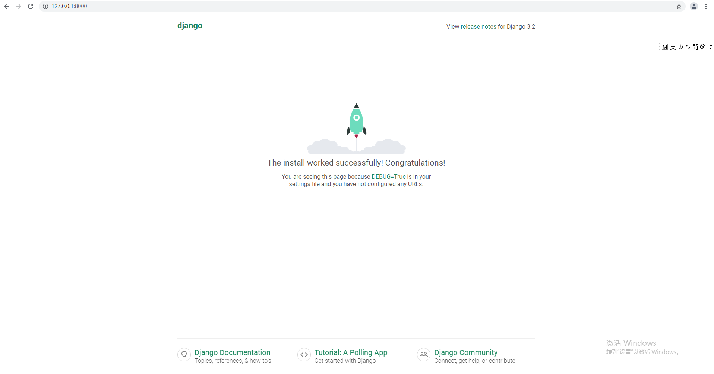
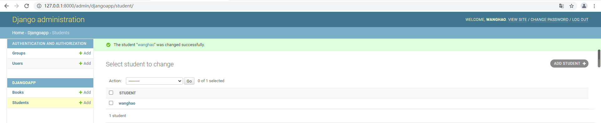
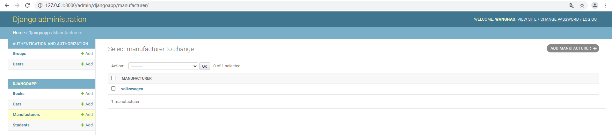
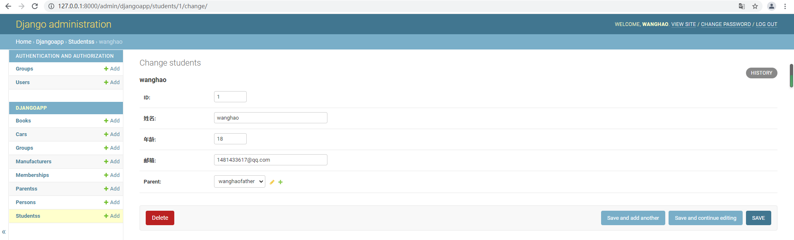
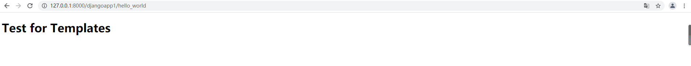
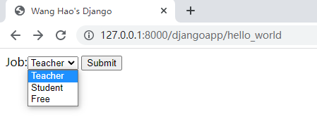
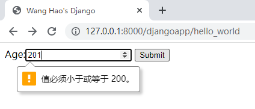
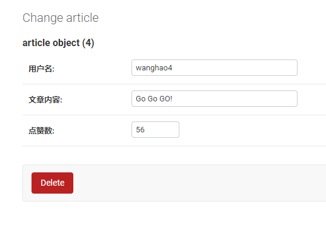
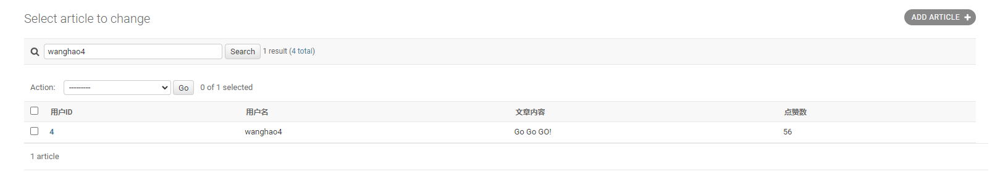
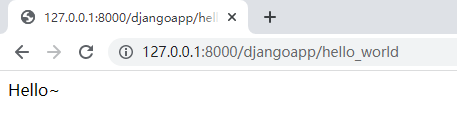

<h1 align = "center">Django学习笔记</h1>

​	                                                    																																													                ——by王浩

[TOC]

# 一、Django的概述

## 1、Django的简介

Web开发指的是开发基于B/S架构，通过前后端的配合，将后台服务器的数据在浏览器上展现给前台用户的应用。比如将电子购物网站的商品数据在浏览器上展示给客户，在基于浏览器的学校系统管理平台上管理学生的数据，监控机房服务器的状态并将结果以图形化的形式展现出来等等。

Django是一个由Python编写的具有完整架站能力的开源Web框架。使用Django，只要很少的代码，开发人员就可以轻松地完成一个正式网站所需要的大部分内容，并进一步开发出全功能的Web服务。

Django本身基于MVC架构，即Model（模型）+View（视图）+ Controller（控制器）设计模式，因此天然具有MVC的出色基因：开发快捷、部署方便、可重用性高、维护成本低等优点。

## 2、Django的特点

### （1）Django是一个全栈Web框架

所谓全栈框架，是指除了封装网络和线程操作，还提供HTTP请求和响应、数据库读写管理、HTML模板渲染等一系列功能的框架。可以不太准确地理解为全栈工程师包办了前后端和数据库访问的所有开发工作，整个网站都是一个人搭建的。

### （2）功能完善、要素齐全

Django提供了大量的特性和工具，无须自己定义、组合、增删及修改。

### （3）完善的文档

经过长期的发展和完善，Django有广泛的实践经验和完善的在线文档。开发者遇到问题时可以搜索在线文档寻求解决方案。

### （4）强大的数据库访问API

Django的Model层自带数据库ORM组件，开发者无须学习其他数据库访问技术（例如SQLALchemy）。当然你也可以使用SQLALchemy，甚至不使用ORM组件。

### （5）灵活的路由系统

Django具备路由转发、正则表达式、命名空间、URL反向解析等功能。

### （6）丰富的Template模板功能

Django自带类似jinjia的模板语言，不但原生功能丰富，还可以自定义模板标签和过滤器。并且以类似Python的调用机制和视图默契配合。

### （7）自带后台管理应用admin

只需要通过简单的几行配置和代码就可以实现一个完整的后台数据管理控制平台。

### （8）完整的错误信息提示

在开发调试过程中如果出现运行错误或者异常，Django可以提供非常完整的错误信息帮助定位问题。

## 3、Django的下载安装（基于docker）

### （1）python环境

Djnago依赖python环境，Windows可以在pycharm中安装Django模块，python3.8.2，Django3.2.7

下载地址：https://www.djangoproject.com/download/

```shell
#拉取官方python3.8的镜像
[root@localhost ~]# docker pull python:3.8
Trying to pull repository docker.io/library/python ...
3.8: Pulling from docker.io/library/python
955615a668ce: Pull complete
2756ef5f69a5: Pull complete
911ea9f2bd51: Pull complete
27b0a22ee906: Pull complete
8584d51a9262: Pull complete
524774b7d363: Pull complete
9460f6b75036: Pull complete
9bc548096c18: Pull complete
1d87379b86b8: Pull complete
Digest: sha256:c2842aababbe377f9c76f172d9eb39487e23f306b2f29f020f3f6654cb0876e9
Status: Downloaded newer image for docker.io/python:3.8

[root@localhost ~]# docker images
REPOSITORY          TAG                 IMAGE ID            CREATED                  SIZE
docker.io/python    3.8                 ff08f08727e5        Less than a second ago   909 MB

[root@localhost ~]# docker run -dit --name django -p 8000:8000  python:3.8
f5a6e057ac15053609725b8c61ce1a07a83f3474da6c2c3553829f3b5ed9cc3f

[root@localhost ~]# docker ps
CONTAINER ID       IMAGE              COMMAND            CREATED            STATUS              PORTS                    NAMES
f5a6e057ac15       python:3.8         "python3"          2 seconds ago      Up 2 seconds        0.0.0.0:8000->8000/tcp   django

[root@localhost ~]# docker exec -it django bash
root@f5a6e057ac15:/# ls
bin  boot  dev  etc  home  lib  lib64  media  mnt  opt  proc  root  run  sbin  srv  sys  tmp  usr  var

#可以看到python的具体的版本是3.8.12
root@f5a6e057ac15:/# python
Python 3.8.12 (default, Sep  3 2021, 20:28:07)
[GCC 10.2.1 20210110] on linux
Type "help", "copyright", "credits" or "license" for more information.
>>>

#已经制作了基础的镜像，可以直接使用
[root@localhost ~]# docker run -dit --name django -p 8000:8000  wanghao7/django:01
a86f70a50b6cd120eee18fd7a66a240f8b5104123d28ed058e465f109f4e273e
```

### （2）安装Django

```shell
#pip安装django3.2.7
root@f5a6e057ac15:/# pip install django==3.2.7
Installing collected packages: sqlparse, pytz, asgiref, django
Successfully installed asgiref-3.4.1 django-3.2.7 pytz-2021.1 sqlparse-0.4.2

#查看django是否安装成功，或者直接在终端输入django-admin
root@f5a6e057ac15:/# python
Python 3.8.12 (default, Sep  3 2021, 20:28:07)
[GCC 10.2.1 20210110] on linux
Type "help", "copyright", "credits" or "license" for more information.
>>> import django
>>> django.get_version()
'3.2.7'
```

## 4、MVC和MTV模式

### （1）MVC模式简介

它是Web设计模式的经典之作，MTV模式也是在它的基础上衍生而来，MVC是Model-View-Controller的缩写，MVC的3层之间紧密相连，但又相互独立，每一层的修改都不会影响其它层，每一层都提供了各自独立的接口供其它层调用，MVC的设计模式降低了代码之间的耦合性（即关联性），增加了模块的可重用性。

* Model：代表数据存储层，是对数据表的定义和数据的增删改查
* View：代表视图层，是系统前端显示部分，它负责显示内容和显示的方法
* Controller：代表控制层，负责根据从View层输入的指令来检索Model层的数据，并在该层编写代码产生结果并输出

### （2）MVC模式的请求与响应过程

- 用户通过浏览器向服务器发起request请求，Controller层接受请求后，同时向Model层和View发送指令；
- Model层根据指令与数据库交互并选择相应业务数据，然后将数据发送给Controller 层；
- View层接收 Controller 的指令后，加载用户请求的页面，并将此页面发送给Controller 层；
- Controller层接收到Model层和View层的数据后，将它们组织成响应格式发送给浏览器，浏览器通过解析后把页面展示出来。


### （3）MTV模式简介

Django借鉴了经典的MVC模式，它也将交互的过程分为了3个层次，MTV是Model-Template-View的缩写

- Model：数据存储层，处理所有数据相关的业务，和数据库进行交互，并提供数据的增删改查
- Template：模板层（也叫表现层）具体来处理页面的显示
- View：业务逻辑层，处理具体的业务逻辑，它的作用是连通Model层和Template

### （4）MTV模式的请求与响应过程

- 用户通过浏览器对服务器发起request 请求，服务器接收请求后，通过View的业务逻辑层进行分析，同时向Model层和Template层发送指令；
- Model层与数据库进行交互，将数据返回给View层；
- Template层接收到指令后，调用相应的模板，并返回给View层；
- View层接收到模板与数据后，首先对模板进行渲染（即将相应的数据赋值给模板），然后组织成响应格式返回给浏览器，浏览器进行解析后并最终呈现给用户


## 5、Django学习文档

学习文档地址：https://docs.djangoproject.com/zh-hans/3.2/


# 二、Django的项目

## 1、创建django项目

### （1）创建项目方法

创建django的项目，这将在目录下生成一个djangopro目录，也就是这个Django项目的根目录。它包含了一系列自动生成的目录和文件，具备各自专有的用途。

```shell
#django-admin startproject projectname

django-admin startproject djangopro

root@f5a6e057ac15:/# ls
bin  boot  dev  etc  home  lib  lib64  media  mnt  opt  proc  root  run  sbin  srv  sys  tmp  usr  var

#在根目录下创建文件夹Django用于存放django项目文件
root@f5a6e057ac15:/# mkdir Django

root@f5a6e057ac15:/# ls
Django  bin  boot  dev  etc  home  lib  lib64  media  mnt  opt  proc  root  run  sbin  srv  sys  tmp  usr  var

root@f5a6e057ac15:/# cd Django/

root@f5a6e057ac15:/Django# ls

#创建项目djangopro
root@f5a6e057ac15:/Django# django-admin startproject djangopro

#项目创建成功之后,就会出现项目的文件夹
root@f5a6e057ac15:/Django# ls
djangopro

root@f5a6e057ac15:/Django# cd djangopro/

root@f5a6e057ac15:/Django/djangopro# ls
djangopro  manage.py
```

### （2）注意事项

* 项目命名：给项目命名的时候必须避开Django和Python的保留关键字，比如“django”，“test”等，否则会引起冲突和莫名的错误。
* djangopro的放置位置：不建议放在传统的/var/wwww目录下，它会具有一定的数据暴露危险，因此Django建议你将项目文件放在例如/home/mycode类似的位置，也可以定义其他位置。

## 2、启动项目服务

### （1）启动项目方法

```shell
#python manage.py runserver
#python manage.py runserver 0.0.0.0：port #
#直接运行或者配置端口，默认情况下端口为127.0.0.1:8000

#进入到项目目录
root@f5a6e057ac15:/Django# cd djangopro/

#项目的
root@f5a6e057ac15:/Django/djangopro# ls
djangopro  manage.py

#启动服务
root@f5a6e057ac15:/Django/djangopro# python manage.py runserver 0.0.0.0:8000
Watching for file changes with StatReloader
Performing system checks...

System check identified no issues (0 silenced).

You have 18 unapplied migration(s). Your project may not work properly until you apply the migrations for app(s): admin, auth, contenttypes, sessions.
Run 'python manage.py migrate' to apply them.
September 05, 2021 - 02:34:22
Django version 3.2.7, using settings 'djangopro.settings'
Starting development server at http://0.0.0.0:8000/
Quit the server with CONTROL-C.
```

### （2）注意事项

* Django的开发服务器具有自动重载功能，当你的Python代码有修改，服务器会在一个周期后自动更新。但是，有一些动作，比如增加文件，不会触发服务器重载，这时就需要你自己手动重启。所以建议，在任何修改代码的操作后，手动重启开发服务器，确保修改被应用。
* django默认的是8000端口，也可以指定其他的端口，但是要注意容器端口映射，所以设置ip为0.0.0.0:8000，windows才可以访问

## 3、浏览器确认

* 端口映射关系如下：

|      | Windows   | Linux     | Django Container |
| ---- | --------- | --------- | ---------------- |
| IP   | 127.0.0.1 | 10.0.2.15 | 172.17.0.2       |
| PORT | 8000      | 8000      | 8000             |
| NET  | -         | NAT       | bridge           |

* 在windows浏览器输入终端输出的URL：http://127.0.0.1:8000/



## 4、项目的目录

```shell
root@f5a6e057ac15:/Django# tree
.
└── djangopro
    ├── db.sqlite3
    ├── djangopro
    │   ├── __init__.py
    │   ├── __pycache__
    │   │   ├── __init__.cpython-38.pyc
    │   │   ├── settings.cpython-38.pyc
    │   │   ├── urls.cpython-38.pyc
    │   │   └── wsgi.cpython-38.pyc
    │   ├── asgi.py
    │   ├── settings.py
    │   ├── urls.py
    │   └── wsgi.py
    └── manage.py
    
3 directories, 11 files
```

### （1）各目录的说明

| 目录/文件名              | 说明                                                         |
| ------------------------ | ------------------------------------------------------------ |
| 外层djangopro/           | 只是你项目的容器， 根目录名称对Django没有影响，你可以将它重命名为任何你喜欢的名称 |
| db.sqlite3               | 数据库文件，配置mysql时，这个文件可以删除                    |
| manage.py                | 可以用各种方式管理Django项目的命令行工具                     |
| 内层djangopro/           | 真正的项目文件包裹目录，它的名字是你引用内部文件的Python包名，例如：mysite.urls |
| djangopro/_ _ init_ _.py | 一个定义包的空文件，告诉Python这个目录应该被认为是一个Python包 |
| djangopro/settings.py    | 项目的配置文件，包括数据库信息，调试标志以及其他一些工作的变量 |
| djangopro/urls.py        | 路由文件，所有的任务都是从这里开始分配，相当于Django驱动站点的目录 |
| djangopro/asgi.py        | 一个基于WSGI的web服务器进入点，提供底层的网络通信功能        |
| djangopro/wsgi.py        | 一个基于ASGI的web服务器进入点，提供异步的网络通信功能        |

### （2）settings.py

```python
root@f5a6e057ac15:/Django/djangopro/djangopro# cat settings.py
"""
Django settings for djangopro project.

Generated by 'django-admin startproject' using Django 3.2.7.

For more information on this file, see
https://docs.djangoproject.com/en/3.2/topics/settings/

For the full list of settings and their values, see
https://docs.djangoproject.com/en/3.2/ref/settings/
"""

from pathlib import Path

#项目的绝对路径
# Build paths inside the project like this: BASE_DIR / 'subdir'.
BASE_DIR = Path(__file__).resolve().parent.parent

# Quick-start development settings - unsuitable for production
# See https://docs.djangoproject.com/en/3.2/howto/deployment/checklist/

# SECURITY WARNING: keep the secret key used in production secret!
SECRET_KEY = 'django-insecure-hz07r=sg5oxjqqkx9(0vo6*mfpk7b85bbgy0^o8zv$o(%voh$f'

# SECURITY WARNING: don't run with debug turned on in production!
DEBUG = True
#启动模式：True表示调试模式，检测代码改动后，立刻重启服务，网页出现错误，可以出现报错页面，可以根据页面的提示进行修改；False表示上线模式

ALLOWED_HOSTS = []
#请求头的Host头，只有请求的Host头在列表中，才会处理，上线时添加Host，可以有效过滤掉不属于本项目的请求；DEBUG = True时，默认127.0.0.1和localhost;如果需要设置内网访问，则需要添加内网ip;['*']表示所有的请求都可以访问

# Application definition
#django项目的应用，如果有新的app创建，则需要添加在这里
INSTALLED_APPS = [
    'django.contrib.admin',
    'django.contrib.auth',
    'django.contrib.contenttypes',
    'django.contrib.sessions',
    'django.contrib.messages',
    'django.contrib.staticfiles',
]

#中间件配置项
MIDDLEWARE = [
    'django.middleware.security.SecurityMiddleware',
    'django.contrib.sessions.middleware.SessionMiddleware',
    'django.middleware.common.CommonMiddleware',
    'django.middleware.csrf.CsrfViewMiddleware',
    'django.contrib.auth.middleware.AuthenticationMiddleware',
    'django.contrib.messages.middleware.MessageMiddleware',
    'django.middleware.clickjacking.XFrameOptionsMiddleware',
]

#django的主路由的位置
ROOT_URLCONF = 'djangopro.urls'

#模板的配置
TEMPLATES = [
    {
        'BACKEND': 'django.template.backends.django.DjangoTemplates',
        'DIRS': [],
        'APP_DIRS': True,
        'OPTIONS': {
            'context_processors': [
                'django.template.context_processors.debug',
                'django.template.context_processors.request',
                'django.contrib.auth.context_processors.auth',
                'django.contrib.messages.context_processors.messages',
            ],
        },
    },
]

#WSGI的配置
WSGI_APPLICATION = 'djangopro.wsgi.application'


# Database
# https://docs.djangoproject.com/en/3.2/ref/settings/#databases
#数据库的配置
DATABASES = {
    'default': {
        'ENGINE': 'django.db.backends.sqlite3',
        'NAME': BASE_DIR / 'db.sqlite3',
    }
}


# Password validation
# https://docs.djangoproject.com/en/3.2/ref/settings/#auth-password-validators

AUTH_PASSWORD_VALIDATORS = [
    {
        'NAME': 'django.contrib.auth.password_validation.UserAttributeSimilarityValidator',
    },
    {
        'NAME': 'django.contrib.auth.password_validation.MinimumLengthValidator',
    },
    {
        'NAME': 'django.contrib.auth.password_validation.CommonPasswordValidator',
    },
    {
        'NAME': 'django.contrib.auth.password_validation.NumericPasswordValidator',
    },
]


# Internationalization
# https://docs.djangoproject.com/en/3.2/topics/i18n/

#语言配置，中文为'zh-Hans'
LANGUAGE_CODE = 'en-us'

#时区，东八区可以设置为'Asia/Shanghai'
TIME_ZONE = 'UTC'

USE_I18N = True

USE_L10N = True

USE_TZ = True


# Static files (CSS, JavaScript, Images)
# https://docs.djangoproject.com/en/3.2/howto/static-files/

STATIC_URL = '/static/'

# Default primary key field type
# https://docs.djangoproject.com/en/3.2/ref/settings/#default-auto-field

DEFAULT_AUTO_FIELD = 'django.db.models.BigAutoField'
```


# 三、Django应用

## 1、创建djangopro项目的应用

### （1）创建应用的方法

```shell
#python manage.py startapp appname，在Django中，每一个应用（app）都是一个Python包，并且遵循着相同的约定。Django自带工具，可以生成应用的基础目录结构。
python manage.py startapp djangoapp

root@f5a6e057ac15:/Django/djangopro# ls
db.sqlite3  djangopro  manage.py

root@f5a6e057ac15:/Django/djangopro# python manage.py startapp djangoapp

#会自动生成应用目录
root@f5a6e057ac15:/Django/djangopro# ls
db.sqlite3  djangoapp  djangopro  manage.py
```

### （2）注意事项

app的存放位置可以是任何地点，但是通常都将它们放在与manage.py脚本同级的目录下，这样方便导入文件。

## 2、应用的目录

```shell
root@f5a6e057ac15:/Django/djangopro# cd djangoapp/
root@f5a6e057ac15:/Django/djangopro/djangoapp# tree
.
├── __init__.py
├── admin.py
├── apps.py
├── migrations
│   └── __init__.py
├── models.py
├── tests.py
└── views.py

1 directory, 7 files
```

### （1）各目录的说明

| 目录/文件命名   | 说明                                                         |
| --------------- | ------------------------------------------------------------ |
| _ _ init _ _.py | python包说明                                                 |
| admin.py        | 管理站点模型的声明文件，默认为空                             |
| apps.py         | 应用信息定义文件。生成了类AppConfig，该类用于定义应用名等Meta数据 |
| migrations/     | 用于迁移功能，迁移数据时生成的中间文件放在该目录下           |
| models.py       | 添加模型层数据类的文件                                       |
| tests.py        | 测试代码文件                                                 |
| views.py        | 定义URL响应视图函数                                          |
| urls.py         | 自己手动添加，配置应用的路由                                 |
| templates       | 自己手动添加，存放模板html文件                               |
| static          | 自己手动添加，存放静态文件                                   |
| templatetags    | 自己手动添加，用于自定义标签和过滤器                         |

## 3、app与project的关系

- 一个app实现某个具体功能，比如博客、公共档案数据库或者简单的投票系统
- 一个project是配置文件和多个app的集合，这些app组合成整个站点
- 一个project可以包含多个app
- 一个app可以属于多个project


# 四、Django的路由系统

## 1、URL

在WWW上，每一信息资源都有统一的且在网上唯一的地址，该地址就叫URL（Uniform Resource Locator，统一资源定位器），它是WWW的统一资源定位标志，就是指网络地址。

### （1）组成

URL由3部分组成：资源类型、存放资源的主机域名、资源文件名。也可认为由4部分组成：协议、主机、端口、路径。

### （2）语法及格式说明

* 语法

[]中的内容为可选项

protocol :// hostname[:port] / path / [;parameters] [?query] [#fragment]

* 格式说明

| 组成                 | 说明                                                         |
| -------------------- | ------------------------------------------------------------ |
| protocol（协议）     | 指定使用的传输协议， 最常用的是HTTP协议，它也是WWW中应用最广的协议。http，通过 HTTP 访问该资源。 格式HTTP://；https，通过安全的HTTPS访问该资源。 格式 HTTPS://（可以通过nginx实现）；file，资源是本地计算机上的文件，格式 file:///；ftp，通过 FTP访问资源。格式 FTP://。 |
| hostname（主机名）   | 是指存放资源的服务器的域名系统(DNS) 主机名或 IP 地址。       |
| port（端口号）       | 整数，可选，省略时使用方案的默认端口，各种传输协议都有默认的端口号，如http的默认端口为80。如果输入时省略，则使用默认端口号。有时候出于安全或其他考虑，可以在服务器上对端口进行重定义，即采用非标准端口号，此时，URL中就不能省略端口号这一项。 |
| path（路径）         | 由零或多个“/”符号隔开的字符串，一般用来表示主机上的一个目录或文件地址。 |
| parameters（参数）   | 这是用于指定特殊参数的可选项。                               |
| query(查询)          | 可选，用于给动态网页（如使用CGI、ISAPI、PHP/JSP/ASP/ASP.NET等技术制作的网页）传递参数，可有多个参数，用“&”符号隔开，每个参数的名和值用“=”符号隔开。 |
| fragment（信息片断） | 字符串，用于指定网络资源中的片段。例如一个网页中有多个名词解释，可使用fragment直接定位到某一名词解释。 |

## 2、Django处理URL请求的流程

### （1）找主路由文件

Django从配置文件settings.py的配置项ROOT_URLCONF找到主路由文件。在django.conf.urls中封装了路由模块，新建的Django项目中提供了urls.py（创建项目后自动生成的配置文件） 路由配置文件。

```shell
#主路由文件在项目的同名文件夹下/djangopro/djangopro/urls.py
ROOT_URLCONF = 'djangopro.urls'
```

### （2）加载主路由文件

Django加载主路由文件中的urlpatterns变量，里面包含很多路由列表

```python
from django.contrib import admin
from django.urls import path

urlpatterns = [
    path('admin/', admin.site.urls),
]
```

### （3）依次匹配path

Django依次匹配urlpatterns[]中的path，匹配到第一个合适的就中断匹配

### （4）处理视图

* 匹配成功：django传递给视图函数一个HttpRequest实例，如果url中的可变参数没有命名，那么就按照位置来与视图函数中的形参一一对应，关键字参数由正则表达式匹配的命名组组成，但是可以被django.conf.urls.url()的可选参数kwargs覆盖。
* 匹配不成功：返回异常

## 3、path()

### （1）导入方法

```python
#django默认使用的方法
from django.urls import path
```

### （2）语法

```python
#默认
path(route, view, kwargs=None, name=None)
```

* route参数

route是一个匹配URL的准则（类似正则表达式）。当Django响应一个请求时，它会从urlpatterns的第一项开始，按顺序依次匹配列表中的项，直到找到匹配的项。这些准则不会匹配GET和POST参数或域名。例如，URLconf在处理请求https://127.0.0.1:8000/details/时，它会尝试匹配datails。处理请求https://127.0.0.1:8000/datails/?page=3 时，也只会尝试匹配details/。

* view参数

当Django找到了一个匹配的准则，就会调用这个特定的视图函数，并传入一个HttpRequest对象作为第一个参数，被“捕获”的参数以关键字参数的形式传入。

* kwargs参数

默认为None，任意个关键字参数可以作为一个字典传递给目标视图函数。

* name参数

默认为None，为URL取名能使在Django的任意地方唯一地引用它，尤其是在模板中。这个有用的特性允许只改一个文件就能全局地修改某个URL模式。

### （3）使用示例

```python
#访问http://127.0.0.1:8000/details/时，会调用同级目录的views.py中的details函数
from django.urls import path
from . import views

urlpatterns = [
    path('details/', views.details),
]
```

## 4、路径转换器

如果转换器类型匹配到对应的数据类型，则将数据按照关键字传参的方法将数据传给视图函数

### （1）类型及作用

| 转换器类型 | 作用                                                         | 使用                                                         |
| ---------- | ------------------------------------------------------------ | ------------------------------------------------------------ |
| str        | 匹配任何非空字符串，但不含斜杠/，如果没有专门指定转换器，那么这个是默认使用的 | 'users/< str:username >'匹配/users/wanghao，username=wanghao |
| int        | 匹配0和正整数，返回一个int类型                               | 'users/< int:age >'匹配/users/15，age=15                     |
| slug       | 可理解为注释。该转换器匹配任何ASCII字符以及连接符和下划线    | 'users/< slug:slugvalue >'匹配/users/wanghao-1st-site，slugvalue=wanghao-1st-site |
| uuid       | 匹配一个uuid格式的对象。为了防止冲突，规定必须使用破折号，所有字母必须小写，返回一个UUID对象 | 'users/< uuid:userid >'匹配/users/075194d3-6885-417e-a8a8-6c931e272f00，userid=075194d3-6885-417e-a8a8-6c931e272f00 |
| path       | 匹配任何非空字符串，重点是可以包含路径分隔符’/‘。这个转换器可以帮助你匹配整个url而不是一段一段的url字符串 | 'users/< path:pathvalue >'匹配/users/wanghao/site/1，pathvalue=wanghao/site/1 |

### （2）使用示例

```python
#访问http://127.0.0.1:8000/users/wanghao时，users函数提取参数可以写为users(request,username='wanghao')
path('users/< str:username >', views.users)

#访问http://127.0.0.1:8000/users/4时，users函数提取参数可以写为users(request,age=4)
path('users/<int:age>', views.users)

#访问http://127.0.0.1:8000/users/wanghao-1st-site时，users函数提取参数可以写为users(request,slugvalue='wanghao-1st-site')
path('users/<slug:slugvalue>', views.users)

#访问http://127.0.0.1:8000/users/075194d3-6885-417e-a8a8-6c931e272f00时，users函数提取参数可以写为users(request,userid='075194d3-6885-417e-a8a8-6c931e272f00')
path('users/<uuid:userid>', views.users)

#访问http://127.0.0.1:8000/users/wanghao/site/1时，users函数提取参数可以写为users(request,pathvalue='/users/wanghao/site/1')
path('users/<path:pathvalue>', views.users)
```

## 5、re_path()

如果路径和转换器语法不足以定义URL模式，则也可以使用正则表达式进行精准匹配。使用 re_path()代替path()。.

### （1）导入方法

```python
from django.urls import re_path
```

### （2）语法

```python
#参数和path()一样，只是在route加入正则表达式
re_path(route, view, kwargs=None, name=None)
route=r'^(?P<name>pattern)$'
```

### （3）使用示例

* 不提取参数

```python
#访问http://127.0.0.1:8000/details/11时，会调用details函数，返回hello
#[0-9]{2}，以0-9的数字开头和结尾的2位数字字符串
re_path(r'^details/([0-9]{2})$',view.details) 

def details(request):
    html = 'hello'
    return HttpResponse(html) #将字符串封装成HttpResponse返回
```

* 提取参数

```python
#访问http://127.0.0.1:8000/details/1995时，会调用details函数,details(request,year=1995)，返回year:1995
re_path(r'^details/(?P<year>\d{4})$',view.details) 

def details(request,year):
    html = 'year:%s' % year
    return HttpResponse(html) #将字符串封装成HttpResponse返回
```

### （4）与path()的不同点

- 捕获URL中的参数使用的是正则捕获，语法是 (?P< name >pattern) ，其中name是组名，pattern是要匹配的模式。
- year中匹配不到10000等非四位数字，这是正则表达式决定的。
- 传递给视图的所有参数都是字符串类型。而不像path()方法中可以指定转换成某种类型。在视图中接收参数时一定要小心。

## 6、include()

用于配置分布式路由。

### （1）导入方法

```python
from django.urls import include
```

### （2）作用

用于转移到局部路由，可以使用include()来设置app和项目的路由配置，每当Django遇到时include()，它都会截断直到该处匹配的URL的任何部分，并将剩余的字符串发送到包含的URLconf中以进行进一步处理。

### （3）使用示例

```python
#访问http:127.0.0.1:8000/djangoapp/details/时，会经过主路由配置匹配到djangoapp/，然后转到app的二级路由中匹配到details/对应的app的视图函数djangoapp.views.details

#主路由配置/djangopro/djangopro/urls.py
from django.contrib import admin
from django.urls import path, include

urlpatterns = [
    path('admin/', admin.site.urls),
    path('djangoapp/', include('djangoapp.urls')) #设置app中的路由在app的二级路由配置文件urls.py中配置
]

#app二级路由配置/djangopro/djangoapp/urls.py
from django.urls import path#引入路由配置相关的包
import djangoapp.views #引入app视图文件

urlpatterns = [
    path('details/', djangoapp.views.details)
]
```

## 7、Django中使用URL

### （1）使用URL的场景

* 路由文件

```python
#普通的路径匹配视图函数
path('url', views)

#正则表达式的路径匹配视图函数
re_path('url', views)

#app二级路由的路径匹配视图函数
include('url', views)
```

* 模板文件
* * htmla标签超链接

```html
<!-- 浏览器中点击超链接会跳转到href指定的url -->
<a href='url'>超链接</a
```

* * form表单

```html
<!-- form表单中的数据用post方法提交给url -->
<form action='url' method='post'>
```

* * 模板url标签获取url字符串

```html
<!-- arg1,arg2参数是可选的，url_str为url路径的值 -->

```

* 视图函数

```python
#302跳转
return HttpResponseRedirect('url')

#或者使用redirect方法
from django.shortcuts import redirect
return redirect('url')
```

### （2）使用URL路径的方法

* 绝对路径

```python
#协议+ip地址+端口+具体的路由
http://127.0.0.1:8000/hello_world
```

* 相对路径1

"/"开头的url，浏览器会自动加上协议+ip地址+端口+相对路径的url，假设相对路径为"/page/1"，访问该相对路径时，就会访问

```python
http://127.0.0.1:8000+/page/1
=http://127.0.0.1:8000/page/1
```

* 相对路径2

没有"/"开头的url，浏览器会根据当前地址栏的url的最后一个"/"，加上该相对路径，假设当前的路径为http://127.0.0.1:8000/page/1，该相对路径为"page/2"，访问该相对路径时，就会访问

```python
http://127.0.0.1:8000/page/+page/2
=http://127.0.0.1:8000/page/page/2
```

当前路径为http://127.0.0.1:8000/page/1时，如果需要访问http://127.0.0.1:8000/page/2时，需要设置的相对路径必须是

```python
"2"
```

### （3）URL的反向解析

url反向解析是指在视图或者模板中，用path的名称来动态查找或计算相应的路由。根据path中的name的关键字参数确定一个唯一确定的名字，在模板和视图中可以通过这个名字反向推断出这个url的信息。

* 模板文件中url反向解析

模板中也可以用url标签来反向解析

```html
<!-- arg1,arg2参数是可选的，url_str为url路径的值 -->

```

* 视图函数中reverse()反向解析

```python
#path假设如下
path('hello', views.hello, name='hello')

#视图函数中使用如下程序，则会重定向到views.hello视图函数中
url = reverse('hello')
return HttpResponseRedirect(url)
```

* 使用示例

* * app路由配置

```python
import djangoapp1.views #引入视图文件

app_name = 'djangoapp1' #app下面的url反向解析时需要说明appname
urlpatterns = [
    path('hello_world', djangoapp1.views.hello_world, name='hello_world'),  #有相关的路径就调用对应的函数
    path('hello_world1', djangoapp1.views.hello_world1, name='hello_world1'),
    path('hello_world2', djangoapp1.views.hello_world2, name='hello_world2'),
   ]
```

* * 视图函数

```python
from django.shortcuts import render, reverse
from django.http import HttpResponse, HttpResponseRedirect

#调用hello_world函数时，就会根据path()中设置的别名反向解析hello_world1的路径，然后重定向
def hello_world(request):
    url = reverse('djangpapp1:hello_world1')   #app下的url反向解析需要说明appname，并用":"分开
    return HttpResponseRedirect(url)

#调用hello_world1函数时，就会返回模板文件test.html渲染的页面
def hello_world1(request):
    return render(request, 'test.html')

#调用hello_world2函数时，就会返回字符串'hello_world2'
def hello_world2(request):
    return HttpResponse('hello_world2')
```

* * 模板文件

```html
<!-- url反向解析hello_world2的路径的并生成超链接 -->
<!DOCTYPE html>
<html lang="en">
<head>
    <meta charset="UTF-8">
    <title>Test</title>
</head>
<body>
<!-- url反向解析app下的路径，也需要说明appname，并用":"分开 -->

<a href={{ hello }}>hello_world2</a>
</body>
</html>
```

* * 浏览器访问

访问http://127.0.0.1:8000/djangoapp1/hello_world，会调用hello_world视图函数，反向解析应用djangpapp1下的hello_world1，并重定向到http://127.0.0.1:8000/djangoapp1/hello_world1。

重定向自动访问http://127.0.0.1:8000/djangoapp1/hello_world1，会调用hello_world1视图函数，用模板文件test.html来渲染页面，test.html中用url反向解析hello_world2的路径并生成超链接。


点击超链接，就会自动跳转到http://127.0.0.1:8000/djangoapp1/hello_world2，就会会调用hello_world2视图函数，返回字符串'hello_world2'。


# 五、Django的请求和响应

## 1、HTTP请求

### （1）定义

浏览器端通过HTTP协议发送给服务器端的数据

### （2）请求的样例

可以在浏览器上F12查看

```html
#起始行：方法、路由、协议
GET /djangoapp1/details/1234 HTTP/1.1

#headers
Host: 127.0.0.1:8000
Connection: keep-alive
Cache-Control: max-age=0
sec-ch-ua: "Google Chrome";v="93", " Not;A Brand";v="99", "Chromium";v="93"
sec-ch-ua-mobile: ?0
sec-ch-ua-platform: "Windows"
Upgrade-Insecure-Requests: 1
User-Agent: Mozilla/5.0 (Windows NT 10.0; Win64; x64) AppleWebKit/537.36 (KHTML, like Gecko) Chrome/93.0.4577.82 Safari/537.36
Accept: text/html,application/xhtml+xml,application/xml;q=0.9,image/avif,image/webp,image/apng,*/*;q=0.8,application/signed-exchange;v=b3;q=0.9
Sec-Fetch-Site: none
Sec-Fetch-Mode: navigate
Sec-Fetch-User: ?1
Sec-Fetch-Dest: document
Accept-Encoding: gzip, deflate, br
Accept-Language: zh-CN,zh;q=0.9

#body,有的时候body的内容是没有的
```

### （3）请求的方法

HTTP1.0定义了三种请求方法： GET, POST 和 HEAD方法(最常用)，HTTP1.1新增了五种请求方法：OPTIONS, PUT, DELETE, TRACE 和 CONNECT 方法。

| 方法    | 说明                                                         |
| ------- | ------------------------------------------------------------ |
| GET     | 请求指定的页面信息，并返回实体主体。                         |
| HEAD    | 类似于get请求，只不过返回的响应中没有具体的内容，用于获取报头。 |
| POST    | 向指定资源提交数据进行处理请求（例如提交表单或者上传文件）。数据被包含在请求体中。POST请求可能会导致新的资源的建立和/或已有资源的修改。 |
| PUT     | 从客户端向服务器传送的数据取代指定的文档的内容。             |
| DELETE  | 请求服务器删除指定的页面。                                   |
| CONNECT | HTTP/1.1协议中预留给能够将连接改为管道方式的代理服务器。     |
| OPTIONS | 允许客户端查看服务器的性能。                                 |
| TRACE   | 回显服务器收到的请求，主要用于测试或诊断。                   |

## 2、Django请求

### （1）定义

请求在django中就是视图函数的第一个参数，服务器接收到http协议的请求后，会根据请求数据报文创建HttpRequest对象，HttpRequest对象通过属性描述了请求的所有的相关信息。

### （2）HttpRequest对象的属性

| 属性      | 说明                                                         |
| --------- | ------------------------------------------------------------ |
| path_info | URL字符串                                                    |
| method    | 字符串，表示HTTP请求方法，常用值：‘GET’、‘POST’              |
| encoding  | 字符串，表示提交的数据的编码方式，如果为None则表示使用浏览器的默认设置，一般为' utf-8 '这个属性是可写的，可以通过修改它来修改访问表单数据使用的编码，接下来对属性的任何访问将使用新的encoding值 |
| GET       | QueryDict查询字典的对象，包含get请求方式的所有数据           |
| POST      | QueryDict查询字典的对象，包含post请求方式的所有数据          |
| FILES     | 类似于字典的对象，包含所有的上传文件信息                     |
| COOKIES   | Python字典，包含所有的cookie，键和值都为字符串               |
| session   | 似于字典的对象，表示当前的会话                               |
| body      | 字符串，请求体的内容(POST或PUT)                              |
| environ   | 字符串,客户端运行的环境变量信息                              |
| scheme    | 请求协议(http/https)                                         |

### （3）HttpRequest对象的方法

| 方法                    | 说明                                                         |
| ----------------------- | ------------------------------------------------------------ |
| request.get_full_path() | 请求的完整路径                                               |
| request.META            | 请求中的元数据(消息头)，request.META[' REMOTE_ADDR '] : 客户端IP地址； |
| request.get_host()      | 请求的主机                                                   |

## 3、HTTP响应

### （1）定义

指服务器端接受请求后做出的相应的处理后回复给浏览器端的数据

### （2）响应的样例

```html
#起始行：协议、状态码、
HTTP/1.1 200 OK

#headers
Date: Sat, 18 Sep 2021 09:49:17 GMT
Server: WSGIServer/0.2 CPython/3.8.2
Content-Type: text/html; charset=utf-8
X-Frame-Options: DENY
Content-Length: 5
X-Content-Type-Options: nosniff
Referrer-Policy: same-origin

#body，浏览器中在Response中查看
hello
```

### （3）响应状态码HTTP Status Code

* HTTP状态码由三个十进制数字组成，第一个十进制数字定义了状态码的类型，后两个数字没有分类的作用

| 响应状态码分类 | 说明                                           |
| -------------- | ---------------------------------------------- |
| 1**            | 信息，服务器收到请求，需要请求者继续执行操作   |
| 2**            | 成功，操作被成功接收并处理                     |
| 3**            | 重定向，需要进一步的操作以完成请求             |
| 4**            | 客户端错误，请求包含语法错误或无法完成请求     |
| 5**            | 服务器错误，服务器在处理请求的过程中发生了错误 |

* 常见的响应状态码

| 响应状态码 | 说明                                          |
| ---------- | --------------------------------------------- |
| 200        | 请求成功                                      |
| 301        | 永久重定向，资源（网页等）被永久转移到其它URL |
| 302        | 临时重定向                                    |
| 404        | 请求的资源（网页等）不存在                    |
| 500        | 内部服务器错误                                |

## 4、Django响应

### （1）定义

django中视图函数返回HttpResponse对象，向客户端返回响应，同时携带响应体内容

### （2）HttpResponse构造函数格式

```python
HttpResponse(content=响应体, content_type=响应体数据类型, status=状态码)
```

* content：表示返回的内容，通常情况下这一个参数就够了。

* status：返回的HTTP响应状态码(默认为200)。

* content_type：指定返回数据的的MIME（Multipurpose Internet Mail Extensions是指多用途互联网邮件扩展类型）类型(默认为"text/html")。浏览器会根据这个属性，来显示数据。如果是text/html，那么就会解析这个字符串，如果是text/plain，那么就会显示一个纯文本。

* 常见的content_type说明如下：

| content_type          | 说明             |
| --------------------- | ---------------- |
| 'text/html'           | 默认的，html文件 |
| 'text/plain'          | 纯文本           |
| 'text/css'            | css文件          |
| 'text/javascript'     | js文件           |
| 'multipart/form-data' | 文件提交         |
| 'application/json'    | json传输         |
| 'application/xml'     | xml文件          |

### （3）HttpResponse子类

* HttpResponse子类类型说明

| 子类类型                | 状态码 | 说明           |
| ----------------------- | ------ | -------------- |
| HttpResponseRedirect    | 302    | 重定向         |
| HttpResponseNotModified | 304    | 未修改         |
| HttpResponseBadRequest  | 400    | 错误请求       |
| HttpResponseNotFound    | 404    | 没有对应的资源 |
| HttpResponseForbidden   | 403    | 请求被禁止     |
| HttpResponseServerErro  | 500    | 服务器错误     |

* HttpResponse子类使用示例

```python
#访问http://127.0.0.1:8000/djangoapp1/hello_world1时，执行视图函数djangoapp1.views.hello_world1，会重定向到http://127.0.0.1:8000/djangoapp1/hello_world，然后执行视图函数djangoapp1.views.hello_world，返回'Hello_World'给浏览器

#路由设置
from django.urls import path#引入路由配置相关的包
import djangoapp1.views #引入视图文件

urlpatterns = [
    path('hello_world', djangoapp1.views.hello_world),  #有相关的路径就调用对应的函数
    path('hello_world1', djangoapp1.views.hello_world1),
]

#视图函数
from django.http import HttpResponse,HttpResponseRedirect #导入方法

def hello_world(request):
    html = 'Hello_World'
    return HttpResponse(html) #将字符串封装成HttpResponse返回

def hello_world1(request):
    return HttpResponseRedirect('hello_world') #重定向
```

## 5、GET请求和POST请求

GET请求和POST请求都是由视图函数处理，由request.method来区分请求的类型

### （1）GET请求

GET请求，一般用于向服务器拿数据

* 产生GET请求的场景：

浏览器地址栏输入地址后，回车

标签中超链接，< a href="地址?参数=值&参数=值" >

form表单中的method为get

```html
<form method='get' action="/user/login">
    姓名:<input type="text" name="uname">
</form>
```

* 服务器端接收参数处理

```python
if request.method == 'GET':
	function1() #处理GET请求时的业务逻辑
else:
    function2() #处理非GET请求时的业务逻辑
```

* 获取客户端GET请求提交的数据的方法

```python
# QueryDict，如果没有值的时候会报错
request.GET['参数名']  

#如果没有的时候会显示默认值
request.GET.get('参数名','默认值') 

#取参数值的列表
request.GET.getlist('参数名') 

#视图函数
def hello_world(request):
    html = 'Hello_World'
    print(request.GET)
    print(request.GET['a'])
    print(request.GET.get('c', 0))
    print(request.GET.getlist('a'))
    return HttpResponse(html) #将字符串封装成HttpResponse返回

#访问http://127.0.0.1:8000/number?a=400&a=300&a=100时，
#终端输出结果
<QueryDict: {'a': ['400', '300', '100']}> #request.GET的值
100 									  #request.GET['a']的值为100，最后一个值
0  										  #request.GET.get('c', 0)的值为0，因为c不存在，所以取默认值
['400', '300', '100']  					  #request.GET.getlist('a')的值
										  #request.GET['c']会报错，因为c不存在
#网页输出结果
Hello_World
```

### （2）POST请求

POST一般用于向服务器提交大量/隐私数据

* 服务器端接收参数处理

```python
if request.method == 'POSTT':
	function1() #处理POST请求时的业务逻辑
else:
    function2() #处理非POST请求时的业务逻辑
```

* 获取客户端GET请求提交的数据的方法

```python
request.POST['参数名']  

#如果没有的时候会显示默认值
request.POST.get('参数名','默认值') 

#取参数值的列表
request.POST.getlist('参数名') 
```

### （3）GET请求和POST请求处理示例

* 编辑app路由

```python
urlpatterns = [
    path('hello_world', djangoapp1.views.hello_world), 
]
```

* 编辑app视图函数

```python
POST_FROM='''
<form method='post' action='/djangoapp1/hello_world'>
    用户名：<input type='text' name='username'>
    <input type='submit' value='提交'>
</from>
'''

def hello_world(request):
    if request.method == 'GET':
        return HttpResponse(POST_FROM)
    elif request.method == 'POST':
        print('username:', request.POST['username'])
        return HttpResponse('post ok')
    else:
        pass    
```

* 暂时取消CSRF验证

```python
#运行时遇到如下错误时，可以暂时设定取消CSRF(跨站伪造请求)验证
Forbidden (403)
CSRF verification failed. Request aborted.

You are seeing this message because this site requires a CSRF cookie when submitting forms. This cookie is required for security reasons, to ensure that your browser is not being hijacked by third parties.

If you have configured your browser to disable cookies, please re-enable them, at least for this site, or for “same-origin” requests.

#项目配置文件settings.py
#暂时注释掉MIDDLEWARE中的CsrfViewMiddleware中间件，这里只为了看效果，测试完更改回来
MIDDLEWARE = [
    'django.middleware.security.SecurityMiddleware',
    'django.contrib.sessions.middleware.SessionMiddleware',
    'django.middleware.common.CommonMiddleware',
    #'django.middleware.csrf.CsrfViewMiddleware',
    'django.contrib.auth.middleware.AuthenticationMiddleware',
    'django.contrib.messages.middleware.MessageMiddleware',
    'django.middleware.clickjacking.XFrameOptionsMiddleware',
]
```

* 访问http://127.0.0.1:8000/djangoapp1/hello_world

当访问这个URL时，此时的请求为GET请求，执行步骤是：

```python
if request.method == 'GET':
        return HttpResponse(POST_FROM)
```

浏览器页面返回表单


* 填写用户名wanghao并点击提交

提交的请求为POST请求，执行的步骤是：

```python
elif request.method == 'POST':
        print('username:', request.POST['username'])
        return HttpResponse('post ok')
```

浏览器页面返回


* 终端的输出信息：

```python
[19/Sep/2021 10:31:21] "GET /djangoapp1/hello_world HTTP/1.1" 200 156
username: wanghao
[19/Sep/2021 10:43:14] "POST /djangoapp1/hello_world HTTP/1.1" 200 7
```


# 六、Django的模型层

## 1、模型层的简介

负责和数据库之间的通信。

## 2、ORM框架

### （1）ORM的定义

ORM（Object Realtional Mapping）即对象关系映射，它是一种基于关系型数据库的程序技术。ORM允许使用类和对象对数据库进行操作，这大大提高了对数据库的控制，避免了直接使用 SQL 语句对数据库进行操作。

### （2）ORM的作用

* 建立模型类和表之间的对应关系，允许我们通过面向对象的方式来访问数据库。
* 根据设计的模型类生成数据库的表格。
* 通过简单的配置就可以实现数据库的切换。

### （3）ORM的优缺点

* 优点：

只需要面向对象编程，不需要面向数据库编写代码，对数据的操作转化为对类的属性和方法的操作，不用编写各种SQL数据库语句。

实现了数据模型和数据库的解耦，屏蔽了不同数据库操作上的差异，不用关注mysql，oracle等数据库的内部的细节，通过简单的配置就可以更改数据库，而不需要修改代码。

* 缺点：

对于复杂的业务，使用的成本较高。

根据对象的操作转化为sql语句，根据查询的结果转换为对象，在映射过程中有性能的损失。

### （4）ORM与数据库的关系映射

| ORM面向对象模型 | 数据库 |
| --------------- | ------ |
| 类              | 数据表 |
| 对象            | 数据行 |
| 属性            | 字段   |


## 3、配置mysql数据库

```shell
#为了节省安装步骤，使用docker来操作
[root@localhost ~]# docker ps
CONTAINER ID        IMAGE                COMMAND                  CREATED             STATUS              PORTS                               NAMES
2d4edd3956c0        wanghao7/mysql:02    "docker-entrypoint..."   3 seconds ago       Up 3 seconds        0.0.0.0:3306->3306/tcp, 33060/tcp   mysql2
e382735dee70        wanghao7/django:02   "python3"                2 hours ago         Up 2 hours          0.0.0.0:8000->8000/tcp              django2
```

### （1）mysql数据库配置

* 创建数据库

要在mysql数据库中创建数据库，default charset utf8，通常数据库名和项目名保持一直

```sql
[root@localhost ~]# docker exec -it mysql2 bash
root@2d4edd3956c0:/# mysql -u root -p
Enter password:
Welcome to the MySQL monitor.  Commands end with ; or \g.
Your MySQL connection id is 8
Server version: 8.0.25 MySQL Community Server - GPL

Copyright (c) 2000, 2021, Oracle and/or its affiliates.

Oracle is a registered trademark of Oracle Corporation and/or its
affiliates. Other names may be trademarks of their respective
owners.

Type 'help;' or '\h' for help. Type '\c' to clear the current input statement.

mysql> show databases;
+--------------------+
| Database           |
+--------------------+
| information_schema |
| mysql              |
| performance_schema |
| sys                |
+--------------------+
4 rows in set (0.00 sec)

mysql> create database djangopro default charset utf8;
Query OK, 1 row affected, 1 warning (0.00 sec)

mysql> show databases;
+--------------------+
| Database           |
+--------------------+
| djangopro          |
| information_schema |
| mysql              |
| performance_schema |
| sys                |
+--------------------+
5 rows in set (0.00 sec)
```

* 创建远程登陆用户

django的容器访问mysql容器时，需要在mysql中设置远程访问用户，并修改加密规则为mysql_native_password

```sql
mysql> grant all privileges on *.* to 'root'@'%';
Query OK, 0 rows affected (0.00 sec)

mysql> alter user 'root'@'%' identified with mysql_native_password  by '123456';
Query OK, 0 rows affected (0.03 sec)

mysql> flush privileges;
Query OK, 0 rows affected (0.00 sec)

mysql> select user,host,plugin from mysql.user;
+------------------+-----------+-----------------------+
| user             | host      | plugin                |
+------------------+-----------+-----------------------+
| root             | %         | mysql_native_password |
| mysql.infoschema | localhost | caching_sha2_password |
| mysql.session    | localhost | caching_sha2_password |
| mysql.sys        | localhost | caching_sha2_password |
| root             | localhost | caching_sha2_password |
+------------------+-----------+-----------------------+
5 rows in set (0.00 sec)
```

### （2）项目配置

* python3 中django连接mysql使用的包是pymysql, 所以第一步先安装 pymysql

```shell
root@e382735dee70:/Django/djangopro# pip install pymysql
Collecting pymysql
  Downloading PyMySQL-1.0.2-py3-none-any.whl (43 kB)
     |████████████████████████████████| 43 kB 64 kB/s
Installing collected packages: pymysql
Successfully installed pymysql-1.0.2
```

* 在app的__ init __.py文件中导入pymysql

```shell
root@e382735dee70:/Django/djangopro/djangoapp# vim __init__.py
import pymysql
pymysql.install_as_MySQLdb()
```

### （3）DATABASES配置

在settings.py中修改DATABASES配置项

```python
#默认的配置
DATABASES = {
    'default': {
        'ENGINE': 'django.db.backends.sqlite3',
        'NAME': os.path.join(BASE_DIR, 'db.sqlite3'),
    }
}

#配置mysql数据库
DATABASES = {
    'default': {
        'ENGINE': 'django.db.backends.mysql', #数据库引擎
        'NAME': 'djangopro',                  #数据库名字
        'USER': 'root',                       #用户
        'PASSWORD': '123456',                 #密码
        'HOST': '172.17.0.3',                 #host为mysql容器的ip
        'PORT': '3306'                        #端口号
    }
}
```

### （4）同步数据到数据库

* django执行数据迁移操作

```shell
root@e382735dee70:/Django/djangopro# python manage.py makemigrations
No changes detected

root@e382735dee70:/Django/djangopro# python manage.py migrate
Operations to perform:
  Apply all migrations: admin, auth, contenttypes, sessions
Running migrations:
  Applying contenttypes.0001_initial... OK
  Applying auth.0001_initial... OK
  Applying admin.0001_initial... OK
  Applying admin.0002_logentry_remove_auto_add... OK
  Applying admin.0003_logentry_add_action_flag_choices... OK
  Applying contenttypes.0002_remove_content_type_name... OK
  Applying auth.0002_alter_permission_name_max_length... OK
  Applying auth.0003_alter_user_email_max_length... OK
  Applying auth.0004_alter_user_username_opts... OK
  Applying auth.0005_alter_user_last_login_null... OK
  Applying auth.0006_require_contenttypes_0002... OK
  Applying auth.0007_alter_validators_add_error_messages... OK
  Applying auth.0008_alter_user_username_max_length... OK
  Applying auth.0009_alter_user_last_name_max_length... OK
  Applying auth.0010_alter_group_name_max_length... OK
  Applying auth.0011_update_proxy_permissions... OK
  Applying auth.0012_alter_user_first_name_max_length... OK
  Applying sessions.0001_initial... OK
```

* mysql检查数据是否已经同步

```sql
mysql> show databases;
+--------------------+
| Database           |
+--------------------+
| djangopro          |
| information_schema |
| mysql              |
| performance_schema |
| sys                |
+--------------------+
5 rows in set (0.00 sec)

mysql> use djangopro;
Reading table information for completion of table and column names
You can turn off this feature to get a quicker startup with -A

Database changed

mysql> show tables;
+----------------------------+
| Tables_in_djangopro        |
+----------------------------+
| auth_group                 |
| auth_group_permissions     |
| auth_permission            |
| auth_user                  |
| auth_user_groups           |
| auth_user_user_permissions |
| django_admin_log           |
| django_content_type        |
| django_migrations          |
| django_session             |
+----------------------------+
10 rows in set (0.01 sec)
```

## 4、模型

### （1）模型的简介

* 模型是一个python类，它是由django.db.models.Model派生出的一个子类。
* 一个模型代表的数据库的一张数据表。
* 模型类的每一个属性都代表着数据库中的一张表。
* 模型是数据交互的接口，是表示和操作数据库的方法和方式。

### （2）模型和数据库交互的方法

* 注册应用

在项目文件夹下的settings.py配置文件中的INSTALLED_APPS配置项中添加app的名字

```python
INSTALLED_APPS = [
    'django.contrib.admin',
    'django.contrib.auth',
    'django.contrib.contenttypes',
    'django.contrib.sessions',
    'django.contrib.messages',
    'django.contrib.staticfiles',
    'djangoapp',                  #新建的app的名字
]
```

* 定义模型类

```python
from django.db import models

class 模型类名(models.Model):
    字段名 = models.字段类型(字段选项)
```

在app文件夹中的models.py文件中定义模型类

```python
from django.db import models

class book(models.Model):                                             #类表示数据表
    name = models.CharField('书名', max_length=50, default='未知名书籍') #name属性表示字段name
    price = models.DecimalField('价格', max_digits=7, decimal_places=2)#price属性表示字段name
    
    def __str__(self):        #设置返回book的name字段，方便在admin中查看
        return self.name
```

* 数据库迁移

迁移是同步对模型的更改到数据库

* * 生成迁移文件

```shell
#将models.py下文件生成一个中间文件，并保存在app文件夹下的migrations文件夹下
root@e382735dee70:/Django/djangopro# python manage.py makemigrations
Migrations for 'djangoapp':
  djangoapp/migrations/0001_initial.py        #迁移文件的位置和名字
    - Create model book

root@e382735dee70:/Django/djangopro/djangoapp# cd migrations/
root@e382735dee70:/Django/djangopro/djangoapp/migrations# ls
0001_initial.py  __init__.py  __pycache__

#查看迁移文件
root@e382735dee70:/Django/djangopro/djangoapp/migrations# cat 0001_initial.py
# Generated by Django 3.2.7 on 2021-10-09 18:15

from django.db import migrations, models


class Migration(migrations.Migration):

    initial = True

    dependencies = [
    ]

    operations = [
        migrations.CreateModel(
            name='book',
            fields=[
                ('id', models.BigAutoField(auto_created=True, primary_key=True, serialize=False, verbose_name='ID')),
                ('name', models.CharField(default='未知名书籍', max_length=50, verbose_name='书名')),
                ('price', models.DecimalField(decimal_places=2, max_digits=7, verbose_name='价格')),
            ],
        ),
    ]
```

* * 执行迁移脚本程序

将每个应用下的migrations文件夹下的中间文件或者模型的更改同步到数据库，当每次对模型进行增、删、修改时，请务必执行命令python manage.py migrate，让操作实际应用到数据库上。这里可以选择在执行migrate之前，先执行python manage.py makemigrations让修改动作保存到记录文件中，方便github等工具的使用。

```shell
#将模型的更改同步到数据库
root@e382735dee70:/Django/djangopro# python manage.py migrate
Operations to perform:
  Apply all migrations: admin, auth, contenttypes, djangoapp, sessions
Running migrations:
  Applying djangoapp.0001_initial... OK        #执行迁移文件
```

* 数据库查看

```sql
mysql> show databases;
+--------------------+
| Database           |
+--------------------+
| djangopro          |
| information_schema |
| mysql              |
| performance_schema |
| sys                |
+--------------------+
5 rows in set (0.00 sec)

mysql> use djangopro;
Database changed

#数据表的名字是djangoapp_book，命名规则是appname_modelname
mysql> show tables;
+----------------------------+
| Tables_in_djangopro        |
+----------------------------+
| auth_group                 |
| auth_group_permissions     |
| auth_permission            |
| auth_user                  |
| auth_user_groups           |
| auth_user_user_permissions |
| django_admin_log           |
| django_content_type        |
| django_migrations          |
| django_session             |
| djangoapp_book             |
+----------------------------+
11 rows in set (0.00 sec)

#如果没有设置主键的话，会自动添加一个主键
mysql> desc djangoapp_book;
+-------+--------------+------+-----+---------+----------------+
| Field | Type         | Null | Key | Default | Extra          |
+-------+--------------+------+-----+---------+----------------+
| id    | bigint       | NO   | PRI | NULL    | auto_increment |
| name  | varchar(50)  | NO   |     | NULL    |                |
| price | decimal(7,2) | NO   |     | NULL    |                |
+-------+--------------+------+-----+---------+----------------+
3 rows in set (0.01 sec)
```

* 为了放便查看，我们将在admin后台查看
* * 命令创建管理员账户

```shell
root@e382735dee70:/Django/djangopro# python manage.py createsuperuser
Username (leave blank to use 'root'): wanghao
Email address:
Password:
Password (again):
Superuser created successfully.
```

* * 将模型注册到admin中

```python
root@e382735dee70:/Django/djangopro/djangoapp# cat admin.py
from django.contrib import admin

# Register your models here.

from djangoapp.models import book

admin.site.register(book)
```

* *  浏览器用superuser登陆查看

app中的模块就出现了


* 添加一组数据


* 保存，显示的是models.py设置的返回字段


* 再在数据库中查看

```sql
mysql> select * from djangoapp_book;
+----+--------+-------+
| id | name   | price |
+----+--------+-------+
|  2 | python | 15.00 |
+----+--------+-------+
1 row in set (0.00 sec)
```

## 5、模型字段

### （1）字段的简介

字段是模型中最重要的内容之一，也是唯一必须的部分。字段在Python中表现为一个类属性，体现了数据表中的一个列。

### （2）字段的命名规则

Django不允许下面两种字段名：

- 与Python关键字冲突。这会导致语法错误。例如：

```python
class Example(models.Model):
    pass = models.IntegerField() # 'pass'是Python保留字！ 
```

- 字段名中不能有两个以上下划线在一起，字段名不能以下划线结尾，因为两个下划线是Django的查询语法。例如：

```python
class Example(models.Model):
    foo__bar = models.IntegerField() # 'foo__bar' 有两个下划线在一起!
```

### （3）字段类型

Django内置了许多字段类型，它们都位于django.db.models中，例如models.CharField，它们的父类都是Field类。字段类型具有下面的作用：

- 决定数据表中对应列的数据类型(例如：INTEGER, VARCHAR, TEXT)
- HTML中对应的表单标签的类型，例如< input type="text" / >
- 在admin后台和自动生成的表单中进行数据验证

| 类型                      | 说明                                                         |
| ------------------------- | ------------------------------------------------------------ |
| AutoField                 | 一个自动增加的整数类型字段。                                 |
| BigAutoField              | 64位整数类型自增字段，数字范围更大，从1到9223372036854775807 |
| BigIntegerField           | 64位整数字段（看清楚，非自增），类似IntegerField ，-9223372036854775808 到9223372036854775807。在Django的模板表单里体现为一个NumberInput标签。 |
| BinaryField               | 二进制数据类型。较少使用。                                   |
| BooleanField              | 布尔值类型。默认值是None。在HTML表单中体现为CheckboxInput标签。如果设置了参数null=True，则表现为NullBooleanSelect选择框。可以提供default参数值，设置默认值。 |
| CharField                 | 最常用的类型，字符串类型。必须接收一个max_length参数，表示字符串长度不能超过该值。默认的表单标签是text input。 |
| DateField                 | 日期类型。                                                   |
| DateTimeField             | 日期时间类型。Python的datetime.datetime的实例。与DateField相比就是多了小时、分和秒的显示，其它功能、参数、用法、默认值等等都一样。 |
| DecimalField              | 固定精度的十进制小数。                                       |
| DurationField             | 持续时间类型。存储一定期间的时间长度。类似Python中的timedelta。在不同的数据库实现中有不同的表示方法。常用于进行时间之间的加减运算。但是小心了，这里有坑，PostgreSQL等数据库之间有兼容性问题！ |
| EmailField                | 邮箱类型。                                                   |
| FileField                 | 上传文件类型。                                               |
| FilePathField             | 文件路径类型。                                               |
| FloatField                | 浮点数类型，对应Python的float。                              |
| ImageField                | 图像类型。                                                   |
| IntegerField              | 整数类型，最常用的字段之一。                                 |
| GenericIPAddressField     | IPV4或者IPV6地址。                                           |
| JSONField                 | JSON类型字段。                                               |
| PositiveBigIntegerField   | 正的大整数，0到9223372036854775807                           |
| PositiveIntegerField      | 正整数，从0到2147483647                                      |
| PositiveSmallIntegerField | 较小的正整数，从0到32767                                     |
| SlugField                 | slug是一个新闻行业的术语。一个slug就是一个某种东西的简短标签，包含字母、数字、下划线或者连接线，通常用于URLs中。可以设置max_length参数，默认为50。 |
| SmallAutoField            | Django3.0新增。类似AutoField，但是只允许1到32767。           |
| SmallIntegerField         | 小整数，包含-32768到32767。                                  |
| TextField                 | 用于储存大量的文本内容。                                     |
| TimeField                 | 时间字段，Python中datetime.time的实例。接收同DateField一样的参数，只作用于小时、分和秒。 |
| URLField                  | 一个用于保存URL地址的字符串类型，默认最大长度200。           |
| UUIDField                 | 用于保存通用唯一识别码（Universally Unique Identifier）的字段。使用Python的UUID类。在PostgreSQL数据库中保存为uuid类型，其它数据库中为char(32)。这个字段是自增主键的最佳替代品，后面有例子展示。 |

### （4）字段类型的使用

* AutoField类型

```python
class AutoField(**options)
```

通常不需要自己编写它，Django会自动帮你添加字段：id = models.AutoField(primary_key=True)，这是一个自增字段，从1开始计数。如果非要自己设置主键，那么请务必将字段设置为primary_key=True。Django在一个模型中只允许有一个自增字段，并且该字段必须为主键！

```python
id = models.AutoField(primary_key=True)
```

* BooleanField类型

```python
class BooleanField(**options)
```

数据库中字段的类型：tinyint(1)，编程语言中使用True或False来表示值，数据库中用1或0来表示具体的值。

```python
status = models.BooleanField()
```

* CharField类型

```python
class CharField(max_length=None, **options)
```

数据库中字段的类型：varchar，必须要指定长度，即指定max_length参数值。

```python
#姓名字段的设置，限定长度为50
name = models.CharField('姓名'，max_length=50)
```

* DateField类型

```python
class DateField(auto_now=False, auto_now_add=False, **options) 
```

数据库中字段的类型：date，一个Python中的datetime.date的实例。在HTML中表现为DateInput标签。在admin后台中，Django会帮你自动添加一个JS日历表和一个“Today”快捷方式，以及附加的日期合法性验证。

参数：（参数互斥，不能共存，只能选一个）

| 参数         | 说明                                                         |
| ------------ | ------------------------------------------------------------ |
| auto_now     | 每当对象被保存时将字段设为当前日期，常用于保存最后修改时间（取值：True/False） |
| auto_now_add | 每当对象被创建时，设为当前日期，常用于保存创建日期，它是不可修改的（取值：True/False） |
| default      | 设置当前时间（取值：字符串格式时间，如：'2021-10-10'）       |

设置上面两个参数就相当于给field添加了editable=False和blank=True属性。如果想具有修改属性，请用default参数。

```python
#自动添加创建的日期
pub_time = models.DateField(auto_now_add=True)
```

* DateTimeField类型

```python
class DateTimeField(auto_now=False, auto_now_add=False, **options)
```

参数和DateField相同，表示日期和时间。数据库中字段的类型：datetime(6)。

```python
#自动添加创建的日期和时间
pub_time = models.DateTimeField(auto_now_add=True)
```

* DecimalField类型

```python
class DecimalField(max_digits=None, decimal_places=None, **options)
```

数据库中的字段的类型：decimal(x,y)，相当于Python的Decimal实例，必须提供两个指定的参数max_digits和decimal_places。

参数：

| 参数           | 说明                                 |
| -------------- | ------------------------------------ |
| max_digits     | 位数的总数，必须大于或等于小数点位数 |
| decimal_places | 小数点位数，精度                     |

当localize=False时，它在HTML表现为NumberInput标签，否则是textInput类型。例子：储存最大不超过999，带有2位小数位精度的数，定义如下：

```python
#总长度为5，小数位为2，最大数值为999.99
price = models.DecimalField('价格', max_digits=5, decimal_places=2)
```

* EmailField类型

```python
class EmailField(max_length=254, **options)
```

数据库中字段的类型：varchar，默认max_length最大长度254位。使用这个字段的好处是可以使用Django内置的EmailValidator进行邮箱格式合法性验证。

```python
email = models.EmailField()
```

* FileField类型

```python
class FileField(upload_to=None, max_length=100, **options)
```

数据库中字段的类型：varchar，上传文件字段（不能设置为主键）。默认情况下，该字段在HTML中表现为一个ClearableFileInput标签。在数据库内，实际保存的是一个字符串类型，默认最大长度100，可以通过max_length参数自定义。真实的文件是保存在服务器的文件系统内的。

参数：

| 参数      | 说明                           |
| --------- | ------------------------------ |
| upload_to | 用于设置上传地址的目录和文件名 |

settings文件中增加设置：

```
MEDIA_URL = '/media/'
MEDIA_ROOT = os.path.join(BASE_DIR, 'media')
```

模型类中的定义：

```python
# 文件被传至`MEDIA_ROOT/uploads`目录，MEDIA_ROOT由你在settings文件中设置
file = models.FileField(upload_to='uploads/')

# 被传到`MEDIA_ROOT/uploads/2021/10/10`目录，增加了一个时间划分
file = models.FileField(upload_to='uploads/%Y/%m/%d/')
```

upload_to参数也可以接收一个回调函数，该函数返回具体的路径字符串。

```python
def user_directory_path(instance, filename):
    #文件上传到MEDIA_ROOT/user_<id>/<filename>目录中
    return 'user_{0}/{1}'.format(instance.user.id, filename)

class MyModel(models.Model):
    upload = models.FileField(upload_to=user_directory_path)
```

当访问一个模型对象中的文件字段时，Django会自动给我们提供一个 FieldFile实例作为文件的代理，通过这个代理，我们可以进行一些文件操作，这些代理的API和Python原生的文件读写API非常类似，其实本质上就是进行了一层封装，让我们可以在Django内直接对模型中文件字段进行读写，而不需要绕弯子。

| 方法                                     | 说明                                 |
| ---------------------------------------- | ------------------------------------ |
| FieldFile.name                           | 获取文件名                           |
| FieldFile.size                           | 获取文件大小                         |
| FieldFile.url                            | 用于访问该文件的url                  |
| FieldFile.open(mode='rb')                | 以类似Python文件操作的方式，打开文件 |
| FieldFile.close()                        | 关闭文件                             |
| FieldFile.save(name, content, save=True) | 保存文件                             |
| FieldFile.delete(save=True)              | 删除文件                             |

* FilePathField类型

```python
class FilePathField(path='', match=None, recursive=False, allow_files=True, allow_folders=False, max_length=100, **options)
```

数据库中字段的类型：varchar，一种用来保存文件路径信息的字段。在数据表内以字符串的形式存在，默认最大长度100，可以通过max_length参数设置。

参数：

| 参数          | 说明                                                         |
| ------------- | ------------------------------------------------------------ |
| path          | 必须指定的参数。表示一个系统绝对路径。path通常是个字符串，也可以是个可调用对象，比如函数。 |
| match         | 可选参数，一个正则表达式，用于过滤文件名。只匹配基本文件名，不匹配路径。例如foo.*\.txt$，只匹配文件名foo23.txt，不匹配bar.txt与foo23.png。 |
| recursive     | 可选参数，只能是True或者False。默认为False。决定是否包含子目录，也就是是否递归的意思。 |
| allow_files   | 可选参数，只能是True或者False。默认为True。决定是否应该将文件名包括在内。它和allow_folders其中必须有一个为True。 |
| allow_folders | 可选参数，只能是True或者False。默认为False。决定是否应该将目录名包括在内。 |

```python
#它只匹配/home/images/foo.png，但不匹配/home/images/foo/bar.png，因为默认情况，只匹配文件名，而不管路径是怎么样的。
filepath = models.FilePathField(path="/home/images", match="foo.*", recursive=True)
```

* FloatField类型

```python
class FloatField(**options)
```

数据库类型：double。

```python
flaot = models.FloatField()
```

* ImageField类型

```python
class ImageField(upload_to=None, height_field=None, width_field=None, max_length=100, **options)
```

数据库中字段类型：varchar，字段的值为图片的存储路径，该字段继承了FileField，其用法和特性与FileField基本一样，只不过多了两个属性height和width。默认情况下，该字段在HTML中表现为一个ClearableFileInput标签。在数据库内，我们实际保存的是一个字符串类型，默认最大长度100，可以通过max_length参数自定义。真实的图片是保存在服务器的文件系统内的。使用Django的ImageField需要提前安装pillow模块，pip install pillow即可。

参数：

| 参数         | 说明                           |
| ------------ | ------------------------------ |
| height_field | 保存有图片高度信息的模型字段名 |
| width_field  | 保存有图片宽度信息的模型字段名 |

使用FileField或者ImageField字段的步骤：

首先，在settings文件中，配置MEDIA_ROOT，作为你上传文件在服务器中的基本路径（为了性能考虑，这些文件不会被储存在数据库中）。再配置个MEDIA_URL，作为公用URL，指向上传文件的基本路径。请确保Web服务器的用户账号对该目录具有写的权限。

接着，添加FileField或者ImageField字段到你的模型中，定义好upload_to参数，文件最终会放在MEDIA_ROOT目录的upload_to子目录中。

然后，所有真正被保存在数据库中的，只是指向你上传文件路径的字符串而已。可以通过url属性，在Django的模板中方便的访问这些文件。例如，假设你有一个ImageField字段，名叫mug_shot，那么在Django模板的HTML文件中，可以使用{{ object.mug_shot.url }}来获取该文件。其中的object用你具体的对象名称代替。还可以通过name和size属性，获取文件的名称和大小信息。

```python
image = models.FileField(upload_to='uploads/images/')
```

* IntegerField类型

```python
class IntegerField(**options)
```

数据库字段的类型：int，取值范围-2147483648到2147483647。在HTML中表现为NumberInput或者TextInput标签。

```python
int = models.IntegerField()
```

* GenericIPAddressField类型

```python
class GenericIPAddressField(protocol='both', unpack_ipv4=False, **options)
```

字符串形式，例如192.0.2.30或者2a02:42fe::4。在HTML中表现为TextInput标签。参数protocol默认值为‘both’，可选‘IPv4’或者‘IPv6’，表示你的IP地址类型。

```python
#默认的ip地址为192.168.0.1
ip = models.GenericIPAddressField(default='192.168.0.1')
```

* JSONField类型

```python
class JSONField(encoder=None,decoder=None,**options)
```

Django3.1新增。其中的encoder和decoder为可选的编码器和解码器，用于自定义编码和解码方式。如果为该字段提供default值，请务必保证该值是个不可变的对象，比如字符串对象。

```python
#null=True表示该字段可以为空
json = models.JSONField(null=True)
```

* TextField类型

```python
class TextField(**options)
```

数据库中字段类型：longtext，，在HTML中表现为Textarea标签，最常用的字段类型之一！如果你为它设置一个max_length参数，那么在前端页面中会受到输入字符数量限制，然而在模型和数据库层面却不受影响。只有CharField才能同时作用于两者。

```python
text = models.TextField()
```

* TimeField类型

```python
class TimeField(auto_now=False, auto_now_add=False, **options)
```

一个时间，在 Python 中用 datetime.time实例表示。接受与DateFiled相同的自动填充选项。

```python
#自动添加创建的时间
pub_time = models.TimeField(auto_now_add=True)
```

* URLField类型

```python
class URLField(max_length=200, **options)
```

URL的CharField，由 URLValidator验证。该字段的默认表单部件是一个URLInput。像所有的CharField子类一样，URLField接受可选的max_length 参数。如果你没有指定max_length参数，则使用默认的 200。

```python
url = models.URLField()
```

* UUIDField类型

```python
class UUIDField(**options)
```

一个用于存储通用唯一标识符的字段。使用 Python 的UUID类。当在 PostgreSQL 上使用时，它存储在一个uuid的数据类型中，否则存储在一个 char(32) 中。通用唯一标识符是primary_key的AutoField的一个很好的替代方案。数据库不会为你生成 UUID，所以建议使用default:

```python
import uuid     # Python的内置模块
from django.db import models

class MyUUIDModel(models.Model):
    #注意不要写成default=uuid.uuid4()，是可调用的对象，而不是实例
    id = models.UUIDField(primary_key=True, default=uuid.uuid4, editable=False)
    # 其它字段
```

* 使用示例

* * 在app的models.py文件中定义一个模型类，表示学生的信息

```python
from django.db import models

class student(models.Model):
    id = models.IntegerField('ID', primary_key=True)   #ID，主键，表示学生的ID
    name = models.CharField('姓名', max_kength=30)      #姓名，最大长度为30
    age = models.IntegerField('年龄', default = 18)     #年龄，默认值为18
    email = models.EmailField('邮箱')                   #邮箱
    date = models.DateTimeField('添加信息日期和时间', auto_now_add=True) #添加该条信息的时间
    
    def __str__(self):          #在admin中查看，返回的是学生的姓名
    	return self.name
```

* * 查看models.py

```shell
root@e382735dee70:/Django/djangopro/djangoapp# cat models.py
from django.db import models


class book(models.Model):
    name = models.CharField('书名', max_length=50, default='未知名书籍')
    price = models.DecimalField('价格', max_digits=7, decimal_places=2)
    
    def __str__(self):
    	return self.name

class student(models.Model):
    id = models.IntegerField('ID', primary_key=True)
    name = models.CharField('姓名', max_length=30)
    age = models.IntegerField('年龄', default=18)
    email = models.EmailField('邮箱')
    date = models.DateTimeField('添加信息时间', auto_now_add=True)
    
    def __str__(self):
    	return self.name
```

* * 创建迁移文件

```shell
root@e382735dee70:/Django/djangopro# python manage.py makemigrations
Migrations for 'djangoapp':
  djangoapp/migrations/0002_student.py
    - Create model student
```

* * 查看迁移文件

```shell
root@e382735dee70:/Django/djangopro/djangoapp/migrations# ls
0001_initial.py  0002_student.py  __init__.py  __pycache__

root@e382735dee70:/Django/djangopro/djangoapp/migrations# cat 0002_student.py
# Generated by Django 3.2.7 on 2021-10-09 21:29

from django.db import migrations, models


class Migration(migrations.Migration):

    dependencies = [
        ('djangoapp', '0001_initial'),
    ]

    operations = [
        migrations.CreateModel(
            name='student',
            fields=[
                ('id', models.IntegerField(primary_key=True, serialize=False, verbose_name='ID')),
                ('name', models.CharField(max_length=30, verbose_name='姓名')),
                ('age', models.IntegerField(default=18, verbose_name='年龄')),
                ('email', models.EmailField(max_length=254, verbose_name='邮箱')),
                ('date', models.DateTimeField(auto_now_add=True, verbose_name='添加信息时间')),
            ],
        ),
    ]
```

* * 同步到数据库

```shell
root@e382735dee70:/Django/djangopro# python manage.py migrate
Operations to perform:
  Apply all migrations: admin, auth, contenttypes, djangoapp, sessions
Running migrations:
  Applying djangoapp.0002_student... OK
```

* * 查看数据库

```sql
mysql> show databases;
+--------------------+
| Database           |
+--------------------+
| djangopro          |
| information_schema |
| mysql              |
| performance_schema |
| sys                |
+--------------------+
5 rows in set (0.00 sec)

mysql> use djangopro;
Reading table information for completion of table and column names
You can turn off this feature to get a quicker startup with -A

Database changed

#djangoapp_student表格已经创建出来了
mysql> show tables;
+----------------------------+
| Tables_in_djangopro        |
+----------------------------+
| auth_group                 |
| auth_group_permissions     |
| auth_permission            |
| auth_user                  |
| auth_user_groups           |
| auth_user_user_permissions |
| django_admin_log           |
| django_content_type        |
| django_migrations          |
| django_session             |
| djangoapp_book             |
| djangoapp_student          |
+----------------------------+
12 rows in set (0.00 sec)

#各个字段也都有了
mysql> desc djangoapp_student;
+-------+--------------+------+-----+---------+-------+
| Field | Type         | Null | Key | Default | Extra |
+-------+--------------+------+-----+---------+-------+
| id    | int          | NO   | PRI | NULL    |       |
| name  | varchar(30)  | NO   |     | NULL    |       |
| age   | int          | NO   |     | NULL    |       |
| email | varchar(254) | NO   |     | NULL    |       |
| date  | datetime(6)  | NO   |     | NULL    |       |
+-------+--------------+------+-----+---------+-------+
5 rows in set (0.00 sec)
```

* * 注册到admin模块

```python
root@e382735dee70:/Django/djangopro/djangoapp# cat admin.py
from django.contrib import admin

# Register your models here.

from djangoapp.models import book, student

admin.site.register([book, student])
```

* * 添加数剧


* * 保存数据，显示的信息是model.py中设置的返回字段字符串



* * 查看数据库

```sql
#自动添加添加该段信息的时间
mysql> select * from djangoapp_student;
+-----+---------+-----+-------------------+----------------------------+
| id  | name    | age | email             | date                       |
+-----+---------+-----+-------------------+----------------------------+
| 314 | wanghao |  18 | 1481433617@qq.com | 2021-10-10 05:14:27.960806 |
+-----+---------+-----+-------------------+----------------------------+
1 row in set (0.00 sec)
```

## 6、关系型字段

### （1）多对一（ForeignKey）

多对一的关系，通常被称为外键。

* 字段类的定义：

```python
class ForeignKey(to, on_delete, **options)
```

* 参数

外键必须需要两个位置参数，一个是模型相关的类（模型类对象或者模型类的名称），另一个是on_delete，还有一些其他的参数。

* * to 

模型相关的类，可以是模型类对象或者模型类的名称

* * on_delete

当一个外键关联的对象被删除时，Django将模仿on_delete参数定义的SQL约束执行相应操作。

on_delete的参数如下：

| on_delete的参数 | 说明                                                         |
| --------------- | ------------------------------------------------------------ |
| CASCADE         | 级联删除。Django模拟了SQL约束ON DELETE CASCADE的行为，将定义有外键的模型对象同时删除。 |
| PROTECT         | 通过引发ProtectedError，即django.db.IntegrityError的子类，防止删除被引用对象。 |
| RESTRICT        | 通过引发 RestrictedError（ django.db.IntegrityError 的一个子类）来防止删除被引用的对象。与PROTECT不同的是，如果被引用的对象也引用了一个在同一操作中被删除的不同对象，但通过CASCADE关系，则允许删除被引用的对象。 |
| SET_NULL        | 将外键字段设为null，只有当字段设置了null=True时，方可使用该值。 |
| SET_DEFAULT     | 将外键字段设为默认值。只有当字段设置了default参数时，方可使用。 |
| SET()           | 设置为一个传递给SET()的值或者一个回调函数的返回值。          |
| DO_NOTHING      | 不采取任何行动。如果你的数据库后端强制执行引用完整性，这将导致一个 IntegrityError除非你手动添加一个 SQL ON DELETE 约束条件到数据库字段。 |

SET_NULL示例：

有一个可为空的外键，并且你想让它在关联的对象被删除时，自动设为null，可以如下定义：

```python
#使用SET_NULL参数，且字段设置了null=True
user = models.ForeignKey(
    User,
    models.SET_NULL,
    blank=True,
    null=True,
)
```

RESTRICT示例：

```python
# 假设有这样的三个模型以及外键关系

class Artist(models.Model):
    name = models.CharField(max_length=10)

class Album(models.Model):
    artist = models.ForeignKey(Artist, on_delete=models.CASCADE)  # 注意这里

class Song(models.Model):
    artist = models.ForeignKey(Artist, on_delete=models.CASCADE) # 注意这里
    album = models.ForeignKey(Album, on_delete=models.RESTRICT) # 注意这里
```

Artist可以被删除，即使这意味着删除被Song引用的Album，因为Song也通过级联关系引用Artist本身，尝试在Django的shell里测试下面的API：

```django
>>> artist_one = Artist.objects.create(name='artist one')
>>> artist_two = Artist.objects.create(name='artist two')
>>> album_one = Album.objects.create(artist=artist_one)
>>> album_two = Album.objects.create(artist=artist_two)
>>> song_one = Song.objects.create(artist=artist_one, album=album_one)
>>> song_two = Song.objects.create(artist=artist_one, album=album_two)
>>> album_one.delete()
# Raises RestrictedError.  不可以删除
>>> artist_two.delete()
# Raises RestrictedError.   不可以删除
>>> artist_one.delete()
(4, {'Song': 2, 'Album': 1, 'Artist': 1})    # 可以删除
```

SET()示例：

```
from django.conf import settings
from django.contrib.auth import get_user_model
from django.db import models

def get_sentinel_user():
    return get_user_model().objects.get_or_create(username='deleted')[0]

class MyModel(models.Model):
    user = models.ForeignKey(
        settings.AUTH_USER_MODEL,
        on_delete=models.SET(get_sentinel_user),
    )
```

* * limit_choices_to

该参数用于限制外键所能关联的对象，只能用于Django的ModelForm（Django的表单模块）和admin后台，对其它场合无限制功能。其值可以是一个字典、Q对象或者一个返回字典或Q对象的函数调用。

```python
#这样定义，则ModelForm的staff_member字段列表中，只会出现那些is_staff=True的Users对象，这一功能对于admin后台非常有用。
staff_member = models.ForeignKey(
    User,
    on_delete=models.CASCADE,
    limit_choices_to={'is_staff': True},
)
```

* *  related_name

用于关联对象反向引用模型的名称。以车和工厂的例子解释，就是从工厂反向关联到车的关系名称。通常情况下，这个参数我们可以不设置，Django会默认以模型的小写加上_set作为反向关联名，比如对于工厂就是car_set，如果你觉得car_set还不够直观，可以如下定义：

```python
#以后从工厂对象反向关联到它所生产的汽车，就可以使用maufacturer.car_producted_by_this_manufacturer了。
class Manufacturer(models.Model):
    #...
    pass

class Car(models.Model):
    manufacturer = models.ForeignKey(
        Manufacturer,      
        on_delete=models.CASCADE,
        related_name='car_producted_by_this_manufacturer',  
    )
```

如果你不想为外键设置一个反向关联名称，可以将这个参数设置为“+”或者以“+”结尾，如下所示：

```python
user = models.ForeignKey(
    User,
    on_delete=models.CASCADE,
    related_name='+',
)
```

* * related_query_name

反向关联查询名。用于从目标模型反向过滤模型对象的名称。这个参数的默认值是定义有外键字段的模型的小写名，如果设置了related_name参数，那么就是这个参数值，如果在此基础上还指定了related_query_name的值，则是related_query_name的值。三者依次有优先顺序。

要注意related_query_name和related_name的区别，前者用于在做查询操作时候作为参数使用，后者主要用于在属性调用时使用。

```python
class Tag(models.Model):
    article = models.ForeignKey(
        Article,
        on_delete=models.CASCADE,
        related_name="tags",
        related_query_name="tag",       # 注意这一行
    )
    name = models.CharField(max_length=255)

# 现在可以使用‘tag’作为查询名了
Article.objects.filter(tag__name="important")
```

* *  to_field

默认情况下，外键都是关联到被关联对象的主键上（一般为id）。如果指定这个参数，可以关联到指定的字段上，但是该字段必须具有unique=True属性，也就是具有唯一属性。

* * db_constraint

默认情况下，这个参数被设为True，表示遵循数据库约束，这也是大多数情况下你的选择。如果设为False，那么将无法保证数据的完整性和合法性。在下面的场景中，你可能需要将它设置为False：

有历史遗留的不合法数据，没办法的选择。

你正在分割数据表。

当它为False，并且你试图访问一个不存在的关系对象时，会抛出DoesNotExist 异常。

* * swappable

控制迁移框架的动作，如果当前外键指向一个可交换的模型。使用场景非常稀少，通常请将该参数保持默认的True。

* 模型的定义

外键要定义在多的一方。

* * 如果要关联的模型定义位于当前模型之前，则可以直接通过模型对象方式引用。

```python
class Manufacturer(models.Model):
    # ...
    pass

class Car(models.Model):
    manufacturer = models.ForeignKey(Manufacturer, on_delete=models.CASCADE)
    # ...
```

* * 如果要关联的模型位于当前模型之后，则需要通过模型名称字符串的方式进行引用。

```python
class Car(models.Model):
    manufacturer = models.ForeignKey(
        'Manufacturer',    # 注意这里
        on_delete=models.CASCADE,
    )
    # ...

class Manufacturer(models.Model):
    # ...
    pass
```

* * 如果要关联的模型位于其他的app之后，则需要通过模型名称字符串的方式进行引用，同时显示的指出appname。

```python
#app:djangoapp/models.py

class Car(models.Model):
    manufacturer = models.ForeignKey(
        'djangoapp1.Manufacturer',      # 关键在这里！！
        on_delete=models.CASCADE,
    )
    
#app：djangoapp1/models.py
class Manufacturer(models.Model):
    # ...
    pass
```

* * 如果要创建一个递归的外键，也就是自己关联自己的的外键，核心在于'self'这个引用。典型的例子就是评论系统，一条评论可以被很多人继续评论。

```python
class Comment(models.Model):
    title = models.CharField(max_length=128)
    text = models.TextField()
    parent_comment = models.ForeignKey('self', on_delete=models.CASCADE)
    # .....
```

* 使用示例

关系字段的定义还有个小坑：verbose_name参数用于设置字段的别名。很多情况下，为了方便，我们都会设置这么个值，并且作为字段的第一位置参数。但是对于关系字段，其第一位置参数永远是关系对象，不能是verbose_name，一定要注意！

在实际的数据库后台，Django会为每一个外键添加_id后缀，并以此创建数据表里的一列。在上面的工厂与车的例子中，Car模型对应的数据表中，会有一列叫做manufacturer_id。但实际上，在Django代码中你不需要使用这个列名，除非你书写原生的SQL语句，一般我们都直接使用字段名manufacturer。

* * 定义模型类

```python
from django.db import models

class Car(models.Model):
    id = models.IntegerField('汽车ID', Primary_key= True)   #31041
    name = models.CharField('汽车名字', max_lrngth=30)       #Sagitar
    buy_date = models.CharField('购买日期', max_lrngth=15)   #2020/10/10
    price = models.DecimalField('价格', max_digits=10, decimal_places=2) #150000.00
    add_date = models.DateField('添加信息时间', auto_now_add=True)   #添加该行信息的时间
    manufacturer = models.ForeignKey(
        'Manufacturer',    
        on_delete=models.CASCADE
    )                                         #制造商信息，第一位置参数永远是关系对象，不能是verbose_name
    def __str__(self):                        #在admin模块中看到的是返回的汽车的名字
        return self.name
    
class Manufacturer(models.Model):
    id = models.IntegerField('制造商ID', Primary_key= True)  
    name = models.CharField('制造商名字', max_lrngth=30)      
    
    def __str__(self):
        return self.name                       #在admin模块中看到的是返回的汽车制造商的名字
```

* * 创建迁移文件

```shell
root@e382735dee70:/Django/djangopro# python manage.py makemigrations
Migrations for 'djangoapp':
  djangoapp/migrations/0003_car_manufacturer.py
    - Create model Manufacturer
    - Create model Car
```

* * 查看迁移文件

```shell
root@e382735dee70:/Django/djangopro/djangoapp/migrations# cat 0003_car_manufacturer.py
# Generated by Django 3.2.7 on 2021-10-10 02:35

from django.db import migrations, models
import django.db.models.deletion


class Migration(migrations.Migration):

    dependencies = [
        ('djangoapp', '0002_student'),
    ]

    operations = [
        migrations.CreateModel(
            name='Manufacturer',
            fields=[
                ('id', models.IntegerField(primary_key=True, serialize=False, verbose_name='制造商ID')),
                ('name', models.CharField(max_length=30, verbose_name='制造商名字')),
            ],
        ),
        migrations.CreateModel(
            name='Car',
            fields=[
                ('id', models.IntegerField(primary_key=True, serialize=False, verbose_name='汽车ID')),
                ('name', models.CharField(max_length=30, verbose_name='汽车名字')),
                ('buy_date', models.CharField(max_length=15, verbose_name='购买时间')),
                ('price', models.DecimalField(decimal_places=2, max_digits=10, verbose_name='价格')),
                ('add_date', models.DateField(auto_now_add=True, verbose_name='添加信息时间')),
                ('manufacturer', models.ForeignKey(on_delete=django.db.models.deletion.CASCADE, to='djangoapp.manufacturer')),
            ],
        ),
    ]
```

* * 同步到数据库

```shell
root@e382735dee70:/Django/djangopro# python manage.py migrate
Operations to perform:
  Apply all migrations: admin, auth, contenttypes, djangoapp, sessions
Running migrations:
  Applying djangoapp.0003_car_manufacturer... OK
```

* * 查看数据库

```sql
mysql> show databases;
+--------------------+
| Database           |
+--------------------+
| djangopro          |
| information_schema |
| mysql              |
| performance_schema |
| sys                |
+--------------------+
5 rows in set (0.00 sec)

mysql> use djangopro;
Reading table information for completion of table and column names
You can turn off this feature to get a quicker startup with -A

Database changed
mysql> show tables;
+----------------------------+
| Tables_in_djangopro        |
+----------------------------+
| auth_group                 |
| auth_group_permissions     |
| auth_permission            |
| auth_user                  |
| auth_user_groups           |
| auth_user_user_permissions |
| django_admin_log           |
| django_content_type        |
| django_migrations          |
| django_session             |
| djangoapp_book             |
| djangoapp_car              |
| djangoapp_manufacturer      |
| djangoapp_student          |
+----------------------------+
14 rows in set (0.00 sec)

#会自动添加一个_id字段
mysql> desc djangoapp_car;
+-----------------+---------------+------+-----+---------+-------+
| Field           | Type          | Null | Key | Default | Extra |
+-----------------+---------------+------+-----+---------+-------+
| id              | int           | NO   | PRI | NULL    |       |
| name            | varchar(30)   | NO   |     | NULL    |       |
| buy_date        | varchar(15)   | NO   |     | NULL    |       |
| price           | decimal(10,2) | NO   |     | NULL    |       |
| add_date        | date          | NO   |     | NULL    |       |
| manufacturer_id | int           | NO   | MUL | NULL    |       |
+-----------------+---------------+------+-----+---------+-------+
6 rows in set (0.00 sec)

mysql> desc djangoapp_manufaturer;
+-------+-------------+------+-----+---------+-------+
| Field | Type        | Null | Key | Default | Extra |
+-------+-------------+------+-----+---------+-------+
| id    | int         | NO   | PRI | NULL    |       |
| name  | varchar(30) | NO   |     | NULL    |       |
+-------+-------------+------+-----+---------+-------+
2 rows in set (0.00 sec)
```

* * 在admin模块中注册这两个模型

```python
from django.contrib import admin

# Register your models here.

from djangoapp.models import book, student, Car, Manufacturer

admin.site.register([book, student, Car, Manufacturer])
```

* * 添加信息

car中添加信息


因为设置了外键，所以也可以给manufacturer中添加信息，多对一的关系，这里可以设置多个汽车部件的制造商


* * 保存信息，看到的条目是models.py中设置的返回字符串


* * 查看Manufacturer中，信息自动的匹配上了



* * 查看数据库

```sql
mysql> select * from djangoapp_car;
+-------+---------+------------+-----------+------------+-----------------+
| id    | name    | buy_date   | price     | add_date   | manufacturer_id |
+-------+---------+------------+-----------+------------+-----------------+
| 31041 | Sagitar | 2020/10/10 | 150000.00 | 2021-10-10 |             310 |
+-------+---------+------------+-----------+------------+-----------------+
1 row in set (0.00 sec)

mysql> select * from djangoapp_manufacturer;
+-----+------------+
| id  | name       |
+-----+------------+
| 310 | volkswagen |
+-----+------------+
1 row in set (0.00 sec)
```

### （2）多对多（ManyToManyField）

多对多关系在数据库中也是非常常见的关系类型。比如一本书可以有好几个作者，一个作者也可以写好几本书。多对多的字段可以定义在任何的一方，尽量定义在符合人们思维习惯的一方，但不要同时都定义，只能选择一个模型设置该字段。

如果要创建一个关联自己的多对多字段，依然是通过'self'引用。

* 字段类的定义：

```python
class ManyToManyField(to, **options)
```

* 参数

ManyToManyField多对多字段不支持Django内置的validators验证功能。null参数对ManyToManyField多对多字段无效！设置null=True毫无意义

* * related_name

参考外键的相同参数。

* * related_query_name

参考外键的相同参数。

* * limit_choices_to

参考外键的相同参数。但是对于使用through参数自定义中间表的多对多字段无效。

* * symmetrical

默认情况下，Django中的多对多关系是对称的。Django认为，如果我是你的朋友，那么你也是我的朋友，这是一种对称关系，Django不会为Person模型添加person_set属性用于反向关联。如果你不想使用这种对称关系，可以将symmetrical设置为False，这将强制Django为反向关联添加描述符。

```python
from django.db import models

class Person(models.Model):
    friends = models.ManyToManyField("self")
```

* * db_table

在数据库后台，Django实际上会额外创建一张用于体现多对多关系的中间表。默认情况下，该表的名称是“多对多字段名+包含该字段的模型名+一个独一无二的哈希码”，例如‘author_books_9cdf4’，当然你也可以通过db_table选项，自定义表名。

* * through

如果想自定义多对多关系的那张额外的关联表，可以使用这个参数！参数的值为一个中间模型。最常见的使用场景是你需要为多对多关系添加额外的数据，比如添加两个人建立QQ好友关系的时间。

通常情况下，这张表在数据库内的结构是这个样子的：

```
中间表的id列....模型对象的id列.....被关联对象的id列
# 各行数据
```

如果自定义中间表并添加时间字段，则在数据库内的表结构如下：

```
中间表的id列....模型对象的id列.....被关联对象的id列.....时间对象列
# 各行数据
```

如下，通过class Membership(models.Model)定义了一个新的模型，用来保存Person和Group模型的多对多关系，并且同时增加了‘邀请人’和‘邀请原因’的字段。

```python
from django.db import models

class Person(models.Model):
    name = models.CharField(max_length=50)

class Group(models.Model):
    name = models.CharField(max_length=128)
    members = models.ManyToManyField(
        Person,
        through='Membership',       ## 自定义中间表
        through_fields=('group', 'person'),
    )

class Membership(models.Model):  # 这就是具体的中间表模型
    group = models.ForeignKey(Group, on_delete=models.CASCADE)
    person = models.ForeignKey(Person, on_delete=models.CASCADE)
    inviter = models.ForeignKey(
        Person,
        on_delete=models.CASCADE,
        related_name="membership_invites",
    )
    invite_reason = models.CharField(max_length=64)
```

* * through_fields

接着上面的例子。Membership模型中包含两个关联Person的外键，Django无法确定到底使用哪个作为和Group关联的对象。所以，在这个例子中，必须显式的指定through_fields参数，用于定义关系。

through_fields参数接收一个二元元组('field1', 'field2')，field1是指向定义有多对多关系的模型的外键字段的名称，这里是Membership中的‘group’字段（注意大小写），另外一个则是指向目标模型的外键字段的名称，这里是Membership中的‘person’，而不是‘inviter’。

再通俗的说，就是through_fields参数指定从中间表模型Membership中选择哪两个字段，作为关系连接字段。

* * db_constraint

参考外键的相同参数。

* * swappable

参考外键的相同参数。

* 使用示例
* * 定义模型类（暂时不定义中间表）

```python
from django.db import models

class Person(models.Model):
    id = models.IntegerField('人员ID', primary_key=True)
    name = models.CharField('人员名称', max_length=50)

    def __str__(self):
        self.name


class Group(models.Model):
    id = models.IntegerField('组ID', primary_key=True)
    name = models.CharField('组名', max_length=50)
    person = models.ManyToManyField(Person)          #第一个参数也必须是关联对象

    def __str__(self):
        self.name
```

* * 创建迁移文件

```shell
root@e382735dee70:/Django/djangopro# python manage.py makemigrations
Migrations for 'djangoapp':
  djangoapp/migrations/0005_group_person.py
    - Create model Person
    - Create model Group
```

* * 查看迁移文件

```shell
root@e382735dee70:/Django/djangopro/djangoapp/migrations# cat 0005_group_person.py
# Generated by Django 3.2.7 on 2021-10-10 10:02

from django.db import migrations, models


class Migration(migrations.Migration):

    dependencies = [
        ('djangoapp', '0004_auto_20211010_0535'),
    ]

    operations = [
        migrations.CreateModel(
            name='Person',
            fields=[
                ('id', models.IntegerField(primary_key=True, serialize=False, verbose_name='人员ID')),
                ('name', models.CharField(max_length=50, verbose_name='人员名称')),
            ],
        ),
        migrations.CreateModel(
            name='Group',
            fields=[
                ('id', models.IntegerField(primary_key=True, serialize=False, verbose_name='组ID')),
                ('name', models.CharField(max_length=50, verbose_name='组名')),
                ('person', models.ManyToManyField(to='djangoapp.Person')),
            ],
        ),
    ]
```

* * 同步到数据库

```python
root@e382735dee70:/Django/djangopro# python manage.py migrate
Operations to perform:
  Apply all migrations: admin, auth, contenttypes, djangoapp, sessions
Running migrations:
  Applying djangoapp.0005_group_person... OK
```

* * 查看数据库

```sql
mysql> show databases;
+--------------------+
| Database           |
+--------------------+
| djangopro          |
| information_schema |
| mysql              |
| performance_schema |
| sys                |
+--------------------+
5 rows in set (0.00 sec)

mysql> use djangopro;
Reading table information for completion of table and column names
You can turn off this feature to get a quicker startup with -A

Database changed

#多出了三个表，djangoapp_group，djangoapp_person，djangoapp_group_person（中间表）
mysql> show tables;
+----------------------------+
| Tables_in_djangopro        |
+----------------------------+
| auth_group                 |
| auth_group_permissions     |
| auth_permission            |
| auth_user                  |
| auth_user_groups           |
| auth_user_user_permissions |
| django_admin_log           |
| django_content_type        |
| django_migrations          |
| django_session             |
| djangoapp_book             |
| djangoapp_car              |
| djangoapp_group            |
| djangoapp_group_person     |
| djangoapp_manufacturer     |
| djangoapp_person           |
| djangoapp_student          |
+----------------------------+
17 rows in set (0.00 sec)

mysql> desc djangoapp_person;
+-------+-------------+------+-----+---------+-------+
| Field | Type        | Null | Key | Default | Extra |
+-------+-------------+------+-----+---------+-------+
| id    | int         | NO   | PRI | NULL    |       |
| name  | varchar(50) | NO   |     | NULL    |       |
+-------+-------------+------+-----+---------+-------+
2 rows in set (0.00 sec)

mysql> desc djangoapp_group;
+-------+-------------+------+-----+---------+-------+
| Field | Type        | Null | Key | Default | Extra |
+-------+-------------+------+-----+---------+-------+
| id    | int         | NO   | PRI | NULL    |       |
| name  | varchar(50) | NO   |     | NULL    |       |
+-------+-------------+------+-----+---------+-------+
2 rows in set (0.00 sec)

#中间表的列为：中间表的id列....模型对象的id列.....被关联对象的id列
mysql> desc djangoapp_group_person;
+-----------+--------+------+-----+---------+----------------+
| Field     | Type   | Null | Key | Default | Extra          |
+-----------+--------+------+-----+---------+----------------+
| id        | bigint | NO   | PRI | NULL    | auto_increment |
| group_id  | int    | NO   | MUL | NULL    |                |
| person_id | int    | NO   | MUL | NULL    |                |
+-----------+--------+------+-----+---------+----------------+
3 rows in set (0.01 sec)
```

* * 在admin模块中注册这两个模型

```python
from django.contrib import admin

# Register your models here.

from djangoapp.models import book, student, Car, Manufacturer, Person, Group

admin.site.register([book, student, Car, Manufacturer, Person, Group, Membership])
```

* * 在admin中添加数据

group中添加俩组数据


因为是多对多的关系，person中也就会自动根据group中添加的数据进行添加数据


* * 查看数据库

```sql
mysql> select * from djangoapp_person;
+----+----------+
| id | name     |
+----+----------+
|  1 | wanghao  |
|  2 | wanghao2 |
+----+----------+
2 rows in set (0.00 sec)

mysql> select * from djangoapp_group;
+----+------+
| id | name |
+----+------+
|  1 | L1   |
|  2 | L2   |
+----+------+
2 rows in set (0.00 sec)

#中间表自动根据两个表添加的数据更新
mysql> select * from djangoapp_group_person;
+----+----------+-----------+
| id | group_id | person_id |
+----+----------+-----------+
|  1 |        1 |         1 |
|  2 |        2 |         2 |
+----+----------+-----------+
2 rows in set (0.00 sec)
```

* * 定义模型类（定义中间表）

```python
from django.db import models

class Person(models.Model):
    id = models.IntegerField('人员ID', primary_key=True)
    name = models.CharField('人员名称', max_length=50)

    def __str__(self):
        self.name

class Group(models.Model):
    id = models.IntegerField('组ID', primary_key=True)
    name = models.CharField('组名', max_length=50)
    person = models.ManyToManyField(Person)          #第一个参数也必须是关联对象
    through='Membership',                            # 自定义中间表
    through_fields=('group', 'person'),              #中间表定义的字段，ManyToMany的是group，关联的对象是person
    )

class Membership(models.Model):                      #具体的中间表模型
    group = models.ForeignKey(Group, on_delete=models.CASCADE)  #关联Group的主键
    person = models.ForeignKey(Person, on_delete=models.CASCADE) #关联Person的主键
    inviter = models.ForeignKey(                      #另外添加信息，关联邀请人，Person的主键
        Person,
        on_delete=models.CASCADE,
        related_name="membership_invites",
    )
    invite_reason = models.CharField('邀请理由', max_length=64)   #邀请原因
```

* * 创建迁移文件

```shell
root@e382735dee70:/Django/djangopro# python manage.py makemigrations
Migrations for 'djangoapp':
  djangoapp/migrations/0007_membership.py
    - Create model Membership
```

* * 查看迁移文件

```shell
root@e382735dee70:/Django/djangopro/djangoapp/migrations# cat 0007_membership.py
# Generated by Django 3.2.7 on 2021-10-10 11:42

from django.db import migrations, models
import django.db.models.deletion


class Migration(migrations.Migration):

    dependencies = [
        ('djangoapp', '0006_rename_persion_group_person'),
    ]

    operations = [
        migrations.CreateModel(
            name='Membership',
            fields=[
                ('id', models.BigAutoField(auto_created=True, primary_key=True, serialize=False, verbose_name='ID')),
                ('invite_reason', models.CharField(max_length=64, verbose_name='邀请理由')),
                ('group', models.ForeignKey(on_delete=django.db.models.deletion.CASCADE, to='djangoapp.group')),
                ('inviter', models.ForeignKey(on_delete=django.db.models.deletion.CASCADE, related_name='membership_invites', to='djangoapp.person')),
                ('person', models.ForeignKey(on_delete=django.db.models.deletion.CASCADE, to='djangoapp.person')),
            ],
        ),
    ]
```

* * 同步到数据库

```shell
root@e382735dee70:/Django/djangopro# python manage.py migrate
Operations to perform:
  Apply all migrations: admin, auth, contenttypes, djangoapp, sessions
Running migrations:
  Applying djangoapp.0007_membership... OK
```

* * 查看数据库

```sql
#多了一个djangoapp_membership
mysql> show tables;
+----------------------------+
| Tables_in_djangopro        |
+----------------------------+
| auth_group                 |
| auth_group_permissions     |
| auth_permission            |
| auth_user                  |
| auth_user_groups           |
| auth_user_user_permissions |
| django_admin_log           |
| django_content_type        |
| django_migrations          |
| django_session             |
| djangoapp_book             |
| djangoapp_car              |
| djangoapp_group            |
| djangoapp_group_person     |
| djangoapp_manufacturer     |
| djangoapp_membership       |
| djangoapp_person           |
| djangoapp_student          |
+----------------------------+
18 rows in set (0.01 sec)

mysql> desc djangoapp_membership;
+---------------+-------------+------+-----+---------+----------------+
| Field         | Type        | Null | Key | Default | Extra          |
+---------------+-------------+------+-----+---------+----------------+
| id            | bigint      | NO   | PRI | NULL    | auto_increment |
| invite_reason | varchar(64) | NO   |     | NULL    |                |
| group_id      | int         | NO   | MUL | NULL    |                |
| inviter_id    | int         | NO   | MUL | NULL    |                |
| person_id     | int         | NO   | MUL | NULL    |                |
+---------------+-------------+------+-----+---------+----------------+
5 rows in set (0.00 sec)
```

* * group重新添加信息


* * person表依旧会自动添加


* * 给membership添加数据时，就可以选择已经添加的数据，因为Person和Group是ManyToMany，所以可以选择多个对应关系


* * 保存membership数据，由于models.py中未设置返回字符串，返回默认格式


* * 查看数据库

```sql
mysql> select * from djangoapp_group;
+----+------+
| id | name |
+----+------+
|  1 | L1   |
|  2 | L2   |
+----+------+
2 rows in set (0.00 sec)

mysql> select * from djangoapp_person;
+----+----------+
| id | name     |
+----+----------+
|  1 | wanghao  |
|  2 | wanghao2 |
+----+----------+
2 rows in set (0.00 sec)

#id=2，是添加数据的次数，即使删除了原来的数据，也会增加
mysql> select * from djangoapp_membership;
+----+----------------+----------+------------+-----------+
| id | invite_reason  | group_id | inviter_id | person_id |
+----+----------------+----------+------------+-----------+
|  2 | for daily work |        1 |          1 |         2 |
+----+----------------+----------+------------+-----------+
1 row in set (0.00 sec)

#删除三次之后的数据
mysql> select * from djangoapp_membership;
+----+----------------+----------+------------+-----------+
| id | invite_reason  | group_id | inviter_id | person_id |
+----+----------------+----------+------------+-----------+
|  4 | for daily work |        1 |          1 |         2 |
+----+----------------+----------+------------+-----------+
1 row in set (0.00 sec)
```

### （3）一对一（OneToOneField）

从概念上讲，一对一关系非常类似具有unique=True属性的外键关系，但是反向关联对象只有一个。这种关系类型多数用于当一个模型需要从别的模型扩展而来的情况。比如，Django自带auth模块的User用户表，如果你想在自己的项目里创建用户模型，又想方便的使用Django的auth中的一些功能，那么一个方案就是在你的用户模型里，使用一对一关系，添加一个与auth模块User模型的关联字段。

* 字段类的定义

```python
class OneToOneField(to, on_delete, parent_link=False, **options)
```

* 参数

该关系的第一位置参数为关联的模型，其用法和前面的多对一外键一样。

如果你没有给一对一关系设置related_name参数，Django将使用当前模型的小写名作为默认值。

OneToOneField一对一关系拥有和多对一外键关系一样的额外可选参数，只是多了一个不常用的parent_link参数。

* 使用示例

* * 定义模型类

```python
from django.db import models

#将之前的student重新改造，迁移时会自动删除
class students(models.Model):
    id = models.IntegerField('ID', primary_key=True)
    name = models.CharField('姓名', max_length=30)
    age = models.IntegerField('年龄', default=18)
    email = models.EmailField('邮箱')
    parent = mdoels.OneToOneField(
        'parents', 
    	on_delete=models.CASCADE)
    date = models.DateTimeField('添加信息时间', auto_now_add=True)

    def __str__(self):
        return self.name

class parents(models.Model):
    id = models.IntegerField('ID', primary_key=True)
    name = models.CharField('姓名', max_length=30)
    tele = models.CharField('电话', max_length=11)
    
    def __str__(self):
        return self.name
```

* * 创建迁移文件

```shell
root@e382735dee70:/Django/djangopro# python manage.py makemigrations
Migrations for 'djangoapp':
  djangoapp/migrations/0008_auto_20211011_0002.py
    - Create model parents
    - Create model students
    - Delete model student
```

* * 查看迁移文件

```shell
root@e382735dee70:/Django/djangopro/djangoapp/migrations# cat 0008_auto_20211011_0002.py
# Generated by Django 3.2.7 on 2021-10-11 00:02

from django.db import migrations, models
import django.db.models.deletion


class Migration(migrations.Migration):

    dependencies = [
        ('djangoapp', '0007_membership'),
    ]

    operations = [
        migrations.CreateModel(
            name='parents',
            fields=[
                ('id', models.IntegerField(primary_key=True, serialize=False, verbose_name='ID')),
                ('name', models.CharField(max_length=30, verbose_name='姓名')),
                ('tele', models.CharField(max_length=11, verbose_name='电话')),
            ],
        ),
        migrations.CreateModel(
            name='students',
            fields=[
                ('id', models.IntegerField(primary_key=True, serialize=False, verbose_name='ID')),
                ('name', models.CharField(max_length=30, verbose_name='姓名')),
                ('age', models.IntegerField(default=18, verbose_name='年龄')),
                ('email', models.EmailField(max_length=254, verbose_name='邮箱')),
                ('date', models.DateTimeField(auto_now_add=True, verbose_name='添加信息时间')),
                ('parent', models.OneToOneField(on_delete=django.db.models.deletion.CASCADE, to='djangoapp.parents')),
            ],
        ),
        migrations.DeleteModel(
            name='student',
        ),
    ]
```

* * 同步到数据库

```shell
root@e382735dee70:/Django/djangopro# python manage.py migrate
Operations to perform:
  Apply all migrations: admin, auth, contenttypes, djangoapp, sessions
Running migrations:
  Applying djangoapp.0008_auto_20211011_0002... OK
```

* * 查看数据库

```sql
mysql> show databases;
+--------------------+
| Database           |
+--------------------+
| djangopro          |
| information_schema |
| mysql              |
| performance_schema |
| sys                |
+--------------------+
5 rows in set (0.00 sec)

mysql> use djangopro;
Reading table information for completion of table and column names
You can turn off this feature to get a quicker startup with -A

Database changed
mysql> show tables;
+----------------------------+
| Tables_in_djangopro        |
+----------------------------+
| auth_group                 |
| auth_group_permissions     |
| auth_permission            |
| auth_user                  |
| auth_user_groups           |
| auth_user_user_permissions |
| django_admin_log           |
| django_content_type        |
| django_migrations          |
| django_session             |
| djangoapp_book             |
| djangoapp_car              |
| djangoapp_group            |
| djangoapp_group_person     |
| djangoapp_manufacturer     |
| djangoapp_membership       |
| djangoapp_parents          |
| djangoapp_person           |
| djangoapp_students         |
+----------------------------+
19 rows in set (0.00 sec)

#自动为关联的字段添加_id
mysql> desc djangoapp_students;
+--------------+--------------+------+-----+---------+-------+
| Field        | Type         | Null | Key | Default | Extra |
+--------------+--------------+------+-----+---------+-------+
| id           | int          | NO   | PRI | NULL    |       |
| name         | varchar(30)  | NO   |     | NULL    |       |
| age          | int          | NO   |     | NULL    |       |
| email        | varchar(254) | NO   |     | NULL    |       |
| date         | datetime(6)  | NO   |     | NULL    |       |
| parent_id    | int          | NO   | UNI | NULL    |       |
+--------------+--------------+------+-----+---------+-------+
6 rows in set (0.00 sec)

mysql> desc djangoapp_parents;
+-------+-------------+------+-----+---------+-------+
| Field | Type        | Null | Key | Default | Extra |
+-------+-------------+------+-----+---------+-------+
| id    | int         | NO   | PRI | NULL    |       |
| name  | varchar(30) | NO   |     | NULL    |       |
| tele  | varchar(11) | NO   |     | NULL    |       |
+-------+-------------+------+-----+---------+-------+
3 rows in set (0.00 sec)
```

* * 注册到admin模块

```python
root@e382735dee70:/Django/djangopro/djangoapp# cat admin.py
from django.contrib import admin

# Register your models here.

from djangoapp.models import book, students, parents, Car, Manufacturer, Person, Group, Membership

admin.site.register([book, students, parents, Car, Manufacturer, Person, Group, Membership])
```

* * students中添加数据，django会自动添加s，所以会出现studentss


* * 保存信息，并查看，parents中的数据已经自动添加了

parent不是id的原因是，在模型定义时，设置返回的字符串为name名




* * 查看数据库

```sql
mysql> select * from djangoapp_students;
+----+---------+-----+-------------------+----------------------------+-----------+
| id | name    | age | email             | date                       | parent_id |
+----+---------+-----+-------------------+----------------------------+-----------+
|  1 | wanghao |  18 | 1481433617@qq.com | 2021-10-11 00:32:32.553752 |         1 |
+----+---------+-----+-------------------+----------------------------+-----------+
1 row in set (0.00 sec)

mysql> select * from djangoapp_parents;
+----+---------------+-------------+
| id | name          | tele        |
+----+---------------+-------------+
|  1 | wanghaofather | 18888888888 |
+----+---------------+-------------+
1 row in set (0.00 sec)
```

## 7、字段的参数

* null

该值为True时，Django在数据库用NULL保存空值。默认值为False。对于保存字符串类型数据的字段，请尽量避免将此参数设为True，那样会导致两种没有数据的情况，一种是NULL，另一种是空字符串''。Django 的惯例是使用空字符串而不是NULL。

* blank

该值为True时，字段可以为空。默认False。和null参数不同的是，null是纯数据库层面的，而blank是验证相关的，它与表单验证是否允许输入框内为空有关，与数据库无关。所以要小心一个null为False，blank为True的字段接收到一个空值可能会出bug或异常。

* choices

用于页面上的选择框标签，需要先提供一个二维的二元元组，第一个元素表示存在数据库内真实的值，第二个表示页面上显示的具体内容。在浏览器页面上将显示第二个元素的值。例如：

```python
    YEAR_IN_SCHOOL_CHOICES = (
        ('FR', 'Freshman'),
        ('SO', 'Sophomore'),
        ('JR', 'Junior'),
        ('SR', 'Senior'),
        ('GR', 'Graduate'),
    )
```

```python
from django.db import models

class Student(models.Model):
    FRESHMAN = 'FR'
    SOPHOMORE = 'SO'
    JUNIOR = 'JR'
    SENIOR = 'SR'
    YEAR_IN_SCHOOL_CHOICES = (
        (FRESHMAN, 'Freshman'),
        (SOPHOMORE, 'Sophomore'),
        (JUNIOR, 'Junior'),
        (SENIOR, 'Senior'),
    )
    year_in_school = models.CharField(
        max_length=2,
        choices=YEAR_IN_SCHOOL_CHOICES,
        default=FRESHMAN,
    )

    def is_upperclass(self):
        return self.year_in_school in (self.JUNIOR, self.SENIOR)
```

* db_column

该参数用于定义当前字段在数据表内的列名。如果未指定，Django将使用字段名作为列名。

* db_index

该参数接收布尔值。如果为True，数据库将为该字段创建索引。

* db_tablespace

用于字段索引的数据库表空间的名字，前提是当前字段设置了索引。默认值为工程的DEFAULT_INDEX_TABLESPACE设置。如果使用的数据库不支持表空间，该参数会被忽略。

* default

字段的默认值，可以是值或者一个可调用对象。如果是可调用对象，那么每次创建新对象时都会调用。设置的默认值不能是一个可变对象，比如列表、集合等等。lambda匿名函数也不可用于default的调用对象，因为匿名函数不能被migrations序列化。

注意：在某种原因不明的情况下将default设置为None，可能会引发intergyerror：not null constraint failed，即非空约束失败异常，导致python manage.py migrate失败，此时可将None改为False或其它的值，只要不是None就行。在给现有的模型添加字段时，需要指定dafault值，否则会报错。

* editable

如果设为False，那么当前字段将不会在admin后台或者其它的ModelForm表单中显示，同时还会被模型验证功能跳过。参数默认值为True。

* error_messages

用于自定义错误信息。参数接收字典类型的值。字典的键可以是null、 blank、 invalid、 invalid_choice、 unique和unique_for_date其中的一个。

* help_text

额外显示在表单部件上的帮助文本。即便你的字段未用于表单，它对于生成文档也是很有用的。该帮助文本默认情况下是可以带HTML代码的，具有风险，所以使用时请注意转义为纯文本，防止脚本攻击。

* primary_key

如果没有给模型的任何字段设置这个参数为True，Django将自动创建一个AutoField自增字段，名为‘id’，并设置为主键。也就是

```python
id = models.AutoField(primary_key=True)
```

如果为某个字段设置了primary_key=True，则当前字段变为主键，并关闭Django自动生成id主键的功能。

另外，主键字段不可修改，如果你给某个对象的主键赋个新值实际上是创建一个新对象，并不会修改原来的对象。

```python
from django.db import models
class Fruit(models.Model):
    name = models.CharField(max_length=100, primary_key=True)
###############    
>>> fruit = Fruit.objects.create(name='Apple')
>>> fruit.name = 'Pear'
>>> fruit.save()
>>> Fruit.objects.values_list('name', flat=True)
['Apple', 'Pear']
```

* unique

设为True时，在整个数据表内该字段的数据不可重复。对于ManyToManyField和OneToOneField关系类型，该参数无效。当unique=True时，db_index参数无须设置，因为unqiue隐含了索引。

* unique_for_date

如果有一个名叫title的字段，并设置了参数unique_for_date="pub_date"，那么Django将不允许有两个模型对象具备同样的title和pub_date。有点类似联合约束。

* unique_for_month

同上，只是月份唯一。

* unique_for_year

同上，只是年份唯一。

* verbose_name

为字段设置一个人类可读，更加直观的别名，在admin模块中查看。对于每一个字段类型，除了ForeignKey、ManyToManyField和OneToOneField这三个特殊的关系类型，其第一可选位置参数都是verbose_name。如果没指定这个参数，Django会利用字段的属性名自动创建它，并将下划线转换为空格。

```python
#verbose name是person’s first name
first_name = models.CharField("person's first name", max_length=30)

#verbose name是first name
first_name = models.CharField(max_length=30)

#对于外键、多对多和一对一字字段，由于第一个参数需要用来指定关联的模型，因此必须用关键字参数verbose_name来明确指定
sites = models.ManyToManyField(Site, verbose_name="list of sites")
```

* validators

运行在该字段上的验证器的列表。

## 8、模型元数据meta

### （1）元数据的简介

模型的元数据，指的是“除了字段外的所有内容”，例如排序方式、数据库表名、人类可读的单数或者复数名等等。所有的这些都是非必须的，甚至元数据本身对模型也是非必须的。但是，有些元数据选项能给予极大的帮助，在实际使用中具有重要的作用，是实际应用的‘必须’。每个模型都可以有自己的元数据类，每个元数据类也只对自己所在模型起作用。

### （2）元数据的类型

* abstract

如果abstract=True，那么模型会被认为是一个抽象模型。抽象模型本身不实际生成数据库表，而是作为其它模型的父类，被继承使用。

* app_label

如果定义了模型的app没有在INSTALLED_APPS中注册，则必须通过此元选项声明它属于哪个app。

```python
app_label = 'djangoapp'
```

* base_manager_name

模型的_base_manager管理器的名字，默认是objects。模型管理器是Django为模型提供的API所在。

* db_table

指定在数据库中，当前模型生成的数据表的表名。

```python
#该模型在数据库中的名字为book，如果你没有指定这个选项，那么Django会自动使用app名和模型名，通过下划线连接生成数据表名，比如djangoapp_book。
db_table = 'book'
```

* db_tablespace

自定义数据库表空间的名字。默认值是项目的DEFAULT_TABLESPACE配置项指定的值。

* default_manager_name

模型的_default_manager管理器的名字。

* default_related_name

默认情况下，从一个模型反向关联设置有关系字段的源模型，我们使用<model_name>_set，也就是源模型的名字+下划线+set。

* get_latest_by

Django管理器给我们提供有latest()和earliest()方法，分别表示获取最近一个和最前一个数据对象。get_latest_by元数据选项帮你解决这个问题，它可以指定一个类似 DateField、DateTimeField或者IntegerField这种可以排序的字段，作为latest()和earliest()方法的排序依据，从而得出最近一个或最前面一个对象。

```python
# 根据order_date升序排列
get_latest_by = "order_date"   

# 根据priority降序排列，如果发生同序，则接着使用order_date升序排列
get_latest_by = ['-priority', 'order_date']  
```

* managed

该元数据默认值为True，表示Django将按照既定的规则，管理数据库表的生命周期。如果设置为False，将不会针对当前模型创建和删除数据库表，也就是说Django暂时不管这个模型了。

* order_with_respect_to

其用途是根据指定的字段进行排序，通常用于关系字段。

* ordering

用于指定该模型生成的所有对象的排序方式，接收一个字段名组成的元组或列表。默认按升序排列，如果在字段名前加上字符“-”则表示按降序排列，如果使用字符问号“？”表示随机排列。

这个顺序是通过查询语句，获得Queryset后的列表内元素的顺序，切不可和前面的get_latest_by等混淆。

```python
ordering = ['pub_date']             # 表示按'pub_date'字段进行升序排列
ordering = ['-pub_date']            # 表示按'pub_date'字段进行降序排列
ordering = ['-pub_date', 'author']  # 表示先按'pub_date'字段进行降序排列，再按`author`字段进行升序排列。
```

* permissions

这个Meta选项非常重要，和auth框架的权限系统紧密相关。

该元数据用于当创建对象时增加额外的权限。它接收一个所有元素都是二元元组的列表或元组，每个元素都是(权限代码, 直观的权限名称)的格式。

```python
permissions = (("can_deliver_pizzas", "可以送披萨"),)
```

* default_permissions

Django默认会在建立数据表的时候就自动给所有的模型设置('add', 'change', 'delete')的权限，也就是增删改。可以自定义这个选项，比如设置为一个空列表，表示你不需要默认的权限，但是这一操作必须在执行migrate命令之前。也是配合auth框架使用。

* proxy

如果设置了proxy = True，表示使用代理模式的模型继承方式。具体内容与abstract选项一样。

* required_db_features

声明模型依赖的数据库功能。比如['gis_enabled']，表示模型的建立依赖GIS功能。

* required_db_vendor

声明模型支持的数据库。Django默认支持sqlite, postgresql, mysql, oracle。

* select_on_save

决定是否使用1.6版本之前的django.db.models.Model.save()算法保存对象。默认值为False。

* indexes

接收一个应用在当前模型上的索引列表。

```python
from django.db import models

class Customer(models.Model):
    first_name = models.CharField(max_length=100)
    last_name = models.CharField(max_length=100)

    class Meta:
        indexes = [
            models.Index(fields=['last_name', 'first_name']),
            models.Index(fields=['first_name'], name='first_name_idx'),
        ]
```

* unique_together

它等同于数据库的联合约束！这个元数据选项经常被用在admin后台，并且强制应用于数据库层面。

```python
#哪怕有两个在同一天出生的同名的人，但他们的籍贯不同，也就是两个不同的用户。一旦三者都相同，则会被Django拒绝创建。
unique_together = [['name', 'birth_day', 'address'],......]
```

unique_together接收一个二维的列表，每个元素都是一维列表，表示一组联合唯一约束，可以同时设置多组约束。为了方便，对于只有一组约束的情况下，可以简单地使用一维元素。

```python
unique_together = ['name', 'birth_day', 'address']
```

* index_together

联合索引，用法和特性类似unique_together。

* constraints

为模型添加约束条件。通常是列表的形式，每个列表元素就是一个约束。

```python
#会检查age年龄的大小，不得低于18。
from django.db import models

class Customer(models.Model):
    age = models.IntegerField()

    class Meta:
        constraints = [
            models.CheckConstraint(check=models.Q(age__gte=18), name='age_gte_18'),
        ]
```

* verbose_name

用于设置模型对象的直观、人类可读的名称，用于在各种打印、页面展示等场景。可以用中文。如果你不指定它，那么Django会使用小写的模型名作为默认值。

```python
verbose_name = "story"
verbose_name = "披萨"
```

* verbose_name_plural

英语有单数和复数形式。这个就是模型对象的复数名，比如“apples”。因为我们中文通常不区分单复数，所以保持和verbose_name一致也可以。如果不指定该选项，那么默认的复数名字是verbose_name加上‘s’。

```python
verbose_name_plural = "stories"
verbose_name_plural = "披萨"
verbose_name_plural = verbose_name
```

* label

前面介绍的元数据都是可修改和设置的，但还有两个只读的元数据，label就是其中之一。

label等同于app_label.object_name。例如polls.Question，polls是应用名，Question是模型名。

* label_lower

同上，也是只读的元数据，不过是小写的模型名。

### （3）元数据的使用

想在模型中增加元数据，方法很简单，在模型类中添加一个子类，名字是固定的Meta，然后在这个Meta类下面增加各种元数据选项或者说设置项。

```python
from django.db import models

class Ox(models.Model):
    horn_length = models.IntegerField()

    class Meta:         # 注意，是模型的子类，要缩进！
        ordering = ["horn_length"]
        verbose_name_plural = "oxen"
```

### 

## 9、ORM的CRUD操作

CRUD操作指的是在计算处理时的Create、Read、Update、Delete操作，即增删改查。ORM框架的CRUD的核心是模型类的管理器对象。每个继承models.Model的模型类，都会有一个叫Objects的对象，这个对象就是管理器对象。

```python
#假设定义的模型是mymodel
class mymodel(models.Model):
	id = models.IntegerField(primary_key=True)
    name = models.CharField(max_length=30)
#objects就是管理器对象
mymodel.objects.create(...)
```

### （1）准备模型

* 创建一个模型mymodel

```python
#models.py
class mymodel(models.Model):
	id = models.IntegerField(primary_key=True)
    name = models.CharField(max_length=30)
```

* 创建迁移文件并

```shell
root@e382735dee70:/Django/djangopro# python manage.py makemigrations
Migrations for 'djangoapp':
  djangoapp/migrations/0010_mymodel.py
    - Create model mymodel
```

* 查看迁移文件

```shell
root@e382735dee70:/Django/djangopro/djangoapp/migrations# cat 0010_mymodel.py
# Generated by Django 3.2.7 on 2021-10-11 05:03

from django.db import migrations, models


class Migration(migrations.Migration):

    dependencies = [
        ('djangoapp', '0009_rename_parent_id_students_parent'),
    ]

    operations = [
        migrations.CreateModel(
            name='mymodel',
            fields=[
                ('id', models.IntegerField(primary_key=True, serialize=False)),
                ('name', models.CharField(max_length=30)),
            ],
        ),
    ]
```

* 同步到数据库

```
root@e382735dee70:/Django/djangopro# python manage.py migrate
Operations to perform:
  Apply all migrations: admin, auth, contenttypes, djangoapp, sessions
Running migrations:
  Applying djangoapp.0010_mymodel... OK
```

* 查看数据库

```sql
mysql> desc djangoapp_mymodel;
+-------+-------------+------+-----+---------+-------+
| Field | Type        | Null | Key | Default | Extra |
+-------+-------------+------+-----+---------+-------+
| id    | int         | NO   | PRI | NULL    |       |
| name  | varchar(30) | NO   |     | NULL    |       |
+-------+-------------+------+-----+---------+-------+
2 rows in set (0.00 sec)
```

### （2）Django shell

* 作用

在Django中提供了一个交互的操作项目Django shell，能够在交互模式用项目工程的代码执行相应的操作。ORM的CRUD的操作可以在django shell中操作。

* 启动方法

```shell
#python manage.py shell

root@e382735dee70:/Django/djangopro# python manage.py shell
Python 3.8.12 (default, Sep  3 2021, 20:28:07)
[GCC 10.2.1 20210110] on linux
Type "help", "copyright", "credits" or "license" for more information.
(InteractiveConsole)
>>>
```

* 退出方法

```django
>>> exit()
```

* 注意事项

如果项目的代码发生变化，需要重新启动django shell。

### （3）创建数据

创建数据表中的每一行记录，就是创建一个数据对象。

* 方案一

* * 语法

```python
mymodel.objects.create(属性1=值1,属性2=值2,...)
```

* * 返回值

成功：返回创建的数据对象

失败：抛出异常

* * 使用示例

django shell中操作

```django
#从app文件夹中引入模型mymodel
>>> from djangoapp.models import mymodel

#创建数据，返回的是创建的数据对象
>>> mymodel.objects.create(id=1,name='model1')   
<mymodel: mymodel object (1)>
```

查看数据库

```sql
mysql> select * from djangoapp_mymodel;
+----+--------+
| id | name   |
+----+--------+
|  1 | model1 |
+----+--------+
1 row in set (0.00 sec)
```

* 方案二
* * 语法

```python
#先创建mymodel实例化对象
obj = mymodel(属性1=值1,属性2=值2,...)
obj.属性=值
#然后调用save()进行保存
obj.save()
```

* * 使用示例

django shell中操作（实例化对象时给值）

```django
#从app文件夹中引入模型mymodel
>>> from djangoapp.models import mymodel

#设置值
>>> obj=mymodel(id=2,name='model2')

#保存
>>> obj.save()
```

查看数据库

```sql
mysql> select * from djangoapp_mymodel;
+----+--------+
| id | name   |
+----+--------+
|  1 | model1 |
|  2 | model2 |
+----+--------+
2 rows in set (0.00 sec)
```

django shell中操作（先实例化对象，再给值）

```django
#从app文件夹中引入模型mymodel
>>> from djangoapp.models import mymodel

#先实例化对象
>>> obj=mymodel()

#赋值
>>> obj.id=3

#保存
>>> obj.save()
```

查看数据库

```sql
mysql> select * from djangoapp_mymodel;
+----+--------+
| id | name   |
+----+--------+
|  1 | model1 |
|  2 | model2 |
|  3 |        |
+----+--------+
3 rows in set (0.00 sec)
```

### （4）查询数据-查询方法

数据库查询需要使用管理器对象进行操作。通过mymodel.objects管理器方法调用查询方法

* 查询的方法的说明

| 方法                   | 说明                                 |
| ---------------------- | ------------------------------------ |
| all()                  | 查看全部的记录，返回一个Queryset对象 |
| values('列1',...)      | 查询部分类的数据并返回               |
| values_list('列1',...) | 查询部分类的数据并返回元组形式       |
| order_by()             | 按一定的顺序排列                     |
| get()                  | 查看符合条件的唯一记录               |
| filter()               | 查询符合条件的多条记录               |
| exclude()              | 查询符合条件之外的记录               |

* all()方法

作用于mymodel实体中的全部数据，返回Queryset容器对象，内部存放mymodel实例

```django
#等同于select * from mymodel;
mymodel.objects.all()
```

django shell中操作

```django
>>> from djangoapp.models import mymodel   #导入模块
>>> obj=mymodel.objects.all()      #获取表中的全部数据
>>> obj                             #返回值是Queryset容器对象，如果想要直观的看到数据，可以模型类中定义def __str__(self)： return self.name
<QuerySet [<mymodel: mymodel object (1)>, <mymodel: mymodel object (2)>, <mymodel: mymodel object (3)>]>
>>> for a in obj:                   #打印查看，为全部数值
...     print(a.id, a.name)
...
1 model1
2 model2
3   
>>> print(obj.query)                #query的方法可以查看使用的sql语句
SELECT `djangoapp_mymodel`.`id`, `djangoapp_mymodel`.`name` FROM `djangoapp_mymodel`
```

数据库中查看

```sql
#结果一致
mysql> SELECT `djangoapp_mymodel`.`id`, `djangoapp_mymodel`.`name` FROM `djangoapp_mymodel`;
+----+--------+
| id | name   |
+----+--------+
|  1 | model1 |
|  2 | model2 |
|  3 |        |
+----+--------+
3 rows in set (0.00 sec)
```

* values('列1',...)方法

作用于部分列，返回字典形式的Queryset

```django
#等同于select id from mymodel
mymodel.objects.values('id')
```

django shell中操作

```django
>>> from djangoapp.models import mymodel
>>> obj = mymodel.objects.values('id')
>>> obj
<QuerySet [{'id': 1}, {'id': 2}, {'id': 3}]>    #获取的所有的id列的值
    
>>> for a in obj:                          #查看数据的方式用字典的方式取值
...     print(a['id'])
...
1
2
3

>>> print(obj.query)
SELECT `djangoapp_mymodel`.`id` FROM `djangoapp_mymodel`
```

在数据库中查看

```sql
mysql> SELECT `djangoapp_mymodel`.`id` FROM `djangoapp_mymodel`;
+----+
| id |
+----+
|  1 |
|  2 |
|  3 |
+----+
3 rows in set (0.00 sec)
```

* values_list('列1',...)

返回Query对象，内部存放元组，会将查询的结果先封装到元组中，再放到查询的集合Queryset中

```django
#等同于select id from mymodel
mymodel.objects.values_list('id')
```

django shell中操作

```django
>>> from djangoapp.models import mymodel
>>> obj = mymodel.objects.values_list('id')
>>> obj
<QuerySet [(1,), (2,), (3,)]>     #返回的是元组形式
    
>>> for a in obj:                #查看数据的方式就要用索引
...     print(a[0])
...
1
2
3

>>> print(obj.query) 
SELECT `djangoapp_mymodel`.`id` FROM `djangoapp_mymodel`
```

数据库中查看

```sql
mysql> SELECT `djangoapp_mymodel`.`id` FROM `djangoapp_mymodel`;
+----+
| id |
+----+
|  1 |
|  2 |
|  3 |
+----+
3 rows in set (0.00 sec)
```

* order_by()方法

根据字段进行排序，默认是按照升序，降序就添加“-”号

```django
#等同于select * from mymdoel order by id
mymodel.objects.order_by('id')
```

django shell中操作

```django
>>> from djangoapp.models import mymodel
>>> obj=mymodel.objects.order_by('id')  #按照id升序排序
>>> obj
<QuerySet [<mymodel: mymodel object (1)>, <mymodel: mymodel object (2)>, <mymodel: mymodel object (3)>]>
>>> for a in obj:                       #所有的数据按照id升序方式排列
...     print(a.id,a.name)
...
1 model1
2 model2
3

>>> print(obj.query)
SELECT `djangoapp_mymodel`.`id`, `djangoapp_mymodel`.`name` FROM `djangoapp_mymodel` ORDER BY `djangoapp_mymodel`.`id` ASC

>>> obj=mymodel.objects.order_by('-id')   #按照id降序排序
>>> obj
<QuerySet [<mymodel: mymodel object (3)>, <mymodel: mymodel object (2)>, <mymodel: mymodel object (1)>]>
>>> for a in obj:						  #所有的数据按照id升序方式排列
...     print(a.id,a.name)
...
3
2 model2
1 model1
   
>>> print(obj.query)
SELECT `djangoapp_mymodel`.`id`, `djangoapp_mymodel`.`name` FROM `djangoapp_mymodel` ORDER BY `djangoapp_mymodel`.`id` DESC
```

在数据库中查看

```sql
mysql> SELECT `djangoapp_mymodel`.`id`, `djangoapp_mymodel`.`name` FROM `djangoapp_mymodel` ORDER BY `djangoapp_mymodel`.`id` ASC;
+----+--------+
| id | name   |
+----+--------+
|  1 | model1 |
|  2 | model2 |
|  3 |        |
+----+--------+
3 rows in set (0.00 sec)

mysql> SELECT `djangoapp_mymodel`.`id`, `djangoapp_mymodel`.`name` FROM `djangoapp_mymodel` ORDER BY `djangoapp_mymodel`.`id` DESC;
+----+--------+
| id | name   |
+----+--------+
|  3 |        |
|  2 | model2 |
|  1 | model1 |
+----+--------+
3 rows in set (0.00 sec)
```

* filter(属性1=值1,...)

返回包含此条件的全部数据集，返回Queryset对象，内部存放mymodel实例，当有多个条件时，条件之间为“与”关系。

```django
#等同于select * from mymodel where id=1 and name='model'
mymodel.objects.filter(id=1, name='model')
```

django shell中操作

```django
>>> from djangoapp.models import mymodel
>>> obj=mymodel.objects.filter(id=1,name='model1')   #选中id=1且name=model1的行数据
>>> obj
<QuerySet [<mymodel: mymodel object (1)>]>
>>> for a in obj:
...     print(a.id,a.name)
...
1 model1

>>> print(obj.query)
SELECT `djangoapp_mymodel`.`id`, `djangoapp_mymodel`.`name` FROM `djangoapp_mymodel` WHERE (`djangoapp_mymodel`.`id` = 1 AND `djangoapp_mymodel`.`name` = model1)    
```

在数据库中查看

```sql
#因为name为字符串类型，所以应该加引号
mysql> SELECT `djangoapp_mymodel`.`id`, `djangoapp_mymodel`.`name` FROM `djangoapp_mymodel` WHERE (`djangoapp_mymodel`.`id` = 1 AND `djangoapp_mymodel`.`name` = 'model1');  
+----+--------+
| id | name   |
+----+--------+
|  1 | model1 |
+----+--------+
1 row in set (0.00 sec)
```

* exclude(属性1=值1)

返回不包含此条件的全部数据集，返回Queryset对象，内部存放mymodel实例。

```django
#等同于select * from mymodel where id!=1
mymodel.objects.filter(id=1)
```

django shell中操作

```django
>>> from djangoapp.models import mymodel
>>> obj=mymodel.objects.exclude(id=1)      #除了id=1的其他行的数据
>>> obj
<QuerySet [<mymodel: mymodel object (2)>, <mymodel: mymodel object (3)>]>
>>> obj=mymodel.objects.exclude(id=1)
>>> for a in obj:
...     print(a.id,a.name)
...
2 model2
3

>>> print(obj.query)
SELECT `djangoapp_mymodel`.`id`, `djangoapp_mymodel`.`name` FROM `djangoapp_mymodel` WHERE NOT (`djangoapp_mymodel`.`id` = 1)
```

在数据库中查看

```sql
mysql> SELECT `djangoapp_mymodel`.`id`, `djangoapp_mymodel`.`name` FROM `djangoapp_mymodel` WHERE NOT (`djangoapp_mymodel`.`id` = 1);
+----+--------+
| id | name   |
+----+--------+
|  2 | model2 |
|  3 |        |
+----+--------+
2 rows in set (0.00 sec)
```

* get()

该方法只能返回一行数据，结果多个和不存在都会报错

```django
#等同于select * from mymodel where id=1
mymodel.objects.get(id=1)
```

django shell中操作

```django
>>> from djangoapp.models import mymodel
>>> obj=mymodel.objects.get(id=1)
>>> obj
<mymodel: mymodel object (1)>

>>> print(obj.id,obj.name)
1 model1
    
#没有query参数
```

在数据中查看

```sql
mysql> select * from djangoapp_mymodel where id=1;
+----+--------+
| id | name   |
+----+--------+
|  1 | model1 |
+----+--------+
1 row in set (0.00 sec)
```

* 这些方法也可以连用

django shell中操作

```django
>>> from djangoapp.models import mymodel
>>> obj=mymodel.objects.values('id').order_by('-id')
>>> obj
<QuerySet [{'id': 3}, {'id': 2}, {'id': 1}]>
>>> for a in obj:
...     print(a['id'])
...
3
2
1

>>> print(obj.query)
SELECT `djangoapp_mymodel`.`id` FROM `djangoapp_mymodel` ORDER BY `djangoapp_mymodel`.`id` DESC
```

在数据库中查看

```sql
mysql> SELECT `djangoapp_mymodel`.`id` FROM `djangoapp_mymodel` ORDER BY `djangoapp_mymodel`.`id` DESC;
+----+
| id |
+----+
|  3 |
|  2 |
|  1 |
+----+
3 rows in set (0.00 sec)
```

### （5）查询数据-查询谓词（字段查询参数)

做更灵活的查询条件时，需要使用条件谓词，每一个谓词都是一个查询功能。默认查找类型为exact。

```django
#属性后面要加双下划线
mymodel.objects.filter(id__exact=1)
```

* 字段查询参数类型

| 字段         | 说明                       |
| ------------ | -------------------------- |
| exact        | 精确匹配                   |
| iexact       | 不区分大小写的精确匹配     |
| contains     | 包含匹配                   |
| icontains    | 不区分大小写的包含匹配     |
| in           | 在..之内的匹配             |
| gt           | 大于                       |
| gte          | 大于等于                   |
| lt           | 小于                       |
| lte          | 小于等于                   |
| startswith   | 从开头匹配                 |
| istartswith  | 不区分大小写从开头匹配     |
| endswith     | 从结尾处匹配               |
| iendswith    | 不区分大小写从结尾处匹配   |
| range        | 范围匹配                   |
| date         | 日期匹配                   |
| year         | 年份                       |
| iso_year     | 以ISO 8601标准确定的年份   |
| month        | 月份                       |
| day          | 日期                       |
| week         | 第几周                     |
| week_day     | 周几                       |
| iso_week_day | 以ISO 8601标准确定的星期几 |
| quarter      | 季度                       |
| time         | 时间                       |
| hour         | 小时                       |
| minute       | 分钟                       |
| second       | 秒                         |
| regex        | 区分大小写的正则匹配       |
| iregex       | 不区分大小写的正则匹配     |

* 字段查询参数的使用

* * exact

默认类型。如果你不提供查询类型，或者关键字参数不包含一个双下划线，那么查询类型就是这个默认的exact。

```django
>>> from djangoapp.models import mymodel
>>> obj=mymodel.objects.filter(id__exact=1)
>>> obj
<QuerySet [<mymodel: mymodel object (1)>]>
>>> for a in obj:
...     print(a.id,a.name)
...
1 model1

>>> print(obj.query)
SELECT `djangoapp_mymodel`.`id`, `djangoapp_mymodel`.`name` FROM `djangoapp_mymodel` WHERE `djangoapp_mymodel`.`id` = 1
```

在数据库中查看

```sql
mysql> SELECT `djangoapp_mymodel`.`id`, `djangoapp_mymodel`.`name` FROM `djangoapp_mymodel` WHERE `djangoapp_mymodel`.`id` = 1;
+----+--------+
| id | name   |
+----+--------+
|  1 | model1 |
+----+--------+
1 row in set (0.00 sec)
```

* * iexact

不区分大小写的查询。注意：SQLite3数据库不支持大小写区分。

```django
>>> from djangoapp.models import mymodel
>>> obj=mymodel.objects.filter(name__iexact='Model1')   #有一个大写字母
>>> obj
<QuerySet [<mymodel: mymodel object (1)>]>
>>> for a in obj:                             #可以查询到小写的字段的值
...     print(a.id,a.name)
...
1 model1

>>> print(obj.query)
SELECT `djangoapp_mymodel`.`id`, `djangoapp_mymodel`.`name` FROM `djangoapp_mymodel` WHERE `djangoapp_mymodel`.`name` = Model1
```

在数据库中查看

```sql
mysql> SELECT `djangoapp_mymodel`.`id`, `djangoapp_mymodel`.`name` FROM `djangoapp_mymodel` WHERE `djangoapp_mymodel`.`name` = 'Model1';  #name为字符串类型，需要加''
+----+--------+
| id | name   |
+----+--------+
|  1 | model1 |
+----+--------+
1 row in set (0.00 sec)
```

* * contains

包含类型的匹配测试！大小写敏感！

```django
>>> from djangoapp.models import mymodel
>>> obj=mymodel.objects.filter(name__contains='Model')     #Model首字母为大写，不能匹配，返回为空
>>> obj
<QuerySet []>
>>> obj=mymodel.objects.filter(name__contains='model')
>>> obj
<QuerySet [<mymodel: mymodel object (1)>, <mymodel: mymodel object (2)>]>
>>> for a in obj:
...     print(a.id,a.name)
...
1 model1
2 model2
    
>>> print(obj.query)
SELECT `djangoapp_mymodel`.`id`, `djangoapp_mymodel`.`name` FROM `djangoapp_mymodel` WHERE `djangoapp_mymodel`.`name` LIKE BINARY %model%
```

在数据库中查看

```sql
mysql> SELECT `djangoapp_mymodel`.`id`, `djangoapp_mymodel`.`name` FROM `djangoapp_mymodel` WHERE `djangoapp_mymodel`.`name` LIKE BINARY '%model%';       #name为字符串类型，需要加双引号
+----+--------+
| id | name   |
+----+--------+
|  1 | model1 |
|  2 | model2 |
+----+--------+
2 rows in set (0.00 sec)
```

* * icontains

contains的大小写不敏感模式。

```django
>>> from djangoapp.models import mymodel
>>> obj=mymodel.objects.filter(name__icontains='Model')   #Model首字母为大写，可以匹配
>>> obj
<QuerySet [<mymodel: mymodel object (1)>, <mymodel: mymodel object (2)>]>
>>> for a in obj:
...     print(a.id,a.name)
...
1 model1
2 model2
    
>>> print(obj.query)
SELECT `djangoapp_mymodel`.`id`, `djangoapp_mymodel`.`name` FROM `djangoapp_mymodel` WHERE `djangoapp_mymodel`.`name` LIKE %Model%
```

在数据库中查看

```sql
mysql> SELECT `djangoapp_mymodel`.`id`, `djangoapp_mymodel`.`name` FROM `djangoapp_mymodel` WHERE `djangoapp_mymodel`.`name` LIKE '%Model%';
+----+--------+
| id | name   |
+----+--------+
|  1 | model1 |
|  2 | model2 |
+----+--------+
2 rows in set (0.00 sec)
```

* * in

在给定的值内的数据

```django
>>> from djangoapp.models import mymodel
>>> obj=mymodel.objects.filter(id__in=[1,2,3])
>>> obj
<QuerySet [<mymodel: mymodel object (1)>, <mymodel: mymodel object (2)>, <mymodel: mymodel object (3)>]>
>>> for a in obj:
...     print(a.id,a.name)
...
1 model1
2 model2
3
    
>>> print(obj.query)
SELECT `djangoapp_mymodel`.`id`, `djangoapp_mymodel`.`name` FROM `djangoapp_mymodel` WHERE `djangoapp_mymodel`.`id` IN (1, 2, 3)
```

在数据库中查看

```sql
mysql> SELECT `djangoapp_mymodel`.`id`, `djangoapp_mymodel`.`name` FROM `djangoapp_mymodel` WHERE `djangoapp_mymodel`.`id` IN (1, 2, 3);
+----+--------+
| id | name   |
+----+--------+
|  1 | model1 |
|  2 | model2 |
|  3 |        |
+----+--------+
3 rows in set (0.00 sec)
```

* * gt

大于给定的值的数据

```django
>>> from djangoapp.models import mymodel
>>> obj=mymodel.objects.filter(id__gt=2)
>>> obj
<QuerySet [<mymodel: mymodel object (3)>]>
>>> for a in obj:
...     print(a.id,a.name)
...
3

>>> print(obj.query)
SELECT `djangoapp_mymodel`.`id`, `djangoapp_mymodel`.`name` FROM `djangoapp_mymodel` WHERE `djangoapp_mymodel`.`id` > 2
```

在数据库中查看

```sql
mysql> SELECT `djangoapp_mymodel`.`id`, `djangoapp_mymodel`.`name` FROM `djangoapp_mymodel` WHERE `djangoapp_mymodel`.`id` > 2;
+----+------+
| id | name |
+----+------+
|  3 |      |
+----+------+
1 row in set (0.00 sec)
```

* * gte

大于等于给定的值的数据

```django
>>> from djangoapp.models import mymodel
>>> obj=mymodel.objects.filter(id__gte=2)
>>> obj
<QuerySet [<mymodel: mymodel object (2)>, <mymodel: mymodel object (3)>]>
>>> for a in obj:
...     print(a.id,a.name)
...
2 model2
3
    
>>> print(obj.query)
SELECT `djangoapp_mymodel`.`id`, `djangoapp_mymodel`.`name` FROM `djangoapp_mymodel` WHERE `djangoapp_mymodel`.`id` >= 2
```

在数据库中查看

```sql
mysql> SELECT `djangoapp_mymodel`.`id`, `djangoapp_mymodel`.`name` FROM `djangoapp_mymodel` WHERE `djangoapp_mymodel`.`id` >= 2;
+----+--------+
| id | name   |
+----+--------+
|  2 | model2 |
|  3 |        |
+----+--------+
2 rows in set (0.00 sec)
```

* * lt

小于给定的值的数据

```django
>>> from djangoapp.models import mymodel
>>> obj=mymodel.objects.filter(id__lt=2)
>>> obj
<QuerySet [<mymodel: mymodel object (1)>]>
>>> for a in obj:
...     print(a.id,a.name)
...
1 model1

>>> print(obj.query)
SELECT `djangoapp_mymodel`.`id`, `djangoapp_mymodel`.`name` FROM `djangoapp_mymodel` WHERE `djangoapp_mymodel`.`id` < 2
```

在数据库中查看

```sql
mysql> SELECT `djangoapp_mymodel`.`id`, `djangoapp_mymodel`.`name` FROM `djangoapp_mymodel` WHERE `djangoapp_mymodel`.`id` < 2;
+----+--------+
| id | name   |
+----+--------+
|  1 | model1 |
+----+--------+
1 row in set (0.00 sec)
```

* * lte

小于等于给定的值的数值

```django
>>> from djangoapp.models import mymodel
>>> obj=mymodel.objects.filter(id__lte=2)
>>> obj
<QuerySet [<mymodel: mymodel object (1)>, <mymodel: mymodel object (2)>]>
>>> for a in obj:
...     print(a.id,a.name)
...
1 model1
2 model2

>>> print(obj.query)
SELECT `djangoapp_mymodel`.`id`, `djangoapp_mymodel`.`name` FROM `djangoapp_mymodel` WHERE `djangoapp_mymodel`.`id` <= 2
```

在数据库中查看

```sql
mysql> SELECT `djangoapp_mymodel`.`id`, `djangoapp_mymodel`.`name` FROM `djangoapp_mymodel` WHERE `djangoapp_mymodel`.`id` <= 2;
+----+--------+
| id | name   |
+----+--------+
|  1 | model1 |
|  2 | model2 |
+----+--------+
2 rows in set (0.00 sec)
```

* * startswith

从字符串开头开始匹配，区分大小写

```django
>>> from djangoapp.models import mymodel
>>> obj=mymodel.objects.filter(name__startswith='m')
>>> obj
<QuerySet [<mymodel: mymodel object (1)>, <mymodel: mymodel object (2)>]>
>>> for a in obj:
...     print(a.id,a.name)
...
1 model1
2 model2

>>> print(obj.query)
SELECT `djangoapp_mymodel`.`id`, `djangoapp_mymodel`.`name` FROM `djangoapp_mymodel` WHERE `djangoapp_mymodel`.`name` LIKE BINARY m%
```

在数据库中查看

```sql
mysql> SELECT `djangoapp_mymodel`.`id`, `djangoapp_mymodel`.`name` FROM `djangoapp_mymodel` WHERE `djangoapp_mymodel`.`name` LIKE BINARY 'm%';
+----+--------+
| id | name   |
+----+--------+
|  1 | model1 |
|  2 | model2 |
+----+--------+
2 rows in set (0.00 sec)
```

* * istartswith

与startswith功能相同，不区分大小写

```django
>>> from djangoapp.models import mymodel
>>> obj=mymodel.objects.filter(name__istartswith='M')
>>> obj
<QuerySet [<mymodel: mymodel object (1)>, <mymodel: mymodel object (2)>]>
>>> for a in obj:
...     print(a.id,a.name)
...
1 model1
2 model2
    
>>> print(obj.query)
SELECT `djangoapp_mymodel`.`id`, `djangoapp_mymodel`.`name` FROM `djangoapp_mymodel` WHERE `djangoapp_mymodel`.`name` LIKE M%
```

在数据库中查看

```sql
mysql> SELECT `djangoapp_mymodel`.`id`, `djangoapp_mymodel`.`name` FROM `djangoapp_mymodel` WHERE `djangoapp_mymodel`.`name` LIKE 'M%';
+----+--------+
| id | name   |
+----+--------+
|  1 | model1 |
|  2 | model2 |
+----+--------+
2 rows in set (0.00 sec)
```

* * endswith

从结尾开始匹配，区分大小写

```django
>>> from djangoapp.models import mymodel
>>> obj=mymodel.objects.filter(name__endswith='l1')
>>> obj
<QuerySet [<mymodel: mymodel object (1)>]>
>>> for a in obj:
...     print(a.id,a.name)
...
1 model1

>>> print(obj.query)
SELECT `djangoapp_mymodel`.`id`, `djangoapp_mymodel`.`name` FROM `djangoapp_mymodel` WHERE `djangoapp_mymodel`.`name` LIKE BINARY %l1
```

在数据库中查看

```sql
mysql> SELECT `djangoapp_mymodel`.`id`, `djangoapp_mymodel`.`name` FROM `djangoapp_mymodel` WHERE `djangoapp_mymodel`.`name` LIKE BINARY '%l1';
+----+--------+
| id | name   |
+----+--------+
|  1 | model1 |
+----+--------+
1 row in set (0.00 sec)
```

* * iendswith

与endswith功能相同，不区分大小写

```django
>>> from djangoapp.models import mymodel
>>> obj=mymodel.objects.filter(name__iendswith='L1')
>>> obj
<QuerySet [<mymodel: mymodel object (1)>]>
>>> for a in obj:
...     print(a.id,a.name)
...
1 model1

>>> print(obj.query)
SELECT `djangoapp_mymodel`.`id`, `djangoapp_mymodel`.`name` FROM `djangoapp_mymodel` WHERE `djangoapp_mymodel`.`name` LIKE %L1
```

在数据库中查看

```sql
mysql> SELECT `djangoapp_mymodel`.`id`, `djangoapp_mymodel`.`name` FROM `djangoapp_mymodel` WHERE `djangoapp_mymodel`.`name` LIKE '%L1';
+----+--------+
| id | name   |
+----+--------+
|  1 | model1 |
+----+--------+
1 row in set (0.00 sec)
```

* * range

在给定的俩个值的区间内的数据

```django
>>> from djangoapp.models import mymodel
>>> obj=mymodel.objects.filter(id__range=(1,2))
>>> obj
<QuerySet [<mymodel: mymodel object (1)>, <mymodel: mymodel object (2)>]>
>>> for a in obj:
...     print(a.id,a.name)
...
1 model1
2 model2
    
>>> print(obj.query)
SELECT `djangoapp_mymodel`.`id`, `djangoapp_mymodel`.`name` FROM `djangoapp_mymodel` WHERE `djangoapp_mymodel`.`id` BETWEEN 1 AND 2
```

在数据库中查看

```sql
mysql> SELECT `djangoapp_mymodel`.`id`, `djangoapp_mymodel`.`name` FROM `djangoapp_mymodel` WHERE `djangoapp_mymodel`.`id` BETWEEN 1 AND 2;
+----+--------+
| id | name   |
+----+--------+
|  1 | model1 |
|  2 | model2 |
+----+--------+
2 rows in set (0.00 sec)
```

* * date

进行日期对比。需要添加添加改行信息时间的字段，如DateField，DateTimeField，TimeField。当USE_TZ为True时，字段将转换为当前时区，然后进行过滤。

```django
Entry.objects.filter(pub_date__date=datetime.date(2005, 1, 1))    #时间为2005/1/1
Entry.objects.filter(pub_date__date__gt=datetime.date(2005, 1, 1))#时间大于2005/1/1
```

* * year

对年份进行匹配。

```django
Entry.objects.filter(pub_date__year=2005)      #年为2005
Entry.objects.filter(pub_date__year__gte=2005) #年大于等于2005
```

* * iso_year

以ISO 8601标准确认的年份。整数类型。

```django
Entry.objects.filter(pub_date__iso_year=2005)   #年为2005
Entry.objects.filter(pub_date__iso_year__gte=2005)#年大于等于2005
```

* * month

对月份进行匹配。取整数1（1月）至12（12月）。当USE_TZ为True时，在过滤之前，datetime字段将转换为当前时区。

```django
Entry.objects.filter(pub_date__month=12)    #月为12
Entry.objects.filter(pub_date__month__gte=6)#月大于等于6
```

* * day

对具体到某一天的匹配。当USE_TZ为True时，在过滤之前，datetime字段将转换为当前时区。

```django
Entry.objects.filter(pub_date__day=3)     
Entry.objects.filter(pub_date__day__gte=3)
```

* * week

根据ISO-8601返回周号（1-52或53），即星期一开始的星期，星期四或之前的第一周。当USE_TZ为True时，字段将转换为当前时区，然后进行过滤。

```django
Entry.objects.filter(pub_date__week=52)
Entry.objects.filter(pub_date__week__gte=32, pub_date__week__lte=38)  #32到38周
```

* * week_day

进行“星期几”匹配。 取整数值，星期日为1，星期一为2，星期六为7。当USE_TZ为True时，在过滤之前，datetime字段将转换为当前时区。

```django
Entry.objects.filter(pub_date__week_day=2)  #星期一
Entry.objects.filter(pub_date__week_day__gte=2)
```

* * iso_week_day

以ISO8601标准确定的星期几。取值范围1-7，分别表示星期一到星期日。

```django
Entry.objects.filter(pub_date__iso_week_day=1)  #星期一
Entry.objects.filter(pub_date__iso_week_day__gte=1)
```

* * quarter

季度。取值范围1-4。

```django
Entry.objects.filter(pub_date__quarter=2)
```

* * time

将字段的值转为datetime.time格式并进行对比。USE_TZ为True时，字段将转换为当前时区，然后进行过滤。

```django
Entry.objects.filter(pub_date__time=datetime.time(14, 30))
Entry.objects.filter(pub_date__time__between=(datetime.time(8), datetime.time(17)))
```

* * hour

对小时进行匹配。 取0和23之间的整数。当USE_TZ为True时，值将过滤前转换为当前时区。

```django
Entry.objects.filter(timestamp__hour=23)
Entry.objects.filter(time__hour=5)
Entry.objects.filter(timestamp__hour__gte=12)
```

* * minute

对分钟匹配。取0和59之间的整数。当USE_TZ为True时，值将被过滤前转换为当前时区。

```django
Entry.objects.filter(timestamp__minute=29)
Entry.objects.filter(time__minute=46)
Entry.objects.filter(timestamp__minute__gte=29)
```

* * second

对秒数进行匹配。取0和59之间的整数。当USE_TZ为True时，值将过滤前转换为当前时区。

```django
Entry.objects.filter(timestamp__second=31)
Entry.objects.filter(time__second=2)
Entry.objects.filter(timestamp__second__gte=31)
```

* * regex

区分大小写的正则表达式匹配。建议使用原始字符串（例如，r'foo'而不是'foo'）来传递正则表达式语法。

```django
Entry.objects.get(title__regex=r'^(An?|The) +')
```

* * iregex

不区分大小写的正则表达式匹配。

```django
Entry.objects.get(title__iregex=r'^(an?|the) +')
```

### （6）更新数据

* 更新单个数据

修改单个数据的步骤：先通过get()方法获取要修改的是对象，然后通过对象.属性=值的方式修改数据，最后通过对象.save()保存数据。

* * 查看更改前的数据

```django
>>> from djangoapp.models import mymodel
>>> obj=mymodel.objects.all()
>>> obj
<QuerySet [<mymodel: mymodel object (1)>, <mymodel: mymodel object (2)>, <mymodel: mymodel object (3)>]>
>>> for a in obj:
...     print(a.id, a.name)
...
1 model1
2 model2
3
    
>>> print(obj.query)
SELECT `djangoapp_mymodel`.`id`, `djangoapp_mymodel`.`name` FROM `djangoapp_mymodel`
```

在数据库中查看

```sql
mysql> select * from djangoapp_mymodel;
+----+--------+
| id | name   |
+----+--------+
|  1 | model1 |
|  2 | model2 |
|  3 |        |
+----+--------+
3 rows in set (0.00 sec)
```

* * 查询单条数据

```django
>>> from djangoapp.models import mymodel
>>> obj=mymodel.objects.get(id=2)
>>> obj
<mymodel: mymodel object (2)>
>>> print(obj.id, obj.name)
2 model2
```

在数据库中查看

```sql
mysql> select * from djangoapp_mymodel where id=2;
+----+--------+
| id | name   |
+----+--------+
|  2 | model2 |
+----+--------+
1 row in set (0.00 sec)
```

* * 修改数据

```django
>>> obj.name='model22'
>>> print(obj.id, obj.name)  
2 model22    #赋值成功
```

在数据库中查看

```sql
#仅仅赋值是不会保存到数据库的
mysql> select * from djangoapp_mymodel where id=2;
+----+--------+
| id | name   |
+----+--------+
|  2 | model2 |
+----+--------+
1 row in set (0.00 sec)
```

* * 保存

```django
>>> obj.save()
>>> print(obj.id, obj.name)
2 model22
```

在数据库中查看

```sql
#执行save()之后，数据才会保存到数据库
mysql> select * from djangoapp_mymodel where id=2;
+----+---------+
| id | name    |
+----+---------+
|  2 | model22 |
+----+---------+
1 row in set (0.00 sec)
```

* 批量更新数据

直接调用Queryset的update(属性=值)，进行批量修改，首先筛选出批量数据，然后使用update()方法批量更新

* * 查看更改前的数据

```django
>>> obj=mymodel.objects.all()
>>> obj
<QuerySet [<mymodel: mymodel object (1)>, <mymodel: mymodel object (2)>, <mymodel: mymodel object (3)>]>
>>> for a in obj:
...     print(a.id, a.name)
...
1 model1
2 model22
3
```

在数据库中查看

```sql
mysql> select * from djangoapp_mymodel;
+----+---------+
| id | name    |
+----+---------+
|  1 | model1  |
|  2 | model22 |
|  3 |         |
+----+---------+
3 rows in set (0.00 sec)
```

* * 批量筛选数据

```django
>>> from djangoapp.models import mymodel
>>> obj=mymodel.objects.filter(id__lt=3)   #筛选出id<3的所有的行的数据
>>> obj
<QuerySet [<mymodel: mymodel object (1)>, <mymodel: mymodel object (2)>]>
>>> for a in obj:
...     print(a.id, a.name)
...
1 model1
2 model22
>>> print(obj.query)
SELECT `djangoapp_mymodel`.`id`, `djangoapp_mymodel`.`name` FROM `djangoapp_mymodel` WHERE `djangoapp_mymodel`.`id` < 3
```

在数据库中查看

```sql
mysql> SELECT `djangoapp_mymodel`.`id`, `djangoapp_mymodel`.`name` FROM `djangoapp_mymodel` WHERE `djangoapp_mymodel`.`id` < 3;
+----+---------+
| id | name    |
+----+---------+
|  1 | model1  |
|  2 | model22 |
+----+---------+
2 rows in set (0.00 sec)
```

* * 修改数据

```django
>>> obj.update(name='model')
2                                #返回的是更改的行数
>>> obj
<QuerySet [<mymodel: mymodel object (1)>, <mymodel: mymodel object (2)>]>
>>> for a in obj:
...     print(a.id, a.name)
...
1 model
2 model
```

在数据库中查看

```sql
#update()方法使用后，数据直接更新同步到数据库中
mysql> SELECT `djangoapp_mymodel`.`id`, `djangoapp_mymodel`.`name` FROM `djangoapp_mymodel` WHERE `djangoapp_mymodel`.`id` < 3;
+----+-------+
| id | name  |
+----+-------+
|  1 | model |
|  2 | model |
+----+-------+
2 rows in set (0.00 sec)
```

### （7）删除数据

* 单条数据删除

修改单个数据的步骤：先通过get()方法获取要修改的是对象，然后通过delete()方法删除数据，该方法将返回被删除对象的总数量和一个字典，字典包含了每种被删除对象的类型和该类型的数量。

* * 删除前数据查看

```django
>>> from djangoapp.models import mymodel
>>> obj=mymodel.objects.all()
>>> obj
<QuerySet [<mymodel: mymodel object (1)>, <mymodel: mymodel object (2)>, <mymodel: mymodel object (3)>]>
>>> for a in obj:
...     print(a.id, a.name)
...
1 model
2 model
3
```

在数据库中查看

```sql
mysql> select * from djangoapp_mymodel;
+----+---------+
| id | name    |
+----+---------+
|  1 | model1  |
|  2 | model22 |
|  3 |         |
+----+---------+
```

* * 删除数据

```django
>>> from djangoapp.models import mymodel
>>> obj=mymodel.objects.get(id=1)   #筛选出id=1的对象
>>> obj
<mymodel: mymodel object (1)>
>>> print(obj.id,obj.name)
1 model
>>> obj.delete()
(1, {'djangoapp.mymodel': 1})
>>> obj                            #已经删除
<mymodel: mymodel object (None)>
```

在数据库中查看

```sql
#id=1行的数据已经被删除
mysql> select * from djangoapp_mymodel;
+----+-------+
| id | name  |
+----+-------+
|  2 | model |
|  3 |       |
+----+-------+
2 rows in set (0.00 sec)
```

* 批量数据删除

先筛选出需要删除的数据，直接调用Queryset的delete()，进行批量删除。

* * 查看删除前的数据

```django
>>> from djangoapp.models import mymodel
>>> obj=mymodel.objects.all()
>>> obj
<QuerySet [<mymodel: mymodel object (2)>, <mymodel: mymodel object (3)>]>
>>> for a in obj:
...     print(a.id, a.name)
...
2 model
3
```

在数据库中查看

```
mysql> select * from djangoapp_mymodel;
+----+-------+
| id | name  |
+----+-------+
|  2 | model |
|  3 |       |
+----+-------+
2 rows in set (0.00 sec)
```

* * 删除数据

```django
>>> from djangoapp.models import mymodel
>>> obj=mymodel.objects.filter(id__gte=2)    #筛选出id>=2的数据
>>> obj
<QuerySet [<mymodel: mymodel object (2)>, <mymodel: mymodel object (3)>]>
>>> for a in obj:
...     print(a.id, a.name)
...
2 model
3
>>> obj.delete()
(2, {'djangoapp.mymodel': 2})
>>> obj
<QuerySet []>
```

在数据库中查看

```sql
#剩下的两条数据被删除
mysql> select * from djangoapp_mymodel;
Empty set (0.00 sec)
```

* 伪删除

在之际的业务中，通常并不是把数据真实删除掉，取而代之的是伪删除，即在表中添加一个布尔型字段is_active，默认情况下，值为True，在网页执行删除操作时，将该字段的值修改为False，在需要显示数据的地方，将都需要is_active=True的过滤查询。

### （8）F对象和Q对象

* F对象

一个F对象代表数据库中的某条记录的字段信息，对于一些特殊的字段的操作，我们不需要用Python把数据先取到内存中，然后操作，再存储到db中了。

通常是对数据库中的字段值在不获取的情况下进行操作和用于类属性之间的比较。

```django
>>> from django.db.models import F
F('列')
```

* * 使用示例

假设有个统计点赞数的字段，每次更新的操作其实就是把字段的值加1。

在models.py中定义模型

```python
from django.db import models
class article(models.Model):
    id = models.IntegerField('用户ID', primary_key=True)
    user = models.CharField('用户名', max_length=50)
    content = models.CharField('文章内容', max_length=100)
    like = models.IntegerField('点赞数')

    class Meta:
        db_table='article'
```

创建迁移文件

```shell
root@e382735dee70:/Django/djangopro# python manage.py makemigrations
Migrations for 'djangoapp':
  djangoapp/migrations/0013_article.py
    - Create model article
```

查看迁移文件

```shell
root@e382735dee70:/Django/djangopro/djangoapp/migrations# cat 0013_article.py
# Generated by Django 3.2.7 on 2021-10-12 12:30

from django.db import migrations, models


class Migration(migrations.Migration):

    dependencies = [
        ('djangoapp', '0012_commodity_restaurant'),
    ]

    operations = [
        migrations.CreateModel(
            name='article',
            fields=[
                ('id', models.IntegerField(primary_key=True, serialize=False, verbose_name='用户ID')),
                ('user', models.CharField(max_length=50, verbose_name='用户名')),
                ('content', models.CharField(max_length=100, verbose_name='文章内容')),
                ('like', models.IntegerField(verbose_name='点赞数')),
            ],
            options={
                'db_table': 'article',
            },
        ),
    ]
```

同步到数据库

```shell
root@e382735dee70:/Django/djangopro# python manage.py migrate
Operations to perform:
  Apply all migrations: admin, auth, contenttypes, djangoapp, sessions
Running migrations:
  Applying djangoapp.0013_article... OK
```

查看数据库

```sql
mysql> show tables;
+----------------------------+
| Tables_in_djangopro        |
+----------------------------+
| article                    |
| auth_group                 |
| auth_group_permissions     |
| auth_permission            |
| auth_user                  |
| auth_user_groups           |
| auth_user_user_permissions |
| commodity                  |
| django_admin_log           |
| django_content_type        |
| django_migrations          |
| django_session             |
| djangoapp_book             |
| djangoapp_car              |
| djangoapp_group            |
| djangoapp_group_person     |
| djangoapp_manufacturer     |
| djangoapp_membership       |
| djangoapp_mymodel          |
| djangoapp_parents          |
| djangoapp_person           |
| djangoapp_students         |
| restaurant                 |
| teacher_info               |
+----------------------------+
24 rows in set (0.00 sec)

mysql> desc article;
+---------+--------------+------+-----+---------+-------+
| Field   | Type         | Null | Key | Default | Extra |
+---------+--------------+------+-----+---------+-------+
| id      | int          | NO   | PRI | NULL    |       |
| user    | varchar(50)  | NO   |     | NULL    |       |
| content | varchar(100) | NO   |     | NULL    |       |
| like    | int          | NO   |     | NULL    |       |
+---------+--------------+------+-----+---------+-------+
4 rows in set (0.01 sec)
```

添加数据

```django
>>> from djangoapp.models import article
>>> article.objects.create(id=1,user='wanghao',content='Nice day!',like=0)
<article: article object (1)>
```

查看数据库

```sql
mysql> select * from article;
+----+---------+-----------+------+
| id | user    | content   | like |
+----+---------+-----------+------+
|  1 | wanghao | Nice day! |    0 |
+----+---------+-----------+------+
1 row in set (0.00 sec)
```

不使用F对象，别人点赞一次时的处理

```django
>>> from djangoapp.models import article
>>> obj=article.objects.get(user='wanghao')    #查询对应的对象
>>> obj.like+=1                                #将like的值加1
>>> obj.save()                                 #保存数据到数据库
>>> obj.like
1
```

查看数据库

```sql
mysql> select * from article;
+----+---------+-----------+------+
| id | user    | content   | like |
+----+---------+-----------+------+
|  1 | wanghao | Nice day! |    1 |
+----+---------+-----------+------+
1 row in set (0.00 sec)
```

使用F对象，不仅代码量少了，而且这是直接在数据中操作，效率也变高了，特别是并发的情况，减少了多线程同时操作带来的隐患。 但是不支持字符串相加的操作。

```django
>>> from django.db.models import F    #需要导入F
>>> from djangoapp.models import article
>>> article.objects.filter(user='wanghao').update(like=F('like')+1)
1
```

查看数据库

```sql
mysql> select * from article;
+----+---------+-----------+------+
| id | user    | content   | like |
+----+---------+-----------+------+
|  1 | wanghao | Nice day! |    2 |
+----+---------+-----------+------+
1 row in set (0.00 sec)
```

用于比较的例子：一个合同有两个日期，一个叫做终止日期，一个叫做结束日期，现在要筛选出终止日期小于结束日期的合同。

```django
>>> from django.db.models import F
>>> from djangoapp.models import contracts
>>> contracts = contracts.objects.filter(contract_stop_time__lt=F('end_time'))
```

* Q对象

当在获取结果集，使用复杂的逻辑或|、逻辑非~等操作时，可以借助Q对象进行操作。作用在条件中用来处理除and以外的or或not操作。

```django
>>> from django.db.models import Q
Q(条件1)|Q(条件2)
Q(条件1)&~Q(条件2)
~Q(条件2)
```

在article中再添加两组数据

```django
>>> from djangoapp.models import article
>>> article.objects.create(id=2,user='wanghao2',content='Bad day!',like=0)
<article: article object (2)>
>>> article.objects.create(id=3,user='wanghao3',content='Hello Django!',like=4)
<article: article object (3)>
```

查看数据库

```sql
mysql> select * from article;
+----+----------+---------------+------+
| id | user     | content       | like |
+----+----------+---------------+------+
|  1 | wanghao  | Nice day!     |    2 |
|  2 | wanghao2 | Bad day!      |    0 |
|  3 | wanghao3 | Hello Django! |    4 |
+----+----------+---------------+------+
3 rows in set (0.00 sec)
```

使用Q对象

```django
>>> from django.db.models import Q   #导入Q
>>> from djangoapp.models import article
>>> obj=article.objects.filter(~Q(like=0))   #查找点赞数不为0的记录
>>> obj.values()
<QuerySet [{'id': 1, 'user': 'wanghao', 'content': 'Nice day!', 'like': 2}, {'id': 3, 'user': 'wanghao3', 'content': 'Hello Django!', 'like': 4}]>
>>> print(obj.query)
SELECT `article`.`id`, `article`.`user`, `article`.`content`, `article`.`like` FROM `article` WHERE NOT (`article`.`like` = 0)
```

在数据库中查看

```sql
mysql> SELECT `article`.`id`, `article`.`user`, `article`.`content`, `article`.`like` FROM `article` WHERE NOT (`article`.`like` = 0);
+----+----------+---------------+------+
| id | user     | content       | like |
+----+----------+---------------+------+
|  1 | wanghao  | Nice day!     |    2 |
|  3 | wanghao3 | Hello Django! |    4 |
+----+----------+---------------+------+
2 rows in set (0.00 sec)
```

查找user为wnaghao或者点赞数大于1的

```django
>>> obj=article.objects.filter(Q(user='wanghao2')| Q(like__gt=1))
>>> obj.values()
<QuerySet [{'id': 1, 'user': 'wanghao', 'content': 'Nice day!', 'like': 2}, {'id': 2, 'user': 'wanghao2', 'content': 'Bad day!', 'like': 0}, {'id': 3, 'user': 'wanghao3', 'content': 'Hello Django!', 'like': 4}]>
>>> print(obj.query)
SELECT `article`.`id`, `article`.`user`, `article`.`content`, `article`.`like` FROM `article` WHERE (`article`.`user` = wanghao2 OR `article`.`like` > 1)
```

在数据中查看

```sql
mysql> SELECT `article`.`id`, `article`.`user`, `article`.`content`, `article`.`like` FROM `article` WHERE (`article`.`user` = 'wanghao2' OR `article`.`like` > 1);
+----+----------+---------------+------+
| id | user     | content       | like |
+----+----------+---------------+------+
|  1 | wanghao  | Nice day!     |    2 |
|  2 | wanghao2 | Bad day!      |    0 |
|  3 | wanghao3 | Hello Django! |    4 |
+----+----------+---------------+------+
3 rows in set (0.00 sec)
```

### （9）聚合aggregate和注解annotate

聚合查询指的是对一个数据表中的一个字段的数据进行部分或全部进行统计查询，聚合查询分为整表聚合和分组聚合，即聚合（aggregate）和注解（annotate）

* 聚合函数

Django提供了一系列内置聚合函数，它们都位于django.db.models模块中。我们在使用aggregate和annotate的时候，需要使用这些内置的统计方法，不能自己瞎写一个类似Avg的方法。

导入方法

```python
from django.db.models import functionname
```

所有的聚合函数都接收以下参数：

| 聚合函数的参数 | 说明                                               |
| -------------- | -------------------------------------------------- |
| expressions    | 引用模型字段的一个字符串，或者一个query expression |
| output_field   | 可选参数，用于指定你要返回哪些模型字段的值         |
| filter         | 一个可选的Q对象，用于过滤聚合的对象                |
| **extra        | 可以给聚合函数生成的SQL提供额外信息的关键字参数    |

* * Avg

```python
class Avg(expression, output_field=None, distinct=False, filter=None, **extra)
```

返回类型：float（或指定任何output_field的类型），返回给定表达式的平均值，它必须是数值，除非指定不同的output_field。distinct用于区分数据，防止混淆。

* * Count

```python
class Count(expression, distinct=False, filter=None, **extra)
```

返回类型：int，返回与expression相关的对象的个数。有一个可选的参数：distinct。如果distinct=True，Count 将只计算唯一的实例。默认值为False。

* * Max

```python
class Max(expression, output_field=None, filter=None, **extra)
```

返回类型：与输入字段的类型相同，返回expression的最大值。如果提供则为output_field类型。

* * Min

```python
class Min(expression, output_field=None, filter=None, **extra）
```

返回类型：与输入字段的类型相同，返回expression的最小值。如果提供则为output_field类型。

* * StdDev

```python
class StdDev(expression, output_field=None, sample=False, filter=None, **extra)
```

返回类型：float，有一个可选的参数：sample。默认情况下，返回群体的标准差。如果sample=True，返回样本的标准差。

* * Sum

```python
class Sum(expression, output_field=None, distinct=False, filter=None, **extra)
```

返回类型：与输入字段的类型相同，计算expression的所有值的和。如果提供则为output_field类型。

* * Variance

```python
class Variance(expression, output_field=None, sample=False, filter=None, **extra)
```

返回类型：float，返回expression的方差。有一个可选的参数：sample。

* aggregate

为整个 QuerySet生成汇总值，这里的核心是：对查询集的整体统计。

```python
mymodel.objects.aggregate(结果变量名=聚合函数('列'))
```

返回结果是结果变量名和值组成的字典，格式为{'结果变量名': 值}

* * 使用实例

数据库中查看数据

```sql
mysql> select * from article;
+----+----------+---------------+------+
| id | user     | content       | like |
+----+----------+---------------+------+
|  1 | wanghao  | Nice day!     |    2 |
|  2 | wanghao2 | Bad day!      |    0 |
|  3 | wanghao3 | Hello Django! |    4 |
+----+----------+---------------+------+
3 rows in set (0.00 sec)
```

django shell中操作

```django
>>> from django.db.models import Sum, Count, Avg, Max, Min, StdDev, Variance
>>> from djangoapp.models import article
>>> article.objects.aggregate(res=Count(id))     #计算一共多少行数据
{'res': 3}
>>> article.objects.aggregate(res=Sum('like'))   #计算点赞数的总值
{'res': 6}
>>> article.objects.aggregate(res=Max('like'))   #计算点赞数的最大值
{'res': 4}
>>> article.objects.aggregate(res=Min('like'))   #计算点赞数的最小值
{'res': 0}
>>> article.objects.aggregate(res=Avg('like'))   #计算点赞数的平均值
{'res': 2.0}
>>> article.objects.aggregate(res=StdDev('like'))#计算点赞数的标准差
{'res': 1.632993161855452}
>>> article.objects.aggregate(res=Variance('like'))#计算点赞数的方差
{'res': 2.6666666666666665}
```

* annotate

分组聚合指的是计算查询结果中每个对象所关联的对象的集合，从而得出计算值。这里的核心是：对查询集中每个对象的单独统计。

```python
Queryset.annotate(结果变量名=聚合函数('列'))
```

返回的结果是Queryset。

* * 使用示例

在数据库中查看数据

```sql
mysql> select * from article;
+----+----------+---------------+------+
| id | user     | content       | like |
+----+----------+---------------+------+
|  1 | wanghao  | Nice day!     |    2 |
|  2 | wanghao2 | Bad day!      |    0 |
|  3 | wanghao3 | Hello Django! |    4 |
+----+----------+---------------+------+
3 rows in set (0.00 sec)
```

先添加一组数据到表中

```django
>>> from djangoapp.models import article
>>> article.objects.create(id=4,user='wanghao2',content='How are you!',like=5)
<article: article object (4)>
```

在数据库中查看数据

```sql
mysql> select * from article;
+----+----------+---------------+------+
| id | user     | content       | like |
+----+----------+---------------+------+
|  1 | wanghao  | Nice day!     |    2 |
|  2 | wanghao2 | Bad day!      |    0 |
|  3 | wanghao3 | Hello Django! |    4 |
|  4 | wanghao2 | How are you!  |    5 |
+----+----------+---------------+------+
4 rows in set (0.00 sec)
```

django shell中操作

```django
>>> from django.db.models import Sum, Count, Avg, Max, Min, StdDev, Variance
>>> from djangoapp.models import article
>>> obj= article.objects.values('user')   #查看所有的user的值
>>> obj
<QuerySet [{'user': 'wanghao'}, {'user': 'wanghao2'}, {'user': 'wanghao3'}, {'user': 'wanghao2'}]>
>>> obj.annotate(res=Count('user'))       
>>> obj1=obj.annotate(res=Count('user'))  #计算user的总数
>>> obj1
<QuerySet [{'user': 'wanghao', 'res': 1}, {'user': 'wanghao2', 'res': 2}, {'user': 'wanghao3', 'res': 1}]>
>>> print(obj1.query)
SELECT `article`.`user`, COUNT(`article`.`user`) AS `res` FROM `article` GROUP BY `article`.`user` ORDER BY NULL
```

在数据库中查看

```sql
mysql> SELECT `article`.`user`, COUNT(`article`.`user`) AS `res` FROM `article` GROUP BY `article`.`user` ORDER BY NULL;
+----------+-----+
| user     | res |
+----------+-----+
| wanghao  |   1 |
| wanghao2 |   2 |
| wanghao3 |   1 |
+----------+-----+
3 rows in set (0.00 sec)
```

计算每个user的最大点赞数

```django
>>> obj2=obj.annotate(res=Max('like'))
>>> obj2
<QuerySet [{'user': 'wanghao', 'res': 2}, {'user': 'wanghao2', 'res': 5}, {'user': 'wanghao3', 'res': 4}]>
>>> print(obj2.query)
SELECT `article`.`user`, MAX(`article`.`like`) AS `res` FROM `article` GROUP BY `article`.`user` ORDER BY NULL
```

在数据库中查看

```sql
mysql> SELECT `article`.`user`, MAX(`article`.`like`) AS `res` FROM `article` GROUP BY `article`.`user` ORDER BY NULL;
+----------+------+
| user     | res  |
+----------+------+
| wanghao  |    2 |
| wanghao2 |    5 |
| wanghao3 |    4 |
+----------+------+
3 rows in set (0.00 sec)
```

计算每个user的最小点赞数

```django
>>> obj3=obj.annotate(res=Min('like'))
>>> obj3
<QuerySet [{'user': 'wanghao', 'res': 2}, {'user': 'wanghao2', 'res': 0}, {'user': 'wanghao3', 'res': 4}]>
>>> print(obj3.query)
SELECT `article`.`user`, MIN(`article`.`like`) AS `res` FROM `article` GROUP BY `article`.`user` ORDER BY NULL
```

在数据库中查看

```sql
mysql> SELECT `article`.`user`, MIN(`article`.`like`) AS `res` FROM `article` GROUP BY `article`.`user` ORDER BY NULL;
+----------+------+
| user     | res  |
+----------+------+
| wanghao  |    2 |
| wanghao2 |    0 |
| wanghao3 |    4 |
+----------+------+
3 rows in set (0.01 sec)
```

计算每个user的点赞数的平均值

```django
>>> obj4=obj.annotate(res=Avg('like'))
>>> obj4
<QuerySet [{'user': 'wanghao', 'res': 2.0}, {'user': 'wanghao2', 'res': 2.5}, {'user': 'wanghao3', 'res': 4.0}]>
>>> print(obj4.query)
SELECT `article`.`user`, AVG(`article`.`like`) AS `res` FROM `article` GROUP BY `article`.`user` ORDER BY NULL
```

在数据库中查看

```sql
mysql> SELECT `article`.`user`, AVG(`article`.`like`) AS `res` FROM `article` GROUP BY `article`.`user` ORDER BY NULL;
+----------+--------+
| user     | res    |
+----------+--------+
| wanghao  | 2.0000 |
| wanghao2 | 2.5000 |
| wanghao3 | 4.0000 |
+----------+--------+
3 rows in set (0.00 sec)
```

计算每个user的点赞数的标准差

```django
>>> obj5=obj.annotate(res=StdDev('like'))
>>> obj5
<QuerySet [{'user': 'wanghao', 'res': 0.0}, {'user': 'wanghao2', 'res': 2.5}, {'user': 'wanghao3', 'res': 0.0}]>
>>> print(obj5.query)
SELECT `article`.`user`, STDDEV_POP(`article`.`like`) AS `res` FROM `article` GROUP BY `article`.`user` ORDER BY NULL
```

在数据库中查看

```sql
mysql> SELECT `article`.`user`, STDDEV_POP(`article`.`like`) AS `res` FROM `article` GROUP BY `article`.`user` ORDER BY NULL;
+----------+------+
| user     | res  |
+----------+------+
| wanghao  |    0 |
| wanghao2 |  2.5 |
| wanghao3 |    0 |
+----------+------+
3 rows in set (0.00 sec)
```

计算每个user的点赞数的方差

```django
>>> obj6=obj.annotate(res=Variance('like'))
>>> obj6
<QuerySet [{'user': 'wanghao', 'res': 0.0}, {'user': 'wanghao2', 'res': 6.25}, {'user': 'wanghao3', 'res': 0.0}]>
>>> print(obj6.query)
SELECT `article`.`user`, VAR_POP(`article`.`like`) AS `res` FROM `article` GROUP BY `article`.`user` ORDER BY NULL
```

在数据库中查看

```sql
mysql> SELECT `article`.`user`, VAR_POP(`article`.`like`) AS `res` FROM `article` GROUP BY `article`.`user` ORDER BY NULL;
+----------+------+
| user     | res  |
+----------+------+
| wanghao  |    0 |
| wanghao2 | 6.25 |
| wanghao3 |    0 |
+----------+------+
3 rows in set (0.00 sec)
```

### （10）原生数据库操作（不推荐使用）

* 使用模型类方法raw

django也可以直接使用sql语句的方式通信数据库，只用于查询

```python
mymodel.objects.raw('sql语句','拼接参数')
```

返回的结果是RawQueryset对象，只支持基本操作，比如循环

```django
>>> from djangoapp.models import article
>>> obj=article.objects.raw('select * from article')
>>> obj
<RawQuerySet: select * from article>
>>> print(obj.query)
select * from article
>>> for a in obj:
...     print(a.like)
...
2
0
4
5
```

* * SQL注入问题

是原生语句时，要防范sql注入，用户通过数据上传，将恶意的sql语句提交给服务器，从而达到攻击的效果。

比如，一条查询id=1的用户的信息，用户输入1 or 1=1

```python
obj = article.objects.raw('select * from article where id =%s'%('1 or 1=1'))
```

此时，1=1条件成立，查询结果为：

```django
>>> from djangoapp.models import article
>>> obj = article.objects.raw('select * from article where id =%s'%('1 or 1=1'))
>>>
>>> for a in obj:
...     print(a.id,a.user,a.content,a.like)
...
1 wanghao Nice day! 2
2 wanghao2 Bad day! 0
3 wanghao3 Hello Django! 4
4 wanghao2 How are you! 5

>>> print(obj.query)
select * from article where id =1 or 1=1
```

就查询到了所有的用户的信息，原因是or 1=1恒成立。

正确的使用方法，将参数放在拼接参数的位置上：

```python
obj = article.objects.raw('select * from article where id =%s',['1 or 1=1'])
```

此时，查询结果为：

```django
>>> from djangoapp.models import article
>>> obj = article.objects.raw('select * from article where id =%s',['1 or 1=1'])
>>> for a in obj:
...     print(a.id,a.user,a.content,a.like)
...
1 wanghao Nice day! 2
```

此时，id='1 or 1=1'，会将字符串的第一个字符转换为整型，就会查询id=1的数据。

* 完全跨过模型类

使用cursor，类似与pymysql，可以实现增删改查操作，用创建cursor类的构造函数创建cursor对象，再使用cursor对象，为保证出现异常时能释放cursor资源，通常使用with语句进行操作

```python
from django.db import connection
with connection.cursor() as cur:
	cur.exectute('sql语句','拼接参数')
```

在数据库中查看数据

```sql
mysql> select * from article;
+----+----------+---------------+------+
| id | user     | content       | like |
+----+----------+---------------+------+
|  1 | wanghao  | Nice day!     |    2 |
|  2 | wanghao2 | Bad day!      |    0 |
|  3 | wanghao3 | Hello Django! |    4 |
|  4 | wanghao2 | How are you!  |    5 |
+----+----------+---------------+------+
4 rows in set (0.00 sec)
```

* * 使用cursor对象查看，fetchmany()可以查看相应的条数

```django
>>> from djangoapp.models import article
>>> from django.db import connection
>>> with connection.cursor() as cur:
...     cur.execute('select * from article;')
...
4
>>> cur.fetchmany(4)
((1, 'wanghao', 'Nice day!', 2), (2, 'wanghao2', 'Bad day!', 0), (3, 'wanghao3', 'Hello Django!', 4), (4, 'wanghao2', 'How are you!', 5))
```

* * 使用cursor对象添加一条记录

```django
>>> from djangoapp.models import article
>>> from django.db import connection
>>> with connection.cursor() as cur:
...     cur.execute('insert into article value (%s,%s,%s,%s)',[5,'wanghao5','New content!',4])
...
1
```

在数据库中查看

```sql
mysql> select * from article;
+----+----------+---------------+------+
| id | user     | content       | like |
+----+----------+---------------+------+
|  1 | wanghao  | Nice day!     |    2 |
|  2 | wanghao2 | Bad day!      |    0 |
|  3 | wanghao3 | Hello Django! |    4 |
|  4 | wanghao2 | How are you!  |    5 |
|  5 | wanghao5 | New content!  |    4 |
+----+----------+---------------+------+
5 rows in set (0.00 sec)
```

* * 使用cursor对象修改一条记录

```django
>>> from djangoapp.models import article
>>> from django.db import connection
>>> with connection.cursor() as cur:
...     cur.execute('update article set user=%s where id =5',['wanghao55'])
...
1
```

在数据库中查看

```sql
mysql> select * from article;
+----+-----------+---------------+------+
| id | user      | content       | like |
+----+-----------+---------------+------+
|  1 | wanghao   | Nice day!     |    2 |
|  2 | wanghao2  | Bad day!      |    0 |
|  3 | wanghao3  | Hello Django! |    4 |
|  4 | wanghao2  | How are you!  |    5 |
|  5 | wanghao55 | New content!  |    4 |
+----+-----------+---------------+------+
5 rows in set (0.00 sec)
```

* * 使用cursor对象删除一条记录

```django
>>> from djangoapp.models import article
>>> from django.db import connection
>>> with connection.cursor() as cur:
...     cur.execute('delete from article where id =4')
...
1
```

在数据中查看

```sql
mysql> select * from article;
+----+-----------+---------------+------+
| id | user      | content       | like |
+----+-----------+---------------+------+
|  1 | wanghao   | Nice day!     |    2 |
|  2 | wanghao2  | Bad day!      |    0 |
|  3 | wanghao3  | Hello Django! |    4 |
|  5 | wanghao55 | New content!  |    4 |
+----+-----------+---------------+------+
4 rows in set (0.00 sec)
```

## 10、模型的继承

类同于Python的类继承，Django也有完善的继承机制。Django中所有的模型都必须继承django.db.models.Model模型，不管是直接继承也好，还是间接继承也罢。唯一需要决定的是，父模型是否是一个独立自主的，同样在数据库中创建数据表的模型，还是一个只用来保存子模型共有内容，并不实际创建数据表的抽象模型。注意：同Python的继承一样，Django也是可以同时继承两个以上父类的。

Django有三种继承的方式：

- 抽象基类：被用来继承的模型被称为Abstract base classes，将子类共同的数据抽离出来，供子类继承重用，它不会创建实际的数据表；
- 多表继承：Multi-table inheritance，每一个模型都有自己的数据库表，父子之间独立存在；
- 代理模型：如果只想修改模型的Python层面的行为，并不想改动模型的字段，可以使用代理模型。

### （1）抽象基类

* 抽象基类的实现方法

只需要在模型的Meta类里添加abstract=True元数据项，就可以将一个模型转换为抽象基类。

Django不会为这种类创建实际的数据库表，它们也没有管理器，不能被实例化也无法直接保存，它们就是被当作父类供起来，让子类继承的。抽象基类完全就是用来保存子模型们共有的内容部分，达到重用的目的。当它们被继承时，它们的字段会全部复制到子模型中。

teacher模型将拥有group，school，name三个字段，并且commoninfo模型不能当做一个正常的模型使用。

如果想修改commoninfo父类中的group字段的定义，在teacher类中创建一个group字段，覆盖父类的即可。这其实就是很简单的Python语法。

那如果不需要commoninfo父类中的group字段呢？在teacher类中创建一个group变量，值设为None即可。

```python
from django.db import models

#commonInfo继承的models.Model类
class commoninfo(models.Model):
    group = models.CharField(max_length=50)
    school = models.CharField(max_length=50)

    class Meta:
        abstract = True    #commoninfo为抽象基类

#teacher继承的时commonInfo类
class teacher(commoninfo):
    name = models.CharField(max_length=50)
```

* 抽象基类的Meta数据

如果子类没有声明自己的Meta类，那么它将自动继承抽象基类的Meta类。

如果子类要设置自己的Meta属性，则需要扩展基类的Meta。

```python
from django.db import models

class commoninfo(models.Model):
    group = models.CharField(max_length=50)
    school = models.CharField(max_length=50)
    
    class Meta:
        abstract = True         #父类
        ordering = ['group']

class teacher(commoninfo):
    name = models.CharField(max_length=50)
    
    class Meta(commoninfo.Meta):   #注意这里有个继承关系
        db_table = 'teacher_info'  #扩展基类的Meta
```

抽象基类中有的元数据，子模型没有的话，直接继承；

抽象基类中有的元数据，子模型也有的话，直接覆盖；

子模型可以额外添加元数据；

抽象基类中的abstract=True这个元数据不会被继承。也就是说如果想让一个抽象基类的子模型，同样成为一个抽象基类，那你必须显式的在该子模型的Meta中同样声明一个abstract = True；

有一些元数据对抽象基类无效，比如db_table，首先是抽象基类本身不会创建数据表，其次它的所有子类也不会按照这个元数据来设置表名。

由于Python继承的工作机制，如果子类继承了多个抽象基类，则默认情况下仅继承第一个列出的基类的Meta选项。如果要从多个抽象基类中继承Meta选项，必须显式地声明 Meta 继承。

```python
from django.db import models

class commoninfo(models.Model):
    group = models.CharField(max_length=50)
    school = models.CharField(max_length=50)

    class Meta:
        abstract = True
        ordering = ['name']

class unmanaged(models.Model):
    class Meta:
        abstract = True
        managed = False

class teacher(commoninfo, unmanaged):
    name = models.CharField(max_length=50)

    class Meta(commoninfo.Meta, unmanaged.Meta):      #需要说明
        pass
```

* 抽象基类的反向关联

如果抽象基类中存在ForeignKey或者ManyToManyField字段，并且使用了related_name或者related_query_name参数，那么一定要小心了。因为按照默认规则，每一个子类都将拥有同样的字段，这显然会导致错误。为了解决这个问题，当你在抽象基类中使用related_name或者related_query_name参数时，它们两者的值中应该包含%(app_label)s和%(class)s部分：

%(class)s用字段所属子类的小写名替换

%(app_label)s用子类所属app的小写名替换

例如，对于common/models.py模块

```python
from django.db import models

class Base(models.Model):
    m2m = models.ManyToManyField(
    OtherModel,
    related_name="%(app_label)s_%(class)s_related",
    related_query_name="%(app_label)s_%(class)ss",
    )

    class Meta:
        abstract = True

class ChildA(Base):
    pass

class ChildB(Base):
    pass
```

对于另外一个应用中的rare/models.py

```python
from common.models import Base

class ChildB(Base):
    pass
```

common.ChildA.m2m字段的reverse name（反向关系名）应该是common_childa_related；reverse query name（反向查询名）应该是common_childas;

common.ChildB.m2m字段的reverse name（反向关系名）应该是common_childb_related；reverse query name（反向查询名）应该是common_childbs。

rare.ChildB.m2m字段的reverse name（反向关系名）应该是rare_childb_related；reverse query name（反向查询名）应该是rare_childbs。

* 使用实例

* * djangapp/models.py

```python
from django.db import models

class commoninfo(models.Model):
    school = models.CharField(max_length=50)
    group = models.CharField(max_length=50)

    class Meta:
        abstract = True  #为父类
        ordering = ['group'] #按group排序


class teacher(commoninfo):
    name = models.CharField(max_length=50)

    class Meta(commoninfo.Meta):  #继承commoninfo的Meta
        db_table = 'teacher_info'
```

* * 创建迁移文件

```shell
#父类未创建模型，仅创建了子类
root@e382735dee70:/Django/djangopro# python manage.py makemigrations
Migrations for 'djangoapp':
  djangoapp/migrations/0011_teacher.py
    - Create model teacher
```

* * 查看迁移文件

```shell
#继承了commoninfo的所有的字段，未给定主键，自动创建id主键字段
root@e382735dee70:/Django/djangopro/djangoapp/migrations# cat 0011_teacher.py
# Generated by Django 3.2.7 on 2021-10-12 03:55

from django.db import migrations, models


class Migration(migrations.Migration):

    dependencies = [
        ('djangoapp', '0010_mymodel'),
    ]

    operations = [
        migrations.CreateModel(
            name='teacher',
            fields=[
                ('id', models.BigAutoField(auto_created=True, primary_key=True, serialize=False, verbose_name='ID')),
                ('school', models.CharField(max_length=50)),
                ('group', models.CharField(max_length=50)),
                ('name', models.CharField(max_length=50)),
            ],
            options={
                'db_table': 'teacher_info',
                'ordering': ['group'],
                'abstract': False,
            },
        ),
    ]
```

* * 同步到数据库

```shell
root@e382735dee70:/Django/djangopro# python manage.py migrate
Operations to perform:
  Apply all migrations: admin, auth, contenttypes, djangoapp, sessions
Running migrations:
  Applying djangoapp.0011_teacher... OK
```

* * 查看数据库

```sql
mysql> show databases;
+--------------------+
| Database           |
+--------------------+
| djangopro          |
| information_schema |
| mysql              |
| performance_schema |
| sys                |
+--------------------+
5 rows in set (0.01 sec)

mysql> use djangopro;
Database changed

#表的名字修改为teacher_info，未创建djangoapp_commoninfo表
mysql> show tables;
+----------------------------+
| Tables_in_djangopro        |
+----------------------------+
| auth_group                 |
| auth_group_permissions     |
| auth_permission            |
| auth_user                  |
| auth_user_groups           |
| auth_user_user_permissions |
| django_admin_log           |
| django_content_type        |
| django_migrations          |
| django_session             |
| djangoapp_book             |
| djangoapp_car              |
| djangoapp_group            |
| djangoapp_group_person     |
| djangoapp_manufacturer     |
| djangoapp_membership       |
| djangoapp_mymodel          |
| djangoapp_parents          |
| djangoapp_person           |
| djangoapp_students         |
| teacher_info               |
+----------------------------+
21 rows in set (0.01 sec)

#继承了commoninfo类的字段
mysql> desc teacher_info;
+--------+-------------+------+-----+---------+----------------+
| Field  | Type        | Null | Key | Default | Extra          |
+--------+-------------+------+-----+---------+----------------+
| id     | bigint      | NO   | PRI | NULL    | auto_increment |
| school | varchar(50) | NO   |     | NULL    |                |
| group  | varchar(50) | NO   |     | NULL    |                |
| name   | varchar(50) | NO   |     | NULL    |                |
+--------+-------------+------+-----+---------+----------------+
4 rows in set (0.01 sec)
```

* * django shell插入数据

```django
>>> from djangoapp.models import teacher
>>> obj=teacher.objects.create(id=1,school='yizhong',group='math',name='wanghao')
>>> obj
<teacher: teacher object (1)>
>>> print(obj.id,obj.school,obj.group,obj.name)
1 yizhong math wanghao
```

* * 查看数据库

```sql
mysql> select * from teacher_info;
+----+---------+-------+---------+
| id | school  | group | name    |
+----+---------+-------+---------+
|  1 | yizhong | math  | wanghao |
+----+---------+-------+---------+
1 row in set (0.00 sec)
```

### （2）多表继承

多表继承，父类和子类都是独立自主、功能完整、可正常使用的模型，都有自己的数据库表，内部隐含了一个一对一的关系。

* 多表继承的实现方法

abstract = True

* * models.py中定义模型

```python
from django.db import models
class restaurant(models.Model): #父类
    name = models.CharField(max_length=50)
    address = models.CharField(max_length=50)
    
    class Meta:
        db_table = 'restaurant'
        ordering = ['-name']
        
class commodity(restaurant):
    rice = mdoels.BooleanField(default=False)
    hotdog = mdoels.BooleanField(default=False)
    
    class Meta:
        db_table = 'commodity'
```

* * 创建迁移文件

```shell
#创建了两个模型
root@e382735dee70:/Django/djangopro# python manage.py makemigrations
Migrations for 'djangoapp':
  djangoapp/migrations/0012_commodity_restaurant.py
    - Create model restaurant
    - Create model commodity
```

* * 查看迁移文件

```shell
#从迁移文件中可以看出：restaurant_ptr和父类为一对一的关系OneToOneField
root@e382735dee70:/Django/djangopro/djangoapp/migrations# cat 0012_commodity_restaurant.py
# Generated by Django 3.2.7 on 2021-10-12 05:32

from django.db import migrations, models
import django.db.models.deletion


class Migration(migrations.Migration):

    dependencies = [
        ('djangoapp', '0011_teacher'),
    ]

    operations = [
        migrations.CreateModel(
            name='restaurant',
            fields=[
                ('id', models.BigAutoField(auto_created=True, primary_key=True, serialize=False, verbose_name='ID')),
                ('name', models.CharField(max_length=50)),
                ('address', models.CharField(max_length=50)),
            ],
            options={
                'db_table': 'restaurant',
                'ordering': ['-name'],
            },
        ),
        migrations.CreateModel(
            name='commodity',
            fields=[
                ('restaurant_ptr', models.OneToOneField(auto_created=True, on_delete=django.db.models.deletion.CASCADE, parent_link=True, primary_key=True, serialize=False, to='djangoapp.restaurant')),
                ('rice', models.BooleanField(default=False)),
                ('hotdog', models.BooleanField(default=False)),
            ],
            options={
                'db_table': 'commodity',
            },
            bases=('djangoapp.restaurant',),
        ),
    ]
```

* * 同步到数据库

```shell
root@e382735dee70:/Django/djangopro# python manage.py migrate
Operations to perform:
  Apply all migrations: admin, auth, contenttypes, djangoapp, sessions
Running migrations:
  Applying djangoapp.0012_commodity_restaurant... OK
```

* * 查看数据库

```sql
mysql> show databases;
+--------------------+
| Database           |
+--------------------+
| djangopro          |
| information_schema |
| mysql              |
| performance_schema |
| sys                |
+--------------------+
5 rows in set (0.00 sec)

mysql> use djangopro;
Reading table information for completion of table and column names
You can turn off this feature to get a quicker startup with -A

Database changed

mysql> show tables;
+----------------------------+
| Tables_in_djangopro        |
+----------------------------+
| auth_group                 |
| auth_group_permissions     |
| auth_permission            |
| auth_user                  |
| auth_user_groups           |
| auth_user_user_permissions |
| commodity                  |
| django_admin_log           |
| django_content_type        |
| django_migrations          |
| django_session             |
| djangoapp_book             |
| djangoapp_car              |
| djangoapp_group            |
| djangoapp_group_person     |
| djangoapp_manufacturer     |
| djangoapp_membership       |
| djangoapp_mymodel          |
| djangoapp_parents          |
| djangoapp_person           |
| djangoapp_students         |
| restaurant                 |
| teacher_info               |
+----------------------------+
23 rows in set (0.00 sec)

#父类表中自动添加了主键id字段
mysql> desc restaurant;
+---------+-------------+------+-----+---------+----------------+
| Field   | Type        | Null | Key | Default | Extra          |
+---------+-------------+------+-----+---------+----------------+
| id      | bigint      | NO   | PRI | NULL    | auto_increment |
| name    | varchar(50) | NO   |     | NULL    |                |
| address | varchar(50) | NO   |     | NULL    |                |
+---------+-------------+------+-----+---------+----------------+
3 rows in set (0.00 sec)

#子类表中也添加了restaurant_ptr_id主键
mysql> desc commodity;
+-------------------+------------+------+-----+---------+-------+
| Field             | Type       | Null | Key | Default | Extra |
+-------------------+------------+------+-----+---------+-------+
| restaurant_ptr_id | bigint     | NO   | PRI | NULL    |       |
| rice              | tinyint(1) | NO   |     | NULL    |       |
| hotdog            | tinyint(1) | NO   |     | NULL    |       |
+-------------------+------------+------+-----+---------+-------+
3 rows in set (0.00 sec)
```

* * 添加第一条数据，单一给restaurant表格添加数据

```django
>>> from djangoapp.models import restaurant,commodity
>>> restaurant.objects.create(id=1,name='peace',address='1th street 109#')  #这是一个纯restaurant对象
<restaurant: restaurant object (1)>
```

查看restaurant的commodity属性，没有commodity属性，会显示错误

```django
>>> obj=restaurant.objects.get(id=1)
>>> obj.commodity
Traceback (most recent call last):
  File "<console>", line 1, in <module>
  File "/usr/local/lib/python3.8/site-packages/django/db/models/fields/related_descriptors.py", line 421, in __get__
    raise self.RelatedObjectDoesNotExist(
djangoapp.models.restaurant.commodity.RelatedObjectDoesNotExist: restaurant has no commodity.
```

查看数据库，restaurant中有数据，commodity中无数据

```sql
mysql> select * from restaurant;
+----+-------+-----------------+
| id | name  | address         |
+----+-------+-----------------+
|  1 | peace | 1th street 109# |
+----+-------+-----------------+
1 row in set (0.00 sec)

mysql> select * from commodity;
Empty set (0.00 sec)
```

* * 添加第二条数据，单一给commodity表格添加数据

```django
>>> from djangoapp.models import restaurant,commodity
>>> commodity.objects.create(restaurant_ptr_id=2,rice=True,hotdog=False)  #这是一个纯commodity对象
<commodity: commodity object (2)>
```

查看commodity的restaurant属性，不能这么调用，会显示错误

```django
>>> obj=commodity.objects.get(restaurant_ptr_id=2)
>>> obj.restaurant                     #不能这么调用
Traceback (most recent call last):
  File "<console>", line 1, in <module>
AttributeError: 'commodity' object has no attribute 'restaurant'
```

查看数据库，restaurant表中的id=2为空

```sql
mysql> select * from restaurant;
+----+-------+-----------------+
| id | name  | address         |
+----+-------+-----------------+
|  1 | peace | 1th street 109# |
|  2 |       |                 |
+----+-------+-----------------+
2 rows in set (0.00 sec)

mysql> select * from commodity;
+-------------------+------+--------+
| restaurant_ptr_id | rice | hotdog |
+-------------------+------+--------+
|                 2 |    1 |      0 |
+-------------------+------+--------+
1 row in set (0.00 sec)
```

* * 添加第三条数据，在restaurant中插入全部数据

这种方法是行不通的，报错

```django
>>> from djangoapp.models import restaurant,commodity
>>> restaurant.objects.create(id=3,name='warm',address='3rd street 121#',rice=False,hotdog=True)
Traceback (most recent call last):
  File "<console>", line 1, in <module>
  File "/usr/local/lib/python3.8/site-packages/django/db/models/manager.py", line 85, in manager_method
    return getattr(self.get_queryset(), name)(*args, **kwargs)
  File "/usr/local/lib/python3.8/site-packages/django/db/models/query.py", line 451, in create
    obj = self.model(**kwargs)
  File "/usr/local/lib/python3.8/site-packages/django/db/models/base.py", line 503, in __init__
    raise TypeError("%s() got an unexpected keyword argument '%s'" % (cls.__name__, kwarg))
TypeError: restaurant() got an unexpected keyword argument 'rice'
```

* * 添加第四条数据，在commodity中插入全部数据

```django
>>> from djangoapp.models import restaurant,commodity
>>> commodity.objects.create(id=3,name='warm',address='3rd street 121#',rice=False,hotdog=True)
<commodity: commodity object (3)>
```

查看commodity的restaurant属性，这种方式也是行不通的。

```django
>>> obj= commodity.objects.get(id=3)
>>> obj.restaurant
Traceback (most recent call last):
  File "<console>", line 1, in <module>
AttributeError: 'commodity' object has no attribute 'restaurant'
```

查看数据库

```sql
mysql> select * from restaurant;
+----+-------+-----------------+
| id | name  | address         |
+----+-------+-----------------+
|  1 | peace | 1th street 109# |
|  2 |       |                 |
|  3 | warm  | 3rd street 121# |
+----+-------+-----------------+
3 rows in set (0.00 sec)

mysql> select * from commodity;
+-------------------+------+--------+
| restaurant_ptr_id | rice | hotdog |
+-------------------+------+--------+
|                 2 |    1 |      0 |
|                 3 |    0 |      1 |
+-------------------+------+--------+
2 rows in set (0.00 sec)
```

* * 添加数据及查询可行的方法：在commodity中插入全部数据，查restaurant的commodity属性

```django
>>> from djangoapp.models import restaurant,commodity
>>> commodity.objects.create(id=4,name='fire',address='4th street 122#',rice=True,hotdog=True)
<commodity: commodity object (4)>
```

查restaurant的commodity属性

```django
>>> obj=restaurant.objects.get(id=4)
>>> obj
<restaurant: restaurant object (4)>
>>> obj.id
4
>>> obj.name
'fire'
>>> obj.address
'4th street 122#'
>>> obj.commodity
<commodity: commodity object (4)>
>>> obj.commodity.rice
True
>>> obj.commodity.hotdog
True
```

查看数据库

```sql
mysql> select * from restaurant;
+----+-------+-----------------+
| id | name  | address         |
+----+-------+-----------------+
|  1 | peace | 1th street 109# |
|  2 |       |                 |
|  3 | warm  | 3rd street 121# |
|  4 | fire  | 4th street 122# |
+----+-------+-----------------+
4 rows in set (0.00 sec)

mysql> select * from commodity;
+-------------------+------+--------+
| restaurant_ptr_id | rice | hotdog |
+-------------------+------+--------+
|                 2 |    1 |      0 |
|                 3 |    0 |      1 |
|                 4 |    1 |      1 |
+-------------------+------+--------+
3 rows in set (0.00 sec)
```

* 多表继承的Meta数据

在多表继承的情况下，由于父类和子类都在数据库内有物理存在的表，父类的Meta类会对子类造成不确定的影响，因此，Django在这种情况下关闭了子类继承父类的Meta功能。这一点和抽象基类的继承方式有所不同。

但是，还有两个Meta元数据属性特殊一点，那就是ordering和get_latest_by，这两个参数是会被继承的。因此，如果在多表继承中，你不想让你的子类继承父类的上面两种参数，就必须在子类中显示的指出或重写。

* 多表继承的反向关联

因为多表继承使用了一个隐含的OneToOneField来链接子类与父类，所以，你可以从父类访问子类。但是这个OnetoOneField字段默认的related_name值与ForeignKey和 ManyToManyField默认的反向名称相同。如果你与父类或另一个子类做多对一或是多对多关系，你就必须在每个多对一和多对多字段上强制指定related_name。如果你没这么做，Django就会在你运行或验证(validation)时抛出异常。

### （3）代理模型

使用多表继承时，父类的每个子类都会创建一张新数据表，通常情况下，这是我们想要的操作，因为子类需要一个空间来存储不包含在父类中的数据。但有时，你可能只想更改模型在Python层面的行为，比如更改默认的manager管理器，或者添加一个新方法。

代理模型就是为此而生的。你可以创建、删除、更新代理模型的实例，并且所有的数据都可以像使用原始模型（非代理类模型）一样被保存。不同之处在于你可以在代理模型中改变默认的排序方式和默认的manager管理器等等，而不会对原始模型产生影响。

代理模型其实就是给原模型换了件衣服（API），实际操作的还是原来的模型和数据。

* 实现代理模型的方法

声明一个代理模型只需要将Meta中proxy的值设为True。

```python
from django.db import models

class Person(models.Model):
    first_name = models.CharField(max_length=30)
    last_name = models.CharField(max_length=30)

class MyPerson(Person):
    class Meta:
        proxy = True     #代理模型

    def do_something(self):
        # ...
        pass
```

MyPerson类将操作和Person类同一张数据库表。并且任何新的Person实例都可以通过MyPerson类进行访问，反之亦然。

```django
>>> p = Person.objects.create(first_name="foobar")
>>> MyPerson.objects.get(first_name="foobar")
<MyPerson: foobar>
```

* 代理模型的Meta数据

在子类设置ordering，父类不会起作用

```python
class OrderedPerson(Person):
    class Meta:
        # 现在，普通的Person查询是无序的，而OrderedPerson查询会按照`last_name`排序。
        ordering = ["last_name"]
        proxy = True
```

* 代理模型的约束

代理模型必须继承自一个非抽象的基类，并且不能同时继承多个非抽象基类（抽象基类父类不能生成表）；

代理模型可以同时继承任意多个抽象基类，前提是这些抽象基类没有定义任何模型字段；

代理模型可以同时继承多个别的代理模型，前提是这些代理模型继承同一个非抽象基类（因为父类要相同）。


# 七、Django的模板层

## 1、模板的简介

模板是可以根据字典数据动态变化的html网页，模板可以根据视图传递的字典数据动态生成相应的html页面。

## 2、模板的配置

### （1）创建templates文件夹

创建模板文件夹，如果已经存在则不需要创建，默认配置下，Django的模板系统会自动找到app下面的templates文件夹中的模板文件。所以，如果文件不存在，我们也在app的文件夹下创建templates文件夹。

```shell
root@a86f70a50b6c:/Django# ls
djangopro

#进入项目文件夹
root@a86f70a50b6c:/Django# cd djangopro/

root@a86f70a50b6c:/Django/djangopro# ls
db.sqlite3  djangoapp  djangopro  manage.py

#进入到app文件夹
root@a86f70a50b6c:/Django/djangopro# cd djangoapp/

root@a86f70a50b6c:/Django/djangopro/djangoapp# ls
__init__.py  admin.py  apps.py  migrations  models.py  tests.py  views.py

#创建模板文件夹
root@a86f70a50b6c:/Django/djangopro/djangoapp# mkdir templates

root@a86f70a50b6c:/Django/djangopro/djangoapp# ls
__init__.py  admin.py  apps.py  migrations  models.py  templates  tests.py  views.py
```

### （2）配置TEMPLATES项

模板的配置项也是在项目配置文件settings.py中

```shell
root@a86f70a50b6c:/Django/djangopro# ls
db.sqlite3  djangoapp  djangopro  manage.py

root@a86f70a50b6c:/Django/djangopro# cd djangopro/

root@a86f70a50b6c:/Django/djangopro/djangopro# ls
__init__.py  __pycache__  asgi.py  settings.py  urls.py  wsgi.py

root@a86f70a50b6c:/Django/djangopro/djangopro# vi settings.py

#只需要配置TEMPLATES项即可
TEMPLATES = [
    {
        'BACKEND': 'django.template.backends.django.DjangoTemplates',
        'DIRS': [],
        'APP_DIRS': True,
        'OPTIONS': {
            'context_processors': [
                'django.template.context_processors.debug',
                'django.template.context_processors.request',
                'django.contrib.auth.context_processors.auth',
                'django.contrib.messages.context_processors.messages',
            ],
        },
    },
]
```

* BACKEND：模板引擎，默认情况下，用Django原生的引擎
* DIRS：模板文件的位置，如果在项目文件夹中创建templates文件夹，而不是在app中，则可以如下配置：

```python
#templates在项目中的绝对路径
'DIRS': [os.path.join(BASE_DIR,'templates')],
```

* APP_DIRS：是否要在应用中的templates文件夹中查找模板，默认值True为在app中文件夹中的templates文件夹中查找
* OPTIONS：有关模板的选项

## 3、模板文件的查找规则

在视图函数中如果使用模板文件渲染时，当app的templates和project的templates都存在时，django查找模板的规则：

* 优先查找外层项目层的templates目录下的模板。

* 当外层项目层的templates目录下的模板不存在时，接着查找app层的templates目录，当有多个app时，按照settings.py文件中的INSTALLED_APPS项的从上到下的顺序逐层查找appapp层的templates目录。

## 4、模板的加载方式

### （1）方式一：loader

* 实现方法：通过loader获取模板，通过HttpResponse响应

* app视图函数

```python
from django.template imporet loader 

def hello_world1(request):
    #通过loader加载模板
    temp = loader.get_template('test.html')
    #将temp转换成html字符串,render()中可以放入字典数据
    html = temp.render()
    return HttpResponse(html) #将字符串封装成HttpResponse返回
```

* HTML文件

```html
#在app文件夹中的templates文件夹下
<!DOCTYPE html>
<html lang="en">
<head>
    <meta charset="UTF-8">
    <title>Test</title>
</head>
<body>
<h1> Test for Templates </h1>
</body>
</html>
```

* 浏览器查看


### （2）方式二：render()

* 实现方法：loader使用起来比较麻烦，现在可以使用视图函数的快捷方法render()直接加载并响应模板

* app视图函数

```python

from django.shortcuts import render

def hello_world1(request):
    return render(request, 'test.html')
#后面也可以加字典数据
	return render(request, 'test.html', 字典数据)
```

* HTML文件

```html
#和方式一使用同一个模板
<!DOCTYPE html>
<html lang="en">
<head>
    <meta charset="UTF-8">
    <title>Test</title>
</head>
<body>
<h1> Test for Templates </h1>
</body>
</html>
```

* 浏览器查看



## 5、模板与视图的交互

### （1）实现方法

* 视图函数中，可以将python变量封装到字典中，传递到模板

```python
def view(request):
	dic = {
        'key1' = 'value1',
        'key2' = 'value2',
    }
	return render(request, 'appview.html', dic)
```

* 模板中，可以使用{{ 变量名 }}的语法调用视图函数中的变量

```html
<!DOCTYPE html>
<html lang="en">
<head>
    <meta charset="UTF-8">
    <title>Test</title>
</head>
<body>
<h1> key1的值是：{{ key1 }} </h1>
<h1> key2的值是：{{ key2 }} </h1>
</body>
</html>
```

### （2）使用示例

* app视图函数

```python
from django.shortcuts import render

def hello_world(request):
	dic = {
        'username' : '王浩',
        'age' : 18,
    }
	return render(request, 'test.html', dic)
#如果有很多的变量需要传入，可以使用locals()代替dic
```

* app模板

```html
<!DOCTYPE html>
<html lang="en">
<head>
    <meta charset="UTF-8">
    <title>Test</title>
</head>
<body>
<h1> {{ username }} 今年 {{ age }} 啦！ </h1>
</body>
</html>
```

* 浏览器查看


## 6、模板的变量

### （1）变量的简介

视图函数中，可以将python变量封装到字典中，传递到模板，当模版引擎遇到一个变量，它将从上下文context中获取这个变量的值，然后用值替换掉它本身。

```shell
def view(request):
	dic = {
        'key1' = 'value1',
        'key2' = 'value2',
    }
	return render(request, 'appview.html', dic)
```

### （2）变量的语法

如果使用的变量不存在，模版系统将插入string_if_invalid选项的值，默认设置为''(空字符串)。

变量的命名包括任何字母数字以及下划线("_")的组合，最重要的是，变量名称中不能有空格或标点符号。

| 变量的使用方法     | 说明                       |
| ------------------ | -------------------------- |
| {{ 变量名 }}       | 获取变量的值               |
| {{ 变量名.index }} | 获取变量的索引             |
| {{ 变量名.key }}   | 获取字典的键对应的值       |
| {{ 对象.方法 }}    | 运行方法，获取方法的返回值 |
| {{ 函数名 }}       | 运行函数，获取返回值       |

### （3）变量的类型

| 变量的类型 | 说明           |
| ---------- | -------------- |
| str        | 字符串         |
| int        | 整型           |
| list       | 数组           |
| tuple      | 元组           |
| dict       | 字典           |
| func       | 方法           |
| obj        | 类实例化的对象 |

### （4）变量的使用示例

* app视图函数

```python
from django.shortcuts import render

def hi_man():
    return ('Hi Man!')

class Hi():
    def hi_lady(self):
        return ('Hi Lady!')

def hello_world(request):
    dic = {}
    dic['int'] = 88
    dic['str'] = 'hello'
    dic['list'] = ['Tom', 'Jerry', 'Sim']
    dic['dict'] = {'username': 'wanghao', 'age': 18}
    dic['func'] = hi_man
    dic['class_obj'] = Hi()
    return render(request, 'test.html', dic)
```

* 模板文件

```html
<!DOCTYPE html>
<html lang="en">
<head>
    <meta charset="UTF-8">
    <title>Test</title>
</head>
<body>
<h1> 整型int的值：{{ int }} </h1>
<h1> 字符串str的值：{{ str }} </h1>
<h1> 列表list的值：{{ list }} </h1>
<h1> 列表list中index为0的值：{{ list.0 }} </h1>
<h1> 字典dict的值：{{ dict }}</h1>
<h1> 字典dict中key为username的值：{{ dict.username }}</h1>
<h1> 函数func的返回值：{{ func }}</h1>
<h1> 类的实例对象class_obj的方法hi_lady的返回值：{{ class_obj.hi_lady }}</h1>
</body>
</html>
```

* 浏览器查看


## 7、模板的标签

### （1）标签的简介

标签用于将服务器端的功能嵌入到模板中，有些用于在输出中创建文本，有些用于控制循环或判断逻辑，有些用于加载外部信息到模板中供以后的变量使用。

### （2）标签的语法

```html


业务逻辑


```

### （3）标签的类型

| 标签        | 说明                                                         |
| ----------- | ------------------------------------------------------------ |
| autoescape  | 自动转义开关，参数是on或off。 该标签会以一个endautoescape作为结束标签 |
| block       | 块引用，可以被子模板覆盖，继承模板时常用。                   |
| comment     | 注释，在和之间的内容会被忽略，作为注释。 |
| csrf_token  | CSRF令牌，用于跨站请求伪造保护。常用于为form表单提供csrf令牌。不需要结束标签。 |
| cycle       | 循环对象的值，每当这个标签被访问,返回它的下一个元素。第一次访问返回第一个元素，第二次访问返回第二个参数，以此类推，一旦所有的变量都被访问过了，就会回到最开始的地方，重复下去。 |
| debug       | 调试模式，输出整个调试信息，包括当前上下文和导入的模块。     |
| extends     | 继承模版                                                     |
| filter      | 过滤功能，通过一个或多个过滤器对内容过滤。需要结束标签endfilter。 |
| firstof     | 输出第一个不为False的参数，如果传入的所有变量都为False，就什么也不输出。 |
| for         | 循环对象，                                                   |
| for … empty | 带empty说明的循环，for标签带有一个可选的从句，以便在循环对象是空的或者没有被找到时，可以有所操作和提示。 |
| if          | 条件判断                                                     |
| ifchanged   | 如果有变化，则..。检查已经渲染过的内容的当前状态，并且只会显示发生改变的内容。如果标签内有多个值时,则会比较每一个值是否与上一次不同。 |
| include     | 导入子模版的内容，include类似Python的import                  |
| load        | 加载标签和过滤器                                             |
| lorem       | 生成无用的废话。                                             |
| now         | 当前时间，显示当前的日期或时间。可以指定显示的格式。         |
| regroup     | 根据对象重组集合                                             |
| resetcycle  | 重置循环                                                     |
| spaceless   | 删除HTML标签之间的空白，包括制表符和换行。                   |
| templatetag | 转义模版标签符号                                             |
| url         | 获取url字符串                                                |
| verbatim    | 禁用模版引擎渲染                                             |
| widthratio  | 宽度比例，为了创建柱状形图，此标签计算给定值与最大值的比率，然后将该比率应用于常量。 |
| with        | 上下文变量管理器                                             |

### （4）标签的使用

* autoescape标签

```html

    {{ body }}

```

* block标签

```html

  想要覆盖的内容

<!-- endblock时可不加blockname -->
```

* comment标签

```html
<p>Rendered text with {{ pub_date|date:"c" }}</p>

    <p>Commented out text with {{ create_date|date:"c" }}</p>

```

* cycle标签

```html

    <tr class="">
        ...
    </tr>

```

* extends标签

```html
<!-- 继承名为"base.html"的父模板 -->

<!-- 使用variable变量表示的模版 -->
{％ extends variable ％}
```

* * app视图函数

```python
from django.shortcuts import render

def news(request):
    return render(request, 'news.html') 

def news_music(request):
    return render(request, 'news_music.html')

def news_sport(request):
    return render(request, 'news_sport.html')
```

* * app路由

```python
from django.urls import path #引入路由配置相关的包
import djangoapp1.views #引入视图文件

urlpatterns = [
    path('news', djangoapp1.views.news),
    path('news_music', djangoapp1.views.news_music),
    path('news_sport', djangoapp1.views.news_sport),
]
```

* * app模板文件

父模板定义可被修改的block，子模版根据需要修改block，子模版不可继承父模板的变量动态内容。

在app文件夹下的templates文件夹下创建三个模板文件news.html，news_music.html，news_sport.html

```html
<!-- 父模板news.html -->
<!DOCTYPE html>
<html lang="en">
<head>
    <meta charset="UTF-8">
    
    <title>Title</title>
    
</head>
<body>
<a herf="/news">新闻首页</a>
<a herf="/news_music">音乐频道</a>
<a herf="/news_sport">体育频道</a>
<br>
<% block info %>
<h1>欢迎我的新闻首页</h1>
<% endblock info %>
<br>
<h3>联系方式：</h3>
<p>姓名：王浩</p>
<p>电话：18895312507</p>
<p>邮箱：1481433617@qq.com</p>
</body>
</html>
    
<!-- 子模版news_music.html -->
<!-- 加上继承标签后，只需要修改保留block部分 -->


    <title>音乐频道</title>


<h1>欢迎我的新闻的音乐频道</h1>

    
<!-- 子模版news_sport.html -->
<!-- 加上继承标签后，只需要修改保留block部分 -->


    <title>体育频道</title>


<h1>欢迎我的新闻的体育频道</h1>

```

* * 浏览器查看

查看首页


查看音乐频道，直接输入url，或者点击网页上方的链接


查看体育频道，直接输入url，或者点击网页上方的链接


* firstof标签

```html


<!-- 等价于 -->

    {{ var1 }}

    {{ var2 }}

    {{ var3 }}


<!-- 也可以用一个默认字符串作为输出以防止传入的所有变量都是False -->

```

* for标签

```html
<!-- 循环对象points的每个元素都是(x,y)这样的二元元组 -->

    {{ x }},{{ y }}


<!-- 访问一个字典中的键值 -->

    {{ key }}: {{ value }}

```

Django为for标签内置的一些属性变量，可以当作普通的模板变量一样使用{{ }}在模版中使用。

| for标签的属性       | 说明                                                         |
| ------------------- | ------------------------------------------------------------ |
| forloop.counter     | 循环的当前索引值，从1开始计数，常用于生成一个表格或者列表的序号。 |
| forloop.counter0    | 循环的当前索引值，从0开始计数                                |
| forloop.revcounter  | 循环倒序索引值（最后一个为1）                                |
| forloop.revcounter0 | 循环倒序索引值（最后一个为0）                                |
| forloop.first       | 判断当前是否循环的第一次，是的话，该变量的值为True           |
| forloop.last        | 判断当前是否循环的最后一次，是的话，该变量的值为True         |
| forloop.parentloop  | 对于嵌套循环，返回父循环所在的循环次数                       |

* for ... empty标签

```html
<ul>

    <li>{{ athlete.name }}</li>

    <li>Sorry, no athletes in this list.</li>

</ul>
```

* * app视图函数

```python
from django.shortcuts import render

def hello_world(request):
    dic = {}
    dic['list'] = ['Tom', 'Jerry', 'Sim']
    return render(request, 'test.html', dic)
```

* * 模板文件test.html

```html
<!DOCTYPE html>
<html lang="en">
<head>
    <meta charset="UTF-8">
    <title>Test</title>
</head>
<body>
顺序标号1开始：

{{ forloop.counter }}:{{ name }}

出现空值

<br>
顺序标号0开始：

{{ forloop.counter0 }}:{{ name }}

出现空值

<br>
倒序标号1开始：

{{ forloop.revcounter }}:{{ name }}

出现空值

<br>
倒序标号0开始：

{{ forloop.revcounter0 }}:{{ name }}

出现空值

</body>
</html>
```

* * 浏览器查看


* if标签

```html
<!-- 基础格式 -->

处理1

处理2

处理3


<!-- if标签允许使用这些操作符：==, !=, <, >, <=, >=, in, not in, is, is not -->


somevar为字符串x时的处理



somevar不为字符串x时的处理



somevar的值小于100时的处理                  



somevar的值大于0时的处理



somevar的值小于等于100时的处理                 



somevar的值大于等于1时的处理



bc为abcdef子串的处理



如果greetings是一个列表或集合，其中一个元素是字符串hello的处理



如果users是QuerySet, user属于users的处理



somevar为True的处理



somevar为None的处理



somevar不为True的处理



somevar不为None的处理

    
<!-- 操作符的优先级 -->
or
and
not
in
==，!=，<，>，<=，>=

<!-- 如果想要不同的优先级，那么你需要使用嵌套的if标签，而不能使用圆括号。 -->   
<!-- 比较运算符不能像Python或数学符号中那样“链接” -->  
<!-- 错误的用法 -->
  
<!-- 正确的用法 -->

```

* * app视图函数

```python
from django.shortcuts import render

def hi_man():
    return ('Hi Man!')

def hello_world(request):
    dic = {}
    dic['func'] = hi_man
    return render(request, 'test.html', dic)
```

* * 模板文件test.html

```html
<!DOCTYPE html>
<html lang="en">
<head>
    <meta charset="UTF-8">
    <title>Test</title>
</head>
<body>

<h1>调用函数hi_man()成功</h1>

<h1>调用函数hi_man()失败</h1>

</body>
</html>
```

* * 浏览器查看


* ifchanged标签

```html

     {{ date.date }} 
    
        {{ date.hour }}
    

```

* include标签

加载指定的模板并以标签内的参数渲染。这是一种引入别的模板的方法，一定要将include和extend区分开！include类似Python的import。

include标签应该被理解为是一种"将子模版渲染并嵌入当前HTML中"的变种方法,而不应该看作是"解析子模版并在被父模版包含的情况下展现其被父模版定义的内容"。这意味着在不同的被包含的子模版之间并不共享父模版的状态,每一个子包含都是完全独立的渲染过程。

```html
<!-- name_snippet.html模板 -->
{{ greeting }}, {{ person|default:"friend" }}!

<!-- 可以使用关键字参数将额外的上下文传递到模板 -->


<!-- 如果仅使用提供的变量来渲染上下文，添加only选项 -->

```

* lorem标签

使用场景：比如你要写个demo，里面要有一大段的文字和篇章，你不可能真的去写一篇文章吧？如果懒得去网上COPY，又不愿意使用一堆毫无意义杂乱的乱码，那么使用这个方法，可以帮你自动填充一些可以阅读的内容。

```html
<!-- 语法，可以使用零个，一个，两个或三个参数 -->

<!-- 
count ：一个数字（或变量），其中包含要生成的段落或字数（默认值为1）。
method：HTML中使用p标签、还是w标签、还是b标签，决定文本格式。默认是“b”。
random：如果给出的话，random这个词在生成文本时不会使用公共段落。
-->

<!-- 将输出常见的“lorem ipsum”段落 -->


<!-- 输出常用的“lorem ipsum”段落和两个随机段落，每段包裹在HTML`<p>`标签中 -->


<!-- 将输出两个随机拉丁字 -->

```

* now标签

```html
It is 
It is 26th September 2021 03:16

It is the 
It is the 26th of September
```

* regroup标签

* * app视图函数

```python
def hello_world(request):
    dic['cities'] = [
        {'name': 'Mumbai', 'population': '19,000,000', 'country': 'India'},
        {'name': 'Calcutta', 'population': '15,000,000', 'country': 'India'},
        {'name': 'New York', 'population': '20,000,000', 'country': 'USA'},
        {'name': 'Chicago', 'population': '7,000,000', 'country': 'USA'},
        {'name': 'Tokyo', 'population': '33,000,000', 'country': 'Japan'},
    ]
    return render(request, 'test.html', dic)
```

* * 模板文件

```html
<!DOCTYPE html>
<html lang="en">
<head>
    <meta charset="UTF-8">
    <title>Test</title>
</head>
<body>

<ul>

    <li>{{ country.grouper }}
    <ul>
        
          <li>{{ city.name }}: {{ city.population }}</li>
        
    </ul>
    </li>

</ul>
</body>
</html>

<!-- 
有三个参数： 要重组的列表、用来分组的属性、结果列表的名字。通过country属性重新分组cities列表，并将结果保存在country_list中。
country_list的每个元素是具有两个字段的namedtuple()的实例：
  grouper - 分组的项目（例如，字符串“India”或“Japan”）。
  list - 此群组中所有项目的列表（例如，所有城市的列表，其中country ='India'）
-->
```

* * 浏览器查看


* spaceless标签

```html

    <p>
        <a href="foo/">Foo</a>
    </p>

<p><a href="foo/">Foo</a></p>

<!-- 仅会删除tags之间的空格，不会删除标签和文本之间的 -->

    <strong>
        Hello
    </strong>

<!-- Hello周围的空格不会被删除 -->
```

* templatetag标签

由于模板系统没有“转义”的概念，无法在HTML中使用‘\’转义出类似`{%`的字符。为了显示模板标签本身，必须使用{％ templatetag ％}标签，并添加相应的参数。

| templatetag标签的参数 | 说明 |
| --------------------- | ---- |
| openblock             |    |
| openvariable          | {{   |
| closevariable         | }}   |
| openbrace             | {    |
| closebrace            | }    |
| opencomment           | {#   |
| closecomment          | #}   |

例子：

```html
 url 'entry_list' 

<!-- 浏览器输出 -->

```

* url标签

```html
<!-- 语法，arg1,arg2参数是可选的-->


<!-- 在使用url标签时，主路由中的app path和视图函数的路由，都需要name参数，并且app路由还需要指明app_name='appname' -->

hello_world_url= /djangoapp1/hello_world
```

* verbatim标签

```html

    {{if dying}}Still alive.{{/if}}


<!-- 禁止模板渲染，浏览器输出 -->
{{if dying}}Still alive.{{/if}}
```

* widthratio标签

```html

<!-- 如果this_value是175，max_value是200，并且max_width是100，则上述示例中的图像将是88像素宽（因为175/200 = 0.875； 0.875*100 = 87.5，四舍五入入为88）。-->
```

* with标签

使用一个简单地名字缓存一个复杂的变量，当你需要使用一个代价较大的方法（比如访问数据库）很多次的时候这是非常有用的。

```html
<!-- total只在with标签内部有效 -->

    {{ total }} employee{{ total|pluralize }}

```

## 8、模板的过滤器

### （1）过滤器的简介

在变量输出时对变量的值进行处理，来改变变量的输出显示

### （2）过滤器的语法

```html
{{ 变量|过滤器1："参数值1"|过滤器2："参数值2"... }}
```

### （3）过滤器的类型

| 过滤器             | 说明                                                  |
| ------------------ | ----------------------------------------------------- |
| add                | 加法                                                  |
| addslashes         | 添加斜杠                                              |
| capfirst           | 首字母大写                                            |
| center             | 文本居中                                              |
| cut                | 切除字符                                              |
| date               | 日期格式化                                            |
| default            | 设置默认值                                            |
| default_if_none    | 为None时设置默认值                                    |
| dictsort           | 字典排序                                              |
| dictsortreversed   | 字典反向排序                                          |
| divisibleby        | 整除判断                                              |
| escape             | 转义                                                  |
| escapejs           | 转义js代码                                            |
| filesizeformat     | 文件尺寸人性化显示                                    |
| first              | 第一个元素                                            |
| floatformat        | 浮点数格式化                                          |
| force_escape       | 强制立刻转义                                          |
| get_digit          | 获取数字                                              |
| iriencode          | 转换IRI                                               |
| join               | 字符列表链接                                          |
| json_script        | 生成script标签，带json数据                            |
| last               | 最后一个                                              |
| length             | 长度                                                  |
| length_is          | 长度等于                                              |
| linebreaks         | 行转换                                                |
| linebreaksbr       | 行转换                                                |
| linenumbers        | 行号                                                  |
| ljust              | 左对齐                                                |
| lower              | 小写                                                  |
| make_list          | 分割成字符列表                                        |
| phone2numeric      | 电话号码                                              |
| pluralize          | 复数形式                                              |
| pprint             | 调试                                                  |
| random             | 随机获取                                              |
| rjust              | 右对齐                                                |
| safe               | 安全确认                                              |
| safeseq            | 列表安全确认                                          |
| slice              | 切片                                                  |
| slugify            | 转换成ASCII                                           |
| stringformat       | 字符串格式化                                          |
| striptags          | 去除HTML中的标签                                      |
| time               | 时间格式化                                            |
| timesince          | 从何时开始                                            |
| timeuntil          | 到何时多久                                            |
| title              | 所有单词首字母大写                                    |
| truncatechars      | 截断字符                                              |
| truncatechars_html | 截断字符                                              |
| truncatewords      | 截断单词                                              |
| truncatewords_html | 截断单词                                              |
| unordered_list     | 无序列表                                              |
| upper              | 大写                                                  |
| urlencode          | 转义url                                               |
| urlize             | url转成可点击的链接                                   |
| urlizetrunc        | urlize的截断方式                                      |
| wordcount          | 单词计数                                              |
| wordwrap           | 单词包裹                                              |
| yesno              | 将True，False和None，映射成字符串‘yes’，‘no’，‘maybe’ |

### （4）过滤器的使用

* add过滤器

把add后的参数加给value，过滤器首先会强制把两个值转换成Int类型。 如果强制转换失败, 它会试图使用各种方式把两个值相加。

```html
<!-- 如果value为 4,则会输出6 -->
{{ value|add:"2" }}

<!-- 如果first是[1, 2, 3]，second是[4, 5, 6], 将会输出[1, 2, 3, 4, 5, 6] -->
{{ first|add:second }}
```

* addslashes过滤器

在引号前面加上斜杆。常用于在CSV中转义字符串。

```html
<!-- 如果value是"I'm using Django", 输出将变成 "I\'m using Django" -->
{{ value|addslashes }}
```

* capfirst过滤器

大写变量的第一个字母， 如果第一个字符不是字母，该过滤器将不会生效。

```html
<!-- 如果value是"django", 输出将变成"Django" -->
{{ value|capfirst }}
```

* center过滤器

在给定的宽度范围内居中。

```html
<!-- 如果value是Django，输出将是"     Django    "，但是在3.2.7中使用无效 -->
"{{ value|center:"15" }}"
```

* cut过滤器

移除value中所有的与给定参数相同的字符串。

```html
<!-- 如果value是wanghao, 输出将变成wngho -->
{{ value|cut:"a" }}
```

* date过滤器

根据给定的格式设置日期。

| 格式化字符 | 描述                                                 | 示例输出                                            |
| ---------- | ---------------------------------------------------- | --------------------------------------------------- |
| a          | 'a.m.'或'p.m.'                                       | 'a.m.'                                              |
| A          | 'AM'或'PM'                                           | 'AM'                                                |
| b          | 月份，文字形式，3个字母，小写。                      | “jan”                                               |
| c          | ISO 8601格式                                         | 2008-01-02T10:30:00.000123+02:00                    |
| d          | 月的日子，带前导零的2位数字。                        | '01'到'31'                                          |
| D          | 周几的文字表述形式，3个字母。                        | 'Fri'                                               |
| e          | 时区名称                                             | ''，'GMT'，'-500'，'US/Eastern'等                   |
| E          | 月份，分地区。                                       |                                                     |
| f          | 时间                                                 | '1'，'1:30'                                         |
| F          | 月，文字形式。                                       | 'January'                                           |
| g          | 12小时格式，无前导零。                               | '1'到'12'                                           |
| G          | 24小时格式，无前导零。                               | '0'到'23'                                           |
| h          | 12小时格式。                                         | '01'到'12'                                          |
| H          | 24小时格式。                                         | '00'到'23'                                          |
| i          | 分钟                                                 | '00'到'59'                                          |
| I          | 夏令时间，无论是否生效。                             | '1'或'0'                                            |
| j          | 没有前导零的月份的日子。                             | '1'到'31'                                           |
| l          | 星期几，完整英文名                                   | 'Friday'                                            |
| L          | 布尔值是否是一个闰年。                               | True或False                                         |
| m          | 月，2位数字带前导零。                                | '01'到'12'                                          |
| M          | 月，文字，3个字母。                                  | “Jan”                                               |
| n          | 月无前导零。                                         | '1'到'12'                                           |
| N          | 美联社风格的月份缩写。                               | 'Jan.'，'Feb.'，'March'，'May'                      |
| o          | ISO-8601周编号                                       | '1999'                                              |
| O          | 与格林威治时间的差，单位小时。                       | '+0200'                                             |
| P          | 时间为12小时                                         | '1 am'，'1:30 pm'，'midnight'，'noon'，'12：30 pm'> |
| r          | RFC 5322格式化日期。                                 | 'Thu， 21 Dec 2000 16:01:07 +0200'                  |
| s          | 秒，带前导零的2位数字。                              | '00'到'59'                                          |
| S          | 一个月的英文序数后缀，2个字符。                      | 'st'，'nd'，'rd'或'th'                              |
| t          | 给定月份的天数。                                     | 28 to 31                                            |
| T          | 本机的时区。                                         | 'EST'，'MDT'                                        |
| u          | 微秒。                                               | 000000 to 999999                                    |
| U          | 自Unix Epoch以来的秒数（1970年1月1日00:00:00 UTC）。 |                                                     |
| w          | 星期几，数字无前导零。                               | '0'（星期日）至'6'（星期六）                        |
| W          | ISO-8601周数，周数从星期一开始。                     | 1，53                                               |
| y          | 年份，2位数字。                                      | '99'                                                |
| Y          | 年，4位数。                                          | '1999'                                              |
| z          | 一年中的日子                                         | 0到365                                              |
| Z          | 时区偏移量，单位为秒。                               | -43200到43200                                       |

```html
<!-- dict['date']= datetime.datetime.now()，则输出的结果是Tue 28 Sep 2021 -->
{{ date|date:"D d M Y" }}
```

* default过滤器

为变量提供一个默认值。

```html
<!-- 输出的结果为default，尽管视图函数未传入改变量，仍有效 -->
{{ value|default:"default" }}
```

* default_if_none过滤器

如果（且仅当）value为None，则使用给定的默认值。

```html
<!-- dict['defalut']= None，则输出的结果是default -->
{{ value|default_if_none:"default" }}
```

* dictsort过滤器

接受一个包含字典元素的列表，并返回按参数中给出的键排序后的列表。

```html
<!--
字典是
dic['cities'] = [
        {'name': 'Mumbai', 'population': '19,000,000', 'country': 'India'},
        {'name': 'Calcutta', 'population': '15,000,000', 'country': 'India'},
        {'name': 'New York', 'population': '20,000,000', 'country': 'USA'},
        {'name': 'Chicago', 'population': '7,000,000', 'country': 'USA'},
        {'name': 'Tokyo', 'population': '33,000,000', 'country': 'Japan'},
    ]
输出结果按照英文的首字母排序
Calcutta15,000,000India
Chicago7,000,000USA
Mumbai19,000,000India
New York20,000,000USA
Tokyo33,000,000Japan
-->

<p>{{ city.name }}{{ city.population }}{{ city.country }}</p>

```

* dictsortreversed过滤器

取一个字典列表，并按参数中给出的键反向排序返回该列表。这与上面的过滤器的工作原理完全相同，但返回的值将是倒序的。

```html
<!--
字典是
dic['cities'] = [
        {'name': 'Mumbai', 'population': '19,000,000', 'country': 'India'},
        {'name': 'Calcutta', 'population': '15,000,000', 'country': 'India'},
        {'name': 'New York', 'population': '20,000,000', 'country': 'USA'},
        {'name': 'Chicago', 'population': '7,000,000', 'country': 'USA'},
        {'name': 'Tokyo', 'population': '33,000,000', 'country': 'Japan'},
    ]
输出结果按照英文的首字母倒叙排序
Tokyo33,000,000Japan
New York20,000,000USA
Mumbai19,000,000India
Chicago7,000,000USA
Calcutta15,000,000India
-->

<p>{{ city.name }}{{ city.population }}{{ city.country }}</p>

```

* divisibleby过滤器

如果数值可以被参数整除，则返回True。

```html
<!-- 如果value是21，则输出True，反之返回False -->
{{ value|divisibleby:"3" }}
```

* escape过滤器

转义字符串的HTML。转义仅在字符串输出时应用，因此在链接的过滤器序列中escape的位置无关紧要，就像它是最后一个过滤器。 如果要应用多次转义，请使用force_escape过滤器。

| html | 字符串 |
| ---- | ------ |
| <    | &lt    |
| >    | &gt    |
| '    | &#x27  |
| "    | &quot  |
| &    | &amp   |

```html
<!-- 当标签autoescape关闭时，可以对字段应用escape -->

    {{ title|escape }}

```

* escapejs过滤器

转义用于JavaScript字符串的字符。 确保在使用模板生成JavaScript / JSON时避免语法错误。

```html
<!-- 如果value为testing\r\njavascript \'string" <b>escaping</b>，输出将为testing\\u000D\\u000Ajavascript \\u0027string\\u0022 \\u003Cb\\u003Eescaping\\u003C/b\\u003E -->
{{ value|escapejs }}
```

* filesizeformat过滤器

格式化为直观的文件大小形式（即'13 KB', '4.1 MB', '102 bytes'等）。

```html
<!-- 如果value为123456789，输出将是117.7 MB -->
{{ value|filesizeformat }}
```

* first过滤器

返回列表的第一项。

```html
<!-- 如果value是列表['Tom', 'Jerry', 'Sim'] ，输出将为Tom -->。
{{ value|first }}
```

* floatformat过滤器

当不使用参数时，将浮点数舍入到小数点后一位，但前提是要显示小数部分，value小数位有有效数字，否则为整数。

```
value           模板语法               输出
34.23234    {{ value|floatformat }}   34.2
34.00000    {{ value|floatformat }}   34
34.26000    {{ value|floatformat }}   34.3
```

如果与数字整数参数一起使用，将数字四舍五入为参数值位数。

```
value           模板语法                输出
34.23234    {{ value|floatformat:3 }} 34.232
34.00000    {{ value|floatformat:3 }} 34.000
34.26000    {{ value|floatformat:3 }} 34.260
```

如果传递0（零）作为参数，它将使数字四舍五入到最接近的整数。

```
value           模板语法                 输出
34.23234    {{ value|floatformat:0 }}   34
34.00000    {{ value|floatformat:0 }}   34
39.56000    {{ value|floatformat:0 }}   40
```

如果传递的参数为负，则会数字四舍五入到小数点后参数值的位置，但前提是要显示一个小数部分，value小数位有有效数字，否则为整数。

```
value           模板语法                    输出
34.23234    {{ value|floatformat:-3 }}    34.232
34.00000    {{ value|floatformat:-3 }}    34
34.26000    {{ value|floatformat:-3 }}    34.260
```

* force_escape过滤器

强制转义HTML字符串。这个过滤器会 立即应用，并返回一个新的转义字符串。在极少数情况下，当你需要多次转义或想对转义结果应用其他过滤器时，这很有用。通常情况下，你要使用escape过滤器。

```html

    {{ body|linebreaks|force_escape }}

```

* get_digit过滤器

给定一个整数，返回要求的数字，其中1是最右边的数字，2是最右边的数字，等等。对于无效的输入（如果输入或参数不是整数，或者参数小于1），返回原始值。否则，输出总是一个整数。

```html
<!-- 如果value为123456789，则输出8 -->
{{ value|get_digit:"2" }}
```

* iriencode过滤器

将 IRI（国际化资源标识符）转换为适合包含在URL中的字符串。如果想在URL中使用包含非ASCII字符的字符串，这一点是必要的。

在已经通过urlencode过滤器的字符串上使用这个过滤器是安全的。

```html
<!-- 如果value是?test=1&me=2，输出则是?test=1&amp;me=2 -->
{{ value|iriencode }}
```

* join过滤器

使用字符串连接列表，类似Python的str.join(list)

```html
<!-- 如果value为['Tom', 'Jerry', 'Sim']，则输出Tom // Jerry // Sim -->
{{ value|join:" // " }}
```

* json_script过滤器

安全的输出一个Python对象的JSON形式，并以< script >标签包裹，供JS使用。可接受一个参数 ，表示< script >标签的id属性值。

```html
<!-- 如果value等于{'hello': 'world'}，输出<script id="hello-data" type="application/json">{"hello": "world"}</script> -->
{{ value|json_script:"hello-data" }}
```

* last过滤器

返回列表中的最后一个项目。类似first过滤器。

```html
<!-- 如果value为['Tom', 'Jerry', 'Sim']，则输出Sim -->
{{ value|last }}
```

* length过滤器

返回对象的长度， 这适用于字符串和列表，过滤器对未定义的变量返回0。

```html
<!-- 如果value为['Tom', 'Jerry', 'Sim']，则输出3；如果value为'hello'，则输出5 -->
{{ value|length }}
```

* length_is过滤器

如果对象的长度等于参数值，则返回True，否则返回False。

```html
<!-- 如果value是['a'， 'b'， 'c'， 'd']或"abcd"，输出将为True -->
{{ value|length_is:"4" }}
```

* linebreaks过滤器

用适当的 HTML 替换纯文本中的换行符；一个新行成为 HTML 换行符（< br>），一个新行后的空行成为段落换行符（< /p >）。

```html
<!-- 如果value是Joel\nis a slug，输出将为<p>Joel<br />is a slug</p> -->
{{ value|linebreaks }}
```

* linebreaksbr过滤器

替换纯文本中的换行符为< br / >标签。

```html
<!-- 如果value是Joel\nis a slug，输出将为Joel<br />is a slug -->
{{ value|linebreaksbr }}
```

* linenumbers过滤器

显示带行号的文本。

```html
<!-- 如果value是hello，输出将为1. hello -->
{{ value|linenumbers }}
```

* ljust过滤器

给定宽度下左对齐。

```html
<!-- 如果value为Django，则输出为"hello " -->
"{{ value|ljust:"10" }}"
```

* lower过滤器

将字符串转换为全部小写。

```html
<!-- 如果value为Nice to meet yoU!，则输出为nice to meet you! -->
{{ value|lower }}
```

* make_list过滤器

将对象转换为字符的列表。对于字符串，直接拆分为单个字符的列表。对于整数，在创建列表之前将参数强制转换为unicode字符串。

```html
<!-- 如果value为wanghao，则输出为['w', 'a', 'n', 'g', 'h', 'a', 'o']；如果value为88，则输出为"['8', '8'] -->
{{ value|make_list }}
```

* phone2numeric过滤器

将一个电话号码（可能包含字母）转换为其数字等价物。输入的不一定是有效的电话号码。

```html
<!-- 如果value为123wang-hao，则输出为1239264-426，字母可对照拼音九键  -->
{{ value|phone2numeric }}
```

* pluralize过滤器

如果值不是1,则返回一个复数形式，另外如果需要的不是's'后缀的话, 可以提供一个备选的参数给过滤器es或者变y为i加es

```html
<!-- 如果value为1，value1为8，value2为4，value3为2，则输出为I received 1 message saying that there were 8 bombs in 4 boxes in 2 cityies. -->
I received {{ value }} message{{ value|pluralize }} saying that there were {{ value1 }} bomb{{ value1|pluralize }} in {{ value2 }} box{{ value2|pluralize:"es" }} in {{ value3 }} city{{ value3|pluralize:"y,ies" }}.
```

* random过滤器

返回给定列表中的随机项。

```html
<!-- 如果value是列表['a', 'b', 'c', 'd']，输出可能是 "b" -->
{{ value|random }}
```

* rjust过滤器

右对齐给定宽度字段中的值。

```html
<!-- 如果value是hello，输出" hello" -->
"{{ value|rjust:"10" }}"
```

* safe过滤器

标记一个字符串在输出前不需要进一步的HTML转义。当自动转义关闭时，该过滤器没有效果。

```html
{{ var|safe|escape }}
```

* safeseq过滤器

将safe过滤器应用于序列的每个元素。 与对序列进行其他过滤操作（例如join）一起使用时非常有用。在这种情况下，不能直接使用safe过滤器，因为它首先将变量转换为字符串，而不是使用序列的各个元素。

```html
{{ some_list|safeseq|join:", " }}
```

* slice过滤器

返回列表的一部分。也就是切片，与Python的列表切片相同的语法。

```html
<!-- 如果some_list是['a'， 'b'， 'c'] ，输出将为['a'， 'b'] -->
{{ some_list|slice:":2" }}
```

* slugify过滤器

转换为ASCII。空格转换为连字符。删除不是字母数字，下划线或连字符的字符。转换为小写。还会去除前导和尾随空格。

```html
<!-- 如果value是Joel is a Slug，输出为joel-is-a-slug -->
{{ value|slugify }}
```

* stringformat过滤器

根据参数，格式化变量。

```html
<!-- 如果value为1000，输出将为1.000000E+03 -->
{{ value|stringformat:"E" }}
```

* striptags过滤器

尽可能的去除HTML中的标签。

```html
<!-- 如果value是<b>Joel</b> <button>is</button> a <span>slug</span>，输出Joel is a slug -->
{{ value|striptags }}
```

* time过滤器

根据给定的格式，格式化时间。给定格式可以是预定义的TIME_FORMAT，也可以是与date过滤器相同的自定义格式。time过滤器只接受格式字符串中与时间相关的参数，而不是日期。如果需要格式化date值，请改用date过滤器。

```html
<!-- 如果value等于datetime.datetime.now()，则输出字符串21:48 -->
{{ value|time:"H:i" }}
```

* timesince过滤器

将日期格式设为自该日期起的时间（例如，“4天，6小时”）。采用一个可选参数，它是一个包含用作比较点的日期的变量。比较本地偏移和感知偏移的日期会返回一个空字符串。分钟是使用的最小单位，凡是相对于比较点来说是未来的日期，都会返回 “0 minutes”。

```html
<!-- 如果blog_date是表示2006年6月1日午夜的日期实例，并且comment_date是2006年6月1日08:00，则以下将返回“8 hours” -->
{{ blog_date|timesince:comment_date }}
```

* timeuntil过滤器

类似于timesince，它测量从现在开始直到给定日期或日期时间的时间。例如，如果今天是2006年6月1日，而conference_date是2006年6月29日，则{{ conference_date | timeuntil }}将返回“4 weeks”。

可选参数是一个包含用作比较点的日期变量。

```html
<!-- 如果from_date为2006年6月22日，则以下内容将返回“1 weeks” -->
{{ conference_date|timeuntil:from_date }}
```

* title过滤器

将所有单词的首字母大写，其它字母小写。

```html
<!-- 如果value为my NAME is wanG hAo，则以下内容将返回My Name Is Wang Hao -->
{{ value|title }}
```

* truncatechars过滤器

如果一个字符串的长度超过指定的字符数，则截断它。截断后的字符串将以一个可翻译的省略号（“...”）结束。

```html
<!-- 如果value为My name is Wang Hao，则以下内容将返回My name … -->
{{ value|truncatechars:9 }}
```

* truncatechars_html过滤器

类似于truncatechars，只是它能识别HTML标签。任何在字符串中打开但在截断点之前没有关闭的标签都会在截断后立即关闭。

```html
<!-- 如果value为<p>My name is Wang Hao</p>，则以下内容将返回<p>My name …</p> -->
{{ value|truncatechars_html:9 }}
```

* truncatewords过滤器

在一定数量的字数后截断字符串。与truncatechars不同的是，这个以字的个数计数，而不是字符计数。

```html
<!-- 如果value为My name is Wang Hao，则以下内容将返回My name is… -->
{{ value|truncatewords:3 }}
```

* truncatewords_html过滤器

类似于 truncatewords，只是它能识别 HTML 标签。任何在字符串中打开的标签，如果在截断点之前没有关闭，则会在截断后立即关闭。这比 truncatewords效率低，所以只能在传递 HTML 文本时使用。HTML内容中的换行符将保留。

```html
<!-- 如果value为<p>My name is Wang Hao</p>，则以下内容将返回<p>My name is…</p> -->
{{ value|truncatewords_html:3 }}
```

* unordered_list过滤器

接收一个嵌套的列表，返回一个HTML的无序列表，但不包含开始和结束的< ul >标签。

```html
<!-- 如果value包含['States', ['Kansas', ['Lawrence', 'Topeka'], 'Illinois']]， 那么{{ var|unordered_list }}将返回：
<li>States
<ul>
        <li>Kansas
        <ul>
                <li>Lawrence</li>
                <li>Topeka</li>
        </ul>
        </li>
        <li>Illinois</li>
</ul>
</li>
-->
{{ value|unordered_list }}
```

浏览器显示


* upper过滤器

将字符串转换为全部大写的形式。

```html
<!-- 如果value为My name is Wang Hao，则以下内容将返回MY NAME IS WANG HAO -->
{{ value|upper }}
```

* urlencode过滤器

转义要在URL中使用的值。

```html
<!-- 如果value为http://127.0.0.1:8000/djangoapp1/index?page=2，输出http%3A//127.0.0.1%3A8000/djangoapp1/index%3Fpage%3D2 -->
{{ value|urlencode }}
```

可以提供一个可选的参数，包含不应该被转义的字符。如果没有提供，则假定 '/' 字符是安全的。当所有字符都应该被转义时，可以提供一个空字符串。例如：

```html
<!--如果value为http://127.0.0.1:8000/djangoapp1/index?page=2，输出http%3A%2F%2F127.0.0.1%3A8000%2Fdjangoapp1%2Findex%3Fpage%3D2 -->
{{ value|urlencode:"" }}
```

* urlize过滤器

将文本中的 URL 和电子邮件地址转换为可点击的链接。这个模板标签适用于以 http://、https:// 或 www. 为前缀的链接。例如：https://goo.gl/aia1t会被转换，但goo.gl/aia1t不会。它还支持以原始顶级域（.com、.edu、.gov、.int、.mil、.net和 .org）之一结尾的纯域链接。例如：djangoproject.com被转换。链接可以有尾部的标点符号（句号、逗号、闭括号），也可以有前面的标点符号（开头的小括号）。

urlize产生的链接有一个 rel="nofollow"属性。

```html
<!-- 如果value是Check out www.djangoproject.com，输出
Check out <a href="http://www.djangoproject.com"rel="nofollow">www.djangoproject.com</a>，显示的是到该网页的超链接
除了超级链接之外，urlize也会将电子邮件地址转换为邮件地址链接。 如果value是Send questions to wanghao@django.com，输出将是
Send questions to <a href="mailto:foo@example.com">wanghao@django.com</a>，点击超链接可打开电脑邮箱  -->
{{ value|urlize }}
```

* urlizetrunc过滤器

将网址和电子邮件地址转换为可点击的链接，就像urlize，但截断长度超过给定字符数限制的网址，参数为链接文本应截断的字符数，包括必要时添加的省略号。

```html
<!-- 如果value是Check out www.djangoproject.com，将输出
Check out <a href="http://www.djangoproject.com" rel="nofollow">www.djangoproj…</a> -->
{{ value|urlizetrunc:15 }}
```

* wordcount过滤器

返回单词的个数。

```html
<!-- 如果value为My name is Wang Hao，则以下内容将返回5 -->
{{ value|wordcount }}
```

* wordwrap过滤器

以指定的行字符长度，换行单词。

```html
<!-- 如果value为My name is Wang Hao，则以下内容将返回
My na
me is
 Wang
 Hao
-->
{{ value|wordwrap:5 }}
```

* yesno过滤器

将 True、False和（可选的）None值映射到字符串 “yes”、“no”、“maybe” 或以逗号分隔的列表形式传递的自定义映射，并根据值返回其中一个字符串。

| 值    | 参数                    | 输出                                               |
| ----- | ----------------------- | -------------------------------------------------- |
| True  |                         | yes                                                |
| True  | "yeah,no,maybe"         | yeah                                               |
| False | "yeah**,**no**,**maybe" | no                                                 |
| None  | "yeah,no,maybe"         | maybe                                              |
| None  | "yeah,no"               | no，如果没有给出 None的映射，则将 None转换为 False |

```html
<!-- 如果value为None，则以下内容将返回maybe -->
{{ value|yesno:"yeah,no,maybe" }}

<!-- 也可以自定义返回的字符串，如果value为None，则以下内容将返回ladyboy -->
{{ value|yesno:"man,woman,ladyboy" }}
```

## 9、特殊的标签和过滤器

### （1）国际化标签和过滤器

Django还提供了一些模板标签和过滤器，用以控制模板中国际化的每个方面。它们允许对翻译，格式化和时区转换进行粒度控制。

* i18n标签

此标签允许在模板中指定可翻译文本。要启用它，请将USE_I18N设置为True，然后加载{％ load i18n ％}。

* l10n标签

此标签提供对模板的本地化控制，只需要使用{％ load l10n ％}。通常将USE_L10N设置为True，以便本地化默认处于活动状态。

* tz标签

此标签对模板中的时区进行控制。 像l10n，只需要使用{％ load tz ％}，但通常还会将USE_TZ设置为True，以便默认情况下转换为本地时间。

### （2）其他的标签和过滤器

Django附带了一些其他模板标签，必须在INSTALLED_APPS设置中显式启用，并在模板中添加标记。

* django.contrib.humanize

为了提高模板系统对人类的友好性，Django在django.contrib.humanize中提供了一系列的模板过滤器，有助于为数据展示添加“人文关怀”。需要把django.contrib.humanize添加到INSTALLED_APPS设置中来激活这些过滤器。然后在模板中使用标签，就可以使用下面的过滤器了。

* * apnumber过滤器

对于数字1~9，返回英文单词，否则返回数字本身。 这遵循了出版图书的格式。可以传递整数，或者整数的字符串形式。

```html
<!-- 如果value为9，则以下内容将返回nine，如果value为10，则以下内容将返回10 -->

{{ value|apnumber }}
```

* * intcomma过滤器

将整数或浮点数（或两者的字符串表示形式）转换为每隔三位数字包含逗号的字符串。这在财务报表中很有用。

```html
<!-- 如果value为
4500 会变成 4,500。
4500.2变为4,500.2。
45000 会变成 45,000
450000 会变成 450,000。
4500000 会变成 4,500,000。
-->

{{ value|intcomma }}
```

* * intword过滤器

将大整数（或整数的字符串表示形式）转换为友好的文本表示形式。适用于超过一百万的数字。支持高达10的100次方 (Googol) 的整数。

```html
<!-- 如果value为
1000000 变成 1.0 million。
1200000 变成 1.2 million。
1200000000 变成 1.2 billion。
-1200000000 变成-1.2 billion。
-->

{{ value|intword }}
```

* * naturalday过滤器

对于当天或者一天之内的日期，返回“today”,“tomorrow”或者“yesterday”的表示形式，视情况而定。否则，使用传进来的格式字符串进行日期格式化。可以接受一个参数，用于指定字符串格式。其它的日期，还是按照传统的方法展示。

```html
<!-- 例如（“今天”是2007年2月17日）
16 Feb 2007 会变成 yesterday。
17 Feb 2007 会变成 today。
18 Feb 2007 会变成 tomorrow。
-->

{{ value|naturalday }}
```

* * naturaltime过滤器

对于日期时间的值，返回一个字符串来表示多少秒、分钟或者小时之前。如果超过一天之前，则回退为使用timesince格式。如果是未来的日期时间，返回值会自动使用合适的文字表述。

```html
<!-- 例如（“现在”是2007年2月17日16时30分0秒）
17 Feb 2007 16:30:00 会变成 now。
17 Feb 2007 16:29:31 会变成 29 seconds ago。
17 Feb 2007 16:29:00 会变成 a minute ago。
17 Feb 2007 16:25:35 会变成 4 minutes ago。
17 Feb 2007 15:30:29 会变成 59 minutes ago。
17 Feb 2007 15:30:01 会变成 59 minutes ago。
17 Feb 2007 15:30:00 会变成 an hour ago。
17 Feb 2007 13:31:29 会变成 2 hours ago。
16 Feb 2007 13:31:29 会变成 1 day, 2 hours ago。
16 Feb 2007 13:30:01 会变成 1 day, 2 hours ago。
16 Feb 2007 13:30:00 会变成 1 day, 3 hours ago。
17 Feb 2007 16:30:30 会变成 30 seconds from now。
17 Feb 2007 16:30:29 会变成 29 seconds from now。
17 Feb 2007 16:31:00 会变成 a minute from now。
17 Feb 2007 16:34:35 会变成 4 minutes from now。
17 Feb 2007 17:30:29 会变成 an hour from now。
17 Feb 2007 18:31:29 会变成 2 hours from now。
18 Feb 2007 16:31:29 会变成 1 day from now。
26 Feb 2007 18:31:29 会变成 1 week, 2 days from now。
-->

{{ value|naturaltime }}
```

* * ordinal过滤器

将一个整数转化为它的序数词字符串。

```html
<!-- 如果value为
1 变成 1st。
2 变成 2nd。
3 变成 3rd。
30 变成 30th。
-->

{{ value|ordinal }}
```

* static

使用静态文件时，需要在app文件夹下创建static文件夹，settings.py中也需要有STATIC_URL = '/static/'的配置，默认是已经存在的。

* * static标签

由于默认情况下，settings的INSTALL_APPS中已经添加了'django.contrib.staticfiles'，所以我们可以直接load加载static标签，然后在模板中使用它们。static标签用于链接保存在STATIC_ROOT中的静态文件。

```html
<!-- images/mtv.jpg为图片在static文件夹下的相对路径 -->


```

浏览器查看


还可以使用变量

```html
<!-- 例如，假设一个 user_stylesheet 变量被传递给模板 -->

<link rel="stylesheet" href="" type="text/css" media="screen" />
```

如果想检索一个静态的URL而不显示它，可以使用一个稍微不同的调用

```html



```

* * get_static_prefix标签

如果需要更好地控制将STATIC_URL注入到模板的位置和方式，可以使用get_static_prefix模板标签。

```html


```

如果多次需要该值，则可以使用第另一种形式来避免额外的处理

```html




```

* * get_media_prefix标签

和get_static_prefix类似，不过是服务于媒体文件的。

```html

<body data-media-url="">
```

## 10、自定义标签和过滤器

### （1）实现方法

Django为我们提供了自定义的机制，可以通过使用Python代码，自定义标签和过滤器来扩展模板引擎，然后使用标签加载它们。

### （2）准备工作

Django对于自定义标签和过滤器是有前置要求的，首先一条就是代码布局和文件组织。

* 文件组织

在app中新建一个templatetags包（名字固定，不能变，只能是这个），和views.py、models.py等文件处于同一级别目录下。这是一个包！不要忘记创建__ init __.py文件以使得该目录可以作为Python的包。可以为自定义标签和过滤器新开一个app，也可以在原有的某个app中添加。

在添加templatetags包后，需要重新启动服务器，然后才能在模板中使用标签或过滤器。将你自定义的标签和过滤器将放在templatetags包下的一个模块里，在templatetags包中放多少个模块没有限制，只需要记住将会载入给定模块名中的标签/过滤器，而不是app中所有的标签和过滤器。

为了让标签正常工作，包含自定义标签的app必须在INSTALLED_APPS中注册。

```shell
#自定义的标签/过滤器在一个名为djangoapp1_filtert.py，djangoapp1_tagt.py的文件中，那么app目录结构看起来应该是这样的
.
├── admin.py
├── apps.py
├── __init__.py
├── migrations
├── models.py
├── static
├── templates
├── templatetags
│   ├── djangoapp1_filter.py
│	├── djangoapp1_tagt.py
│   ├── __init__.py
├── tests.py
├── urls.py
└── views.py
```

* 代码布局

这个模块的名字是后面载入标签时使用的标签名，所以要谨慎的选择名字以防与其他应用下的自定义标签和过滤器名字冲突，当然更不能与Django内置的冲突。

要在模块内自定义标签，首先，这个模块必须包含一个名为register的变量，它是template.Library的一个实例，所有的标签和过滤器都是在其中注册的。 所以把如下的内容放在过滤器和标签文件的顶部。

```shell
from django import template

register = template.Library()
```

### （3）自定义过滤器

* 编写过滤器

自定义过滤器就是一个带有一个或两个参数的Python函数，这个Python函数的第一个参数是你要过滤的对象，第二个参数才是你自定义的参数。而且最多总共只能有两个参数，所以你只能自定义一个参数！这是过滤器的先天限制。

变量的值：不一定是字符串形式。

参数的值：可以有一个初始值，或者完全不要这个参数。

例如，在{{ var|foo:"bar" }}中，foo过滤器应当传入变量var和参数"bar"。

由于模板语言没有提供异常处理，任何从过滤器中抛出的异常都将会显示为服务器错误。

```python
#定义一个过滤器，将value中的所有arg部分切除掉，即替换为''
def cut(value, arg):
    return value.replace(arg, '')
```

大多数过滤器没有参数，在这种情况下，你的过滤器函数不带额外的参数即可，但基本的value参数是必带的。

```python
#将字符串全部替换为小写
def lower(value): 
    return value.lower()
```

* 注册过滤器

django.template.Library.filter()

一旦你写好了过滤器函数，就需要注册它，方法是调用register.filter，比如：

```python
register.filter('cut', cut)
register.filter('lower', lower)
```

Library.filter()方法需要两个参数：

过滤器的名称：一个字符串对象

编译的函数：刚才写的过滤器函数

还可以把register.filter()用作装饰器，以如下的方式注册过滤器（使用较多）：

djangoapp1_filter.py文件

```python
from django import template

register = template.Library()

@register.filter(name='cut')
def cut(value, arg):
    return value.replace(arg, '')

@register.filter() #没有声明name参数，Django将使用函数名作为过滤器的名字
def lower(value):
    return value.lower()
```

* 使用过滤器

模板文件中要先，filename是定义过滤器的文件名

```html
<!-- 如果value为Wang Hao，则返回的结果为
Wng Ho
wang hao
-->

<!DOCTYPE html>
<html lang="en">
<head>
    <meta charset="UTF-8">
    <title>Test</title>
</head>
<body>

{{ value|cut:"a" }}
<br>
{{ value|lower }}
</body>
</html>
```

* 限制为字符串

django.template.defaultfilters.stringfilter()

在使用{{ value|lower }}{{ value|cut:"2" }}过滤器时，如果value的值为整数12345，则会报错：AttributeError: 'int' object has no attribute 'replace'和AttributeError: 'int' object has no attribute 'lower'，此时就需要转换过滤器的value为字符串。

如果编写只接收一个字符串作为第一个参数的模板过滤器，可以使用stringfilter的装饰器。它会将参数自动转为字符串后传递给函数。

djangoapp1_filter.py文件

```shell
from django import template
from django.template.defaultfilters import stringfilter

register = template.Library()

@register.filter(name='cut')
@stringfilter    #自动转为字符串后传递给value
def cut(value, arg):
    return value.replace(arg, '')

@register.filter #没有声明name参数，Django将使用函数名作为过滤器的名字
@stringfilter    #自动转为字符串后传递给value
def lower(value):
    return value.lower()
```

* 再次使用过滤器

```html
<!-- 如果value为12345，则返回的结果为
1345
12345
-->

<!DOCTYPE html>
<html lang="en">
<head>
    <meta charset="UTF-8">
    <title>Test</title>
</head>
<body>

{{ value|cut:"2" }}
<br>
{{ value|lower }}
</body>
</html>
```

### （4）自定义标签

标签比过滤器更复杂，因为标签可以做任何事情。Django提供了大量的快捷方式，使得编写标签比较容易。

* simple_tag

django.template.Library.simple_tag()

对于我们一般的自定义标签来说，simple_tag是最重要的，它帮助我们将一个Python函数注册为一个简单的模版标签。

为了简单化模版标签的创建，Django提供一个辅助函数simple_tag，这个函数是django.template.Library的一个方法。

* * 编写标签

使用datetime函数来获取当前的时间，根据format_string给的格式来显示时间。

djangoapp1_tag.py文件

```python
import datetime

def current_time(format_string):
    return datetime.datetime.now().strftime(format_string)
```

* * 注册标签

和注册过滤器使用的方法相同，django.template.Library.filter()

djangoapp1_tag.py文件

```python
import datetime
from django import template

register = template.Library()

@register.simple_tag(name='current_time') #如果不指定名字，默认函数名为标签名
def current_time(format_string):
    return datetime.datetime.now().strftime(format_string)
```

* * 使用标签

模板文件中要先，filename是定义标签的文件名。

```html
<!-- "%Y-%m-%d %I:%M %p"为format_string，显示时间的格式 -->

<!DOCTYPE html>
<html lang="en">
<head>
    <meta charset="UTF-8">
    <title>Test</title>
</head>
<body>
<p>当前的时间为：</p>

{% current_time "%Y-%m-%d %I:%M %p" %}
<br>
<!-- 可以将标签结果存储在模板变量中，而不是直接输出。这是通过使用as参数后跟变量名来实现的 -->
{% current_time "%Y-%m-%d %I:%M %p" as the_time %}
{{ the_time }}
</body>
</html>
```

* * 浏览器查看


* * simple_tag使用的注意事项

如果不需要额外的转义，可以使用mark_safe()让输出不进行转义，前提是你绝对确保代码中不包含XSS漏洞。 如果要创建小型HTML片段，强烈建议使用format_html()而不是mark_safe()。

如果你的模板标签需要访问当前上下文，可以在注册标签时使用takes_context参数：

```python
@register.simple_tag(takes_context=True)
def current_time(context, format_string):   #第一个参数必须称作context
    timezone = context['timezone']
    return your_get_current_time_method(timezone, format_string)
```

simple_tag函数可以接受任意数量的位置参数和关键字参数。

```python
@register.simple_tag
def my_tag(a, b, *args, **kwargs):
    warning = kwargs['warning']
    profile = kwargs['profile']
    ...
    return ...
```

然后在模板中，可以将任意数量的由空格分隔的参数传递给模板标签。像在Python中一样，关键字参数的值使用等号（"="）赋予，并且必须在位置参数之后提供。

```html

```

* inclusion_tag

django.template.Library.inclusion_tag()

另一种常见类型的模板标签是通过渲染一个模板来显示一些数据。例如，Django的Admin界面使用自定义模板标签显示"添加/更改"表单页面底部的按钮。这些按钮看起来总是相同，但链接的目标却是根据正在编辑的对象而变化的。

* * 编写标签

```html
def pagenation(num):
    return {"num": range(1, num+1)} 
```

* * 创建用于标签渲染的模板

在同一个app的templates文件夹下创建results.html

```html
<nav aria-label="Page navigation" class="text-center">
    <ul class="pagination">
        <li>
            <a href="#" aria-label="Previous">
                <span aria-hidden="true">&laquo;</span>
            </a>
        </li>
        
            <li>
                <a href="">{{ i }}</a>
            </li>
        
        <li>
            <a href="#" aria-label="Next">
                <span aria-hidden="true">&raquo;</span>
            </a>
        </li>
    </ul>
</nav>
```

* * 注册标签

通过调用Library对象的inclusion_tag()装饰器方法创建并注册Inclusion标签

```python
from django import template

register = template.Library()

@register.inclusion_tag('results.html')

def pagenation(num):
    return {"num": range(1, num+1)} 
```

或者使用django.template.Template实例注册Inclusion标签

```python
from django.template.loader import get_template

t = get_template('results.html')
register.inclusion_tag(t)(show_results)

def pagenation(num):
    return {"num": range(1, num+1)} 
```

* * 使用标签

模板文件中要先，filename是定义标签的文件名。

```html
<!-- 表示调用的标签，以及传入的参数，会出现5页分页效果
<!DOCTYPE html>
<html lang="en">
<head>
    <meta charset="UTF-8">
    <title>Test</title>
</head>
<body>


</body>
</html>
```

* * 浏览器查看


* * inclusion_tag使用的注意事项

inclusion_tag函数可以接受任意数量的位置参数和关键字参数。

```python
@register.inclusion_tag('my_template.html')
def my_tag(a, b, *args, **kwargs):
    warning = kwargs['warning']
    profile = kwargs['profile']
    ...
    return ...
```

然后在模板中，可以将任意数量的由空格分隔的参数传递给模板标签。像在Python中一样，关键字参数的值的设置使用等号（"="） ，并且必须在位置参数之后提供。

```html

```

可以在标签中传递上下文中的参数，比如说,当你想要将上下文context中的home_link和home_title这两个变量传递给模版。注意函数的第一个参数必须叫做context并且context必须是一个字典类型。

```python
@register.inclusion_tag('link.html', takes_context=True)
def jump_link(context):
    return {
        'link': context['home_link'],
        'title': context['home_title'],
    }
```

在register.inclusion_tag()这一行，我们指定了takes_context=True和模板的名字。使用takes_context=True，就表示不需要传递参数给这个模板标签。它会自己去获取上下文。然后，当任何时候你想调用这个自定义的标签时，只需要load它本身，不需要添加任何参数，{{ link }}和{{ title }}会自动从标签中获取参数值。

```html

```


# 八、Django的视图层

## 1、视图的简介

视图函数，简称视图，本质上是一个简单的Python函数，它接受Web请求并且返回Web响应。

响应的内容可以是HTML网页、重定向、404错误，XML文档或图像等任何东西。但是，无论视图本身是个什么处理逻辑，最好都返回某种响应。

## 2、视图函数的基本构成

```python
def hello_world(request,year):
    html = 'year:%s' % year
    return HttpResponse(html) #将字符串封装成HttpResponse返
```

* request：请求数据
* year：传给视图函数的另外的参数
* HttpResponse：返回给浏览器的数据

## 3、视图函数的执行过程

Django收到请求以后：

* 首先创建一个带有请求信息的HttpRequset对象，将HttpRequest的对象request作为第一个参数传递给视图函数；
* 然后视图接收参数后继续向下执行，选择加载对应的视图；
* 最后返回HttpResponse对象给浏览器。

## 4、异步视图

Django3.1开始支持异步视图函数。编写异步视图，只需要用Python的async def关键字语法。Django将自动地探测和运行视图在一个异步上下文环境中。为了让异步视图发挥它的性能优势，需要启动一个基于ASGI的异步服务器。

### （1）定义方法

```python
import datetime
from django.http import HttpResponse

async def current_datetime(request):
    now = datetime.datetime.now()
    html = '<html><body>It is now %s.</body></html>' % now
    return HttpResponse(html)
```

或者

```python
async def my_view(request):
    await asyncio.sleep(0.5)
    return HttpResponse('Welcome to visit https//www.liujiangblog.com for Django course')
```

### （2）注意事项

- 异步功能同时支持WSGI和ASGI模式；
- 在WSGI模式下，使用异步功能会有性能损失；
- 可以混用异步/同步视图或中间件，Django会自动处理其中的上下文；
- 建议主要使用同步模式，在有需求的场景才使用异步功能；
- 异步功能不会影响同步代码的执行速度，也不会对已有项目产生明显的影响。

## 5、内置快捷方法

Django在django.shortcuts模块中，为我们提供了很多快捷方便的类和方法，它们都很重要，使用频率很高。

### （1）render()

* 作用：结合一个给定的模板和一个给定的上下文字典，返回一个渲染后的HttpResponse对象。

* 格式：

```python
render(request, template_name, context=None, content_type=None, status=None, using=None)
```

参数说明如下：

| 参数              | 说明                                                         |
| ----------------- | ------------------------------------------------------------ |
| request           | 必选参数，视图函数处理的当前请求，封装了请求头的所有数据，其实就是视图参数request。 |
| template_name     | 必选参数，要使用的模板的完整名称或者模板名称的列表。如果是一个列表，将使用其中能够查找到的第一个模板。 |
| context=None      | 可选参数，添加到模板上下文的一个数据字典。默认是一个空字典。可以将任何需要提供给模板的数据以字典的格式添加进去。这里有个小技巧，使用Python内置的locals()方法，可以方便地将函数作用域内的所有变量一次性添加进去。 |
| content_type=None | 可选参数，用于生成的文档的MIME类型。 默认为DEFAULT_CONTENT_TYPE设置的值，也就是'text/html'。 |
| status=None       | 可选参数，响应的状态代码， 默认为200。                       |
| using=None        | 可选参数，用于加载模板使用的模板引擎的NAME。                 |

* 使用示例

```python
#模板文件/djangoapp1/templates/test.html
<!DOCTYPE html>
<html lang="en">
<head>
    <meta charset="UTF-8">
    <title>Test</title>
</head>
<body>
<h1> Test for Templates </h1>
</body>
</html>

#app视图函数/dhangoapp1/views.py，视图函数中需要导入响应的模块
from django.shortcuts import render

#test.html是templates文件夹中的模板文件
def hello_world(request):
    return render(request, 'test.html')
```

访问http://127.0.0.1:8000/djangoapp1/hello_world时会直接用模板文件夹中的HTML文件来渲染


### （2）redirect()

* 作用：根据传递进来的url参数，返回HttpResponseRedirect
* 格式：

```python
redirect(to, *args, permanent=False, *kwargs)
```

参数to的类型：

| to的类型              | 说明                                                         |
| --------------------- | ------------------------------------------------------------ |
| 一个模型实例          | 将调用模型的get_absolute_url()函数，反向解析出目的url        |
| URL的name名称         | name是在路由里面设置的，可能带有参数：reverse()将用于反向解析url |
| 一个绝对的或相对的URL | 将原封不动的作为重定向的目标位置                             |

*args：参数

permanent：默认情况下为False，是临时重定向，如果设置permanent=True将永久重定向。

* 使用示例

```python
#调用对象的get_absolute_url()方法来重定向URL
from django.shortcuts import redirect

def my_view(request):
    ...
    obj = MyModel.objects.get(...)
    return redirect(obj)

#传递URL的name名称，内部会自动使用reverse()方法反向解析url
def my_view(request):
    ...
    return redirect('some-view-name', foo='bar')

#重定向到硬编码的URL
#访问http://127.0.0.1:8000/djangoapp1/hello_world，则会重定向到http://127.0.0.1:8000/djangoapp1/hello_world1
def hello_world(request):
    return redirect('http://127.0.0.1:8000/djangoapp1/hello_world1')
	#或者return redirect('/djangoapp1/hello_world1')

def hello_world1(request):
    return HttpResponse('hello_world') #将字符串封装成HttpResponse返回
```

### （3）get_object_or_404()

* 作用：常用于查询某个对象，找到了则进行下一步处理，如果未找到则给用户返回404页面。在后台，Django其实是调用了模型管理器的get()方法，只会返回一个对象。不同的是，如果get()发生异常，会引发Http404异常，从而返回404页面，而不是模型的DoesNotExist异常。
* 格式：

```python
get_object_or_404(klass, *args, *kwargs)
```

klass：要获取的对象的Model类名或者Queryset等

**kwargs：查询的参数，格式应该可以被get()接受

* 使用示例

```python
#从MyModel中使用主键1来获取对象
from django.shortcuts import get_object_or_404

def my_view(request):
    obj = get_object_or_404(MyModel, pk=1)
    
#等同于：
from django.http import Http404

def my_view(request):
    try:
        obj = MyModel.objects.get(pk=1)
    except MyModel.DoesNotExist:
        raise Http404("No MyModel matches the given query.")
```

如果找到多个对象将引发一个MultipleObjectsReturned异常

### （4）get_list_or_404()

* 作用：这其实就是get_object_or_404多值获取版本。在后台，返回一个给定模型管理器上filter()的结果，并将结果映射为一个列表，如果结果为空则弹出Http404异常。
* 格式

```python
get_list_or_404(klass, *args, **kwargs)
```

klass：获取该列表的一个Model、Manager或QuerySet实例。

**kwargs：查询的参数，格式应该可以被filter()接受

* 示例：

```python
#MyModel中获取所有发布出来的对象
from django.shortcuts import get_list_or_404

def my_view(request):
    my_objects = get_list_or_404(MyModel, published=True)
    
#等同于
from django.http import Http404

def my_view(request):
    my_objects = list(MyModel.objects.filter(published=True))
    if not my_objects:
        raise Http404("No MyModel matches the given query.")
```

## 6、常用内置装饰器

Django内置了一些装饰器，用来对视图函数进行一些控制。

### （1）require_http_methods()

* 作用：此装饰器位于 django.views.decorators.http模块，用于限制可以访问该视图的HTTP方法。如果请求的HTTP方法，不是指定的方法之一，则返回django.http.HttpResponseNotAllowed（405）响应，和判断request.method的值来执行视图函数的作用一样
* 使用示例

```python
from django.views.decorators.http import require_http_methods

#只有POST请求时，才执行视图函数hellow_world
@require_http_methods(["POST"])   
def hellow_world(request):
    return HttpResponse('hello_world')

#当浏览器输入http://127.0.0.1:8000/hello_world时，由于请求为GET，所以不会执行视图函数hellow_world()，返回HTTP ERROR 405
```

### （2）require_GET

* 作用：只允许GET请求访问，位于 django.views.decorators.http模块。

* 使用示例

```python
from django.views.decorators.http import require_GET

#只有GET请求时，才执行视图函数hellow_world
@require_GET 
def hellow_world(request):
    return HttpResponse('hello_world')

#当浏览器输入http://127.0.0.1:8000/hello_world时，由于请求为GET，所以会执行视图函数hellow_world()，返回hello_world
```

### （3）require_POST

* 作用：只允许POST请求访问，位于 django.views.decorators.http模块。
* 使用示例

```python
from django.views.decorators.http import require_POST

#只有GET请求时，才执行视图函数hellow_world
@require_POST 
def hellow_world(request):
    return HttpResponse('hello_world')

#当浏览器输入http://127.0.0.1:8000/hello_world时，由于请求为GET，所以不会执行视图函数hellow_world()，返回HTTP ERROR 405
```

### （4）require_safe

* 作用：只允许安全的请求类型，也就是GET和HEAD访问，位于django.views.decorators.http模块。
* 使用示例

```python
from django.views.decorators.http import require_safe

#只有GET请求时，才执行视图函数hellow_world
@require_safe 
def hellow_world(request):
    return HttpResponse('hello_world')

#当浏览器输入http://127.0.0.1:8000/hello_world时，由于请求为GET，所以会执行视图函数hellow_world()，返回hello_world
```

### （5）gzip_page

* 作用：Django使用gzip实现压缩请求，以实现API接口返回的json数据压缩，适用于大量数据在浏览器进行传输中耗费时间长的情况，对视图的响应内容进行压缩，如果浏览器支持。位于django.views.decorators.gzip模块。
* 使用示例

```python
from django.views.decorators.gzip import gzip_page

@gzip_page
def hellow_world(request):
    return HttpResponse('hello_world\n'*100)

#如果不使用装饰器gzip_page，终端输出
[20/Sep/2021 15:52:44] "GET /djangoapp1/hello_world1 HTTP/1.1" 200 1100

#如果使用装饰器gzip_page，终端输出
[20/Sep/2021 15:52:54] "GET /djangoapp1/hello_world1 HTTP/1.1" 200 41
```

## 7、自定义错误页面

### （1）异常视图出现的条件

只有当DEBUG设置为False时，这些错误视图才会被自动使用。DEBUG为True表示开发模式，Django会展示详细的错误信息页面，而不是针对性的错误页面。

### （2）自定义异常视图

* 编辑项目配置文件settings.py

```python
#设置DEBUG的值为False，ALLOWED_HOSTS
DEBUG = False

ALLOWED_HOSTS = ['*']
```

* 配置主路由文件

```python
from django.contrib import admin
from django.urls import path
from app import views          #从app中导入视图

urlpatterns = [
    path('admin/', admin.site.urls),
]

# 增加的条目
handler400 = views.bad_request
handler403 = views.permission_denied
handler404 = views.page_not_found
handler500 = views.error
```

* 编辑模板

```python
#在templates文件夹中添加HTML文件，并编辑文件，编辑成想要的效果
400.html
403.html
404.html
500.html
```

* 编辑app的视图文件

```python
#views.py文件中增加四个处理视图

from django.shortcuts import render
from django.views.decorators.csrf import requires_csrf_token

@requires_csrf_token
def bad_request(request, exception):
    return render(request, '400.html')

@requires_csrf_token
def permission_denied(request, exception):
    return render(request, '403.html')

@requires_csrf_token
def page_not_found(request, exception):
    return render(request, '404.html')

@requires_csrf_token
def error(request):
    return render(request, '500.html')
```

## 8、生成CSV和PDF文件

### （1）生成CSV文件的方法

* CSV

CSV (Comma Separated Values)，最常用的场景就是数据分析和机器学习中源数据的载体。以纯文本形式存储数字和文本数据的存储方式。纯文本意味着该文件是一个字符序列，不含必须像二进制数字那样的数据。CSV文件由任意数目的记录组成，记录间以某种换行符分隔；每条记录由字段组成，字段间的分隔符是其它字符或字符串，最常见的是逗号或制表符。通常，所有记录都有完全相同的字段序列。

* Django视图中生成CSV的方法

要在Django的视图中生成CSV文件，可以使用Python的CSV库或者Django的模板系统来实现。Python自带处理CSV文件的标准库csv。csv模块的CSV文件创建功能作用于类似于文件对象创建，并且Django的HttpResponse对象也是类似于文件的对象。也可以使用Django的模板系统来生成CSV。比起便捷的Python-csv库，这样做比较低级，不建议使用。

### （2）生成CSV文件的示例

要在生成CSV的API中使用钩子非常简单：只需要把response作为第一个参数传递给csv.writer。csv.writer方法接受一个类似于文件的对象，而HttpResponse对象正好就是这么个东西

* 编写视图函数

```python
#/djangoapp/views.py
from django.shortcuts import render
from django.http import HttpResponse  
import csv   #导入csv模块
from djangoapp.models import article  #导入article模型
def hello_world(request):
    articledata={}
    articledata['articlecontent']=article.objects.all()
    #如果获取的是download，则执行下载
    if request.POST.get('download'): 
        #响应对象的MIME类型设置为text/csv，告诉浏览器，返回的是一个CSV文件而不是HTML文件。
        csvcontent= HttpResponse(content_type="text/csv") 
        #响应对象设置了附加的Content-Disposition协议头，含有CSV文件的名称。文件名随便取，浏览器会在“另存为...”对话框等环境中使用它。
        csvcontent['Content-Disposition']='attchment;filename="article.csv"'
        #获取文章内容
        articledata=article.objects.all()
        writer=csv.writer(csvcontent)
        #写入第一行说明数据
        writer.writerow(['用户ID','用户名','文章内容','点赞数'])
        #对于CSV文件的每一行，调用writer.writerow，向它传递一个可迭代的对象比如列表或者元组
        for data in articledata:
            writer.writerow([data.id,data.user,data.content,data.like])
        #返回文件    
        return csvcontent
    else:
        #其他访问方法时，如get时，显示article.html渲染的内容
        return render(request,'article.html',articledata)
```

* 编写模板文件

```html
<-- /djangpapp/templates/article.html</-->
<!DOCTYPE html>
<html>
<head>
<meta charset='utf-8'>
<title>Wang Hao's Django</title>
</head>
<body>
<p>article的内容：</p>

<table border="1">
<tr>
<td>{{ article.id }}</td>
<td>{{article.user}}</td>
<td>{{article.content}}</td>
<td>{{article.like}}</td>
</tr>
</table>

<p>点击下面按钮下载.csv文件</p>
<form action:'/hello_world/' method='POST'>
        
        <input type='hidden' name='download' value='download'/>
        <button name='download1'>Download csv</button>
</form>
</body>
</html>
```

* 访问http://127.0.0.1:8000/djangoapp/hello_world


* 点击按钮下载文件


* 在数据库查看（csv文件中数据与表中的数据一致）

```sql
mysql> select * from article;
+----+----------+-----------+------+
| id | user     | content   | like |
+----+----------+-----------+------+
|  1 | wanghao  | Oh yeah!  |   12 |
|  2 | wanghao2 | Nice Day! |   24 |
|  3 | wanghao3 | Bad Day!  |   34 |
|  4 | wanghao4 | Hello~    |   44 |
+----+----------+-----------+------+
4 rows in set (0.00 sec)
```

### （3）生成PDF文件的方法

可以通过开源的Python PDF库ReportLab来实现PDF文件的动态生成。

* ReportLab库在PyPI上提供，可以使用pip来安装

```shell
root@e382735dee70:/Django/djangopro/djangoapp# pip install reportlab
Collecting reportlab
  Downloading reportlab-3.6.3-cp38-cp38-manylinux_2_17_x86_64.manylinux2014_x86_64.whl (2.8 MB)
     |████████████████████████████████| 2.8 MB 57 kB/s
Collecting pillow>=4.0.0
  Downloading Pillow-8.4.0-cp38-cp38-manylinux_2_17_x86_64.manylinux2014_x86_64.whl (3.1 MB)
     |████████████████████████████████| 3.1 MB 406 kB/s
Installing collected packages: pillow, reportlab
Successfully installed pillow-8.4.0 reportlab-3.6.3
```

* 简单查看是否安装成功

```python
Python 3.8.12 (default, Sep  3 2021, 20:28:07)
[GCC 10.2.1 20210110] on linux
Type "help", "copyright", "credits" or "license" for more information.
>>> import reportlab          #不报错则说明安装成功
>>>
```

### （4）生成PDF文件的示例

* 编写视图函数

```python
#djangoapp/views.py
from django.shortcuts import render
from reportlab.pdfgen import canvas
from django.http import HttpResponse
from djangoapp.models import article  #导入article模型
 
def hello_world(request):
	#如果获取的是download，则执行下载
    if request.POST.get('download'): 
        #响应对象的MIME类型设置为application/pdf，告诉浏览器，返回的是一个PDF文件而不是HTML文件。
    	pdfcontent=HttpResponse(mimetype='application/pdf')
        #响应对象设置了附加的Content-Disposition协议头，含有CSV文件的名称。文件名随便取，浏览器会在“另存为...”对话框等环境中使用它。
    	pdfcontent['Content-Disposition']='attachment; filename=article.pdf'
        #所有后续生成PDF的方法都是在PDF对象上调用的（本例中是p）——而不是在buffer上调用
    	p=canvas.Canvas(pdfcontent)
        #设置字符放置的位置
		x=100
        y=200
        #默认不支持中文。如果使用中文需要注册中文字体。
    	p.drawString(x,y,'id,user,content,like')
        articledata=article.objects.all()
        for data in articledata:
            y=y-20
            datastr=[data.id,data.user,data.content,data.like]
            datasign=','
            datachanged=datasign.join('%s'%d for d in datastr)
            p.drawString(x,y-10,datachanged)
        #在PDF文件上调用showPage()和save()方法非常重要，否则生成文件无法查看
        p.showPage()
        p.save()
        return pdfcontent
    else:
        articledata={}
        articledata['articlecontent']=article.objects.all()
        return render(request,'article.html',articledata)
```

* 编写模板文件

```html
<-- /djangpapp/templates/article.html</-->
<!DOCTYPE html>
<html>
<head>
<meta charset='utf-8'>
<title>Wang Hao's Django</title>
</head>
<body>
<p>article的内容：</p>

<table border="1">
<tr>
<td>{{ article.id }}</td>
<td>{{article.user}}</td>
<td>{{article.content}}</td>
<td>{{article.like}}</td>
</tr>
</table>

<p>点击下面按钮下载.pdf文件</p>
<form action:'/hello_world/' method='POST'>
        
        <input type='hidden' name='download' value='download'/>
        <button name='download1'>Download pdf</button>
</form>
</body>
</html>
```

* 访问http://127.0.0.1:8000/djangoapp/hello_world


* 点击按钮下载文件


* 数据库查看数据（csv文件中数据与表中的数据一致）

```sql
mysql> select * from article;
+----+----------+-----------+------+
| id | user     | content   | like |
+----+----------+-----------+------+
|  1 | wanghao  | Oh yeah!  |   12 |
|  2 | wanghao2 | Nice Day! |   24 |
|  3 | wanghao3 | Bad Day!  |   34 |
|  4 | wanghao4 | Hello~    |   44 |
+----+----------+-----------+------+
4 rows in set (0.00 sec)
```

## 9、文件上传


# 九、Django的表单

## 1、HTML表单的简介

Django开发的是动态Web服务，而非单纯提供静态页面。动态服务的本质在于和用户进行互动，接收用户的输入，根据输入的不同，返回不同的内容给用户。返回数据是我们服务器后端做的，而接收用户输入就需要靠HTML表单。表单< form>...< /form>可以收集其内部标签中的用户输入，然后将数据发送到服务端。

一个HTML表单必须指定两样东西：

* 目的地：用户数据发送的目的URL

* 方式：发送数据所使用的HTTP方法

## 2、GET和POST 

处理表单时候只会用到POST和GET方法。

GET方法将用户数据以键=值的形式，以‘&’符号组合在一起成为一个整体字符串，最后添加前缀“？”，将字符串拼接到url内，生成一个类似https://docs.djangoproject.com/search/?q=forms&release=1的URL。

而对于POST方法，浏览器会组合表单数据、对它们进行编码，然后打包将它们发送到服务器，数据不会出现在url中。

GET方法通常用来请求数据，不适合密码表单这一类保密信息的发送，也不适合数据量大的表单和二进制数据。对于这些类型的数据，应该使用POST方法。但是，GET特别适合网页搜索的表单，因为这种表示一个GET请求的URL可以很容易地设置书签、分享和重新提交。

刷新网页，当前的请求类型，取决于上次执行的是GET还是POST，如果上次执行的是POST请求，刷新页面时也会执行POST请求，如果上次执行的是GET请求，刷新页面时也会执行GET请求。

## 3、Django的form表单

通常情况下，我们需要自己手动在HTML页面中，编写form标签和其内的其它元素。但这费时费力，而且有可能写得不太恰当，数据验证也比较麻烦。有鉴于此，Django在内部集成了一个表单模块，专门帮助我们快速处理表单相关的内容。

Django的表单模块给我们提供了下面三个主要功能：

* 准备和重构数据用于页面渲染
* 为数据创建HTML表单元素
* 接收和处理用户从表单发送过来的数据

## 4、Django表单的使用

### （1）编写表单类

可以通过Django提供的Form类来自动生成上面的表单，不再需要手动在HTML中编写。

* 在当前app内新建一个forms.py文件（这个套路是Django的惯用手法，就像views.py，models.py等等）

```shell
root@e382735dee70:/Django/djangopro/djangoapp# touch forms.py
root@e382735dee70:/Django/djangopro/djangoapp# ls
__init__.py  __pycache__  admin.py  apps.py  forms.py  migrations  models.py  static  templates  tests.py  urls.py  views.py
```

* 编写forms.py

```python
#需要导入forms模块
from django import forms

class nameform(forms.Form):    #表单类都要继承forms.Form类
#每个表单字段都有自己的字段类型比如CharField，它们分别对应一种HTML语言中的<form>元素中的表单元素，和模型类相似。
#max_length限制最大长度为100。它同时起到两个作用，一是在浏览器页面限制用户输入不可超过100个字符，二是在后端服务器验证用户输入的长度不可超过100。
    name = forms.CharField(label='Your name', max_length=100) 
```

### （2）路由处理

* 项目主路由

```python
#/djangopro/djangopro/urls.py

from django.contrib import admin
from django.urls import path, include

urlpatterns = [
    path('admin/', admin.site.urls),
    path('djangoapp/', include('djangoapp.urls'), name='djangoapp')  #设置app的路由
]
```

* 应用子路由

```python
##/djangopro/djangoapp/urls.py

import djangoapp.views #引入视图文件
from django.urls import path


urlpatterns = [
    path('hello_world', djangoapp.views.hello_world, name='hello_world'),  #有相关的路径就调用对应的函数
]
```

### （3）视图处理

每个Django表单的实例都有一个内置的is_valid()方法，用来验证接收的数据是否合法。如果所有数据都合法，那么该方法将返回True，并将所有的表单数据转存到它的一个叫做cleaned_data的属性中，该属性是一个字典类型数据。

* 编写views.py

```python
from django.shortcuts import render
from django.http import HttpResponse
from djangoapp.forms import nameform   #导入编写的表单类

def hello_world(request):
    # 如果form通过POST方法发送数据
    if request.method == 'POST':
        # 接受request.POST参数构造form类的实例
        form = nameform(request.POST)
        # 验证数据是否合法
        if form.is_valid():       #如果数据合法，按照正常业务逻辑继续执行下去
            print(form)
            # 处理form.cleaned_data中的数据

    # 如果是通过GET方法请求数据，返回一个空的表单
    elif request.method == 'GET':
        form = nameform()
        
    else:
        pass

    return render(request, 'name.html', {'form': form})
```

### （4）模板处理

在Django的模板中，需要做一定的处理，就可以得到完整的HTML页面。

* 在app文件夹下的templates文件夹下，添加name.html文件

```shell
root@e382735dee70:/Django/djangopro/djangoapp/templates# touch name.html
root@e382735dee70:/Django/djangopro/djangoapp/templates# ls
name.html
```

* 编写name.html

csrf 全称是 Cross Site Request Forgery。这是Django提供的防止伪装提交请求的功能。POST方法提交的表格，必须有此标签。

```html
<form action="/hello_world/" method="post">
    
    {{ form }}
    <input type="submit" value="Submit" />
</form>
```

### （5）浏览器查看

设置都是返回相同的页面，GET请求时，为空表单，POST请求时，表单有name内容。

* 运行项目

```shell
root@e382735dee70:/Django/djangopro# python manage.py runserver 0:8000
Watching for file changes with StatReloader
Performing system checks...

System check identified no issues (0 silenced).
October 14, 2021 - 21:13:40
Django version 3.2.7, using settings 'djangopro.settings'
Starting development server at http://0:8000/
Quit the server with CONTROL-C.
```

* 访问url http://127.0.0.1:8000/djangoapp/hello_world（GET请求）


* 输入name，提交（POST请求）


## 5、Django表单的API

### （1）表单的绑定属性

Form要么是绑定了数据的，要么是未绑定数据的。如果是绑定的，那么它能够验证数据，并渲染表单及其数据，然后生成HTML表单。如果未绑定，则无法进行验证（因为没有数据可以验证！），但它仍然可以以HTML形式呈现空白表单。

若要绑定数据到表单，可以将数据以字典的形式传递给Form类的构造函数，在这个字典中，键为字段的名称，它们对应于Form类中的字段。 值为需要验证的数据。

* Form.is_bound

若要创建一个未绑定的Form实例，只需简单地实例化该类

```python
>>> from djangoapp.forms import nameform
>>> form=nameform()     #简单地实例化该类
>>> form.is_bound             
False					#表示未绑定

>>> form=nameform({'name':'wanghao'})  #传递数据给Form类一个非空字典
>>> form.is_bound       
True                    #表示已绑定

>>> form=nameform({})   #传递数据给Form类一个空字典
>>> form.is_bound
True                    #表示已绑定
```

### （2）使用表单验证数据

* Form.is_valid()

Form对象的主要任务之一就是验证数据。调用is_valid()方法来执行绑定表单的数据验证工作，并返回一个表示数据是否合法的布尔值。

```python
>>> from djangoapp.forms import nameform
>>> form=nameform()     #简单地实例化该类
>>> form.is_valid()
False					#表示无效数据

>>> form=nameform({'name':'wanghao'})  #传递数据给Form类一个非空字典
>>> form.is_valid()
True                    #表示有效数据

>>> form=nameform({})   #传递数据给Form类一个空字典
>>> form.is_valid()
True                    #表示有效数据
```

### （3）表单的HTML生成方式

* 渲染成文字段落as_p()

该方法将form渲染成一系列< p>标签，每个< p>标签包含一个字段。

* 渲染成无序列表as_ul()

该方法将form渲染成一系列< li>标签，每个< li>标签包含一个字段。但不会自动生成< /ul>和< ul>，所以你可以自己指定< ul>的任何HTML属性。

## 6、Django表单的字段

### （1）字段的方法

* Field.clean(value)

虽然表单字段的Field类主要使用在Form类中，但也可以直接实例化它们来使用，以便更好地了解它们是如何工作的。每个Field的实例都有一个clean()方法，它接受一个参数，然后返回“清洁的”数据或者抛出一个django.forms.ValidationError异常

```python
>>> from django import forms
>>> f = forms.EmailField()      
>>> f.clean('foo@example.com')   #有效的email
'foo@example.com'
>>> f.clean('invalid email address')  #无效的email
Traceback (most recent call last):
...
ValidationError: ['Enter a valid email address.']
```

### （2）表单字段的参数

* required

给字段添加必填属性，不能空着。

```python
>>> from django import forms
>>> name = forms.CharField(required=True)
>>> name.clean('wanghao')     #不为空
'wanghao'
>>> name.clean('')            #为空时则报错
...
django.core.exceptions.ValidationError: ['This field is required.']
```

* label

label参数用来给字段添加‘人类友好’的提示信息。如果没有设置这个参数，那么就用字段的首字母大写名字。

```python
#forms.py
from django import forms

class nameform(forms.Form):
    name = forms.CharField(label="Your name")
```

显示效果（显示的是"Your name"）


不设置

```python
#forms.py
from django import forms

class nameform(forms.Form):
    name = forms.CharField()
```

显示效果（字段的首字母大写名字：Name）


* label_suffix

Django默认为上面的label参数后面加个冒号后缀，如果想自定义，可以使用label_suffix参数。

```python
#forms.py
from django import forms

class nameform(forms.Form):
    name = forms.CharField(label_suffix='~.~')
```

显示效果


* initial

为HTML页面中表单元素定义初始值。也就是input元素的value参数的值。

```python
#forms.py
from django import forms

class nameform(forms.Form):
    name = forms.CharField(initial='Put your name here~')
```

显示效果


* widget

每个字段都有一个默认的widget类型。如果你想要使用一个不同的Widget，可以在定义字段时使用widget参数。

```python
#forms.py
from django import forms

class nameform(forms.Form):
    #这将使用一个Textarea Widget来展现表单的评论字段，而不是默认的TextInput Widget。
    name = forms.CharField(widget=forms.Textarea)  
```

显示效果


* help_text

该参数用于设置字段的辅助描述文本。

```python
#forms.py
from django import forms

class nameform(forms.Form):
    #这将使用一个Textarea Widget来展现表单的评论字段，而不是默认的TextInput Widget。
    name = forms.CharField(help_text='Please put your name here')  
```

显示效果


* error_messages

该参数允许你覆盖字段引发异常时的默认信息。 传递的是一个字典，其键为你想覆盖的错误信息。

```python
>>> from django import forms
>>> name = forms.CharField(required=True)
>>> name.clean('wanghao')
'wanghao'
>>> name.clean('')
...
django.core.exceptions.ValidationError: ['This field is required.']  #默认的是'This field is required.'

    
>>> from django import forms
>>> name = forms.CharField(required=True,error_messages={'required':'Put your name here first!'})
>>> name.clean('wanghao')
'wanghao'
>>> name.clean('')
...
django.core.exceptions.ValidationError: ['Put your name here first!'] #修改为'Put your name here first!'

```

* validators

指定一个列表，其中包含了为字段进行验证的函数。也就是说，如果你自定义了验证方法，不用Django内置的验证功能，那么要通过这个参数，将字段和自定义的验证方法链接起来。

* localize

localize参数帮助实现表单数据输入的本地化。

* disabled

设置有该属性的字段在前端页面中将显示为不可编辑状态。该参数接收布尔值，当设置为True时，使用HTML的disabled属性禁用表单域，以使用户无法编辑该字段。即使非法篡改了前端页面的属性，向服务器提交了该字段的值，也将依然被忽略。

```python
#forms.py
from django import forms

class nameform(forms.Form):
    #不能修改初始名字
    name = forms.CharField(initial='wanghao',help_text='You can not change your name here!',disabled=True) 
```

显示效果（Name为不可编辑状态）


* has_changed()方法

和Form类似，每个Field也有一个has_changed()方法（注意这不是参数，是方法），用于判断字段的值是否发生了改变。

### （3）表单的字段

对于每个字段类，有默认的widget，当输入为空时返回的值，以及采取何种验证方式。‘规范化’表示转换为Python的何种对象。可用的错误信息键，表示该字段可自定义错误信息的类型（字典的键）。

* BooleanField

| 属性             | 说明                  |
| ---------------- | --------------------- |
| 默认的Widget     | CheckboxInput         |
| 空值表示的值     | False                 |
| 规范化           | Python的True或者False |
| 可用的错误信息键 | required              |

表单定义

```python
#forms.py
from django import forms

class nameform(forms.Form):
    #不能修改初始名字
    man = forms.BooleanField(required=True) 
```

显示效果


* CharField

| 属性             | 说明                                                         |
| ---------------- | ------------------------------------------------------------ |
| 默认的Widget     | TextInput                                                    |
| 空值表示的值     | TextInput                                                    |
| 规范化           | 一个Unicode 对象                                             |
| 可用的错误信息键 | min_length, max_length, required                             |
| 验证数据         | max_length或min_length，如果设置了这两个参数。 否则，所有的输入都是合法的 |

可选参数

| 参数        | 说明                                         |
| ----------- | -------------------------------------------- |
| max_length  | 设置字符串的最大长度                         |
| min_length  | 设置字符串的最小长度                         |
| strip       | 如果True（默认），去除输入的前导和尾随空格。 |
| empty_value | 用来表示“空”的值。 默认为空字符串。          |

表单定义

```python
#forms.py
from django import forms

class nameform(forms.Form):
    #去除前后的空格，为空时，设置name为unknown name
    name = forms.CharField(max_lenth=20,strip=True,empty_value='unknown name') 
```

显示效果


* ChoiceField

| 属性             | 说明                     |
| ---------------- | ------------------------ |
| 默认的Widget     | Select                   |
| 空值表示的值     | ''（一个空字符串）       |
| 规范化           | 一个Unicode 对象         |
| 可用的错误信息键 | invalid_choice, required |
| 验证数据         | 给定的值是否在选项列表中 |

参数choices：用来作为该字段选项的一个二元组组成的可迭代对象（例如，列表或元组）或者一个可调用对象。格式与用于和ORM模型字段的choices参数相同。

表单定义

```python
#forms.py
from django import forms

class nameform(forms.Form):
    job = forms.ChoiceField(choices=((1,'Teacher'),(2,'Student'),(3,'Free')),required=True)
```

显示效果



* TypedChoiceField

像ChoiceField一样，只是还有两个额外的参数：coerce和empty_value。

| 属性             | 说明                                       |
| ---------------- | ------------------------------------------ |
| 默认的Widget     | Select                                     |
| 空值表示的值     | empty_value参数设置的值                    |
| 规范化           | coerce参数类型的值                         |
| 可用的错误信息键 | invalid_choice, required                   |
| 验证数据         | 给定的值在选项列表中存在并且可以被强制转换 |

表单定义

```python
#forms.py
from django import forms

class nameform(forms.Form):
    job = forms.TypedChoiceField(choices=((1,'Teacher'),(2,'Student'),(3,'Free')),required=True)
```

显示效果


* DateField

| 属性             | 说明                                                         |
| ---------------- | ------------------------------------------------------------ |
| 默认的Widget     | DateInput                                                    |
| 空值表示的值     | None                                                         |
| 规范化           | datetime.date对象                                            |
| 可用的错误信息键 | required, invalid                                            |
| 验证数据         | 验证给出的值是一个datetime.date、datetime.datetime 或指定日期格式的字符串 |

接收一个可选的参数：input_formats。一个格式的列表，用于转换字符串为datetime.date对象。

如果没有提供input_formats，默认的输入格式为：

```python
['%Y-%m-%d',      # '2006-10-25'
 '%m/%d/%Y',      # '10/25/2006'
 '%m/%d/%y']      # '10/25/06'
```

另外，如果在设置中指定USE_L10N=False，以下的格式也将包含在默认的输入格式中：

```python
['%b %d %Y',      # 'Oct 25 2006'
 '%b %d, %Y',     # 'Oct 25, 2006'
 '%d %b %Y',      # '25 Oct 2006'
 '%d %b, %Y',     # '25 Oct, 2006'
 '%B %d %Y',      # 'October 25 2006'
 '%B %d, %Y',     # 'October 25, 2006'
 '%d %B %Y',      # '25 October 2006'
 '%d %B, %Y']     # '25 October, 2006'
```

表单定义

```python
#forms.py
from django import forms

class nameform(forms.Form):
    #需要输入的格式：2020-10-10
    joindate = forms.DateField(input_formats='%Y-%m-%d', required=True)
```

显示效果


* DateTimeField

| 属性             | 说明                                                         |
| ---------------- | ------------------------------------------------------------ |
| 默认的Widget     | DateTimeInput                                                |
| 空值表示的值     | None                                                         |
| 规范化           | Python的datetime.datetime对象                                |
| 可用的错误信息键 | required, invalid                                            |
| 验证数据         | 验证给出的值是一个datetime.datetime、datetime.date或指定日期格式的字符串 |

接收一个可选的参数：input_formats，如果没有提供input_formats，默认的输入格式为：

```python
['%Y-%m-%d %H:%M:%S',    # '2006-10-25 14:30:59'
 '%Y-%m-%d %H:%M',       # '2006-10-25 14:30'
 '%Y-%m-%d',             # '2006-10-25'
 '%m/%d/%Y %H:%M:%S',    # '10/25/2006 14:30:59'
 '%m/%d/%Y %H:%M',       # '10/25/2006 14:30'
 '%m/%d/%Y',             # '10/25/2006'
 '%m/%d/%y %H:%M:%S',    # '10/25/06 14:30:59'
 '%m/%d/%y %H:%M',       # '10/25/06 14:30'
 '%m/%d/%y']             # '10/25/06'
```

表单定义

```python
#forms.py
from django import forms

class nameform(forms.Form):
    #需要输入的格式：2020-10-10 10:10:10
    joindate = forms.DateTimeField(input_formats='%Y-%m-%d %H:%M:%S', help_text='Time format:Year=Month-Day Hour-Minute-second',required=True)
```

显示效果


* DecimalField

| 属性             | 说明                                                         |
| ---------------- | ------------------------------------------------------------ |
| 默认的Widget     | 当Field.localize是False时为NumberInput，否则为TextInput      |
| 空值表示的值     | None                                                         |
| 规范化           | Python decimal对象                                           |
| 可用的错误信息键 | max_whole_digits, max_digits, max_decimal_places,max_value, invalid, required,min_value |
| 验证数据         | 验证给定的值为一个十进制数。 忽略前导和尾随的空白            |

可选参数

| 参数                 | 说明                                                         |
| -------------------- | ------------------------------------------------------------ |
| max_value，min_value | 允许的值的范围，需要赋值decimal.Decimal对象，不能直接给个整数类型 |
| max_digits           | 值允许的最大位数（小数点之前和之后的数字总共的位数，前导的零将被删除） |
| decimal_places       | 允许的最大小数位                                             |

表单定义

```python
#forms.py
from django import forms

class nameform(forms.Form):
    #总位数为6，小数为2位
    price = forms.DecimalField(max_digits=6,decimal_places=2,required=True)
```

显示效果


* DurationField

时间间隔，存储时间段的类型，即表示两个时间的差值

| 属性             | 说明                                                  |
| ---------------- | ----------------------------------------------------- |
| 默认的Widget     | TextInput                                             |
| 空值表示的值     | None                                                  |
| 规范化           | Python timedelta                                      |
| 可用的错误信息键 | required, invalid                                     |
| 验证数据         | 验证给出的值是一个字符串，而且可以转换为timedelta对象 |

表单定义

```python
#forms.py
from django import forms

class nameform(forms.Form):
    #%d %H:%M:%S.%f
    time = forms.DurationField(required=True)
```

显示效果


* EmailField

邮箱地址

| 属性             | 说明                                           |
| ---------------- | ---------------------------------------------- |
| 默认的Widget     | EmailInput                                     |
| 空值表示的值     | ''（一个空字符串）                             |
| 规范化           | Unicode 对象                                   |
| 可用的错误信息键 | required, invalid                              |
| 验证数据         | 使用正则表达式验证给出的值是一个合法的邮件地址 |

两个可选的参数用于验证，max_length 和min_length

表单定义

```python
#forms.py
from django import forms

class nameform(forms.Form):
    #邮箱格式
    email = forms.EmailField(required=True)
```

显示效果


* FileField

文件

| 属性             | 说明                                                     |
| ---------------- | -------------------------------------------------------- |
| 默认的Widget     | ClearableFileInput                                       |
| 空值表示的值     | None                                                     |
| 规范化           | 一个UploadedFile对象，它封装文件内容和文件名到一个对象内 |
| 可用的错误信息键 | missing, invalid, required, empty, max_length            |
| 验证数据         | 验证非空的文件数据已经绑定到表单                         |

具有两个可选的参数用于验证：max_length 和 allow_empty_file

表单定义

```python
#forms.py
from django import forms

class nameform(forms.Form):
    
    file = forms.FileField(allow_empty_file=False,required=True)
```

显示效果


* FilePathField

这个字段允许从一个特定的目录选择文件。

| 属性             | 说明                           |
| ---------------- | ------------------------------ |
| 默认的Widget     | Select                         |
| 空值表示的值     | None                           |
| 规范化           | Unicode 对象                   |
| 可用的错误信息键 | required, invalid_choice       |
| 验证数据         | 验证选择的选项在选项列表中存在 |

它有五个额外的参数，其中的path是必须的：

| 参数          | 说明                                                         |
| ------------- | ------------------------------------------------------------ |
| path          | 要列出的目录的绝对路径。 这个目录必须存在。                  |
| recursive     | 如果为False（默认值），只用直接位于path下的文件或目录作为选项。如果为True，将递归访问这个目录，其内所有的子目录和文件都将作为选项。 |
| match         | 正则表达模式；只有具有与此表达式匹配的文件名称才被允许作为选项 |
| allow_files   | 可选。默认为True。表示是否应该包含指定位置的文件。它和allow_folders必须有一个为True |
| allow_folders | 可选。默认为False。表示是否应该包含指定位置的目录            |

表单定义

```python
#forms.py
from django import forms

class nameform(forms.Form):
    #包含/Django/djangopro/djangoapp/路径下的所有文件以及子目录的文件
    filepath= forms.FilePathField(path='/Django/djangopro/djangoapp/',recursive=True,allow_files=True,required=True)
```

显示效果


* FloatField

| 属性             | 说明                                                    |
| ---------------- | ------------------------------------------------------- |
| 默认的Widget     | 当Field.localize是False时为NumberInput，否则为TextInput |
| 空值表示的值     | None                                                    |
| 规范化           | Float 对象                                              |
| 可用的错误信息键 | max_value, invalid, required, min_value                 |
| 验证数据         | 验证给定的值是一个浮点数                                |

接收两个可选的参数用于验证，max_value和min_value，控制允许的值的范围。

表单定义

```python
#forms.py
from django import forms

class nameform(forms.Form):
    #最大值999.99
    record= forms.FloatField(max_value=999.99,required=True)
```

显示效果


* ImageField

| 属性             | 说明                                                         |
| ---------------- | ------------------------------------------------------------ |
| 默认的Widget     | ClearableFileInput                                           |
| 空值表示的值     | None                                                         |
| 规范化           | 一个UploadedFile 象，它封装文件内容和文件名为一个单独的对象  |
| 可用的错误信息键 | missing, invalid, required, empty, invalid_image             |
| 验证数据         | 验证文件数据已绑定到表单，并且该文件是Pillow可以解析的图像格式 |

表单定义

```python
#forms.py
from django import forms

class nameform(forms.Form):
    #
    image= forms.ImageField(required=True)
```

显示效果


* IntegerField

| 属性             | 说明                                                         |
| ---------------- | ------------------------------------------------------------ |
| 默认的Widget     | 当Field.localize是False时为NumberInput，否则为TextInput      |
| 空值表示的值     | None                                                         |
| 规范化           | Python 整数或长整数                                          |
| 可用的错误信息键 | max_value, invalid, required, min_value                      |
| 验证数据         | 验证给定值是一个整数。 允许前导和尾随空格，类似Python的int()函数 |

两个可选参数：max_value和min_value，控制允许的值的范围。

表单定义

```python
#forms.py
from django import forms

class nameform(forms.Form):
    #
    age= forms.IntegerField(max_value=200,required=True)
```

显示效果



* JSONField

接收JSON编码的字段。

| 属性             | 说明                     |
| ---------------- | ------------------------ |
| 默认的Widget     | Textarea                 |
| 空值表示的值     | None                     |
| 规范化           | 一个JSON对象             |
| 可用的错误信息键 | required, invalid        |
| 验证数据         | 验证给定值是否合法的JSON |

可接受两个参数：encoder和decoder，编码器和解码器

表单定义

```python
#forms.py
from django import forms

class nameform(forms.Form):
    #
    json= forms.JSONField(required=True)
```

显示效果


* GenericIPAddressField

包含IPv4或IPv6地址的字段。

| 属性             | 说明                     |
| ---------------- | ------------------------ |
| 默认的Widget     | TextInput                |
| 空值表示的值     | ''（一个空字符串）       |
| 规范化           | 一个Unicode对象          |
| 可用的错误信息键 | required, invalid        |
| 验证数据         | 验证给定值是有效的IP地址 |

有两个可选参数：protocol和unpack_ipv4，设置protocol为both时，才可以设置unpack_ipv4

表单定义

```python
#forms.py
from django import forms

class nameform(forms.Form):
    #
    ipv4= forms.GenericIPAddressField(required=True)
```

显示效果


* MultipleChoiceField

| 属性             | 说明                                       |
| ---------------- | ------------------------------------------ |
| 默认的Widget     | SelectMultiple                             |
| 空值表示的值     | []（一个空列表）                           |
| 规范化           | 一个Unicode对象                            |
| 可用的错误信息键 | invalid_list, invalid_choice, required     |
| 验证数据         | 验证给定值列表中的每个值都存在于选择列表中 |

表单定义

```python
#forms.py
from django import forms

class nameform(forms.Form):
    #
    multiplechoices=forms.MultipleChoiceField(choices=((1,'A python'),(2,'B Django'),(3,'C Docker'),(4,'D MySQL')),required=True)
```

显示效果


* TypedMultipleChoiceField

类似MultipleChoiceField，除了需要两个额外的参数，coerce和empty_value。

| 属性             | 说明                                   |
| ---------------- | -------------------------------------- |
| 默认的Widget     | SelectMultiple                         |
| 空值表示的值     | empty_value                            |
| 规范化           | coerce参数提供的类型值列表             |
| 可用的错误信息键 | required, invalid_choice               |
| 验证数据         | 验证给定值存在于选项列表中并且可以强制 |

表单定义

```python
#forms.py
from django import forms

class nameform(forms.Form):
    #
    typedmultiplechoices=forms.TypedMultipleChoiceField(choices=((1,'A'),(2,'B'),(3,'C'),(4,'D')),empty_value='A',required=True)
```

显示效果


* NullBooleanField

| 属性         | 说明                                            |
| ------------ | ----------------------------------------------- |
| 默认的Widget | NullBooleanSelect                               |
| 空值表示的值 | None                                            |
| 规范化       | Python None, False 或True 值                    |
| 验证数据     | 不验证任何内容（即，它从不引发ValidationError） |

表单定义

```python
#forms.py
from django import forms

class nameform(forms.Form):
    #
    man =forms.NullBooleanField()
```

显示效果（三个选项）


* RegexField

| 属性             | 说明                           |
| ---------------- | ------------------------------ |
| 默认的Widget     | TextInput                      |
| 空值表示的值     | ''（一个空字符串）             |
| 规范化           | 一个Unicode 对象               |
| 可用的错误信息键 | required, invalid              |
| 验证数据         | 验证给定值与某个正则表达式匹配 |

需要一个必需的参数：regex，需要匹配的正则表达式。还可以接收max_length，min_length和strip参数，类似CharField

表单定义

```python
#forms.py
from django import forms

class nameform(forms.Form):
    #限制字符数在5-10
    num =forms.RegexField(regex='^[0-9]+$', min_length=5, max_length=10,required=True)
```

显示效果


* SlugField

此字段用于在表单中表示模型的SlugField。

| 属性             | 说明                                             |
| ---------------- | ------------------------------------------------ |
| 默认的Widget     | TextInput                                        |
| 空值表示的值     | ''（一个空字符串）                               |
| 规范化           | 一个Unicode 对象                                 |
| 可用的错误信息键 | required, invalid                                |
| 验证数据         | 验证给定的字符串只包括字母、数字、下划线及连字符 |

表单定义

```python
#forms.py
from django import forms

class nameform(forms.Form):
    #
    nick_name =forms.SlugField(min_length=5, max_length=10,required=True)
```

显示效果


* TimeField

| 属性             | 说明                                                    |
| ---------------- | ------------------------------------------------------- |
| 默认的Widget     | TextInput                                               |
| 空值表示的值     | None                                                    |
| 规范化           | 一个Python 的datetime.time 对象                         |
| 可用的错误信息键 | required, invalid                                       |
| 验证数据         | 验证给定值是datetime.time或以特定时间格式格式化的字符串 |

接收一个可选的参数：input_formats，用于尝试将字符串转换为有效的datetime.time对象的格式列表。如果没有提供input_formats，默认的输入格式为：

```python
'%H:%M:%S',     # '14:30:59'
'%H:%M',        # '14:30'
```

表单定义

```python
#forms.py
from django import forms

class nameform(forms.Form):
    #当前时间
    currenttime =forms.TimeField(input_formats="%H:%M:%S",required=True)
```

显示效果


* URLField

| 属性             | 说明                    |
| ---------------- | ----------------------- |
| 默认的Widget     | URLInput                |
| 空值表示的值     | ''（一个空字符串）      |
| 规范化           | 一个Unicode 对象        |
| 可用的错误信息键 | required, invalid       |
| 验证数据         | 验证给定值是个有效的URL |

可选参数：max_length和min_length

表单定义

```python
#forms.py
from django import forms

class nameform(forms.Form):
    #网址
    url =forms.URLField(required=True)
```

显示效果


* UUIDField

| 属性             | 说明               |
| ---------------- | ------------------ |
| 默认的Widget     | TextInput          |
| 空值表示的值     | ''（一个空字符串） |
| 规范化           | UUID对象           |
| 可用的错误信息键 | required, invalid  |

表单定义

```python
#forms.py
from django import forms

class nameform(forms.Form):
    #uuid
    uuid =forms.UUIDField(required=True)
```

显示效果


* ComboField

| 属性             | 说明                                           |
| ---------------- | ---------------------------------------------- |
| 默认的Widget     | TextInput                                      |
| 空值表示的值     | ''（一个空字符串）                             |
| 规范化           | Unicode 对象                                   |
| 可用的错误信息键 | required, invalid                              |
| 验证数据         | 根据指定为ComboField的参数的每个字段验证给定值 |

接收一个额外的必选参数：fields，用于验证字段值的字段列表（按提供它们的顺序）。

表单定义

```python
#forms.py
from django import forms

class nameform(forms.Form):
    #联合条件
    
    comboemail =forms.ComboField(fields=[forms.CharField(max_length=15), forms.EmailField()],required=True)
```

显示效果（有一个小问题，max_length=15限制不起作用）


* MultiValueField

| 属性             | 说明                                                |
| ---------------- | --------------------------------------------------- |
| 默认的Widget     | TextInput                                           |
| 空值表示的值     | ''（一个空字符串）                                  |
| 规范化           | 子类的compress方法返回的类型                        |
| 可用的错误信息键 | incomplete, invalid, required                       |
| 验证数据         | 根据指定为MultiValueField的参数的每个字段验证给定值 |

抽象类，子类中可以实现聚合多个字典去匹配一个值，要配合MultiWidget使用。

* SplitDateTimeField

| 属性             | 说明                                                         |
| ---------------- | ------------------------------------------------------------ |
| 默认的Widget     | SplitDateTimeWidget                                          |
| 空值表示的值     | None                                                         |
| 规范化           | Python datetime.datetime 对象                                |
| 可用的错误信息键 | invalid_date, invalid, required, invalid_time                |
| 验证数据         | 验证给定的值是datetime.datetime或以特定日期时间格式格式化的字符串 |

表单定义

```python
#forms.py
from django import forms

class nameform(forms.Form):
    #日期时间分割
    
    splitdatetime =forms.SplitDateTimeField(input_date_formats=''%Y-%m-%d',input_date_formats='%H:%M:%S',required=True)
```

显示效果


## 7、模型表单ModelForm

### （1）ModelForm的作用

如果你正在构建一个数据库驱动的应用，那么你可能会有与Django的模型紧密映射的表单。比如，你有个BlogComment模型，并且你还想创建一个表单让大家提交评论到这个模型中。在这种情况下，写一个forms.Form类，然后在表单类中定义字段，这种一般创建表单的做法是冗余的，因为你已经在ORM模型model中定义了字段的属性和功能，完全没必要重新写一遍字段。

### （2）ModelForm的的核心

* 首先从django.forms导入ModelForm；

* 编写一个自己的类，继承ModelForm；

* 在新类里，设置元类Meta；

* 在Meta中，设置model属性为你要关联的ORM模型，这里是Article；

* 在Meta中，设置fields属性为你要在表单中使用的字段列表；

* 列表里的值，应该是ORM模型model中的字段名。

### （3）ModelForm的字段

| 模型字段                   | 表单字段                                                     |
| -------------------------- | ------------------------------------------------------------ |
| AutoField                  | 在Form类中无法使用                                           |
| BigAutoField               | 在Form类中无法使用                                           |
| BigIntegerField            | IntegerField，最小-9223372036854775808，最大9223372036854775807. |
| BooleanField               | BooleanField                                                 |
| CharField                  | CharField，同样的最大长度限制。如果model设置了null=True，Form将使用empty_value |
| CommaSeparatedIntegerField | CharField                                                    |
| DateField                  | DateField                                                    |
| DateTimeField              | DateTimeField                                                |
| DecimalField               | DecimalField                                                 |
| EmailField                 | EmailField                                                   |
| FileField                  | FileField                                                    |
| FilePathField              | FilePathField                                                |
| FloatField                 | FloatField                                                   |
| ForeignKey                 | ModelChoiceField                                             |
| ImageField                 | ImageField                                                   |
| IntegerField               | IntegerField                                                 |
| IPAddressField             | IPAddressField                                               |
| GenericIPAddressField      | GenericIPAddressField                                        |
| ManyToManyField            | ModelMultipleChoiceField                                     |
| NullBooleanField           | NullBooleanField                                             |
| PositiveIntegerField       | IntegerField                                                 |
| PositiveSmallIntegerField  | IntegerField                                                 |
| SlugField                  | SlugField                                                    |
| SmallIntegerField          | IntegerField                                                 |
| TextField                  | CharField，并带有widget=forms.Textarea参数                   |
| TimeField                  | TimeField                                                    |
| URLField                   | URLField                                                     |

ManyToManyField和 ForeignKey字段类型属于特殊情况：

- ForeignKey被映射成为表单类的django.forms.ModelChoiceField，它的选项是一个模型的QuerySet，也就是可以选择的对象的列表，但是只能选择一个。
- ManyToManyField被映射成为表单类的django.forms.ModelMultipleChoiceField，它的选项也是一个模型的QuerySet，也就是可以选择的对象的列表，但是可以同时选择多个，多对多嘛。

同时，在表单属性设置上，还有下面的映射关系：

- 如果模型字段设置blank=True，那么表单字段的required设置为False。 否则，required=True。
- 表单字段的label属性根据模型字段的verbose_name属性设置，并将第一个字母大写。
- 如果模型的某个字段设置了editable=False属性，那么它表单类中将不会出现该字段。道理很简单，都不能编辑了，就不放在表单里提交。
- 表单字段的help_text设置为模型字段的help_text。
- 如果模型字段设置了choices参数，那么表单字段的widget属性将设置成Select框，其选项来自模型字段的choices。选单中通常会包含一个空选项，并且作为默认选择。如果该字段是必选的，它会强制用户选择一个选项。 如果模型字段具有default参数，则不会添加空选项到选单中。

### （4）模型表单的使用示例

* 在djangoapp中定义模型类和模型表单类

```python
#models.py
from django.db import models
from django.forms import ModelForm

class article(models.Model):
    id = models.IntegerField('用户ID', primary_key=True)
    user = models.CharField('用户名', max_length=50)
    content = models.CharField('文章内容', max_length=100)
    like = models.IntegerField('点赞数')

    class Meta:
        db_table='article'
        verbose_name='article'
        verbose_name_plural='articles'

    def __str__(self):
        return self.user

class articleform(ModelForm):
    class Meta:
        model = article
        fields = ['id', 'user', 'content', 'like']
```

* 创建迁移文件

```shell
root@e382735dee70:/Django/djangopro# python manage.py makemigrations
Migrations for 'djangoapp':
  djangoapp/migrations/0014_alter_article_options.py
    - Change Meta options on article
```

* 查看迁移文件

```shell
root@e382735dee70:/Django/djangopro/djangoapp/migrations# cat 0014_alter_article_options.py
# Generated by Django 3.2.7 on 2021-11-19 13:49

from django.db import migrations


class Migration(migrations.Migration):

    dependencies = [
        ('djangoapp', '0013_article'),
    ]

    operations = [
        migrations.AlterModelOptions(
            name='article',
            options={'verbose_name': 'article', 'verbose_name_plural': 'articles'},
        ),
    ]
```

* 同步到数据库

```shell
root@e382735dee70:/Django/djangopro# python manage.py migrate
Operations to perform:
  Apply all migrations: admin, auth, contenttypes, djangoapp, sessions
Running migrations:
  Applying djangoapp.0014_alter_article_options... OK
```

* 查看数据库

```sql
mysql> show databases;
+--------------------+
| Database           |
+--------------------+
| djangopro          |
| information_schema |
| mysql              |
| performance_schema |
| sys                |
+--------------------+
5 rows in set (0.01 sec)

mysql> use djangopro
Reading table information for completion of table and column names
You can turn off this feature to get a quicker startup with -A

Database changed
mysql> show tables;
+----------------------------+
| Tables_in_djangopro        |
+----------------------------+
| article                    |
| auth_group                 |
| auth_group_permissions     |
| auth_permission            |
| auth_user                  |
| auth_user_groups           |
| auth_user_user_permissions |
| commodity                  |
| django_admin_log           |
| django_content_type        |
| django_migrations          |
| django_session             |
| djangoapp_book             |
| djangoapp_car              |
| djangoapp_group            |
| djangoapp_group_person     |
| djangoapp_manufacturer     |
| djangoapp_membership       |
| djangoapp_mymodel          |
| djangoapp_parents          |
| djangoapp_person           |
| djangoapp_students         |
| restaurant                 |
| teacher_info               |
+----------------------------+
24 rows in set (0.00 sec)

mysql> desc article;
+---------+--------------+------+-----+---------+-------+
| Field   | Type         | Null | Key | Default | Extra |
+---------+--------------+------+-----+---------+-------+
| id      | int          | NO   | PRI | NULL    |       |
| user    | varchar(50)  | NO   |     | NULL    |       |
| content | varchar(100) | NO   |     | NULL    |       |
| like    | int          | NO   |     | NULL    |       |
+---------+--------------+------+-----+---------+-------+
4 rows in set (0.01 sec)
```

* 编写路由文件

* * 主路由

```python
#/djangopro/urls.py
from django.contrib import admin
from django.urls import path, include

urlpatterns = [
    path('admin/', admin.site.urls),
    path('djangoapp/', include('djangoapp.urls'), name='djangoapp')
]
```

* * app路由

```python
#/djangopro/djangoapp/urls.py
import djangoapp.views #引入视图文件
from django.urls import path


urlpatterns = [
    path('hello_world', djangoapp.views.hello_world, name='hello_world'),  #有相关的路径就调用对应的函数
]
```

* 编写视图函数

```python
#/djangopro/djangoapp/views.py
from django.shortcuts import render
from djangoapp.models import articleform
from django.http import HttpResponse

def hello_world(request):
    if request.method == 'POST':
        form = articleform(request.POST)
        if form.is_valid:
            form.save()
            return render(request, 'content.html', {'form':form})
        else:
            return HttpResponse('NO!')
    elif request.method == 'GET':
        form = articleform()
        return render(request,'content.html',{'form':form})
    else:
        pass
```

* 编写模板文件

```html
#/djangopro/djangoapp/templates/content.html
<!DOCTYPE html>
<html>
<head>
<meta charset='utf-8'>
<title>Wang Hao's Django</title>
</head>
<body>
<form action:'/hello_world/' method='POST'>
        
        {{ form.as_p }}
        <input type='submit' value='Submit'/>
</form>
</body>
</html>
```

* 注册到admin模块

```python
#/djangopro/djangoapp/admin.py
from django.contrib import admin
from django.db import models

from djangoapp.models import article

def articleaction(modelsadmin, request, queryset):
    queryset.update(user='unknown')
articleaction.short_description="Update selected user to unknown"

class articlemanager(admin.ModelAdmin):
    list_display=['id','user','content','like']
    actions=[articleaction]
admin.site.register(article,articlemanager)
```

* 输入数据并提交


* 在admin后台查看（数据已经保存）


* 在mysql数据库查看

```sql
mysql> select * from article;
+----+---------+----------+------+
| id | user    | content  | like |
+----+---------+----------+------+
|  1 | wanghao | Oh yeah! |   12 |
+----+---------+----------+------+
1 row in set (0.01 sec)
```


# 十、Django的Admin后台

## 1、进入Django Admin后台

### （1）创建超级用户

```shell
#python manage.py createsuperuser

root@e382735dee70:/Django/djangopro# python manage.py createsuperuser
Username (leave blank to use 'root'): wanghao
Email address:
Password:
Password (again):
Superuser created successfully.
```

### （2）运行django项目

```shell
root@e382735dee70:/Django/djangopro# python manage.py runserver 0:8000
Watching for file changes with StatReloader
Performing system checks...

System check identified no issues (0 silenced).
October 12, 2021 - 23:11:38
Django version 3.2.7, using settings 'djangopro.settings'
Starting development server at http://0:8000/
Quit the server with CONTROL-C.
```

### （3）打开admin后台

浏览器访问http://127.0.0.1:8000/admin，会自动跳转到登陆页面


输入账号密码，即可进入admin管理后台


当在INSTALLED_APPS设置中添加了django.contrib.admin后，Django将自动在每个应用中搜索admin模块并导入它。也就是说，通常我们在每个app下都有一个admin.py文件，将当前app和admin有关的内容写到内部的admin.py文件中就可以了，Django会自动搜索并应用它们。

## 2、注册模型类到admin后台

### （1）定义模型类

在app文件夹models.py中定义article

```python
from django.db import models

class article(models.Model):
    id = models.IntegerField('用户ID', primary_key=True)
    user = models.CharField('用户名', max_length=50)
    content = models.CharField('文章内容', max_length=100)
    like = models.IntegerField('点赞数')

    class Meta:
        db_table='article'
```

### （2）创建迁移文件

```shell
root@e382735dee70:/Django/djangopro# python manage.py makemigrations
Migrations for 'djangoapp':
  djangoapp/migrations/0013_article.py
    - Create model article
```

### （3）查看迁移文件

```shell
root@e382735dee70:/Django/djangopro/djangoapp/migrations# cat 0013_article.py
# Generated by Django 3.2.7 on 2021-10-12 12:30

from django.db import migrations, models


class Migration(migrations.Migration):

    dependencies = [
        ('djangoapp', '0012_commodity_restaurant'),
    ]

    operations = [
        migrations.CreateModel(
            name='article',
            fields=[
                ('id', models.IntegerField(primary_key=True, serialize=False, verbose_name='用户ID')),
                ('user', models.CharField(max_length=50, verbose_name='用户名')),
                ('content', models.CharField(max_length=100, verbose_name='文章内容')),
                ('like', models.IntegerField(verbose_name='点赞数')),
            ],
            options={
                'db_table': 'article',
            },
        ),
    ]
```

### （4）同步到数据库

```shell
root@e382735dee70:/Django/djangopro# python manage.py migrate
Operations to perform:
  Apply all migrations: admin, auth, contenttypes, djangoapp, sessions
Running migrations:
  Applying djangoapp.0013_article... OK
```

### （5）在数据库中查看

```sql
mysql> desc article;
+---------+--------------+------+-----+---------+-------+
| Field   | Type         | Null | Key | Default | Extra |
+---------+--------------+------+-----+---------+-------+
| id      | int          | NO   | PRI | NULL    |       |
| user    | varchar(50)  | NO   |     | NULL    |       |
| content | varchar(100) | NO   |     | NULL    |       |
| like    | int          | NO   |     | NULL    |       |
+---------+--------------+------+-----+---------+-------+
4 rows in set (0.01 sec)
```

### （6）注册到admin

编辑app文件夹中的admin.py文件

```python
from django.contrib import admin

# Register your models here.
#导入定义的模型
from djangoapp.models import book, students, parents, Car, Manufacturer, Person, Group, Membership, article

#注册模型到admin后台
admin.site.register([book, students, parents, Car, Manufacturer, Person, Group, Membership, article])
```

### （7）运行项目查看admin后台


### （8）添加四组数据

可以直接点add添加，或者在数据库中添加，或者在django shell中添加


在admin中查看


添加的数据可以在数据库中查看

```sql
mysql> select * from article;
+----+----------+-----------+------+
| id | user     | content   | like |
+----+----------+-----------+------+
|  1 | wanghao1 | Nice Day! |    4 |
|  2 | wanghao2 | Bad Day!  |    9 |
|  3 | wanghao3 | Hello~    |    6 |
|  4 | wanghao4 | Go Go GO! |   56 |
+----+----------+-----------+------+
4 rows in set (0.00 sec)
```

## 3、自定制admin后台

### （1）模型管理器类

* 作用

为后台管理界面添加便于操作的功能，后台管理器类必须继承django.contrib.admin里的Modeladmin类。

* 使用方法
* * 常用的admin.site.register(Author, Authormanager)方式进行注册

在app/admin.py文件中定义模型管理器类，绑定注册模型管理器类和模型类

```python
from django.contrib import admin
from app.models import yyyy

#yyyy是在app/models.py中注册的模型类，yyyymanager是定义的模型管理器类
class yyyymanager(admin.ModelAdmin):
	#...  #定义属性  
admin.site.register(yyyy, yyyymanager)  
```

* * 用装饰器的方式连接模型和ModelAdmin

```python
from django.contrib import admin
from app.models import yyyy

#yyyy是在app/models.py中注册的模型类，yyyymanager是定义的模型管理器类
@admin.register(yyyy)
class yyyymanager(admin.ModelAdmin):
	#...  #定义属性  
```

### （2）模型管理器类的属性

ModelAdmin非常灵活，它有许多内置属性，帮助我们自定义admin的界面和功能。所有的属性都定义在ModelAdmin的子类中，如下方式：

```python
from django.contrib import admin

class AuthorAdmin(admin.ModelAdmin):
    date_hierarchy = 'pub_date'
```

* ModelAdmin.actions

一个列表，包含自定义的actions，给列表页面上提供额外操作功能。

action必须携带三个参数：当前的ModelAdmin；当前的HttpRequest对象（即request）；被选择的对象（即QuerySet）

```python
from django.contrib import admin
from djangoapp.models import article

def articleaction(modeladmin, request, queryset):
    queryset.update(user='unknown')    #使用批量更新的方法update
    
articleaction.short_description="Update selected user to unknown"     
class articlemanager(admin.ModelAdmin)
	list_display=['id','user','content','like']
    actions=[articleaction]     #action为将选中的字段的user改为unknown
    
admin.site.register(article, articlemanager)
```

显示效果（Action选项中多出一个Update selected user to unknown）


选中数据被点击"Go"


查看数据库（数据已经同步到数据库中了）

```sql
mysql> select * from article;
+----+---------+-----------+------+
| id | user    | content   | like |
+----+---------+-----------+------+
|  4 | unknown | Go Go GO! |   56 |
+----+---------+-----------+------+
1 row in set (0.00 sec)
```

* ModelAdmin.actions_on_top

是否在列表上方显示actions的下拉框，默认为True.

```python
from django.contrib import admin
from djangoapp.models import article

class articlemanager(admin.ModelAdmin):
    actions_on_top=True     #默认为True,可以不设置
    
admin.site.register(article, articlemanager)
```

显示效果


* ModelAdmin.actions_on_bottom

是否在列表下方显示actions的下拉框，默认为False。

```python
from django.contrib import admin
from djangoapp.models import article

class articlemanager(admin.ModelAdmin):
    actions_on_bottom= True
    
admin.site.register(article, articlemanager)
```

显示效果


* ModelAdmin.actions_selection_counter

是否在actions下拉框右侧显示选中的对象的数量，默认为True

```python
from django.contrib import admin
from djangoapp.models import article

class articlemanager(admin.ModelAdmin):
    actions_on_bottom= True
    actions_selection_counter=True #默认为True,可以不设置
    
admin.site.register(article, articlemanager)
```

显示效果


* ModelAdmin.date_hierarchy

根据指定的日期相关的字段，为页面创建一个时间导航栏，可通过日期过滤对象。

pub_date是模型article中的日期相关的字段。

```python
from django.contrib import admin
from djangoapp.models import article

class articlemanager(admin.ModelAdmin):
    date_hierarchy = 'pub_date'
    
admin.site.register(article, articlemanager)
```

* ModelAdmin.empty_value_display

指定空白显示的内容。如果有些字段没有值（例如None，空字符串等等），默认情况下会显示破折号“-”。

```python
from django.contrib import admin
from djangoapp.models import article

class articlemanager(admin.ModelAdmin):
    empty_value_display = '-'  #默认值为-
    
admin.site.register(article, articlemanager)
```

* ModelAdmin.exclude

不显示指定的某些字段。

```python
from django.contrib import admin
from djangoapp.models import article

class articlemanager(admin.ModelAdmin):
    exclude = ('id',) #不显示id，值是个元组！一个元素的时候，最后的逗号不能省略
    
admin.site.register(article, articlemanager)
```

显示效果（没有id字段的信息）


* ModelAdmin.fields

按希望的顺序，显示指定的字段。与exclude功能相反。如果没有对field或fieldsets选项进行定义，那么Django将按照模型定义中的顺序，每一行显示一个字段的方式，逐个显示所有的非AutoField和editable=True的字段。（自动字段，如主键，不可编辑字段是不会出现在页面里的。）

```python
from django.contrib import admin
from djangoapp.models import article

class articlemanager(admin.ModelAdmin):
    fields = (('id','user'),'content','like',) #id，user字段在同一行
    
admin.site.register(article, articlemanager)
```

显示效果


* ModelAdmin.fieldsets

二元元组的格式为(name,field_options)，name是一个表示该filedset标题的字符串，field_options是一个包含在该filedset内的字段列表。

```python
from django.contrib import admin
from djangoapp.models import article

class articlemanager(admin.ModelAdmin):
    fieldsets = (
        ('Basic info', {
            'fields': ('id', 'user',)
        }),
        ('Advanced options', {
            'classes': ('collapse',),
            'fields': ('content', 'like',),
        }),
    )
    
admin.site.register(article, articlemanager)
```

参数说明

| 参数        | 说明                                                         |
| ----------- | ------------------------------------------------------------ |
| fields      | 一个必填的元组，包含要在fieldset中显示的字段，可以通过组合元组，实现多个字段在一行内的效果。 |
| classes     | 两个比较有用的样式是collaspe和wide，前者将fieldsets折叠起来，后者让它具备更宽的水平空间。 |
| description | 一个可选的额外的说明文本，放置在每个fieldset的顶部。但是，这里并没有对description的HTML语法进行转义，因此可能有时候会造成一些莫名其妙的显示，要忽略HTML的影响，使用django.utils.html.escape()手动转义。 |

显示效果

Advanced options的属性为collapse，折叠状态，需要点下Show才可以打开


* ModelAdmin.filter_horizontal

水平扩展多对多字段。默认情况下，ManyTOManyField在admin的页面中会显示为一个select框。在需要选择大量对象时，这会有点困难。将ManyTOManyField添加到这个属性列表里后，页面就会对字段进行水平扩展，并提供过滤功能。

```python
class Person(models.Model):
    id = models.IntegerField('人员ID', primary_key=True)
    name = models.CharField('人员名称', max_length=50)

    def __str__(self):
        return self.name


class Group(models.Model):
    id = models.IntegerField('组ID', primary_key=True)
    name = models.CharField('组名', max_length=50)
    person = models.ManyToManyField(Person)


    def __str__(self):
        return self.name

class Membership(models.Model):
    group = models.ForeignKey(Group, on_delete=models.CASCADE)
    person = models.ForeignKey(Person, on_delete=models.CASCADE)
    inviter = models.ForeignKey(
            Person,
            on_delete=models.CASCADE,
            related_name='membership_invites',
            )
    invite_reason = models.CharField('邀请理由', max_length=64)
```

例如在关系型字段中使用的Group和Person模型，就是多对多

```python
from django.contrib import admin
from djangoapp.models import Group, Person， Membership

class Groupmanager(admin.ModelAdmin):
    filter_horizontal=('person',)

admin.site.register(Group, Groupmanager)
```

显示效果


* ModelAdmin.filter_vertical

与ModelAdmin.filter_horizontal作用一样，只是改为垂直扩展了

```python
from django.contrib import admin
from djangoapp.models import Group, Person， Membership

class Groupmanager(admin.ModelAdmin):
    filter_vertical=('person',)

admin.site.register(Group, Groupmanager)
```

显示效果


* ModelAdmin.form

默认情况下，admin系统会为模型动态的创建ModelForm，它用于创建"添加/修改"页面的表单。我们可以编写自定义的ModelForm，在"添加/修改"页面覆盖默认的表单行为。

```python
from django import forms           #需要导入forms模块
from django.contrib import admin
from djangoapp.models import article

class articleform(forms.ModelForm):
                                     #此处未设置其他行为，仍保持默认
    class Meta:
        model = article
        exclude = ('user',)

class articlemanager(admin.ModelAdmin):
    exclude = ('id',)
    form = articleform
    
admin.site.register(article, articlemanager)
```

显示效果

如果ModelForm和ModelAdmin同时定义了exclude选项，那么ModelAdmin中的具有优先权，"id"字段将被排除，但是"user"字段将被显示。



* ModelAdmin.formfield_overrides

修改显示的控件形式，django的CharField在admin后台的默认展示方式时input的形式，有时我们需要修改成textarea用来优化输入。

```python
from django.contrib import admin
from django.db import models
from djangoapp.models import article

class articlemanager(admin.ModelAdmin):
    formfield_overrides = {models.CharField: {'widget': forms.Textarea},}
    
admin.site.register(article, articlemanager)
```

显示效果

user和content为CharField，显示的控件形式改为了Textarea


* ModelAdmin.inlines

可以在admin界面同时修改多个Model。

```python
class Car(models.Model):
    id = models.IntegerField('汽车ID', primary_key=True)
    name = models.CharField('汽车名字', max_length=30)
    buy_date = models.CharField('购买时间', max_length=15)
    price = models.DecimalField('价格', max_digits=10, decimal_places=2)
    add_date = models.DateField('添加信息时间', auto_now_add=True)
    manufacturer = models.ForeignKey(
            'Manufacturer',
            on_delete=models.CASCADE
    )

    def __str__(self):
        return self.name


class Manufacturer(models.Model):
    id = models.IntegerField('制造商ID', primary_key=True)
    name = models.CharField('制造商名字', max_length=30)

    def __str__(self):
        return self.name
```

模型Car的manufacturer字段和Manufacturer外键关联，可以在同一个页面修改。

```python
from django.contrib import admin
from djangoapp.models import Car, Manufacturer

class Carinline(admin.TabularInline):
    model = Car
    
class Manufacturermanager(admin.ModelAdmin):
    inlines = [
        Carinline,
    ]
    
admin.site.register(Manufacturer, Manufacturermanager)
```

显示效果


* ModelAdmin.list_display

原本列表页面显示的只是返回的对象，或者用 __ str__()方法自己定义的返回字符串，list_display可以设置列表显示的具体字段项。

```python
from django.contrib import admin
from djangoapp.models import article
    
class articlermanager(admin.ModelAdmin):
    list_display=['id','user','content','like']
    
admin.site.register(article, articlermanager)
```

显示效果

上面的中文名，是在模型类定义时的verbose_name


* ModelAdmin.list_display_links

指定用于修改页面的链接，通常情况，list_display列表中的第一个元素被作为指向目标修改页面的超级链接点，上面的示例就是id为修改页面的链接点。使用list_display_links可以修改这一默认配置。list_display_links的前提条件是使用list_display。如果设置为None，则根本没有链接了，无法跳到目标的修改页面，或者设置为一个字段的元组或列表（和list_display的格式一样），这里面的每一个元素都是一个指向修改页面的链接。可以指定和list_display一样多的元素个数，Django不关心它的多少。

```python
from django.contrib import admin
from djangoapp.models import article
    
class articlermanager(admin.ModelAdmin):
    list_display=['id','user','content','like']
    list_display_links=['id','user','content','like']  #将每一个字段都设置为修改页面的超链接点。
admin.site.register(article, articlermanager)
```

显示效果（每个字段都可以链接到修改页面）


* ModelAdmin.list_editable

指定在列表页面中哪些字段可以被编辑。指定的字段将显示为编辑框，可修改后直接批量保存。也需要使用list_display，来列出字段。要和list_display_links的字段不同。

```python
from django.contrib import admin
from djangoapp.models import article
    
class articlermanager(admin.ModelAdmin):
    list_display=['id','user','content','like']
    list_editable= ['user', 'content']              #可在列表页修改用户名,和文章内容
admin.site.register(article, articlermanager)
```

显示效果（user和content的字段为可编辑状态，编辑完成可以点击save，批量保存）


* ModelAdmin.list_filter

在列表页的右侧添加筛选栏，根据设置的筛选字段进行筛选。

```python
from django.contrib import admin
from djangoapp.models import article
    
class articlermanager(admin.ModelAdmin):
    list_display=['id','user','content','like']
    list_filter= ['user']              #列表右侧页面添加过滤器，按照user筛选
admin.site.register(article, articlermanager)
```

显示效果


* ModelAdmin.list_max_show_all

设置一个数值，当列表元素总数小于这个值的时候，将显示一个“show all”链接，点击后就能看到一个展示了所有元素的页面。该值默认为200。

```python
from django.contrib import admin
from djangoapp.models import article
    
class articlermanager(admin.ModelAdmin):
    list_display=['id','user','content','like']
    list_max_show_all = 2              #当列表行数大于2时，将显示一个“show all”链接
admin.site.register(article, articlermanager)
```

可能是数据量少的原因，效果不显示

* ModelAdmin.list_per_page

设置每页显示多少个元素。Django自动分页。默认为100。list_per_page在使用时，使用list_max_show_all，list_max_show_all将不起作用。

```python
from django.contrib import admin
from djangoapp.models import article
    
class articlermanager(admin.ModelAdmin):
    list_display=['id','user','content','like']
    list_per_page = 1              #设置每页显示一个元素
admin.site.register(article, articlermanager)
```

显示效果


* ModelAdmin.list_select_related

select_related()在列表页面上检索对象列表时使用。属性的值可以是布尔值、元组或列表，默认为False。当值为True时，将始终调用select_related()方法；如果值为False，Django将查看list_display属性，只对ForeignKey字段调用select_related()方法。如果需要更细粒度的控制，赋值一个元组（或列表）。空元组将阻止select_related()方法，否则元组会被当做参数传递给select_related()方法。

* ModelAdmin.ordering

设置排序的方式。属性的值必须为一个元组或列表，格式和模型的ordering参数一样。如果不设置这个属性，Django将按默认方式进行排序。

```python
from django.contrib import admin
from djangoapp.models import article
    
class articlermanager(admin.ModelAdmin):
    list_display=['id','user','content','like']
    ordering = ['id']              #按照id排序
admin.site.register(article, articlermanager)
```

显示效果（原本按照时间排序，变成了按照id排序）


* ModelAdmin.paginator

指定用于分页的分页器。默认情况下，分页器用的是Django自带的django.core.paginator.Paginator。如果自定义分页器的构造函数接口和django.core.paginator.Paginator的不一样，还需要自己实现ModelAdmin.get_paginator()方法。

* ModelAdmin.prepopulated_fields

设置预填充字段。不接收DateTimeField、ForeignKey和ManyToManyField类型的字段。

```python
from django.contrib import admin
from djangoapp.models import article
    
class articlermanager(admin.ModelAdmin):
    list_display=['id','user','content','like']
    prepopulated_fields= {'content':('id','user','like',)}  #content的值会自动添加，值为id-user-like
admin.site.register(article, articlermanager)
```

显示效果（填写id,user,like的值后，content的值自动生成，中间会自动添加'-'）


* ModelAdmin.preserve_filters

默认情况下，当你对目标进行创建、编辑或删除操作后，页面会依然保持原来的过滤状态。将preserve_filters设为False后，则会返回未过滤状态。preserve_filters的默认值为True，一般情况下不用修改。

* ModelAdmin.radio_fields

默认情况下，Django使用select标签显示ForeignKey或choices集合。如果将这种字段设置为radio_fields，则会以radio_box标签的形式展示。

Car模型的字段manufacturer对应的外键的模型Manufacturer

```python
from django.contrib import admin
from djangoapp.models import Car, Manufacturer

class Carmanager(admin.ModelAdmin):
    list_display=['id','name','buy_date','price','add_date','manufacturer']
    radio_fields={'manufacturer':admin.VERTICAL}
admin.site.register(Car, Carmanager)

#VERTICAL表示垂直分布，HORIZONTAL表示水平分布
```

显示效果


* ModelAdmin.raw_id_fields

这个属性会改变默认的ForeignKey和ManyToManyField的展示方式，它会变成一个输入框，用于输入关联对象的主键id。对于ManyToManyField，id以逗号分隔。并且在输入框右侧提供一个放大镜的图标，可以点击进入选择界面。

模型Group的字段和person和模型Person为多对多关系

```python
from django.contrib import admin
from djangoapp.models import Group, Person

class Groupmanager(admin.ModelAdmin):
    raw_id_fields=('person',)
admin.site.register(Group, Groupmanager)
```

显示效果（id以逗号分隔。并且在输入框右侧提供一个放大镜的图标，可以点击进入选择界面）


* ModelAdmin.readonly_fields

该属性包含的字段在修改页面内将展示为不可编辑状态。它还可以展示模型或者ModelAdmin本身的方法的返回值，类似ModelAdmin.list_display的行为。

```python
from django.contrib import admin
from djangoapp.models import article
    
class articlermanager(admin.ModelAdmin):
    readonly_fields=('id','user',)  #id和user字段为不可以编辑状态
admin.site.register(article, articlermanager)
```

显示效果（id和user字段为不可编辑状态，content和like字段为可编辑状态）


* ModelAdmin.save_as

默认情况下，它的值为False。如果设置为True，那么右下角的“Save and add another”按钮将被替换成“Save as new”，意思也变成保存为一个新的对象。

```python
from django.contrib import admin
from djangoapp.models import article
    
class articlermanager(admin.ModelAdmin):
    save_as=True     #“Save and add another”按钮将被替换成“Save as new”
admin.site.register(article, articlermanager)
```

显示效果


* ModelAdmin.save_as_continue

默认值为True, 在保存新对象后跳转到该对象的修改页面。但是如果这时save_as_continue=False，则会跳转到元素列表页面。

```python
from django.contrib import admin
from djangoapp.models import article
    
class articlermanager(admin.ModelAdmin):
    save_as=True     #“Save and add another”按钮将被替换成“Save as new”，save_as_continue保持默认值True
admin.site.register(article, articlermanager)
```

显示效果（在修改数据之后，点击Save as new，保存新对象后跳转到该对象的修改页面）


* ModelAdmin.save_on_top

在表单顶部添加保存按钮，默认值为False

```python
from django.contrib import admin
from djangoapp.models import article
    
class articlermanager(admin.ModelAdmin):
    save_on_top=True     #修改页面顶部添加保存按钮
admin.site.register(article, articlermanager)
```

显示效果


* ModelAdmin.search_fields

默认为False，设置为True时，在列表页面设置搜索框。

```python
from django.contrib import admin
from djangoapp.models import article
    
class articlermanager(admin.ModelAdmin):
    list_display=['id','user','content','like']
    search_fields=['id','user']     #在列表页面设置搜索框,通过id或者user字段值搜索
admin.site.register(article, articlermanager)
```

显示效果（通过搜索user: wanghao4，直接搜索到相应的对象的信息，也可以模糊搜索）



* ModelAdmin.show_full_result_count

需要设置搜索框，用于设置是否显示一个过滤后的对象总数的提示信息，例如上：“1 result (4 total)”。如果它被设置为False，那么显示的将是“ 1 result (Show all)”。 默认情况下，它的值为True，这将会对整个表进行一个count操作，在表很大的时候，可能会耗费一定的时间和资源。

```python
from django.contrib import admin
from djangoapp.models import article
    
class articlermanager(admin.ModelAdmin):
    list_display=['id','user','content','like']
    search_fields=['id','user']     #在列表页面设置搜索框,通过id或者user字段值搜索
    show_full_result_count=False    #设置搜索后不显示总的信息的条数
admin.site.register(article, articlermanager)
```

显示效果（点击show all，可以查看所有的信息）


* ModelAdmin.sortable_by

允许的字段参与全体信息的排序，其他的字段将不参与排序。

```python
from django.contrib import admin
from djangoapp.models import article
    
class articlermanager(admin.ModelAdmin):
    list_display=['id','user','content','like']
    sortable_by=['id']                   #只能通过id字段对整体信息进行排序
admin.site.register(article, articlermanager)
```

显示效果（只能通过id字段对整体信息进行排序，其他字段不能排序）


* ModelAdmin.view_on_site

控制是否显示“在站点上查看”按钮是否显示，默认值为True，可以通过将view_on_site 设置为False不显示此按钮。

### （3）设置列表页面的显示

修改列表页面的显示，除了list_display指定显示字段外，也可以在模型中定义__ str __()方法，来设置显示的值

```python
class article(models.Model):
    id = models.IntegerField('用户ID', primary_key=True)
    user = models.CharField('用户名', max_length=50)
    content = models.CharField('文章内容', max_length=100)
    like = models.IntegerField('点赞数')

    class Meta:
        db_table='article'

    def __str__(self):              #添加__ str__方法，列表页面返回用户名
        return self.user
```

显示效果


### （4）设置模型名的单复数形式

默认情况下，admin后台会在模型列表为每个模型添加"s"，由于情况不同，可以在模型类的meta类中定义verbose_name和verbose_name_plural来定义单复数形式。

```python
class article(models.Model):
    id = models.IntegerField('用户ID', primary_key=True)
    user = models.CharField('用户名', max_length=50)
    content = models.CharField('文章内容', max_length=100)
    like = models.IntegerField('点赞数')

class Meta:
    db_table='article'
    verbose_name='article'    #verbose_name设置，无明显作用
    verbose_name_plural='articles'  #默认就是显示复数形式，想要显示单数形式，需要将复数形式也改为单数形式

def __str__(self):              #添加__ str__方法，列表页面返回用户名
    return self.user
```

显示效果（当只有一条信息时，也是只显示复数形式）


### （5）设置Django admin页面的标题

在源码sites.py文件中存在title，header以及index_title的默认值，可通过在admin.py中对其进行重写更改title和header的值。

```python
from django.contrib import admin

admin.site.index_title="Hello~"
admin.site.site_title="Django Admin"
admin.site.site_header="Welcome to Wang Hao\'s Django!"
```

显示效果


# 十一、Django中间件

## 1、中间件的简介

中间件是 Django 用来处理请求和响应的钩子框架。它是一个轻量级的、底层级的“插件”系统，用于全局性地控制Django 的输入或输出，可以理解为一些关卡。

在django.core.handlers.base模块中定义了如何接入中间件，这也是学习Django源码的入口之一。每个中间件组件负责实现一些特定的功能。例如，Django 包含一个中间件组件AuthenticationMiddleware，它使用会话机制将用户与请求request关联起来。中间件可以放在你的工程的任何地方，并以Python路径的方式进行访问。Django 具有一些内置的中间件，并自动开启了其中的一部分，我们可以根据自己的需要进行调整。

## 2、中间的启用方法

若要启用中间件组件，请将其添加到Django配置文件settings.py的 MIDDLEWARE配置项列表中。

在MIDDLEWARE中，中间件由字符串表示。这个字符串以圆点分隔，指向完整 Python 路径。下面是使用django-admin startproject命令创建工程后，默认的中间件配置：

```
MIDDLEWARE = [
    'django.middleware.security.SecurityMiddleware',
    'django.contrib.sessions.middleware.SessionMiddleware',
    'django.middleware.common.CommonMiddleware',
    'django.middleware.csrf.CsrfViewMiddleware',
    'django.contrib.auth.middleware.AuthenticationMiddleware',
    'django.contrib.messages.middleware.MessageMiddleware',
    'django.middleware.clickjacking.XFrameOptionsMiddleware',
]
```

实际上在Django中可以不使用任何中间件，MIDDLEWARE 配置项可以为空。但是强烈建议至少使用 CommonMiddleware，最好是保持默认的配置，这有助于提高网站的安全性。

## 3、中间件的顺序

这么多MIDDLEWARE放在一个列表中，它们之间的顺序很重要，具有先后关系，因为有些中间件会依赖其他中间件。例如： AuthenticationMiddleware需要在会话中间件中存储的经过身份验证的用户信息，因此它必须在SessionMiddleware后面运行 。

在请求阶段，调用视图之前，Django按照定义的顺序执行中间件MIDDLEWARE，自上向下。

可以把它想象成一个洋葱：每个中间件类都是一个“皮层”，它包裹起了洋葱的核心--实际业务视图。如果请求通过了洋葱的所有中间件层，一直到内核的视图，那么响应将在返回的过程中以相反的顺序再通过每个中间件层，最终返回给用户。

如果某个层的执行过程认为当前的请求应该被拒绝，或者发生了某些错误，导致短路，直接返回了一个响应，那么剩下的中间件以及核心的视图函数都不会被执行。

## 4、Django内置的中间件

### （1）Django常用的中间件

| 中间件          | 说明                  | 作用                                                         |
| --------------- | --------------------- | ------------------------------------------------------------ |
| Cache           | 缓存中间件            | 如果启用了该中间件，Django会以CACHE_MIDDLEWARE_SECONDS配置的参数进行全站级别的缓存。 |
| Common          | 通用中间件            | 禁止DISALLOWED_USER_AGENTS中的用户代理访问服务器，动为URL添加斜杠后缀和www前缀功能。如果配置项 APPEND_SLASH 为True ，并且访问的URL 没有斜杠后缀，在URLconf中没有匹配成功，将自动添加斜杠，然后再次匹配，如果匹配成功，就跳转到对应的url。 PREPEND_WWW的功能类似，为url添加www.前缀。为非流式响应设置Content-Length头部信息。 |
| GZip            | 内容压缩中间件        | 用于减小响应数据的体积，降低带宽压力，提高传输速度。该中间件必须位于其它所有需要读写响应体内容的中间件之前，此时数据还未被压缩。如果存在下面情况之一，将不会压缩响应内容：内容少于200 bytes；已经设置了Content-Encoding头部属性；请求的 Accept-Encoding 头部属性未包含 gzip。可以使用 gzip_page()装饰器，为视图单独开启GZip压缩服务。 |
| Conditional GET | 有条件的GET访问中间件 | 很少使用。                                                   |
| Locale          | 本地化中间件          | 用于处理国际化和本地化，语言翻译。                           |
| Message         | 消息中间件            | 基于cookie或者会话的消息功能，比较常用。                     |
| Security        | 安全中间件            | django.middleware.security.SecurityMiddleware中间件为我们提供了一系列的网站安全保护功能，可以单独开启或关闭。 |
| Session         | 会话中间件            | 非常常用。                                                   |
| Site            | 站点框架              | 它可以让你的Django具备多站点支持的功能。通过增加一个site属性，区分当前request请求访问的对应站点。无需多个IP或域名，无需开启多个服务器，只需要一个site属性，就能搞定多站点服务。 |
| Authentication  | 认证框架              | Django最主要的中间件之一，提供用户认证服务。                 |
| CSRF protection | CSRF防御中间件        | 提供CSRF防御机制。                                           |
| X-Frame-Options | 点击劫持防御中间件    |                                                              |

### （2）中间件建议的排列顺序

对于Django内置的中间件，有一个建议的排列顺序如下：

| 顺序 | 中间件                     |
| ---- | -------------------------- |
| 1    | SecurityMiddleware         |
| 2    | UpdateCacheMiddleware      |
| 3    | GZipMiddleware             |
| 4    | SessionMiddleware          |
| 5    | ConditionalGetMiddleware   |
| 6    | LocaleMiddleware           |
| 7    | CommonMiddleware           |
| 8    | CsrfViewMiddleware         |
| 9    | AuthenticationMiddleware   |
| 10   | MessageMiddleware          |
| 11   | FetchFromCacheMiddleware   |
| 12   | FlatpageFallbackMiddleware |
| 13   | RedirectFallbackMiddleware |

## 5、自定义中间件

### （1）自定义中间件方法

有时候，为了实现一些特定的需求，我们可能需要编写自己的中间件。需要注意的是，存在两种编写的方式。一种是Django当前官网上提供的例子，一种是老版本的方式。本质上，两种方式其实是一样的。传统的方式是技术文章最多，目前使用最多的方式。

中间件类需继承django.utils.deprecation.MiddlewareMixin，中间件类需实现五个钩子函数的一个或多个。

这五个钩子函数分别是：

| 钩子函数                    | 执行时机                                          | 执行顺序       | 返回值                     |
| --------------------------- | ------------------------------------------------- | -------------- | -------------------------- |
| process_request()           | 请求刚到来，执行视图之前                          | 配置列表的正序 | None或者HttpResponse对象   |
| process_view()              | process_request之后，路由转发到视图，执行视图之前 | 配置列表的正序 | None或者HttpResponse对象   |
| process_response()          | 视图执行完毕，返回响应时                          | 配置列表的逆序 | HttpResponse对象           |
| process_exception()         | 视图执行中发生异常时                              | 配置列表的逆序 | None或者HttpResponse对象   |
| process_template_response() | 视图刚执行完毕，process_response之前              | 配置列表的逆序 | 实现了render方法的响应对象 |

### （2）process_request()

```python
process_request(request)
```

只有一个参数，也就是request请求内容，和视图函数中的request是一样的。

所有的中间件都是同样的request，不会发生变化。它的返回值可以是None也可以是HttpResponse对象。返回None的话，表示一切正常，继续走流程，交给下一个中间件处理。返回HttpResponse对象，则发生短路，不继续执行后面的中间件，也不执行视图函数，而将响应内容返回给浏览器。

### （3）process_view()

```python
process_view(request, view_func, view_args, view_kwargs)
```

request：HttpRequest对象

view_func ：真正的业务逻辑视图函数（不是函数的字符串名称）

view_args ：位置参数列表

view_kwargs ：关键字参数字典

process_view()在Django调用真正的业务视图之前被执行，并且以正序执行。当process_request()正常执行完毕后，会进入urlconf路由阶段，并查找对应的视图，在执行视图函数之前，会先执行process_view()中间件钩子。

这个方法必须返回None或者一个HttpResponse对象。如果返回的是None，Django将继续处理当前请求，执行其它的process_view() 中间件钩子，最后执行对应的视图。如果返回的是一个HttpResponse对象，Django不会调用业务视图，而是执行响应中间件，并返回结果。

### （4）process_response()

```python
process_response(request, response)
```

request：请求内容

response：视图函数返回的HttpResponse对象

该方法的返回值必须是一个HttpResponse对象，不能是None。process_response()方法在视图函数执行完毕之后执行，并且按配置顺序的逆序执行。

### （5）process_exception()

```python
process_exception(request, exception)
```

request：HttpRequest对象

exception：视图函数引发的具体异常对象

当一个视图在执行过程中引发了异常，Django将自动调用中间件的 process_exception()方法。 process_exception() 要么返回一个None，要么返回一个 HttpResponse对象。如果返回的是HttpResponse对象 ，模板响应和响应中间件将被调用 ，否则进行正常的异常处理流程。

同样的，此时也是以逆序的方式调用每个中间件的process_exception方法，以短路的机制。

### （6）process_template_response()

```python
process_template_response(request,response)
```

request：HttpRequest对象

response： TemplateResponse对象

process_template_response()方法在业务视图执行完毕后调用。

正常情况下一个视图执行完毕，会渲染一个模板，作为响应返回给用户。使用这个钩子方法，你可以重新处理渲染模板的过程，添加你需要的业务逻辑。

对于process_template_response()方法，也是采用逆序的方式进行执行的。该方法实现需要实现了render方法的响应对象。

### （7）钩子方法执行流程

一旦任何一个中间件返回了一个HttpResponse对象，立刻进入响应流程！要注意，未被执行的中间件，其响应钩子方法也不会被执行，这是一个短路，或者说剥洋葱的过程。

* 整体的访问的流程


* 中间件中钩子函数运行流程


### （8）自定义中间件示例

* 编写app中间件文件middleware.py

可以在项目文件夹下，也可以在app文件夹下创建

创建文件

```shell
root@e382735dee70:/Django/djangopro/djangoapp# touch middleware.py
```

编写middleware.py

```python
#/djangoapp/middleware.py
from django.utils.deprecation import MiddlewareMixin

class djangoapp_middleware1(MiddlewareMixin):
    
    def process_request(self, request):
        print("djangpapp_middleware1 process_request done")
        
	def process_view(self, request, view_func, view_args, view_kwargs):
    	print("djangpapp_middleware1 process_view done")
        
    def process_response(self, request, response):
        print("djangpapp_middleware1 process_response done")
        #必须返回一个response,返回视图函数的response
        return response
    
class djangoapp_middleware2(MiddlewareMixin):
    
    def process_request(self, request):
        print("djangpapp_middleware2 process_request done")
        
	def process_view(self, request, view_func, view_args, view_kwargs):
    	print("djangpapp_middleware2 process_view done")
        
    def process_response(self, request, response):
        print("djangpapp_middleware2 process_response done")
        #必须返回一个response,返回视图函数的response
        return response
```

* 注册中间件

在项目目录下的settings.py文件中的MIDDLEWARE项中添加这两个中间件

```python
MIDDLEWARE = [
    'django.middleware.security.SecurityMiddleware',
    'django.contrib.sessions.middleware.SessionMiddleware',
    'django.middleware.common.CommonMiddleware',
    'django.middleware.csrf.CsrfViewMiddleware',
    'django.contrib.auth.middleware.AuthenticationMiddleware',
    'django.contrib.messages.middleware.MessageMiddleware',
    'django.middleware.clickjacking.XFrameOptionsMiddleware',
    'djangoapp.middleware.djangoapp_middleware1',
    'djangoapp.middleware.djangoapp_middleware2',
]
```

* 编写app视图函数

```python
from django.http import HttpResponse
def hello_world(request):
    return HttpResponse("Hello~")
```

* 访问http://127.0.0.1:8000/djangoapp/hello_world，返回的是视图函数的内容



* 查看控制台log，顺序执行process_request和process_view，无异常，逆序执行process_response

```shell
djangoapp_middleware1 process_request done
djangoapp_middleware2 process_request done
djangoapp_middleware1 process_view done
djangoapp_middleware2 process_view done
djangoapp_middleware2 process_response done
djangoapp_middleware1 process_response done
[20/Nov/2021 09:57:46] "GET /djangoapp/hello_world HTTP/1.1" 200 6
```


# 十二、Django的高级配置

## 1、Cookies和Sessions

### （1）Cookie和Session简介

因为因特网HTTP协议的特性，每一次来自于用户浏览器的请求（request）都是无状态的、独立的。通俗地说，就是无法保存用户状态，后台服务器根本就不知道当前请求和以前及以后请求是否来自同一用户。对于静态网站，这可能不是个问题，而对于动态网站，尤其是京东、天猫、银行等购物或金融网站，无法识别用户并保持用户状态是致命的，根本就无法提供服务。可以尝试将浏览器的cookie功能关闭，你会发现将无法在京东登录和购物。

为了保持连接状态，网站会通过用户的浏览器在用户机器内被限定的硬盘位置中写入一些数据，也就是所谓的Cookie。通过Cookie可以保存一些诸如用户名、浏览记录、表单记录、登录和注销等各种数据。但是这种方式非常不安全，因为Cookie保存在用户的机器上，如果Cookie被伪造、篡改或删除，就会造成极大的安全威胁，因此，现代网站设计通常将Cookie用来保存一些不重要的内容，实际的用户数据和状态还是以Session会话的方式保存在服务器端。

Session就是在服务器端的‘Cookie’，将用户数据保存在服务器端，远比保存在用户端要安全、方便和快捷得多。

Session依赖Cookie！但与Cookie不同的地方在于Session将所有的数据都放在服务器端，用户浏览器的Cookie中只会保存一个非明文的识别信息，比如哈希值。

### （2）Cookie的特点

* cookiess在浏览器上是以键值对的形式进行存储的，键值都是以ASCII子符串的形式存储（不能是中文字符串）。
* 存储的数据带有生命周期。
* cookies中的数据是按域存储隔离的，不同的域之间无法访问。
* cookies的内部的数据会在每次访问此网址时都会携带到服务器端，如果cookie过大会降低反应速度。

### （3）Cookie的使用

* 存储cookie

```python
HttpResponse.set_cookie(key,value='',max_age=None,expries=None)
```

参数说明如下：

| 参数     | 说明                                                         |
| -------- | ------------------------------------------------------------ |
| key      | cookie的名字                                                 |
| value    | cookie的值                                                   |
| max_age  | cookie存活时间，秒为单位                                     |
| expries  | 具体的过期时间                                               |
| path     | 对域名下哪个路径有效。默认是对域名下所有路径都有效           |
| domain   | 针对哪个域名有效。默认是针对主域名下都有效，如果只要针对某个子域名才有效，那么可以设置这个属性 |
| secure   | 是否是安全的，如果设置为 True ，那么只能在 https 协议下才可用。 |
| httponly | 默认是 False 。如果为 True ，那么在客户端不能通过 JavaScript 进行操作。 |

当不指定max_age和expries时，关闭浏览器时此数据失效。

```python
#/djangoapp/views.py
from django.http import HttpResponse
def hello_world(request):
    resp= HttpResponse("Set cookie done!")
    resp.set_cookie("uuname", "wanghao",max_age=7*24*3600)
    return resp
```

访问http://127.0.0.1:8000/djangoapp/hello_world：


* 修改cookie

修改和存储的方法一样，就是将新的数据重新存储一遍

```python
HttpResponse.set_cookie(key,value='',max_age=None,expries=None)
```

* 获取cookie

通过request.COOKIES绑定的字典（dict）获取客户端的cookies数据：

```python
value=request.COOKIES.get('key','默认值')
```

参数key表示的是cookie的名字，默认值表示未找到cookie时的值。

```python
#/djangoapp/views.py
from django.http import HttpResponse
def hello_world(request):
    value=request.COOKIES.get('uuname','Can not find the cookie!') 
    responsedata="The value of cookie named uuname is:"+value
    return HttpResponse()
```

访问http://127.0.0.1:8000/djangoapp/hello_world，因为之前设置的过期时间为7 *24 *3600，所以依然在有效期内。


* 删除cookie

删除指定的key的cookie，如果key不存在，则什么也不发生。

```python
HttpResponse.delete_cookie(key)
```

参数key表示要删除的cookie的名字。

```python
#/djangoapp/views.py
from django.http import HttpResponse
def hello_world(request):
    resp=HttpResponse("The cookie named uuname has been deleted."")
    resp.delete_cookie('uuname')
    return resp
```

访问http://127.0.0.1:8000/djangoapp/hello_world，删除的原理就是设置key，value为空字符串，存活时间为0


### （4）Session的特点

* session是在服务器上开辟的一段空间，用于保留浏览器和服务器交互时的重要数据。
* 使用session需要在客户端启动cookie，且在cookie中存储sessionid。
* 每个客户端都可以在服务器端有一个独立的session。
* 不同的请求者之间不会共享数据，与请求者一一对应。

### （5）Session框架

Session是大多数网站都需要具备的功能。Django为我们提供了一个通用的Session框架，并且可以使用多种session数据的保存方式：

- 保存在数据库内
- 保存到缓存
- 保存到文件内
- 保存到cookie内

通常情况，没有特别需求的话，请使用保存在数据库内的方式，尽量不要保存到Cookie内。

Django的session框架支持匿名会话，封装了cookies的发送和接收过程。cookie包含一个会话ID而不是数据本身（除非你使用的是基于后端的cookie）。

### （6）Session的配置

* 启用session

Django通过一个内置中间件来实现会话功能，要启用会话就要先启用该中间件。编辑settings.py中的MIDDLEWARE设置，确保存在django.contrib.sessions.middleware.SessionMiddleware这一行。默认情况在新建的项目中它是存在的。

```python
#/djangopro/djangopro/settings.py
MIDDLEWARE = [
    'django.middleware.security.SecurityMiddleware',
    'django.contrib.sessions.middleware.SessionMiddleware',    #启用session中间件
    'django.middleware.common.CommonMiddleware',
    'django.middleware.csrf.CsrfViewMiddleware',
    'django.contrib.auth.middleware.AuthenticationMiddleware',
    'django.contrib.messages.middleware.MessageMiddleware',
    'django.middleware.clickjacking.XFrameOptionsMiddleware',
   # 'djangoapp.middleware.djangoapp_middleware1',
   # 'djangoapp.middleware.djangoapp_middleware2',
]
```

编辑settings.py中的INSTALLED_APPS设置，确保在INSTALLED_APPS设置中django.contrib.sessions的存在。

```python
INSTALLED_APPS = [
    'django.contrib.admin',
    'django.contrib.auth',
    'django.contrib.contenttypes',
    'django.contrib.sessions',     ##启用session应用
    'django.contrib.messages',
    'django.contrib.staticfiles',
    'djangoapp',
]
```

* 配置session引擎

默认情况下，Django将会话数据保存在数据库内（通过使用django.contrib.sessions.models.Session模型）。当然，也可以将数据保存在文件系统或缓存内。

* * 基于数据库的会话

确保在INSTALLED_APPS设置中django.contrib.sessions的存在，然后运行manage.py migrate命令在数据库内创建sessions表。

```sql
mysql> show tables;
+----------------------------+
| Tables_in_djangopro        |
+----------------------------+
| article                    |
| auth_group                 |
| auth_group_permissions     |
| auth_permission            |
| auth_user                  |
| auth_user_groups           |
| auth_user_user_permissions |
| commodity                  |
| django_admin_log           |
| django_content_type        |
| django_migrations          |
| django_session             |
| djangoapp_book             |
| djangoapp_car              |
| djangoapp_group            |
| djangoapp_group_person     |
| djangoapp_manufacturer     |
| djangoapp_membership       |
| djangoapp_mymodel          |
| djangoapp_parents          |
| djangoapp_person           |
| djangoapp_students         |
| restaurant                 |
| teacher_info               |
+----------------------------+
24 rows in set (0.00 sec)


mysql> desc django_session;
+--------------+-------------+------+-----+---------+-------+
| Field        | Type        | Null | Key | Default | Extra |
+--------------+-------------+------+-----+---------+-------+
| session_key  | varchar(40) | NO   | PRI | NULL    |       |
| session_data | longtext    | NO   |     | NULL    |       |
| expire_date  | datetime(6) | NO   | MUL | NULL    |       |
+--------------+-------------+------+-----+---------+-------+
3 rows in set (0.01 sec)

mysql> select * from django_session\G;
*************************** 1. row ***************************
 session_key: ecl527eh5kbhusf0yiuovy7yxifr5g4y
session_data: .eJxVjEEOwiAQAP_C2ZCyhQIevfcNZGFZqRqalPZk_Lsh6UGvM5N5i4DHXsLR8hYWElehxOWXRUzPXLugB9b7KtNa922JsifytE3OK-XX7Wz_BgVb6VvDiXgwwEQMaFANVoFDjOM0ae01JWMTW1Yc0anRZQ8edGTtPEL24vMF-SA4OQ:1mo4jt:sYGrY6ncndRzl3ljLT2Ap5WrI9MAfGwEpvLDlzh5_eE
 expire_date: 2021-12-03 14:19:41.670856
*************************** 2. row ***************************
 session_key: fvqszgmgh5d1gh0bwzm7jezwoc12ude8
session_data: .eJxVjEEOwiAQAP_C2ZCyhQIevfcNZGFZqRqalPZk_Lsh6UGvM5N5i4DHXsLR8hYWElehxOWXRUzPXLugB9b7KtNa922JsifytE3OK-XX7Wz_BgVb6VvDiXgwwEQMaFANVoFDjOM0ae01JWMTW1Yc0anRZQ8edGTtPEL24vMF-SA4OQ:1maREz:2ajvtBd5BdMVM7zuElfhHXRNuA4zCMqeB2jbQ5rDznU
 expire_date: 2021-10-26 23:31:25.572244
*************************** 3. row ***************************
 session_key: ggob3jp5f1qb5rxicpinrqlif5xtkbku
session_data: .eJxVjEEOwiAQAP_C2ZCyhQIevfcNZGFZqRqalPZk_Lsh6UGvM5N5i4DHXsLR8hYWElehxOWXRUzPXLugB9b7KtNa922JsifytE3OK-XX7Wz_BgVb6VvDiXgwwEQMaFANVoFDjOM0ae01JWMTW1Yc0anRZQ8edGTtPEL24vMF-SA4OQ:1moOGr:UC3niTanHaJLLTliOd8YvyNXD_WZoM5An_2Jb3fL-I0
 expire_date: 2021-12-04 11:11:01.595777
*************************** 4. row ***************************
 session_key: ippikdaiyt2m47yvr5fg6jfodiyr85g9
session_data: .eJxVjEEOwiAQAP_C2ZCyhQIevfcNZGFZqRqalPZk_Lsh6UGvM5N5i4DHXsLR8hYWElehxOWXRUzPXLugB9b7KtNa922JsifytE3OK-XX7Wz_BgVb6VvDiXgwwEQMaFANVoFDjOM0ae01JWMTW1Yc0anRZQ8edGTtPEL24vMF-SA4OQ:1mZP87:QjQFFNJZ6GZYOKkBXe3BQWMOD-AV7DMQzCO9xWgGyBY
 expire_date: 2021-10-24 03:04:03.049638
*************************** 5. row ***************************
 session_key: yhtljbxsibg4a3kaniu7jaz3rsrkvat8
session_data: .eJxVjEEOwiAQAP_C2ZCyhQIevfcNZGFZqRqalPZk_Lsh6UGvM5N5i4DHXsLR8hYWElehxOWXRUzPXLugB9b7KtNa922JsifytE3OK-XX7Wz_BgVb6VvDiXgwwEQMaFANVoFDjOM0ae01JWMTW1Yc0anRZQ8edGTtPEL24vMF-SA4OQ:1mncm2:_GBUAX5WdSAgYW9mQp-ibE5ZySTUfyRmVRbVzhzlbsE
 expire_date: 2021-12-02 08:28:02.221359
5 rows in set (0.00 sec)
```

* * 基于缓存的session

从性能角度考虑，基于缓存的会话会更好一些。但是首先，得先配置好你的缓存。如果定义有多个缓存，Django将使用默认的那个。如果想用其它的，将SESSION_CACHE_ALIAS参数设置为那个缓存的名字。

配置好缓存后，可以选择两种保存数据的方法：

一是将SESSION_ENGINE设置为"django.contrib.sessions.backends.cache"，简单的对会话进行保存。但是这种方法不是很可靠，因为当缓存数据存满时将清除部分数据，或者遇到缓存服务器重启时数据将丢失。

为了数据安全保障，可以将SESSION_ENGINE设置为"django.contrib.sessions.backends.cached_db"。这种方式在每次缓存的时候会同时将数据在数据库内写一份。当缓存不可用时，会话会从数据库内读取数据。

两种方法都很迅速，但是第一种简单的缓存更快一些，因为它忽略了数据的持久性。如果使用缓存+数据库的方式，还需要对数据库进行配置。

* * 基于文件的session

将SESSION_ENGINE设置为"django.contrib.sessions.backends.file"。同时，必须正确配置SESSION_FILE_PATH（默认使用tempfile.gettempdir()方法的返回值，就像/tmp目录），确保文件存储目录，以及Web服务器对该目录具有读写权限。

* * 基于cookie的会话

将SESSION_ENGINE设置为"django.contrib.sessions.backends.signed_cookies"。Django将使用加密签名工具和安全秘钥设置保存会话的cookie。建议将SESSION_COOKIE_HTTPONLY设置为True，阻止javascript对会话数据的访问，提高安全性。

* SESSION_COOKIE_AGE

配置session在cookie中保存的时长

```python
#/djangopro/djangopro/settings.py
SESSION_COOKIE_AGE=60*60*24*7*2
```

* SESSION_EXPIRE_AT_BROWSER_CLOSE

配置浏览器关闭，session的失效情况

```python
#/djangopro/djangopro/settings.py

SESSION_EXPIRE_AT_BROWSER_CLOSE= True
```

### （7）Session的使用

启用session后，传递给视图request参数的HttpRequest对象将包含一个session属性，这个属性的值是一个类似字典的对象。可以在视图的任何地方读写request.session属性，或者多次编辑使用它。session能存储字符串、整型、字典、列表等。session的默认保存时间是14天。

* 保存session的值到服务器

```python
resquest.session['key']=value
```

参数key：session的名字

参数value：session的名字对应的值

```python
#/djangoapp/views.py
from django.http import HttpResponse
def hello_world(request):
    request.session['uuname']='wanghao'
    return HttpResponse("The Session named uuname has been saved.")
```

访问http://127.0.0.1:8000/djangoapp/hello_world：


* 获取session的值

```python
value=request.session['key']

#或者
value=request.session.get('key','默认值')
```

参数key：session的名字

参数value：session的名字对应的值

```python
#/djangoapp/views.py
from django.http import HttpResponse
def hello_world(request):
    value=request.session.get('uuname','Can not find the session.')
    return HttpResponse("The value of Session named uuname is %s"%(value))
```

访问http://127.0.0.1:8000/djangoapp/hello_world：默认保持时间为14天，所以可以查到。


* 删除session

```python
del request.session['key']
```

参数key：session的名字

```python
#/djangoapp/views.py
from django.http import HttpResponse
def hello_world(request):
    del request.session["uuname"]
    return HttpResponse("The Session named uuname has been deleted.)
```

访问http://127.0.0.1:8000/djangoapp/hello_world：


* 删除过期的session

```shell
root@e382735dee70:/Django/djangopro# python manage.py clearsessions
```

当前的时间

```shell
root@e382735dee70:/Django/djangopro# date
Sun Nov 21 00:38:53 UTC 2021
```

查看删除过后的数据表

```sql
mysql> select * from django_session\G;
*************************** 1. row ***************************
 session_key: ecl527eh5kbhusf0yiuovy7yxifr5g4y
session_data: .eJxVjEEOwiAQAP_C2ZCyhQIevfcNZGFZqRqalPZk_Lsh6UGvM5N5i4DHXsLR8hYWElehxOWXRUzPXLugB9b7KtNa922JsifytE3OK-XX7Wz_BgVb6VvDiXgwwEQMaFANVoFDjOM0ae01JWMTW1Yc0anRZQ8edGTtPEL24vMF-SA4OQ:1mo4jt:sYGrY6ncndRzl3ljLT2Ap5WrI9MAfGwEpvLDlzh5_eE
 expire_date: 2021-12-03 14:19:41.670856
*************************** 2. row ***************************
 session_key: ggob3jp5f1qb5rxicpinrqlif5xtkbku
session_data: .eJxVjjsOwyAQBe9CHSGDwUDK9D6DtbBscD4g2UYpotw9RnKRtG9Go_dmE9QtTXWNyzQjOzPBTr-bh3CPuQG8Qb4WHkreltnzpvCDrnwsGB-Xw_0LJFhTy2oKSJ2WhEgSNIjOCGkBfD8MSjmFQZtAhgR5sKK30UknlSdlHcjo9mitGZ5xb732IwkK-3wBYSQ-lw:1moSLb:hhPoqxTo23_70V1GRaGb84940VF14zkgLjrgI7W3RbE
 expire_date: 2021-12-04 15:32:11.487070
*************************** 3. row ***************************
 session_key: yhtljbxsibg4a3kaniu7jaz3rsrkvat8
session_data: .eJxVjEEOwiAQAP_C2ZCyhQIevfcNZGFZqRqalPZk_Lsh6UGvM5N5i4DHXsLR8hYWElehxOWXRUzPXLugB9b7KtNa922JsifytE3OK-XX7Wz_BgVb6VvDiXgwwEQMaFANVoFDjOM0ae01JWMTW1Yc0anRZQ8edGTtPEL24vMF-SA4OQ:1mncm2:_GBUAX5WdSAgYW9mQp-ibE5ZySTUfyRmVRbVzhzlbsE
 expire_date: 2021-12-02 08:28:02.221359
3 rows in set (0.00 sec)
```

## 2、Django的日志

Django使用Python内置的logging模块实现它自己的日志系统。

### （1）日志的组成部分

在Python的logging模块中，主要包含四个组成部分：Loggers、Handlers、Filters、Formatters。

* Loggers（记录器）

logger是日志系统的入口。每个logger都是命名了的bucket，消息写入bucket以便进一步处理。logger可以配置日志级别。

当logger处理一条消息时，会将自己的日志级别和这条消息的日志级别做对比。如果消息的日志级别匹配或者高于logger的日志级别，它就会被进一步处理。否则这条消息就会被忽略掉。

当logger确定了一条消息需要处理之后，会把它传给Handler。

* Handlers（处理器）

Handler是决定如何处理logger中每一条消息的引擎。它描述特定的日志行为，比如把消息输出到屏幕、文件或网络socket。

和logger一样，handler也有日志级别的概念。如果一条日志记录的级别不匹配或者低于handler的日志级别，对应的消息会被handler忽略。

一个logger可以有多个handler，每一个handler可以有不同的日志级别。这样就可以根据消息的重要性不同，来提供不同格式的输出。例如，可以添加一个handler把ERROR和CRITICAL消息发到寻呼机，再添加另一个handler把所有的消息（包括ERROR和CRITICAL消息）保存到文件里以便日后分析。

* Filters（过滤器）

在日志从logger传到handler的过程中，使用Filter来做额外的控制。

默认情况下，只要级别匹配，任何日志消息都会被处理。不过，也可以通过添加filter来给日志处理的过程增加额外条件。例如，可以添加一个filter只允许某个特定来源的ERROR消息输出。

Filter还被用来在日志输出之前对日志记录做修改。例如，可以写一个filter，当满足一定条件时，把日志记录从ERROR降到WARNING级别。

Filter在logger和handler中都可以添加；多个filter可以链接起来使用，来做多重过滤操作。

* Formatters（格式器）

日志记录最终是需要以文本来呈现的。Formatter描述了文本的格式。一个 formatter通常由包含LogRecord attributes的Python格式化字符串组成，不过也可以为特定的格式来配置自定义的 formatter。

| 属性        | 格式            | 说明                                                       |
| ----------- | --------------- | ---------------------------------------------------------- |
| asctime     | %(asctime)s     | 日志产生的时间，默认格式为2003-07-08 16:49:45,896          |
| created     | %(created)f     | time.time()生成的日志创建时间戳                            |
| filename    | %(filename)s    | 生成日志的程序名                                           |
| funcName    | %(funcName)s    | 调用日志的函数名                                           |
| levelname   | %(levelname)s   | 日志级别 ('DEBUG', 'INFO', 'WARNING', 'ERROR', 'CRITICAL') |
| levelno     | %(levelno)s     | 日志级别对应的数值                                         |
| lineno      | %(lineno)d      | 日志所针对的代码行号（如果可用的话）                       |
| module      | %(module)s      | 生成日志的模块名                                           |
| msecs       | %(msecs)d       | 日志生成时间的毫秒部分                                     |
| message     | %(message)s     | 具体的日志信息                                             |
| name        | %(name)s        | 日志调用者                                                 |
| pathname    | %(pathname)s    | 生成日志的文件的完整路径                                   |
| process     | %(process)d     | 生成日志的进程ID（如果可用）                               |
| processName | %(processName)s | 进程名（如果可用）                                         |
| thread      | %(thread)d      | 生成日志的线程ID（如果可用）                               |
| threadName  | %(threadName)s  | 线程名（如果可用）                                         |

### （2）日志的级别

日志级别描述了由该logger处理的消息的严重性。Python定义了几种日志级别：DEBUG、INFO、WARNING、ERROR、CRITICAL。

每一条写入logger的消息都是一条日志记录。每一条日志记录也包含日志级别，代表对应消息的严重程度。日志记录还包含有用的元数据，来描述被记录的事件细节，例如堆栈跟踪或者错误码。

| 日志级别 | 说明                             |
| -------- | -------------------------------- |
| DEBUG    | 排查故障时使用的低级别系统信息。 |
| INFO     | 一般的系统信息。                 |
| WARNING  | 描述系统发生了一些小问题的信息。 |
| ERROR    | 描述系统发生了大问题的信息。     |
| CRITICAL | 描述系统发生严重问题的信息。     |

### （3）Django对logging模块的扩展

Django对logging模块进行了一定的扩展，用来满足Web服务器专门的日志记录需求。

* 记录器 Loggers

Django额外提供了几个其内建的logger。

| loggers                   | 说明                                                         |
| ------------------------- | ------------------------------------------------------------ |
| django                    | 不要使用这个记录器，用下面的。                               |
| django.request            | 记录与处理请求相关的消息。5XX错误被记录为ERROR消息；4XX错误记录为WARNING消息。接收额外参数：status_code和request。 |
| django.server             | 记录开发服务器下处理请求相关的消息。只用于开发阶段。         |
| django.template           | 记录与渲染模板相关的日志。                                   |
| django.db.backends        | 与数据库交互的代码相关的消息。                               |
| django.security           | 记录任何与安全相关的错误。                                   |
| django.security.csrf      | 记录CSRF验证失败日志。                                       |
| django.db.backends.schema | 记录查询导致数据库修改的日志。                               |

* 处理器 Handlers

Django额外提供了一个handler，AdminEmailHandler。这个处理器将它收到的每个日志信息用邮件发送给站点管理员。

* 过滤器 Filters

| filters                          | 说明                                                         |
| -------------------------------- | ------------------------------------------------------------ |
| CallbackFilter(callback)[source] | 这个过滤器接受一个回调函数，并对每个传递给过滤器的记录调用它。如果回调函数返回False，将不会进行记录的处理。 |
| RequireDebugFalse[source]        | 这个过滤器只会在settings.DEBUG==False时传递。                |
| RequireDebugTrue[source]         | 这个过滤器只会在settings.DEBUG==True时传递。                 |

### （4）Django日志的配置

在settings.py中添加配置，实际上Python的logging模块提供了好几种配置方式，默认情况下，Django使用dictConfig format，也就是字典方式。

```python
#/djangopro/djangopro/settings.py

LOGGING = {
    # 指明dictConnfig的版本，目前就只有一个版本
    'version': 1, 
    # 不禁用所有的已经存在的日志配置
    'disable_existing_loggers': False,   

    # 格式器
    'formatters': {
         #标准输出格式
        'standard': { 
            #[时间][日志级别][完整路径][模块名][函数名][日志消息]
            'format': '[%(asctime)s][%(levelname)s][%(pathname)s][%(module)s][%(funcName)s][%(message)s]',
         },
         #简单输出格式
        'simple': {
            #[时间][日志级别][日志消息]
            'format': '[%(asctime)s][%(levelname)s][%(message)s]',
         },
    },

    # 过滤器
    'filters': {
        'require_debug_true': {
            # 此过滤器仅在settings.DEBUG为True时传递记录
            '()': 'django.utils.log.RequireDebugTrue',
         },
        'require_debug_false': {
            # 此过滤器仅在settings.DEBUG为False时传递记录
            '()': 'django.utils.log.RequireDebugFalse',
        },
    },

    # 处理器，在这里定义了三个处理器。主要指明：处理引擎类、格式器、过滤器、日志等级
    'handlers': {
        # 文件处理器，所有高于(包括)debug的消息会被传到"/Django/django.log"
        'default': {   
            'level':'DEBUG',
            'class':'logging.handlers.TimedRotatingFileHandler',
            'formatter':'standard',
            'filename': '/Django/djangoall.log',
            'encoding': 'utf-8',  # 设置默认编码，否则打印出来汉字乱码
         },
        # 文件处理器，所有高于(包括)error的消息会被传到"/Django/djangoerror.log"
        'error': {   
            'level':'ERROR',
            'class':'logging.handlers.TimedRotatingFileHandler',
            'formatter':'standard',
            'filename': '/Django/djangoerror.log',
            'encoding': 'utf-8',  # 设置默认编码，否则打印出来汉字乱码
         },
        # 流处理器(控制台)，所有的高于(包括)info的消息会被传到stderr，使用的是simple格式器
        'console':{     
            'level':'INFO',
            'class':'logging.StreamHandler',
            'formatter': 'simple',
         },
        # AdminEmail处理器，所有高于(包括)而error的消息会被发送给站点管理员，使用的是special格式器
        'mail_admins': {    
            'level': 'ERROR',
            'class': 'django.utils.log.AdminEmailHandler',
            'formatter':'standard',
            # 是否发送那些回溯信息，因为这些都是很敏感的系统系统，如果被人截获，可能会发生危险，所以要谨慎
            'include_html':False,
            # 当settings.DEBUG=False的时候，AdminEmailHandler才生效
            'filters': ['require_debug_false'],
         },
    },

    # 记录器。主要指明：处理器、日志等级
    'loggers': {
        # 使用default处理器，所有高于(包括)info的消息会被发往console和default处理器，向父层次传递信息
        'django': {     
            'handlers': ['default','console'],
            'level':'INFO',
            'propagate': False,  # 是否继承父类的log信息
         },
        # 所有高于(包括)debug的消息会被发往console和default处理器，消息不向父层次发送
        'log': {     
            'handlers': ['default','console','error'],
            'level': 'DEBUG',
            'propagate': True,
         },
        # 所有高于(包括)info的消息同时会被发往console和mail_admins处理器
        'myproject.custom': {   
            'handlers': ['mail_admins','console'],
            'level': 'INFO',
            'propagate': False,
         },
    }
}
```

### （5）Django日志的使用

* logger对象有下面几个内置方法

| 方法               | 说明                                                       |
| ------------------ | ---------------------------------------------------------- |
| logger.debug()     | debug级别的日志                                            |
| logger.info()      | info级别的日志                                             |
| logger.warning()   | warning级别的日志                                          |
| logger.error()     | error级别的日志                                            |
| logger.critical()  | critical级别的日志                                         |
| logger.log()       | 手动输出一条指定日志级别的日志消息。(上面五种方法的基础版) |
| logger.exception() | 创建一个包含当前异常堆栈帧的ERROR级别日志消息              |

* 视图函数

```python
#/djangoapp/views.py

from django.http import HttpResponse
import logging
logger = logging.getLogger('log')
def hello_world(request):
    logger.debug('This is DEBUG log!')
    logger.info('This is INFO log!')
    logger.warning('This is WARNING log!')
    logger.error('This is ERROR log!')
    logger.critical('This is CRITICAL log!')
    return HttpResponse('Log testing!')
```

* 访问http://127.0.0.1:8000/djangoapp/hello_world


* 控制台输出

```shell
#处理器为console，输出INFO级别以上的log，格式为simple
root@e382735dee70:/Django/djangopro# python manage.py runserver 0:8000
[2021-11-21 11:42:46,472][INFO][Watching for file changes with StatReloader]
Performing system checks...

System check identified no issues (0 silenced).
November 21, 2021 - 11:42:46
Django version 3.2.7, using settings 'djangopro.settings'
Starting development server at http://0:8000/
Quit the server with CONTROL-C.
[2021-11-21 11:42:50,149][INFO][This is INFO log!]
[2021-11-21 11:42:50,149][WARNING][This is WARNING log!]
[2021-11-21 11:42:50,149][ERROR][This is ERROR log!]
[2021-11-21 11:42:50,150][CRITICAL][This is CRITICAL log!]
[2021-11-21 11:42:50,151][INFO]["GET /djangoapp/hello_world HTTP/1.1" 200 12]
```

* 日志文件

```shell
#生成djangoall.log和djangoerror.log
root@e382735dee70:/Django# ls
djangoall.log  djangoerror.log  djangopro

#所有级别的log（debug级别以上）都会记录，处理器为dafault，格式为standard
root@e382735dee70:/Django# cat djangoall.log
[2021-11-21 11:42:46,472][INFO][/usr/local/lib/python3.8/site-packages/django/utils/autoreload.py][autoreload][run_with_reloader][Watching for file changes with StatReloader]
[2021-11-21 11:42:50,149][DEBUG][/Django/djangopro/djangoapp/views.py][views][hello_world][This is DEBUG log!]
[2021-11-21 11:42:50,149][INFO][/Django/djangopro/djangoapp/views.py][views][hello_world][This is INFO log!]
[2021-11-21 11:42:50,149][WARNING][/Django/djangopro/djangoapp/views.py][views][hello_world][This is WARNING log!]
[2021-11-21 11:42:50,149][ERROR][/Django/djangopro/djangoapp/views.py][views][hello_world][This is ERROR log!]
[2021-11-21 11:42:50,150][CRITICAL][/Django/djangopro/djangoapp/views.py][views][hello_world][This is CRITICAL log!]
[2021-11-21 11:42:50,151][INFO][/usr/local/lib/python3.8/site-packages/django/core/servers/basehttp.py][basehttp][log_message]["GET /djangoapp/hello_world HTTP/1.1" 200 12]

#记录error级别以上的log，处理器为error，格式为standard
root@e382735dee70:/Django# cat djangoerror.log
[2021-11-21 11:42:50,149][ERROR][/Django/djangopro/djangoapp/views.py][views][hello_world][This is ERROR log!]
[2021-11-21 11:42:50,150][CRITICAL][/Django/djangopro/djangoapp/views.py][views][hello_world][This is CRITICAL log!]
```

## 3、Django的缓存

### （1）缓存的定义

缓存是一类可以更快的读取数据的介质的统称，也指其他可以加快数据读取的存储方式。一般用来存储临时数据，常用介质是指读取速度很快的内存。

缓存的思路是，既然已经处理过一次，得到了结果，就把当前结果缓存下来。下次再请求时，把缓存的处理结果直接返回。这样，可以极大地减少重复工作，降低数据库负载。

```txt
给定一个URL， 试图在缓存中查询对应的页面

如果缓存中有该页面：
    返回这个缓存的页面
否则：
    生成页面
    将生成的页面保存到缓存中（用作以后）
    返回这个生成的页面
```

### （2）缓存的意义

视图渲染有一定的成本，数据库频繁查询过高，所以对于低频变动的页面看可以考虑使用缓存技术，减少实际渲染次数，用户拿到响应结果的时间成本更低。

### （3）缓存的配置

Django支持基于数据库的、文件的和内存的缓存。通常我们首先要对其进行设置。Django关于缓存的设置都位于settings.py中的CACHES配置项中。

* Memcached

Memcached是Django原生支持的缓存系统，速度快，效率高。Memcached是一种基于内存的缓存服务，起初是为了解决LiveJournal.com的负载问题而开发的，后来由Danga开源。它被类似Facebook和维基百科这种大型网站使用，用来减少数据库访问次数，显著地提高了网站的性能。

Memcached会启动一个守护进程，并分配单独的内存块。其主要工作就是为缓存提供一个快速的添加，检索，删除的接口。所有的数据直接存储在内存中，所以它不能取代数据库或者文件系统的功能。

Memcached不是Django自带的软件，而是一个独立的软件，需要安装、配置和启动服务；Memcached安装好了后，还要安装Python操作Memcached的依赖库，最常用的是python-memcached和pylibmc；上面两个条件都满足了后，还要在Django中进行配置。

* * Memcached运行在localhost (127.0.0.1) port11211，使用了python-memcached库

```python
#djangopro/djangopro/settings.py
CACHES = {
    'default': {
        'BACKEND': 'django.core.cache.backends.memcached.MemcachedCache',
        'LOCATION': '127.0.0.1:11211',
    }
}
```

* * Memcached运行在本地的Unix socket上：/tmp/memcached.sock，依赖python-memcached

```python
CACHES = {
    'default': {
        'BACKEND': 'django.core.cache.backends.memcached.MemcachedCache',
        'LOCATION': 'unix:/tmp/memcached.sock',
    }
}
```

* * Memcached运行在/tmp/memcached.sock，不带unix:/前缀，依赖pylibmc库

```python
CACHES = {
    'default': {
        'BACKEND': 'django.core.cache.backends.memcached.PyLibMCCache',
        'LOCATION': '/tmp/memcached.sock',
    }
}
```

* * Memcached支持分布式服务，可能同时在几台机器上运行，将它们的IP地址都加入到LOCATION中

```python
CACHES = {
    'default': {
        'BACKEND': 'django.core.cache.backends.memcached.MemcachedCache',
        'LOCATION': [
            '172.19.26.240:11211',
            '172.19.26.242:21423',
            '172.19.26.244:11213',
        ]
    }
}
```

* 数据库缓存

将缓存的数据存储在数据库中，尽管存储介质没有更换，但是当把一次负责查询的结果直接存储到表中，比如多个条件的过滤查询结果，可避免重复进行复杂查询，提升效率。

```python
CACHES = {
    'default': {
        'BACKEND': 'django.core.cache.backends.db.DatabaseCache',
        'LOCATION': 'my_cache_table',
        'TIMEOUT': 300,  #缓存保存的时间，默认为300s
        'OPTIONS':{
            'MAX_ENTRIES': 300,   #缓存最大数据条数
            'CULL_FREQUNCY': 2,   #缓存条数达到最大值时，删除1/x(这里就是1/2)的缓存条数
        }
    }
}
```

* 文件系统缓存

将缓存数据存到本地文件中。

* * Linux

```python
CACHES = {
    'default': {
        'BACKEND': 'django.core.cache.backends.filebased.FileBasedCache',
        'LOCATION': '/var/tmp/django_cache', #文件路径
    }
}
```

* * Windows

```python
CACHES = {
    'default': {
        'BACKEND': 'django.core.cache.backends.filebased.FileBasedCache',
        'LOCATION': 'c:/foo/bar',   #文件路径
    }
}
```

* 基于本地内存的缓存

数据缓存到服务器内存中，如果本地主机内存够大够快，也可以直接使用它作为缓存，并且这也是Django默认使用的缓存后端。

```python
CACHES = {
    'default': {
        'BACKEND': 'django.core.cache.backends.locmem.LocMemCache',
        'LOCATION': 'unique-snowflake',
    }
}
```

LOCATION 被用于标识各个内存存储位置。如果只有一个 locmem缓存，可以忽略LOCATION 。但是如果有多个本地内存缓存，那么至少要为其中一个起个名字，以便将它们区分开。注意，每个进程将有它们自己的私有缓存实例，这意味着不存在跨进程的缓存。这也意味着本地内存缓存不是特别节省内存，因此它不适合生产环境，不过它在开发环境中表现很好。

* 开发用的虚拟缓存

Django很贴心的为我们设计了一个开发用的缓存。当生产环境是个大型的缓存系统，而在开发的时候又没有相应的缓存系统支持，或者不想用那种笨重的大家伙进行开发。但实际开发过程中，又不得不接入缓存系统，使用缓存的api，这种情况下，开发用的缓存就很顺手了。

```python
CACHES = {
    'default': {
        'BACKEND': 'django.core.cache.backends.dummy.DummyCache',
    }
}
```

* 自定义缓存后端

自己写一个缓存后端，或者接入redis等第三方缓存。

```python
CACHES = {
    'default': {
        'BACKEND': 'path.to.backend',
    }
}
```

* 缓存配置使用示例（配置数据库缓存）

* * 配置数据库，配置mysql数据库

```python
#/djangopro/djangopro/settings.py
DATABASES = {
    'default': {
       # 'ENGINE': 'django.db.backends.sqlite3',
       # 'NAME': BASE_DIR / 'db.sqlite3',
       'ENGINE': 'django.db.backends.mysql',
       'NAME': 'djangopro',
       'USER': 'root',
       'PASSWORD': '123456',
       'HOST': '172.17.0.3',
       'PORT': '3306'

    }
}
```

* * 配置缓存

```python
CACHES = {
    'default': {
        'BACKEND': 'django.core.cache.backends.db.DatabaseCache',
        'LOCATION': 'my_cache_table',
        'TIMEOUT': 300,  #缓存保存的时间，默认为300s
        'OPTIONS':{
            'MAX_ENTRIES': 300,   #缓存最大数据条数
            'CULL_FREQUNCY': 2,   #缓存条数达到最大值时，删除1/x(这里就是1/2)的缓存条数
        }
    }
}
```

* * 创建缓存表

数据库缓存，需要手动执行创建表的命令

```shell
root@e382735dee70:/Django/djangopro# python manage.py createcachetable
```

查看数据库

```sql
#my_cache_table表已经出现
mysql> show tables;
+----------------------------+
| Tables_in_djangopro        |
+----------------------------+
| article                    |
| auth_group                 |
| auth_group_permissions     |
| auth_permission            |
| auth_user                  |
| auth_user_groups           |
| auth_user_user_permissions |
| commodity                  |
| django_admin_log           |
| django_content_type        |
| django_migrations          |
| django_session             |
| djangoapp_book             |
| djangoapp_car              |
| djangoapp_group            |
| djangoapp_group_person     |
| djangoapp_manufacturer     |
| djangoapp_membership       |
| djangoapp_mymodel          |
| djangoapp_parents          |
| djangoapp_person           |
| djangoapp_students         |
| my_cache_table             |
| restaurant                 |
| teacher_info               |
+----------------------------+
25 rows in set (0.01 sec)

mysql> desc my_cache_table;
+-----------+--------------+------+-----+---------+-------+
| Field     | Type         | Null | Key | Default | Extra |
+-----------+--------------+------+-----+---------+-------+
| cache_key | varchar(255) | NO   | PRI | NULL    |       |
| value     | longtext     | NO   |     | NULL    |       |
| expires   | datetime(6)  | NO   | MUL | NULL    |       |
+-----------+--------------+------+-----+---------+-------+
3 rows in set (0.00 sec)

mysql> select * from my_cache_table;
Empty set (0.00 sec)
```

### （4）全站缓存策略

将'django.middleware.cache.UpdateCacheMiddleware'和'django.middleware.cache.FetchFromCacheMiddleware'添加到MIDDLEWARE设置中，update中间件必须放在列表的开始位置，而fectch中间件，必须放在最后。 这是Django使用中间件的规则，它们是有顺序关系的。

然后，添加下面这些需要的参数到settings文件里：

```python
#/djangopro/djangopro/settings.py
CACHE_MIDDLEWARE_ALIAS : 用于存储的缓存的别名
CACHE_MIDDLEWARE_SECONDS : 每个page需要被缓存多少秒.
CACHE_MIDDLEWARE_KEY_PREFIX : 密钥前缀
```

### （5）视图缓存策略

* 在视图函数中设置

在django.views.decorators.cache定义了一个自动缓存视图响应结果的装饰器cache_page。cache_page接受一个参数：timeout，秒为单位。如果视图的结果将被缓存15分钟(为了提高可读性写成了60 * 15)。

```python
#/djangoapp/views.py
from django.http import HttpResponse
from django.views.decorators.cache import cache_page  #引入模块
import time

@cache_page(15)   #缓存时间为15秒
def hello_world(request):
    t = time.time()
    return HttpREsponse('The value of t is: %s'%(t))
```

访问http://127.0.0.1:8000/djangoapp/hello_world：

当不设置@cache_page(15) 缓存时间，则每次刷新网页数据都会变，连续访问三次的结果如下：

```txt
The value of t is: 1637473790.3090258
The value of t is: 1637473898.0645523
The value of t is: 1637473909.5825498
```

设置@cache_page(15)后，只有等缓存时间过了才会数值变化一次，原因是，第一次访问时，没有缓存，会新建缓存，在15s周期内都是使用缓存响应，15s周期之后缓存自动删除，又因为设置了缓存，所以又新建一个缓存响应，周期也是15s。

15s内一直访问，返回的结果

```txt
The value of t is: 1637474214.569633
```

查看数据库缓存表

```sql
#显示的过期时间为2021-11-21 06:00:26.000000
mysql> select * from my_cache_table\G;
*************************** 1. row ***************************
cache_key: :1:views.decorators.cache.cache_header..f1328c3caf1d7922243e574a1758f6f8.en-us.UTC
    value: gAVdlC4=
  expires: 2021-11-21 06:00:26.000000
*************************** 2. row ***************************
cache_key: :1:views.decorators.cache.cache_page..GET.f1328c3caf1d7922243e574a1758f6f8.d41d8cd98f00b204e9800998ecf8427e.en-us.UTC
    value: gAWVuAEAAAAAAACMFGRqYW5nby5odHRwLnJlc3BvbnNllIwMSHR0cFJlc3BvbnNllJOUKYGUfZQojAdoZWFkZXJzlGgAjA9SZXNwb25zZUhlYWRlcnOUk5QpgZR9lIwGX3N0b3JllH2UKIwMY29udGVudC10eXBllIwMQ29udGVudC1UeXBllIwYdGV4dC9odG1sOyBjaGFyc2V0PXV0Zi04lIaUjAdleHBpcmVzlIwHRXhwaXJlc5SMHVN1biwgMjEgTm92IDIwMjEgMDY6MDA6MjYgR01UlIaUjA1jYWNoZS1jb250cm9slIwNQ2FjaGUtQ29udHJvbJSMCm1heC1hZ2U9MTWUhpR1c2KMCF9jaGFyc2V0lE6MEV9yZXNvdXJjZV9jbG9zZXJzlF2UjA5faGFuZGxlcl9jbGFzc5ROjAdjb29raWVzlIwMaHR0cC5jb29raWVzlIwMU2ltcGxlQ29va2lllJOUKYGUjAZjbG9zZWSUiYwOX3JlYXNvbl9waHJhc2WUTowKX2NvbnRhaW5lcpRdlEMjVGhlIHZhbHVlIG9mIHQgaXM6IDE2Mzc0NzQ0MTEuMzUxODiUYXViLg==
  expires: 2021-11-21 06:00:26.000000
2 rows in set (0.00 sec)

ERROR:
No query specified
```

15s后再一直访问，显示的结果

```
The value of t is: 1637474274.743898
```

查看数据库缓存表

```sql
#显示的过期时间是2021-11-21 06:00:42.000000
mysql> select * from my_cache_table\G;
*************************** 1. row ***************************
cache_key: :1:views.decorators.cache.cache_header..f1328c3caf1d7922243e574a1758f6f8.en-us.UTC
    value: gAVdlC4=
  expires: 2021-11-21 06:00:42.000000
*************************** 2. row ***************************
cache_key: :1:views.decorators.cache.cache_page..GET.f1328c3caf1d7922243e574a1758f6f8.d41d8cd98f00b204e9800998ecf8427e.en-us.UTC
    value: gAWVugEAAAAAAACMFGRqYW5nby5odHRwLnJlc3BvbnNllIwMSHR0cFJlc3BvbnNllJOUKYGUfZQojAdoZWFkZXJzlGgAjA9SZXNwb25zZUhlYWRlcnOUk5QpgZR9lIwGX3N0b3JllH2UKIwMY29udGVudC10eXBllIwMQ29udGVudC1UeXBllIwYdGV4dC9odG1sOyBjaGFyc2V0PXV0Zi04lIaUjAdleHBpcmVzlIwHRXhwaXJlc5SMHVN1biwgMjEgTm92IDIwMjEgMDY6MDA6NDIgR01UlIaUjA1jYWNoZS1jb250cm9slIwNQ2FjaGUtQ29udHJvbJSMCm1heC1hZ2U9MTWUhpR1c2KMCF9jaGFyc2V0lE6MEV9yZXNvdXJjZV9jbG9zZXJzlF2UjA5faGFuZGxlcl9jbGFzc5ROjAdjb29raWVzlIwMaHR0cC5jb29raWVzlIwMU2ltcGxlQ29va2lllJOUKYGUjAZjbG9zZWSUiYwOX3JlYXNvbl9waHJhc2WUTowKX2NvbnRhaW5lcpRdlEMlVGhlIHZhbHVlIG9mIHQgaXM6IDE2Mzc0NzQ0MjcuNDk4OTYyMpRhdWIu
  expires: 2021-11-21 06:00:42.000000
2 rows in set (0.00 sec)

ERROR:
No query specified
```

* 在路由配置中设置

如果URL指向视图，也可以在URL配置中设置缓存，效果和在视图中使用相同。

```python
#/djangoapp/urls.py
from djangoapp.views import hello_world#引入视图文件
from django.urls import path
from django.views.decorators.cache import cache_page


urlpatterns = [
    path('hello_world',cache_page(15)(hello_world)),
]

#/djangoapp/views.py
from django.http import HttpResponse
import time

def hello_world(request):
    t = time.time()
    return HttpREsponse('The value of t is: %s'%(t))
```

15s内一直访问，返回的结果

```txt
The value of t is: 1637475473.061056
```

查看数据库缓存表

```sql
#显示的过期时间为2021-11-21 06:17:53.000000
mysql> select * from my_cache_table\G;
*************************** 1. row ***************************
cache_key: :1:views.decorators.cache.cache_header..f1328c3caf1d7922243e574a1758f6f8.en-us.UTC
    value: gAVdlC4=
  expires: 2021-11-21 06:17:53.000000
*************************** 2. row ***************************
cache_key: :1:views.decorators.cache.cache_page..GET.f1328c3caf1d7922243e574a1758f6f8.d41d8cd98f00b204e9800998ecf8427e.en-us.UTC
    value: gAWVuAEAAAAAAACMFGRqYW5nby5odHRwLnJlc3BvbnNllIwMSHR0cFJlc3BvbnNllJOUKYGUfZQojAdoZWFkZXJzlGgAjA9SZXNwb25zZUhlYWRlcnOUk5QpgZR9lIwGX3N0b3JllH2UKIwMY29udGVudC10eXBllIwMQ29udGVudC1UeXBllIwYdGV4dC9odG1sOyBjaGFyc2V0PXV0Zi04lIaUjAdleHBpcmVzlIwHRXhwaXJlc5SMHVN1biwgMjEgTm92IDIwMjEgMDY6MTc6NTMgR01UlIaUjA1jYWNoZS1jb250cm9slIwNQ2FjaGUtQ29udHJvbJSMCm1heC1hZ2U9MTWUhpR1c2KMCF9jaGFyc2V0lE6MEV9yZXNvdXJjZV9jbG9zZXJzlF2UjA5faGFuZGxlcl9jbGFzc5ROjAdjb29raWVzlIwMaHR0cC5jb29raWVzlIwMU2ltcGxlQ29va2lllJOUKYGUjAZjbG9zZWSUiYwOX3JlYXNvbl9waHJhc2WUTowKX2NvbnRhaW5lcpRdlEMjVGhlIHZhbHVlIG9mIHQgaXM6IDE2Mzc0NzU0NTguOTM5NDaUYXViLg==
  expires: 2021-11-21 06:17:53.000000
2 rows in set (0.00 sec)

ERROR:
No query specified
```

15s后再一直访问，显示的结果

```txt
The value of t is: 1637475592.0622685
```

查看数据库缓存表

```sql
#显示的过期时间是2021-11-21 06:18:08.000000
mysql> select * from my_cache_table\G;
*************************** 1. row ***************************
cache_key: :1:views.decorators.cache.cache_header..f1328c3caf1d7922243e574a1758f6f8.en-us.UTC
    value: gAVdlC4=
  expires: 2021-11-21 06:18:08.000000
*************************** 2. row ***************************
cache_key: :1:views.decorators.cache.cache_page..GET.f1328c3caf1d7922243e574a1758f6f8.d41d8cd98f00b204e9800998ecf8427e.en-us.UTC
    value: gAWVuQEAAAAAAACMFGRqYW5nby5odHRwLnJlc3BvbnNllIwMSHR0cFJlc3BvbnNllJOUKYGUfZQojAdoZWFkZXJzlGgAjA9SZXNwb25zZUhlYWRlcnOUk5QpgZR9lIwGX3N0b3JllH2UKIwMY29udGVudC10eXBllIwMQ29udGVudC1UeXBllIwYdGV4dC9odG1sOyBjaGFyc2V0PXV0Zi04lIaUjAdleHBpcmVzlIwHRXhwaXJlc5SMHVN1biwgMjEgTm92IDIwMjEgMDY6MTg6MDggR01UlIaUjA1jYWNoZS1jb250cm9slIwNQ2FjaGUtQ29udHJvbJSMCm1heC1hZ2U9MTWUhpR1c2KMCF9jaGFyc2V0lE6MEV9yZXNvdXJjZV9jbG9zZXJzlF2UjA5faGFuZGxlcl9jbGFzc5ROjAdjb29raWVzlIwMaHR0cC5jb29raWVzlIwMU2ltcGxlQ29va2lllJOUKYGUjAZjbG9zZWSUiYwOX3JlYXNvbl9waHJhc2WUTowKX2NvbnRhaW5lcpRdlEMkVGhlIHZhbHVlIG9mIHQgaXM6IDE2Mzc0NzU0NzMuMDYxMDU2lGF1Yi4=
  expires: 2021-11-21 06:18:08.000000
2 rows in set (0.00 sec)

ERROR:
No query specified
```

### （6）模板缓存策略

我们还可以使用cache模板标签来缓存模板的一个片段，要使用这个标签，首先要在模版的顶部位置添加。模板标签将在设定的时间内，缓存标签块中包含的内容。它最少需要两个参数：缓存时间（以秒为单位）以及给缓存片段起的名称。

* 视图函数

```python
#/djangoapp/views.py
from django.shortcuts import render
from djangoapp.models import article
import time

def hello_world(request):
    dict={}
    dict['articlecontent']=article.objects.all()
    dict['t'] = time.time()
    return render(request,'article.html',dict)
```

* 模板文件

```html
<!--/djangoapp/templates/article.html-->
<!DOCTYPE html>
<html>
<head>
<meta charset='utf-8'>
<title>Wang Hao's Django</title>
</head>
<body>
<p>article的内容：</p>



<table border="1">
<tr>
<td>{{ article.id }}</td>
<td>{{article.user}}</td>
<td>{{article.content}}</td>
<td>{{article.like}}</td>
</tr>
</table>

<p>t的值为：{{ t }}</p>

</body>
</html>
```

* 访问http://127.0.0.1:8000/djangoapp/hello_world

15s内一直访问，返回的结果


查看数据库缓存表

```sql
#显示的过期时间为2021-11-21 07:44:54.000000
mysql> select * from my_cache_table\G;
*************************** 1. row ***************************
cache_key: :1:template.cache.sidebar.d41d8cd98f00b204e9800998ecf8427e
    value: gAWV5wEAAAAAAACMF2RqYW5nby51dGlscy5zYWZlc3RyaW5nlIwKU2FmZVN0cmluZ5STlFizAQAACgo8dGFibGUgYm9yZGVyPSIxIj4KPHRyPgo8dGQ+MTwvdGQ+Cjx0ZD53YW5naGFvPC90ZD4KPHRkPk9oIHllYWghPC90ZD4KPHRkPjEyPC90ZD4KPC90cj4KPC90YWJsZT4KCjx0YWJsZSBib3JkZXI9IjEiPgo8dHI+Cjx0ZD4yPC90ZD4KPHRkPndhbmdoYW8yPC90ZD4KPHRkPk5pY2UgRGF5ITwvdGQ+Cjx0ZD4yNDwvdGQ+CjwvdHI+CjwvdGFibGU+Cgo8dGFibGUgYm9yZGVyPSIxIj4KPHRyPgo8dGQ+MzwvdGQ+Cjx0ZD53YW5naGFvMzwvdGQ+Cjx0ZD5CYWQgRGF5ITwvdGQ+Cjx0ZD4zNDwvdGQ+CjwvdHI+CjwvdGFibGU+Cgo8dGFibGUgYm9yZGVyPSIxIj4KPHRyPgo8dGQ+NDwvdGQ+Cjx0ZD53YW5naGFvNDwvdGQ+Cjx0ZD5IZWxsb348L3RkPgo8dGQ+NDQ8L3RkPgo8L3RyPgo8L3RhYmxlPgoKPHA+dOeahOWAvOS4uu+8mjE2Mzc0ODA2NzkuNzI5NTc1NDwvcD4KlIWUgZQu
  expires: 2021-11-21 07:44:54.000000
*************************** 2. row ***************************
cache_key: :1:views.decorators.cache.cache_header..f1328c3caf1d7922243e574a1758f6f8.en-us.UTC
    value: gAVdlC4=
  expires: 2021-11-21 06:20:07.000000
*************************** 3. row ***************************
cache_key: :1:views.decorators.cache.cache_page..GET.f1328c3caf1d7922243e574a1758f6f8.d41d8cd98f00b204e9800998ecf8427e.en-us.UTC
    value: gAWVugEAAAAAAACMFGRqYW5nby5odHRwLnJlc3BvbnNllIwMSHR0cFJlc3BvbnNllJOUKYGUfZQojAdoZWFkZXJzlGgAjA9SZXNwb25zZUhlYWRlcnOUk5QpgZR9lIwGX3N0b3JllH2UKIwMY29udGVudC10eXBllIwMQ29udGVudC1UeXBllIwYdGV4dC9odG1sOyBjaGFyc2V0PXV0Zi04lIaUjAdleHBpcmVzlIwHRXhwaXJlc5SMHVN1biwgMjEgTm92IDIwMjEgMDY6MjA6MDcgR01UlIaUjA1jYWNoZS1jb250cm9slIwNQ2FjaGUtQ29udHJvbJSMCm1heC1hZ2U9MTWUhpR1c2KMCF9jaGFyc2V0lE6MEV9yZXNvdXJjZV9jbG9zZXJzlF2UjA5faGFuZGxlcl9jbGFzc5ROjAdjb29raWVzlIwMaHR0cC5jb29raWVzlIwMU2ltcGxlQ29va2lllJOUKYGUjAZjbG9zZWSUiYwOX3JlYXNvbl9waHJhc2WUTowKX2NvbnRhaW5lcpRdlEMlVGhlIHZhbHVlIG9mIHQgaXM6IDE2Mzc0NzU1OTIuMDYyMjY4NZRhdWIu
  expires: 2021-11-21 06:20:07.000000
3 rows in set (0.00 sec)

ERROR:
No query specified
```

15s后再一直访问，显示的结果


查看数据库缓存表

```sql
#显示的过期时间是2021-11-21 07:45:09.000000
mysql> select * from my_cache_table\G;
*************************** 1. row ***************************
cache_key: :1:template.cache.sidebar.d41d8cd98f00b204e9800998ecf8427e
    value: gAWV5gEAAAAAAACMF2RqYW5nby51dGlscy5zYWZlc3RyaW5nlIwKU2FmZVN0cmluZ5STlFiyAQAACgo8dGFibGUgYm9yZGVyPSIxIj4KPHRyPgo8dGQ+MTwvdGQ+Cjx0ZD53YW5naGFvPC90ZD4KPHRkPk9oIHllYWghPC90ZD4KPHRkPjEyPC90ZD4KPC90cj4KPC90YWJsZT4KCjx0YWJsZSBib3JkZXI9IjEiPgo8dHI+Cjx0ZD4yPC90ZD4KPHRkPndhbmdoYW8yPC90ZD4KPHRkPk5pY2UgRGF5ITwvdGQ+Cjx0ZD4yNDwvdGQ+CjwvdHI+CjwvdGFibGU+Cgo8dGFibGUgYm9yZGVyPSIxIj4KPHRyPgo8dGQ+MzwvdGQ+Cjx0ZD53YW5naGFvMzwvdGQ+Cjx0ZD5CYWQgRGF5ITwvdGQ+Cjx0ZD4zNDwvdGQ+CjwvdHI+CjwvdGFibGU+Cgo8dGFibGUgYm9yZGVyPSIxIj4KPHRyPgo8dGQ+NDwvdGQ+Cjx0ZD53YW5naGFvNDwvdGQ+Cjx0ZD5IZWxsb348L3RkPgo8dGQ+NDQ8L3RkPgo8L3RyPgo8L3RhYmxlPgoKPHA+dOeahOWAvOS4uu+8mjE2Mzc0ODA2OTQuMzE2OTY0PC9wPgqUhZSBlC4=
  expires: 2021-11-21 07:45:09.000000
*************************** 2. row ***************************
cache_key: :1:views.decorators.cache.cache_header..f1328c3caf1d7922243e574a1758f6f8.en-us.UTC
    value: gAVdlC4=
  expires: 2021-11-21 06:20:07.000000
*************************** 3. row ***************************
cache_key: :1:views.decorators.cache.cache_page..GET.f1328c3caf1d7922243e574a1758f6f8.d41d8cd98f00b204e9800998ecf8427e.en-us.UTC
    value: gAWVugEAAAAAAACMFGRqYW5nby5odHRwLnJlc3BvbnNllIwMSHR0cFJlc3BvbnNllJOUKYGUfZQojAdoZWFkZXJzlGgAjA9SZXNwb25zZUhlYWRlcnOUk5QpgZR9lIwGX3N0b3JllH2UKIwMY29udGVudC10eXBllIwMQ29udGVudC1UeXBllIwYdGV4dC9odG1sOyBjaGFyc2V0PXV0Zi04lIaUjAdleHBpcmVzlIwHRXhwaXJlc5SMHVN1biwgMjEgTm92IDIwMjEgMDY6MjA6MDcgR01UlIaUjA1jYWNoZS1jb250cm9slIwNQ2FjaGUtQ29udHJvbJSMCm1heC1hZ2U9MTWUhpR1c2KMCF9jaGFyc2V0lE6MEV9yZXNvdXJjZV9jbG9zZXJzlF2UjA5faGFuZGxlcl9jbGFzc5ROjAdjb29raWVzlIwMaHR0cC5jb29raWVzlIwMU2ltcGxlQ29va2lllJOUKYGUjAZjbG9zZWSUiYwOX3JlYXNvbl9waHJhc2WUTowKX2NvbnRhaW5lcpRdlEMlVGhlIHZhbHVlIG9mIHQgaXM6IDE2Mzc0NzU1OTIuMDYyMjY4NZRhdWIu
  expires: 2021-11-21 06:20:07.000000
3 rows in set (0.00 sec)

ERROR:
No query specified
```

## 4、Django的分页

分页功能是几乎所有的网站上都需要提供的功能，当你要展示的条目比较多时，必须进行分页，不但能减小数据库读取数据压力，也有利于用户浏览。Django提供了一个Paginator分页工具，分页功能的Paginator类位于django.core.paginator模块。也可以使用python的分页模块。

使用Paginator实现分页的处理方法：

* 使用任何方法，获取要展示的对象列表QuerySet；
* 将对象列表和每页展示数量传递给Paginator，返回一个Page分页对象；
* 调用该对象的各种方法，获取各种分页信息；
* 在HTML模板中，使用上面的分页信息构建分页栏。.

### （1）paginator对象

Paginator负责分页整体数据的处理。

* 对象的构造方法

```python
from django.core.paginator import Paginator
paginator=Paginator(object_list,per_page)
```

参数：object_list表示需要分页数据的对象列表，per_page表示每页的数据个数。

返回值：Paginator的对象。

* paginator对象的方法

```python
#返回指定页面的对象列表，比如第7页的所有内容，下标以1开始。如果提供的页码不存在，抛出InvalidPage异常。
paginator.page(number)

#上面方法的安全版本，不会弹出异常。如果输入的参数不是数字，返回第一页。如果输入的数字大于最大页码，返回最后一页。
paginator.get_page(number)
```

* paginator对象的属性

| 属性                 | 说明                                      |
| -------------------- | ----------------------------------------- |
| paginator.count      | 需要分页对象的数据的总数                  |
| paginator.num_pagesp | 分页后的页面总数                          |
| paginator.page_range | 基于1的页数范围迭代器。比如：[1, 2, 3, 4] |
| paginpaptor.per_page | 每页数据的个数                            |

### （2）page对象

page负责分页整体数据的处理，我们主要的操作都是基于page对象的。

* 对象的构造方法

```python
#先要构造paginator对象，由paginator对象得到page对象
from django.core.paginator import Paginator

paginator=Paginator(object_list,per_page)

page=paginator.get_page(number)
```

* page对象的方法

| 方法                        | 说明                                                         |
| --------------------------- | ------------------------------------------------------------ |
| page.has_next()             | 如果有下一页，则返回True                                     |
| page.has_previous()         | 如果有上一页，返回 True                                      |
| page.has_other_pages()      | 如果有上一页或下一页，返回True                               |
| page.next_page_number()     | 返回下一页的页码，如果下一页不存在，抛出InvalidPage异常      |
| page.previous_page_number() | 返回上一页的页码，如果上一页不存在，抛出InvalidPage异常      |
| page.start_index()          | 返回当前页上的第一个对象，相对于分页列表的所有对象的序号，从1开始计数。 比如，将五个对象的列表分为每页两个对象，第二页的start_index()会返回3。 |
| page.end_index()            | 返回当前页上的最后一个对象，相对于分页列表的所有对象的序号，从1开始。 比如，将五个对象的列表分为每页两个对象，第二页的end_index()会返回4。 |

- page对象的属性

| 属性             | 说明                            |
| ---------------- | ------------------------------- |
| Page.object_list | 当前页上所有对象的列表          |
| Page.number      | 当前页的序号，从1开始计数       |
| Page.paginator   | 当前Page对象所属的Paginator对象 |

### （3）Paginator的异常处理

在实际使用中，可能恶意也可能不小心，用户请求的页面，可能千奇百怪。正常我们希望是个合法的1，2，3之类，但请求的可能是‘apple’，‘1000000’，‘#’，这就有可能导致异常，需要特别处理。Django为我们内置了下面几个，Paginator相关异常。

- exception InvalidPage：异常的基类，当paginator传入一个无效的页码时抛出。
- exception PageNotAnInteger：当向page()提供一个不是整数的值时抛出。
- exception EmptyPage：当向page()提供一个有效值，但是那个页面上没有任何对象时抛出。

后面两个异常都是InvalidPage的子类，所以可以通过简单的except InvalidPage来处理它们。

### （4）Django分页的使用

* 视图函数

```python
#/djangoapp/views.py

#导入相关的模块
from django.shortcuts import render
from django.core.paginator import Paginator  
from djangoapp.views import article

def hello_world(request):
    #获取当前的页码数,未获取到则设置pagenum为1
    pagenum=request.GET.get('page',1)
    #获取article模型的对象
    articledata=article.objects.all()
    #初始化paginator对象，对articledata进行分页，每页俩条数据
    paginator = Paginator(articledata, 2)
    #初始化具体页面的page对象
    page=paginator.page(int(pagenum))
    #传递全部的数据，使用article.html渲染
    return render(request,'article.html',locals())
```

* 模板文件

```html
<!DOCTYPE html>
<html>
<head>
<meta charset='utf-8'>
<title>Wang Hao's Django</title>
</head>
<body>
<p>article当前页的内容：</p>
<!-- 显示当前页内容 -->

    <p>{{ p.id }}{{ p.user }}{{ p.content }}{{ p.like }}</p>

<!-- 如果当前页有上一页，则显示上一页超链接 -->

	<a href="/hello_world?page= {{ page.previous_page_number }}">上一页</a>

    已是第一页

<!-- 显示所有的页码，并设置除自身页码外的超链接,当前页页面仅显示数字 -->

    
    	{{ pnum }}
    
    	<a href="/hello_world?page= {{ pnum }}">{{ pnum }}</a>
    

<!-- 如果当前页有下一页，则显示下一页超链接 -->   

	<a href="/hello_world?page= {{ page.next_page_number }}">下一页</a>

    已是最后页

</body>
</html>
```

* 查看数据库

```sql
mysql> select * from article;
+----+----------+---------------------+------+
| id | user     | content             | like |
+----+----------+---------------------+------+
|  1 | wanghao  | Oh yeah!            |   12 |
|  2 | wanghao2 | Nice Day!           |   24 |
|  3 | wanghao3 | Bad Day!            |   34 |
|  4 | wanghao4 | Hello~              |   44 |
|  5 | wanghao5 | Happy!              |   23 |
|  6 | wanghao6 | Good!               |   34 |
|  7 | wanghao7 | To be or not to be? |   45 |
|  8 | wanghao8 | See you~            |   14 |
+----+----------+---------------------+------+
8 rows in set (0.00 sec)
```

* 访问http://127.0.0.1:8000/djangoapp/hello_world，未获取到页数时，默认数值为1，即第一页。


* 访问http://127.0.0.1:8000/djangoapp/hello_world?page=4


## 5、Django发送邮件

### （1）邮件相关的协议

* SMTP协议

SMTP（Simple Mail TransferProtocol）即简单邮件传输协议（25号端口），它是一种TCP协议支持的提供可靠且有效电子邮件传输的应用层协议。

属于推送协议。它是一组用于源地址到目的地址传输邮件的规范，通过它来控制邮件的中转。

* IMAP协议

IMAP（InternetMessageAccessPotocol）即交互式邮箱访问协议（143号端口），是一种用于邮箱访问的应用层协议。

属于拉取协议。用来从本地邮件客户端访问远程服务器上的邮件。

IMAP具备摘要浏览功能，可预览部分摘要，再下载邮件。

IMAP为双向协议，客户端操作可反馈给服务器。

* POP3协议

POP3（Post Office Protocol - Version 3）即邮局协议的第三版（110号端口），是TCP/IP协议中的一员。

属于拉取协议。主要用于支持使用客户端远程管理在服务器上的电子邮件。

POP3不具备摘要功能，必须下载全部邮件。

POP3为单项协议，客户端操作无法同步服务器。

### （2）Django邮件的配置

* 获取授权码

Django发送邮件，主要使用SMTP协议，需要开启邮箱的SMTP协议，获取授权码。

```txt
（qq邮箱）登陆邮箱 -> 设置 -> 账号 -> POP3/IMAP/SMTP/Exchange/CardDAV/CalDAV服务 -> 开启POP3/SMTP服务或者IMAP/SMTP服务 -> 发送短信配置邮件客户端 -> 获取授权码
iyomuxqfnzvyhaha
```

* 配置django配置选项

在settings.py中添加配置

```python
#/djangopro/djangopro/settings.py
#邮件的相关配置
EMAIL_BACKEND = 'django.core.mail.backends.smtp.EmailBackend'
EMAIL_HOST = 'smtp.qq.com'  #smtp服务器地址
EMAIL_PORT = 25  #smtp服务的端口
EMAIL_HOST_USER = '1481433617@qq.com'
EMAIL_HOST_PASSWORD = 'iyomuxqfnzvyhaha'  #授权码
EMAIL_USE_TLS = False #是否启动TLS(安全连接)，默认False
```

### （3）Django单发邮件

在Python中已经内置了一个smtplib邮件发送模块，Django在此基础上进行了简单地封装，让我们在Django环境中可以更方便更灵活的发送邮件。

所有的功能都在django.core.mail中。

send_mail()，发送多个邮件给接受列表中的人。

```python
from django.core.mail import send_mail
#单发邮件
send_mail(
    subject,    #邮件主题。字符串。
    message,    #邮件具体内容。字符串。
    from_email, #邮件发送者。字符串。
    recipient_list,  #收件人。一个由邮箱地址组成的字符串列表。
    fail_silently=False,  #一个布尔值。默认值为False，表示send_mail发送失败时，将会引发一个smtplib.SMTPException异常。list或者tuple类型数据。
    auth_user=None,     #可选的用户名用来验证SMTP服务器，如果你要特别指定使用哪个邮箱帐号，就指定这个参数。如果没有提供这个值，Django将会使用settings中EMAIL_HOST_USER的值。
    auth_password=None, #可选的授权码用来验证SMTP服务器。如果没有提供这个值，Django将会使用settings中EMAIL_HOST_PASSWORD的值。
    connection=None,   #可选的用来发送邮件的电子邮件后端。SMTP是默认的后端。邮件将会通过SMTP服务器发送。
    html_message=None) #如果提供了html_message，可以发送带HTML代码的邮件。
#send_mail()方法返回值将是成功发送出去的邮件数量（只会是0或1，因为它只能发送一封邮件）
```

* 视图函数

```python
#/djangoapp/views.py
from django.http import HttpResponse
from django.core.mail import send_mail

def hello_world(request):
    status = send_mail(
                subject='Test Eamil from Django!',
                message='Test Email, please ignore!',
                from_email='1481433617@qq.com',
                recipient_list=['1481433617@qq.com'],
                fail_silently=False,
             )
    if status==1:
        response = 'Test email sent successfully!'
    else:
        response = 'Failed to send test Email!'
    return HttpResponse(response)
```

* 访问http://127.0.0.1:8000/djangoapp/hello_world


* 查看邮箱


### （4）Django群发邮件

send_mass_mail()用于群发邮件，可以发送多个邮件给收件列表中的人。参数和send_mail()函数一样，send_mass_mail()方法的返回值是成功发送的邮件数量。

使用send_mail()方法时，每调用一次，它会和SMTP服务器建立一次连接，也就是发一次连一次，效率很低。而send_mass_mail()，则只建立一次链接，就将所有的邮件都发送出去，效率比较高。

```python
from django.core.mail import send_mass_mail

#它的参数中，datatuple是必需参数，接收一个元组，元组的每个元素的格式如下：(subject, message, from_email, recipient_list)
datatuple = (
    ('Subject', 'Message', 'from@django.com', ['to@django.com']),
    ('Subject', 'Message', 'from@django.com', ['to@django.com']),
)	
send_mass_mail(
    datatuple=(),   #subject,message,from_email,recipient_list的集合
	fail_silently=False, 
	auth_user=None, 
	auth_password=None, 
	connection=None)
```

* 视图函数

```python
from django.http import HttpResponse
from django.core.mail import send_mass_mail
def hello_world(request):
    status = send_mass_mail(
        		datatuple= (
    				('Test Email-1 from Django', 'Test Email-1, please ignore!', '1481433617@qq.com', ['1481433617@qq.com']),
    				('Test Email-2 from Django', 'Test Email-2, please ignore!', '1481433617@qq.com', ['1481433617@qq.com']),
				),	
        		fail_silently=False, 
        	)
    #send_mass_mail()方法的返回值是成功发送的邮件数量。
    if status==2:
        response = 'Test email sent successfully!'
    else:
        response = 'Failed to send test Email!'
    return HttpResponse(response)
```

* 访问http://127.0.0.1:8000/djangoapp/hello_world


* 查看邮箱


### （5）防止头部注入攻击

有时候，要根据用户表单的输入来构造电子邮件，这就存在头部注入攻击的风险，Django提供了一定的防范能力，但是更多时候，还需要自己编写安全防范代码。

```python
#接收用户输入的主题、邮件内容和发送方，将邮件发送到系统管理员
#如果检查到用户的输入带有头部注入攻击的可能性，会弹出BadHeaderError异常
from django.core.mail import BadHeaderError, send_mail
from django.http import HttpResponse, HttpResponseRedirect

def send_email(request):
    subject = request.POST.get('subject', '')
    message = request.POST.get('message', '')
    from_email = request.POST.get('from_email', '')
    if subject and message and from_email:
        try:
            send_mail(subject, message, from_email, ['admin@django.com'])
        except BadHeaderError:
            return HttpResponse('Invalid header found.')
        return HttpResponseRedirect('/contact/thanks/')
    else:
        # In reality we'd use a form class to get proper validation errors.
        return HttpResponse('Make sure all fields are entered and valid.')
```

## 6、部署Django

项目部署是指在软件开发完毕后，将开发机器上运行的软件实际安装到服务器上长期运行。

### （1）部署方法

Django的主要部署的方式是WSGI，它是Web服务器和Web应用的Python标准，也是所谓的同步服务和默认服务。Django支持Gunicorn，uWSGI，Apache，Apache，很多推荐Nginx配合uWSGI。

Python + Centos + Nginx + uWSGI + Django，用uWSGI替代python manage.py runserver方法启动服务器，配置nginx反向代理服务器，用nginx配置静态文件，解决静态路径问题。

### （2）WSGI

Web服务器网关接口（Web Server Gateway Interface，缩写为WSGI）是为Python语言定义的Web服务器和Web应用程序或框架之间的一种简单而通用的接口。自从WSGI被开发出来以后，许多其它语言中也出现了类似接口。

WSGI没有官方的实现，因为WSGI更像一个协议。只要遵照这些协议，WSGI应用（Application）都可以在任何服务器（Server）上运行，反之亦然。

用WSGI部署的关键是一个叫做application的可调用对象，应用服务器用它与代码交互，是所有请求的接口和入口。

application一般位于一个Python模块中，以名为application的对象的形式出现，且对服务器可见。使用startproject 命令创建项目时会自动创建 /wsgi.py文件，其中就包含了application 对象，直接使用即可。Django开发服务器和生产环境的WSGI部署都使用它。WSGI服务器从其配置文件中获取application对象的路径。Django的开发服务器（ runserver ），从配置项WSGI_APPLICATION中获取。默认值是 .wsgi.application，指向 /wsgi.py中的application 。

```python
#djangopro/djangopro/wsgi.py
"""
WSGI config for djangopro project.

It exposes the WSGI callable as a module-level variable named ``application``.

For more information on this file, see
https://docs.djangoproject.com/en/3.2/howto/deployment/wsgi/
"""

import os

from django.core.wsgi import get_wsgi_application

os.environ.setdefault('DJANGO_SETTINGS_MODULE', 'djangopro.settings')

application = get_wsgi_application()
```

### （3）部署uWSGI

uWSGI是一个Web服务器，它实现了WSGI协议、uwsgi、http等协议。

uWSGI是实现了WSGI协议的WSGI服务器。

uWSGI 是一个快速的、自我驱动的、对开发者和系统管理员友好的应用容器服务器，完全由C编写。

* 安装uWSGI

```shell
root@e382735dee70:/# pip install uwsgi -i http://pypi.douban.com/simple/ --trusted-host pypi.douban.com
Looking in indexes: http://pypi.douban.com/simple/
Collecting uwsgi
  Downloading http://pypi.doubanio.com/packages/24/fd/93851e4a076719199868d4c918cc93a52742e68370188c1c570a6e42a54f/uwsgi-2.0.20.tar.gz (804 kB)
     |████████████████████████████████| 804 kB 2.6 MB/s
  Preparing metadata (setup.py) ... done
Building wheels for collected packages: uwsgi
  Building wheel for uwsgi (setup.py) ... done
  Created wheel for uwsgi: filename=uWSGI-2.0.20-cp38-cp38-linux_x86_64.whl size=588039 sha256=fba49d659bd1b621201ff4cdad940c753077ff81b9db0da897259ef74240aa24
  Stored in directory: /root/.cache/pip/wheels/c4/74/e6/657a3590164c457a86a052debbd68f2855598fc606a074de2a
Successfully built uwsgi
Installing collected packages: uwsgi
Successfully installed uwsgi-2.0.20
```

* 查看uWSGI是否安装成功

```shell
root@e382735dee70:/# pip freeze|grep -i 'uwsgi'
uWSGI==2.0.20    #出现版本号，则表示安装成功
```

* 添加配置文件uwsgi.ini

在项目的同名文件夹中创建uwsgi.ini，settings.py的同级目录，注释部分最好都是//

```ini
[uwsgi]                                
chdir = /Django/djangopro   //项目根目录，绝对地址
module = djangopro.wsgi:application     //  指定wsgi模块下的application对象
HTTP方式http = 127.0.0.1:8000         //套接字方式socket = 127.0.0.1:8000，需要有nginx，对本机8000端口提供服务，端口转发时：0.0.0.0：8000
master = true                   //主进程管理模式

# 以上4个是核心配置项
wsgi-file = djangopro/wsgi.py   //wsgi文件的地址，相对地址
pidfile = uwsgi.pid    //服务pid文件，用于脚本启动、停止该进程
daemonize = uwsgi.log    // 日志文件,实际上这个参数问题很大，设置daemonize在将日志记录到文件的同时，也会让uWSGI进程进入后台
disable-logging = true   //不记录正常信息，只记录错误信息
static-map=/static=/Django/djangopro/static  //配置静态文件
#vhost = true          //多站模式
#no-site = true        //多站模式时不设置入口模块和文件
#workers = 2           //子进程数
#reload-mercy = 10
#vacuum = true         //退出、重启时清理文件
#max-requests = 1000
#limit-as = 512
#buffer-size = 30000
#process=4 //进程数
#threads=2  //线程数
```

使用时，注释可能会报错，可以改为以下内容：

```ini
[uwsgi]                                
chdir = /Django/djangopro
module = djangopro.wsgi:application
http = 0.0.0.0:8000         
master = true                   
wsgi-file = djangopro/wsgi.py
pidfile = uwsgi.pid
daemonize = uwsgi.log
disable-logging = true
static-map=/static=/Django/djangopro/static
```

* 修改配置文件settings.py

```python

#上线使用，防止别人看到debug信息
DEBUG = True
#改为
DEBUG = False

ALLOWED_HOSTS = [] 
#改为
ALLOWED_HOSTS = ['网站域名/服务器监听的端口']
#或者
ALLOWED_HOSTS = ['*']
#添加静态文件ROOT，不然admin的ccs样式等就会出错
STATIC_ROOT = '/Django/djangopro/static/'
```

* 设置静态文件路径后，需要收集静态文件

```shell
root@e382735dee70:/Django/djangopro# python manage.py collectstatic

128 static files copied to '/Django/djangopro/static'.

root@e382735dee70:/Django/djangopro# cd static/
root@e382735dee70:/Django/djangopro/static# ls
admin
```

* 启动uwsgi

```shell
#启动之后就可以访问
root@e382735dee70:/Django/djangopro/djangopro# uwsgi --ini uwsgi.ini
[uWSGI] getting INI configuration from uwsgi.ini
[uwsgi-static] added mapping for /static => /Django/djangopro/static

root@e382735dee70:/Django/djangopro/djangopro# ps aux|grep 'uwsgi'
root      2355  0.1  3.1  75896 32216 ?        S    13:56   0:00 uwsgi --ini uwsgi.ini
root      2357  0.0  2.7  75896 27808 ?        S    13:56   0:00 uwsgi --ini uwsgi.ini
root      2358  0.0  3.4  84092 35420 ?        S    13:56   0:00 uwsgi --ini uwsgi.ini
root      2363  0.0  0.0   5056   964 ?        S+   13:59   0:00 grep uwsgi
```

* 查看文件

```shell
#文件已经存在
root@e382735dee70:/Django/djangopro/djangopro# ls
__init__.py  __pycache__  asgi.py  settings.py  urls.py  uwsgi.ini  uwsgi.log  uwsgi.pid  wsgi.py

root@e382735dee70:/Django/djangopro/djangopro# cat uwsgi.pid
2355
```

* 停止uwsgi

```shell
root@e382735dee70:/Django/djangopro/djangopro# uwsgi --stop uwsgi.pid

#如果无法终止的话，可以之间kill掉进程
pkill -9 uwsgi
```

* 重启uwsgi

```shell
root@e382735dee70:/Django/djangopro/djangopro# uwsgi --reload uwsgi.pid
```

* 访问http://127.0.0.1:8000/admin/，未出现样式无法加载的情况


* 使用uwsgi注意事项

启动成功后，所有的日志文件，都会记录在uwsgi.log文件中，django中代码的修改，需要重启uwsgi。无论启动关闭，最好用ps aux|grep 'uwsgi'检查下进程。

### （4）部署Nginx（基于Docker）

Nginx是轻量级的高性能Web服务器，提供了注入HTTP代理和反向代理、负载均衡等一系列重要特性。

django部署nginx的原理，客户端请求nginx，再由nginx将请求转发uWSGI运行的django。

* 运行nginx容器

```shell
[root@localhost ~]# docker run -dit --name nginx -p 80:80 wanghao7/nginx:01
Unable to find image 'wanghao7/nginx:01' locally
Trying to pull repository docker.io/wanghao7/nginx ...
01: Pulling from docker.io/wanghao7/nginx
e1acddbe380c: Pull complete
e21006f71c6f: Pull complete
f3341cc17e58: Pull complete
2a53fa598ee2: Pull complete
12455f71a9b5: Pull complete
b86f2ba62d17: Pull complete
81bea8e6a2b1: Pull complete
Digest: sha256:3729280d59cbc95761311b6e5ab39147212337cbaab703bac32ffd00b66d696c
Status: Downloaded newer image for docker.io/wanghao7/nginx:01
8fa3e7091f18993133dc07e7ec15b40e9b0192a81664f83baf1c1f5d62c04542

[root@localhost ~]# docker exec -it nginx bash
root@8fa3e7091f18:/# nginx -v
nginx version: nginx/1.21.1
```

* 访问http://127.0.0.1/


* 端口

|      | Windows   | Linux     | Django Container | Nginx Container |
| ---- | --------- | --------- | ---------------- | --------------- |
| IP   | 127.0.0.1 | 10.0.2.15 | 172.17.0.2       | 172.17.0.4      |
| PORT | 80        | 80        | 8000             | 80              |
| NET  | -         | NAT       | bridge           | bridge          |

* 配置uwsgi，修改uwsgi模式为socket

```ini
[uwsgi]
chdir = /Django/djangopro
module = djangopro.wsgi:application
socket = 0.0.0.0:8000
master = true
wsgi-file = djangopro/wsgi.py
pidfile = uwsgi.pid
daemonize = uwsgi.log
disable-logging = true
static-map=/static=/Django/djangopro/static
```

* 配置nginx

```nginx
#/etc/nginx/conf.d/default.conf
#静态文件已经在uwsgi中配置，nginx中就不用配置
server {
    listen       80;
    listen  [::]:80;
    server_name  172.17.0.4;

    #access_log  /var/log/nginx/host.access.log  main;

    location / {
        include  /etc/nginx/uwsgi_params;
        uwsgi_pass  172.17.0.2:8000;  
    }
    
    #error_page  404              /404.html;

    # redirect server error pages to the static page /50x.html
    #
    error_page   500 502 503 504  /50x.html;
    location = /50x.html {
        root   /usr/share/nginx/html;
    }

}
```

* 配置文件settings.py

```python
#上线使用，防止别人看到debug数据
DEBUG = True
#改为
DEBUG = False

ALLOWED_HOSTS = [] 
#改为
ALLOWED_HOSTS = ['*',]

#添加静态文件ROOT，不然admin的ccs样式等就会出错
STATIC_ROOT = '/Django/djangopro/static/'
```

* 启动uwsgi

```shell
root@e382735dee70:/Django/djangopro/djangopro# uwsgi --ini uwsgi.ini
[uWSGI] getting INI configuration from uwsgi.ini
[uwsgi-static] added mapping for /static => /Django/djangopro/static
```

* 重新加载nginx

```shell
#因为容器中nginx一直为启动状态，重新加载下配置文件即可
root@8fa3e7091f18:/etc/nginx/conf.d# nginx -s reload
2021/12/21 21:55:29 [notice] 33#33: signal process started
```

* 访问http://127.0.0.1/admin/，未出现样式无法加载的情况


